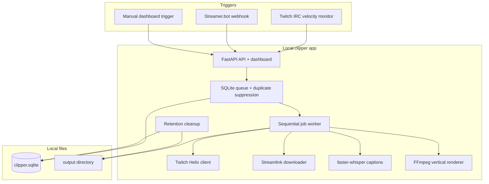

# Design: Standalone Live Clipper

## 1. Overview

The live clipper is a local-first Python app that automates the boring part of short-form stream clipping while keeping expensive work on the operator's machine.

The app watches chat or accepts webhooks, creates a Twitch clip, downloads the public clip media, optionally transcribes speech, renders a vertical MP4, and records the result in SQLite. It is intentionally separate from Streamclone's existing Go services.



## 2. Runtime Shape

The app should live in a standalone `clipper/` directory when implemented. It should have a Python package, a small static dashboard, a SQLite schema, and local tests. A Dockerfile can be added for convenience, but local execution should stay the easiest path.

Recommended modules:

| Module | Responsibility |
|---|---|
| `clipper.app` | FastAPI app, routes, dashboard responses |
| `clipper.config` | environment and layout config loading |
| `clipper.db` | SQLite schema, job writes, duplicate suppression |
| `clipper.irc` | Twitch IRC WebSocket monitor and spike detector |
| `clipper.twitch` | Helix users, create clip, poll clip readiness |
| `clipper.streamlink` | authenticated/anonymous clip download |
| `clipper.transcribe` | faster-whisper captions and empty transcript handling |
| `clipper.render` | FFmpeg trim/layout/subtitle command construction |
| `clipper.cleanup` | raw/temp/final artifact lifecycle |

Use raw `asyncio`, `subprocess`, `threading`, and a single local worker queue for V1. Do not introduce Celery, RQ, Redis, or a separate broker until concurrent or distributed workers are actually required.

## 3. Data Model

SQLite is the durable job and dashboard source. The minimum tables are:

| Table | Purpose |
|---|---|
| `watched_channels` | channel login, broadcaster id, enabled flag, spike settings, timestamps |
| `jobs` | trigger metadata, Twitch ids, state, paths, warnings, errors, created/updated timestamps |
| `job_events` | append-only state transitions and redacted operational notes |
| `suppressed_triggers` | duplicate/cooldown suppressions for dashboard visibility |

Job states:

```text
queued
creating_clip
waiting_for_clip
downloading
transcribing
rendering
ready
failed
purged
```

Failure codes should be specific enough to act on: `offline`, `clips_disabled`, `clip_restricted`, `invalid_token`, `missing_scope`, `clip_not_ready`, `download_auth_failed`, `download_failed`, `transcribe_failed`, `render_failed`, and `disk_cleanup_failed`.

## 4. Trigger Flow

Webhook triggers enter through `POST /v1/triggers/streamerbot`. The endpoint validates the shared token, normalizes the channel login, resolves broadcaster id when needed, and asks the SQLite layer to insert a job subject to duplicate suppression.

Chat triggers use a native Twitch IRC monitor:

- Connect to `wss://irc-ws.chat.twitch.tv:443`.
- Send anonymous Twitch IRC login commands.
- Request tags/commands if message timestamps or metadata are needed.
- Join watched channels.
- Reply to `PING :tmi.twitch.tv` with `PONG :tmi.twitch.tv`.
- Reconnect with jitter and resubscribe active channels.

The spike detector keeps a rolling message-count window per channel. It should require both a minimum message count and a multiplier over baseline before queueing. It records the detection time, peak chat timestamp, message count, and reason.

Duplicate suppression happens before queue insertion. If the same broadcaster has a queued, running, or recently successful job inside `CLIPPER_DUPLICATE_WINDOW_SECONDS`, the trigger is not queued and a suppression row is recorded.

## 5. Twitch And Download Flow

The Twitch client uses the configured user access token and matching client id.

1. Resolve login to broadcaster id when missing.
2. Call Helix Create Clip with broadcaster id, title, and source duration when configured.
3. Store clip id and edit URL.
4. Poll Get Clips by id until the clip is available or the timeout expires.
5. Store the final clip URL and duration returned by Twitch.

The downloader uses Streamlink with argument arrays. When a user token exists, pass it through the Twitch plugin header format:

```text
--twitch-api-header=Authorization=Bearer <redacted>
```

If authenticated download fails, retry anonymous once only if the failure is not clearly a local subprocess or disk error. Store raw media under a job-local temp directory and remove it after successful render.

## 6. Caption And Render Flow

Transcription is optional. When enabled, initialize faster-whisper with `compute_type=int8` by default. If no words are returned, skip ASS generation and render without subtitles.

The renderer computes the final trim window from source duration, final duration, trigger type, and event latency offset. Chat-triggered clips should bias toward the likely event moment:

```text
event_time = peak_chat_time - CLIPPER_EVENT_LATENCY_OFFSET_SECONDS
trim_start = clamp(event_time - final_duration * 0.35, 0, source_duration - final_duration)
```

Webhook triggers without chat timing may use the last final-duration slice of the source clip.

Default FFmpeg layout:

- `1080x1920` output.
- blurred scaled background from source.
- centered source crop or per-channel layout crop.
- optional ASS subtitle burn-in.
- audio preserved.
- `libx264` default encoder.

Subtitle paths must be escaped for FFmpeg filter syntax. Prefer relative job-local paths and avoid shell interpolation.

## 7. Dashboard And API

The dashboard is an operational surface, not a marketing page. It should show:

- watched channel state
- recent trigger counts
- suppressed trigger counts
- current worker state
- recent jobs and failure codes
- available final MP4 links
- purged artifact markers

API surface:

```text
POST   /v1/triggers/streamerbot
POST   /v1/channels/{login}/watch
DELETE /v1/channels/{login}/watch
GET    /v1/channels
GET    /v1/jobs
GET    /v1/jobs/{id}
GET    /v1/jobs/{id}/final.mp4
POST   /v1/jobs/{id}/retry
```

All mutating endpoints should require local access or a shared token unless a future auth spec replaces that with a stronger model.

## 8. Cleanup And Hosting

Cleanup runs periodically and on startup:

- delete stale temp directories for jobs no longer running
- delete raw inputs after successful render
- purge final MP4 files older than retention
- mark purged jobs without deleting job history

Hosting strategy:

1. Run everything local for V1.
2. Add Cloudflare Tunnel or Tailscale only for remote dashboard/webhook access.
3. Add Cloudflare R2 or Backblaze B2 only for final MP4 sharing or backup.
4. Defer hosted rendering until a separate spec covers cost, scaling, credentials, and artifact retention.

## 9. Test Strategy

Tests should be concentrated around live-stream failure modes and filesystem safety:

- Helix client tests with mocked users/create/get clips responses.
- IRC monitor tests for PING/PONG, reconnect, and message parsing.
- Spike detector tests for threshold, cooldown, and duplicate suppression.
- SQLite tests for restart-safe job states.
- Streamlink command tests with token redaction.
- FFmpeg command tests for trim math, subtitle path escaping, empty transcript, and encoder selection.
- Tiny fixture render test that verifies final dimensions and audio stream presence.
