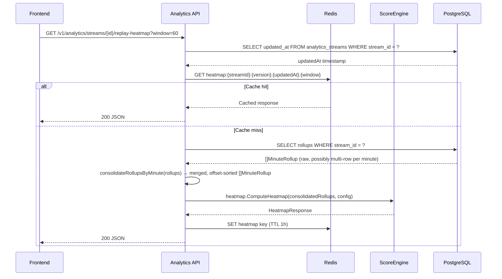
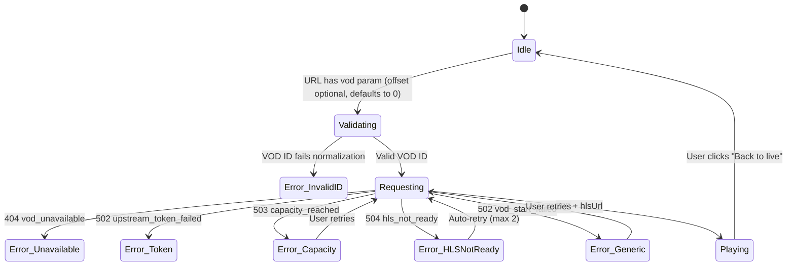

# Design Document: Moment Timeline

## Overview

The Moment Timeline unifies VOD playback, replay heatmap scoring, analytics redesign, live statistics, and clip workflows under a single synchronized playhead. The feature spans backend score computation (Go), frontend visualization (React/TypeScript), and infrastructure caching (Redis), delivering a "Most Reacted" heatmap that communicates moment intensity across analytics and VOD player surfaces.

The design is organized into three layers:

1. **Heatmap Service** — A new `internal/analytics/heatmap` package within the existing analytics service that computes deterministic, versioned scores from merged rollups and serves them via a REST endpoint with Redis caching.
2. **Frontend Heatmap & Analytics Redesign** — React components for the right rail, heatmap lanes, live stats band, and VOD mode controls, all coordinated through Zustand stores and React Query.
3. **VOD Deep Link & Review Mode** — Channel workspace enhancements for VOD mode landing, error states, player heatmap integration, and chart-to-player sync.

### Key Design Decisions

| Decision | Rationale |
|----------|-----------|
| Server-side score computation | Determinism, versioning, and cache-friendliness; avoids shipping scoring algorithm to every client |
| Score model as config, not code | Weights/thresholds in a versioned config struct; `DefaultScoringConfig()` is the compile-time baseline, overridable via `HEATMAP_SCORING_CONFIG_PATH` env var pointing to a JSON file. Tuning ships a new JSON without recompilation. |
| Redis cache keyed by rollup `updatedAt` | Natural invalidation on new data without TTL guessing |
| Single SVG path per heatmap lane | One DOM element per pixel column; no per-point nodes |
| Zustand shared playhead store | Same-page sync between chart cursor and VOD player without prop drilling or context providers |
| `Most Reacted` label until replay telemetry | Honest naming per glossary — reaction signals only until playback seek data exists |

---

## Architecture

### System Context Diagram

```mermaid
graph TB
    subgraph Browser
        APage[Analytics Page]
        CWS[Channel Workspace]
        HLane[Heatmap Lane Component]
        RRail[Right Rail - Moments/Emotes/Clips/Sync]
        LSB[Live Stats Band]
    end

    subgraph Go Backend
        AnalyticsSvc[Analytics Service<br/>cmd/analytics]
        HeatmapPkg[internal/analytics/heatmap]
        VideoSvc[Video Orchestrator<br/>cmd/video]
    end

    subgraph Infra
        PG[(PostgreSQL<br/>analytics_rollups)]
        Redis[(Redis<br/>heatmap cache)]
        MediaMTX[MediaMTX HLS]
        Caddy[Caddy Proxy :8090]
    end

    APage -->|GET replay-heatmap| AnalyticsSvc
    APage -->|GET streams/{id}| AnalyticsSvc
    CWS -->|POST vod/start| VideoSvc
    CWS -->|GET replay-heatmap| AnalyticsSvc
    AnalyticsSvc --> HeatmapPkg
    HeatmapPkg --> PG
    HeatmapPkg --> Redis
    VideoSvc --> MediaMTX
    Caddy --> AnalyticsSvc
    Caddy --> VideoSvc
    Caddy --> MediaMTX
```

### Data Flow: Heatmap Score Computation



> **Rollup consolidation boundary (Requirement 8.2):** `consolidateRollupsByMinute` lives **unexported** in `internal/analytics/api.go`. The new `internal/analytics/heatmap` package therefore cannot call it directly, and exporting analytics internals into heatmap (or importing `analytics` from `heatmap`) would create a circular dependency between the two packages. The chosen approach is **(b)**: the HTTP handler in package `analytics` consolidates rollups via the existing `consolidateRollupsByMinute` and passes a **consolidated, deduplicated, offset-sorted `[]MinuteRollup`** slice into the pure `heatmap.ComputeHeatmap(rollups, config)` function. This keeps `heatmap` a pure, dependency-free scoring package (no DB or analytics-package imports), satisfies the "merged and deduplicated input data" requirement, and leaves rollup-merge logic owned by `internal/analytics` where its tests already live (`go test ./internal/analytics/...`). The rejected alternative (a) — extracting/exporting consolidation into a shared helper for heatmap to import — is heavier and risks duplicating merge semantics.

---

## Components and Interfaces

### Backend Components

#### 1. Heatmap Package (`internal/analytics/heatmap`)

| File | Responsibility |
|------|---------------|
| `config.go` | `ScoringConfig` struct with version, weights, smoothing, suppression params |
| `score.go` | `ComputeHeatmap(rollups []MinuteRollup, config) HeatmapResponse` — **pure** deterministic scoring engine; receives an already-consolidated, offset-sorted rollup slice and performs no DB or `analytics`-package access |
| `normalize.go` | Z-score normalization, log transform, EWMA smoothing |
| `suppress.go` | Non-max suppression within configurable radius |
| `confidence.go` | Per-signal and per-window confidence computation |
| `decimate.go` | Response compaction to ≤720 points |
| `reason.go` | Reason label selection from component z-scores |
| `cache.go` | Redis cache get/set/invalidate logic |
| `score_test.go` | Fixture-based determinism tests + property tests |

> The HTTP handler for `GET /v1/analytics/streams/{id}/replay-heatmap` lives in package **`analytics`** (not in `heatmap`). It resolves the stream, reads raw rollups, calls the unexported `consolidateRollupsByMinute`, checks/populates the Redis cache, and invokes `heatmap.ComputeHeatmap` with the consolidated slice. This avoids a circular dependency and keeps `heatmap` pure (see the rollup consolidation boundary note above).

#### 2. VOD Chat Storage (`internal/analytics/chatreplay`) — P2

| File | Responsibility |
|------|--|
| `model.go` | `VODChatMessage` struct |
| `store.go` | Postgres CRUD + paginated query; `UNIQUE (stream_id, message_id)` upsert (`ON CONFLICT DO NOTHING`) |
| `sink.go` | `Sink` interface + batched, segment-aware buffer written by the serial and parallel GQL fetch paths (see VOD Chat Replay Persistence) |
| `handler.go` | `GET /v1/analytics/streams/{id}/chat-replay` |
| `retention.go` | Scheduled cleanup worker |

#### 3. Video Orchestrator Enhancements (`internal/video/orchestrator`)

No new package — existing `vod.go` already implements all required error codes. Frontend changes consume the existing structured error responses.

### Frontend Components

#### 4. Heatmap Lane (`frontend/src/components/analytics/HeatmapLane.tsx`)

- Renders SVG `<path>` or `<canvas>` strip below chart
- Decimates points to pixel columns on mount/resize
- Tooltip on hover (offset, reason, emotes, play action)
- Keyboard navigation (roving tabindex, arrow keys)
- Respects `prefers-reduced-motion`

#### 5. Player Heatmap (`frontend/src/components/channel/PlayerHeatmap.tsx`)

- Color-gradient strip inside progress bar
- Click-to-seek
- Tooltip on hover (simplified: offset + reason + emotes)

#### 6. Right Rail (`frontend/src/components/analytics/RightRail.tsx`)

- Tabbed container: Moments | Emotes | Clips | Sync
- Default to Moments tab on load/stream change
- Each tab panel as lazy-loaded child component

#### 7. Live Stats Band (`frontend/src/components/analytics/LiveStatsBand.tsx`)

- 15-second refresh cycle via React Query
- Sparkline canvas (60 points, 1/min)
- Trend arrows (1min vs 5min average)
- Reduced-motion: disable number animations

#### 8. VOD Mode Controls (`frontend/src/components/channel/VodModeControls.tsx`)

- Banner with VOD ID, offset, back-to-live, back-to-analytics actions
- Hide "Jump to Live" in VOD mode
- Duration display (HH:MM:SS / total)

#### 9. Playhead Sync Store (`frontend/src/stores/playheadStore.ts`)

- Zustand store holding `{ streamId, offsetSeconds, isPlaying }`
- Updated by VOD player at 1Hz
- Consumed by analytics chart cursor
- Same-page only (no cross-tab in P1)

#### 10. VOD Error States (`frontend/src/components/channel/VodErrorState.tsx`)

- Maps API error codes to user-facing copy + actions
- Retry logic for retryable codes
- Max 2 retries for `hls_not_ready`

### API Endpoints (New)

| Method | Path | Description |
|--------|------|-------------|
| GET | `/v1/analytics/streams/{streamId}/replay-heatmap` | Heatmap scores (compact). Add `?detail=true` for per-signal components. |
| DELETE | `/v1/analytics/streams/{streamId}/replay-heatmap/cache` | Admin cache bust |
| GET | `/v1/analytics/streams/{streamId}/chat-replay` | VOD chat replay (P2) |
| DELETE | `/v1/analytics/streams/{streamId}/chat-messages` | Admin purge (P2) |

### API Endpoints (Existing, Consumed)

| Method | Path | Consumer |
|--------|------|----------|
| POST | `/v1/stream/vod/start` | Channel Workspace VOD mode |
| GET | `/v1/analytics/streams/{streamId}` | Stream detail + rollups |
| POST | `/v1/analytics/streams/{streamId}/sync` | Sync trigger |
| GET | `/v1/analytics/channels/{login}/live` | Live stats |

---

## Data Models

### ReplayHeatmapPoint (Go struct)

```go
package heatmap

import "time"

type SignalComponent struct {
    RawScore     float64 `json:"rawScore"`
    WeightedScore float64 `json:"weightedScore"`
    Confidence   float64 `json:"confidence"`
}

type HeatmapEmote struct {
    ID       string `json:"id"`
    Name     string `json:"name"`
    ImageURL string `json:"imageUrl"`
    Count    int    `json:"count"`
    Provider string `json:"provider"`
}

// ReplayHeatmapPoint is the compact lane payload (default response).
// Components are omitted by default to stay within the 50 KB budget.
type ReplayHeatmapPoint struct {
    OffsetSeconds   int              `json:"offsetSeconds"`
    DurationSeconds int              `json:"durationSeconds"`
    Score           int              `json:"score"`
    Confidence      float64          `json:"confidence"`
    Reason          string           `json:"reason"`
    TopEmotes       []HeatmapEmote   `json:"topEmotes,omitempty"`
    VodID           *string          `json:"vodId,omitempty"`
    StreamID        string           `json:"streamId"`
    MinuteTs        time.Time        `json:"minuteTs"`
}

// ReplayHeatmapDetailPoint extends ReplayHeatmapPoint with per-signal
// components. Returned only when ?detail=true is passed.
type ReplayHeatmapDetailPoint struct {
    ReplayHeatmapPoint
    Components map[string]SignalComponent `json:"components"`
}

type HeatmapResponse struct {
    StreamID       string               `json:"streamId"`
    WindowSeconds  int                  `json:"windowSeconds"`
    Confidence     float64              `json:"confidence"`
    ScoringVersion string               `json:"scoringVersion"`
    UpdatedAt      int64                `json:"updatedAt"`
    Points         []ReplayHeatmapPoint `json:"points"`
}

// HeatmapDetailResponse is returned when ?detail=true.
// Not subject to the 50 KB compact constraint.
type HeatmapDetailResponse struct {
    StreamID       string                     `json:"streamId"`
    WindowSeconds  int                        `json:"windowSeconds"`
    Confidence     float64                    `json:"confidence"`
    ScoringVersion string                     `json:"scoringVersion"`
    UpdatedAt      int64                      `json:"updatedAt"`
    Points         []ReplayHeatmapDetailPoint `json:"points"`
}
```

### ScoringConfig (Go struct)

```go
package heatmap

type SignalWeights struct {
    ChatRate          float64 `json:"chatRate"`
    EmoteRate         float64 `json:"emoteRate"`
    ViewerMomentum    float64 `json:"viewerMomentum"`
    ProviderSpike     float64 `json:"providerSpike"`
    TopEmoteDominance float64 `json:"topEmoteDominance"`
    Novelty           float64 `json:"novelty"`
}

type ScoringConfig struct {
    Version             string       `json:"version"`
    Weights             SignalWeights `json:"weights"`
    DensityConfidenceWeight float64  `json:"densityConfidenceWeight"` // default 0.20; confidence-only weight, excluded from the score-weights sum
    SmoothingSpan       int          `json:"smoothingSpan"`       // default 3
    SmoothingAlpha      float64      `json:"smoothingAlpha"`      // default 0.5
    SuppressionThreshold int         `json:"suppressionThreshold"` // default 20
    SuppressionRadius   int          `json:"suppressionRadius"`   // default 3
    MaxPoints           int          `json:"maxPoints"`           // default 720
    TopRetainPercent    float64      `json:"topRetainPercent"`    // default 0.20
}

// DefaultScoringConfig returns v1 defaults
func DefaultScoringConfig() ScoringConfig {
    return ScoringConfig{
        Version: "v1",
        Weights: SignalWeights{
            ChatRate:          0.25,
            EmoteRate:         0.20,
            ViewerMomentum:    0.20,
            ProviderSpike:     0.15,
            TopEmoteDominance: 0.10,
            Novelty:           0.10,
        },
        DensityConfidenceWeight: 0.20,
        SmoothingSpan:        3,
        SmoothingAlpha:       0.5,
        SuppressionThreshold: 20,
        SuppressionRadius:    3,
        MaxPoints:            720,
        TopRetainPercent:     0.20,
    }
}

// LoadScoringConfig loads config from HEATMAP_SCORING_CONFIG_PATH if set,
// falling back to DefaultScoringConfig(). This allows tuning weights/thresholds
// via a JSON file without recompiling. Changing the file content requires a
// service restart (or future hot-reload) and MUST bump the Version field.
func LoadScoringConfig() (ScoringConfig, error) {
    path := os.Getenv("HEATMAP_SCORING_CONFIG_PATH")
    if path == "" {
        return DefaultScoringConfig(), nil
    }
    data, err := os.ReadFile(path)
    if err != nil {
        return ScoringConfig{}, fmt.Errorf("load scoring config: %w", err)
    }
    var cfg ScoringConfig
    if err := json.Unmarshal(data, &cfg); err != nil {
        return ScoringConfig{}, fmt.Errorf("parse scoring config: %w", err)
    }
    // Validate weights sum to 1.0
    sum := cfg.Weights.ChatRate + cfg.Weights.EmoteRate + cfg.Weights.ViewerMomentum +
           cfg.Weights.ProviderSpike + cfg.Weights.TopEmoteDominance + cfg.Weights.Novelty
    if math.Abs(sum-1.0) > 0.001 {
        return ScoringConfig{}, fmt.Errorf("scoring weights sum to %.4f, must equal 1.0", sum)
    }
    return cfg, nil
}
```

### VODChatMessage (P2 — Go struct)

```go
package chatreplay

import "time"

type VODChatMessage struct {
    ID            int64     `json:"id"`
    StreamID      string    `json:"streamId"`
    MinuteTS      time.Time `json:"minuteTs"`
    MessageID     string    `json:"messageId"`
    DisplayName   string    `json:"displayName"`
    SenderHash    string    `json:"senderHash"`
    Text          string    `json:"text"`
    EmoteFrags    []EmoteFrag `json:"emoteFrags,omitempty"`
    OffsetSeconds int       `json:"offsetSeconds"`
    SyncedAt      time.Time `json:"syncedAt"`
}

type EmoteFrag struct {
    Name     string `json:"name"`
    ID       string `json:"id"`
    Provider string `json:"provider"`
    ImageURL string `json:"imageUrl"`
}
```

The `ID` field is `int64` matching the `BIGSERIAL` primary key in the schema. The `MessageID` field (text) stores the Twitch-provided comment ID for dedup.

### Cache Key Structure (Redis)

```
heatmap:{streamId}:{scoringVersion}:{rollupUpdatedAtMs}:{windowSeconds}
```

- Natural invalidation: when rollups change, `updatedAt` changes, new key is used
- TTL: 1 hour (safety net for orphaned keys)
- Explicit invalidation: `DELETE /v1/analytics/streams/{id}/replay-heatmap/cache` removes all keys matching `heatmap:{streamId}:*`

#### Cache Revision Source

The `rollupUpdatedAtMs` is obtained from `analytics_streams.updated_at` via a new store method:

```go
// GetStreamUpdatedAt returns the stream's updated_at timestamp.
// Called by the heatmap handler before checking cache.
func (s *Store) GetStreamUpdatedAt(ctx context.Context, streamID string) (time.Time, error) {
    var updatedAt time.Time
    err := s.db.QueryRow(ctx,
        `SELECT updated_at FROM analytics_streams WHERE stream_id = $1`,
        streamID,
    ).Scan(&updatedAt)
    return updatedAt, err
}
```

The heatmap handler calls this lightweight query first to construct the cache key, then checks Redis. This avoids loading full rollups on cache hits. The existing `BulkUpsertMinuteRollups` and `BulkPatchChatRollups` already update `analytics_streams.updated_at` on writes.

### Frontend TypeScript Types

```typescript
// stores/playheadStore.ts
interface PlayheadState {
  streamId: string | null;
  offsetSeconds: number;
  isPlaying: boolean;
  vodId: string | null;
  setPlayhead: (streamId: string, offset: number, vodId?: string) => void;
  setPlaying: (playing: boolean) => void;
  reset: () => void;
}

// types/heatmap.ts
interface SignalComponent {
  rawScore: number;
  weightedScore: number;
  confidence: number;
}

interface HeatmapEmote {
  id: string;
  name: string;
  imageUrl: string;
  count: number;
  provider: string;
}

// Compact point (default response, fits 50 KB budget)
interface ReplayHeatmapPoint {
  offsetSeconds: number;
  durationSeconds: number;
  score: number;
  confidence: number;
  reason: string;
  topEmotes: HeatmapEmote[];
  vodId: string | null;
  streamId: string;
  minuteTs: string; // ISO 8601
}

// Detail point (returned with ?detail=true, includes per-signal breakdown)
interface ReplayHeatmapDetailPoint extends ReplayHeatmapPoint {
  components: Record<string, SignalComponent>;
}

interface HeatmapResponse {
  streamId: string;
  windowSeconds: number;
  confidence: number;
  scoringVersion: string;
  updatedAt: number;
  points: ReplayHeatmapPoint[];
}

interface HeatmapDetailResponse {
  streamId: string;
  windowSeconds: number;
  confidence: number;
  scoringVersion: string;
  updatedAt: number;
  points: ReplayHeatmapDetailPoint[];
}

// types/vodMode.ts
//
// VodStartResponse ALREADY EXISTS in frontend/src/api.ts as:
//   export interface VodStartResponse extends StartResponse {
//     vod_id: string; offset_seconds: number; seek_seconds: number
//   }
// (StartResponse provides hlsUrl, session_id, renditions, etc.)
//
// Do NOT define a duplicate VodStartResponse here. VOD-mode code MUST reuse the
// existing type. If types/vodMode.ts needs it, re-export from api.ts rather than
// redeclaring:
//   export type { VodStartResponse } from '../api';
//
// Only NEW VOD-mode-specific types belong in this file, e.g.:
interface VodStartError {
  code: string;
  message: string;
  retryable: boolean;
}
```

### Database Schema (New Tables)

```sql
-- P2: VOD Chat Message Storage
CREATE TABLE IF NOT EXISTS analytics_vod_chat_messages (
    id            BIGSERIAL PRIMARY KEY,
    stream_id     TEXT NOT NULL,
    minute_ts     TIMESTAMPTZ NOT NULL,
    message_id    TEXT NOT NULL,
    display_name  TEXT NOT NULL,
    sender_hash   TEXT NOT NULL,
    text          TEXT NOT NULL,
    emote_frags   JSONB DEFAULT '[]',
    offset_seconds INT NOT NULL,
    synced_at     TIMESTAMPTZ NOT NULL DEFAULT NOW(),
    UNIQUE (stream_id, message_id)
);

CREATE INDEX idx_vod_chat_stream_offset
    ON analytics_vod_chat_messages (stream_id, offset_seconds);

CREATE INDEX idx_vod_chat_synced_at
    ON analytics_vod_chat_messages (synced_at);
```

---

## Low-Level Design: Score Computation Algorithm

### Signal Extraction

For each scoring window (default 60s, aligned to rollup minute boundaries):

```
chatRate      = ln(chatCount + 1)
emoteRate     = ln(totalEmoteCount + 1)
viewerMomentum = viewerAvg[t] - viewerAvg[t-1]  (delta, can be negative)
providerSpike = max(
    normalized_7tv_rate,
    normalized_twitch_emote_rate,
    normalized_ffz_rate
)
topEmoteDominance = topEmoteCount / max(totalEmoteCount, 1)
novelty       = 1.0 - (topEmoteCount_appeared_before / max(totalEmoteCount, 1))
```

Provider rates are derived from the existing rollup fields:
- `seventvEmoteCount` for 7TV
- Emotes map entries with `twitch` provider prefix for Twitch native
- Emotes map entries with `ffz` provider prefix for FFZ

### Z-Score Normalization (per-stream)

```go
func zScore(values []float64, idx int) float64 {
    mean := mean(values)
    stddev := stddev(values)
    if stddev == 0 {
        return 0
    }
    return (values[idx] - mean) / stddev
}
```

Applied independently per signal across all windows in the stream.

### EWMA Smoothing (forward-only)

```go
func ewmaSmooth(scores []float64, span int, alpha float64) []float64 {
    smoothed := make([]float64, len(scores))
    smoothed[0] = scores[0]
    for i := 1; i < len(scores); i++ {
        smoothed[i] = alpha*scores[i] + (1-alpha)*smoothed[i-1]
    }
    return smoothed
}
```

Forward pass only to preserve causality (a peak at minute 5 should not retroactively boost minute 3).

### Non-Max Suppression

```go
func suppressPeaks(scores []float64, threshold int, radius int) []float64 {
    result := make([]float64, len(scores))
    copy(result, scores)
    for i := range scores {
        if scores[i] < float64(threshold) {
            continue
        }
        // Check if this is the local max within radius
        isMax := true
        for j := max(0, i-radius); j <= min(len(scores)-1, i+radius); j++ {
            if j != i && scores[j] > scores[i] {
                isMax = false
                break
            }
        }
        if !isMax {
            result[i] = 0 // suppress non-max peaks
        }
    }
    return result
}
```

### Final Score Composition (Positive-Surprise Only)

```go
func compositeScore(signals map[string]float64, weights SignalWeights, allMissing bool) int {
    if allMissing {
        return 0 // explicit early return for missing windows
    }
    // Clamp each z-score to positive surprise only — average/below-average = 0
    raw := math.Max(0, signals["chatRate"])*weights.ChatRate +
           math.Max(0, signals["emoteRate"])*weights.EmoteRate +
           math.Max(0, signals["viewerMomentum"])*weights.ViewerMomentum +
           math.Max(0, signals["providerSpike"])*weights.ProviderSpike +
           math.Max(0, signals["topEmoteDominance"])*weights.TopEmoteDominance +
           math.Max(0, signals["novelty"])*weights.Novelty
    // Scale: max possible raw is ~3.5 (extreme z-scores * weights sum to 1.0)
    // Map to 0-100 via percentile-rank: score = min(100, raw * 30)
    score := int(math.Round(math.Min(100, math.Max(0, raw*30))))
    return score
}
```

The scoring uses **positive surprise only**: each signal's z-score is clamped to `max(0, z)` before weighting, so average or below-average windows produce score 0 (not 50). This ensures:
- Missing windows (all signals null) return 0 via the early guard
- Average windows with z≈0 also score 0 after clamping
- Only above-average windows produce non-zero scores
- The `*30` scale factor maps the practical z-score range (~0–3.5 weighted) to 0–100 where peaks above 60 are notable moments

This eliminates the conflict between "neutral = 50" and the zero-score omission requirement.

### Decimation Algorithm

```go
func decimate(points []ReplayHeatmapPoint, maxPoints int, topRetainPct float64) []ReplayHeatmapPoint {
    if len(points) <= maxPoints {
        return points
    }
    // Sort by score descending to identify top N%
    topCount := int(float64(len(points)) * topRetainPct)
    // Always retain top-scoring points
    // Uniform sample remaining to fill maxPoints - topCount
    // Merge and re-sort by offsetSeconds
}
```

### Confidence Computation

Confidence is computed per-signal and the overall window confidence is the **weighted average of the available per-signal confidence values, weighted by the scoring-config signal weights**, not a product (Requirement 11.6). This prevents a single missing signal (e.g. emote dictionary not loaded) from zeroing out the entire confidence when chat and viewer data are strong.

Each per-signal confidence is first **capped** per Requirements 11.1–11.4 (chat 0.3, viewer 0.4, density 0.5, emote 0.0 when the dictionary is absent), then averaged. The averaging weights are drawn from the active `ScoringConfig.Weights`, mapped onto the four confidence dimensions:

| Confidence signal | Scoring-config weight source |
|-------------------|------------------------------|
| Chat | `Weights.ChatRate` |
| Viewer | `Weights.ViewerMomentum` |
| Emote | `Weights.EmoteRate + Weights.ProviderSpike + Weights.TopEmoteDominance + Weights.Novelty` (all emote/provider-derived score signals) |
| Density | `DensityConfidenceWeight` — a dedicated scoring-config weight for the data-quality density signal (default 0.20); density is a cross-cutting data-quality signal with no single score component, so it carries its own configured weight and is excluded from the score-weights-sum-to-1.0 validation |

Signals whose capped confidence is exactly `0.0` are **excluded** from both the numerator and denominator of the weighted average, and the result is clamped to `[0.0, 1.0]`.

```go
func windowConfidence(rollup MinuteRollup, cfg ScoringConfig, streamChatCoverage float64, emoteDictLoaded bool, rollupDensityLow bool) WindowConfidence {
    conf := WindowConfidence{Chat: 1.0, Viewer: 1.0, Emote: 1.0, Density: 1.0}

    // Per-signal caps (Requirements 11.1–11.4), applied before averaging.
    if streamChatCoverage < 0.35 && rollup.ChatCount == 0 {
        conf.Chat = 0.3
    }
    if rollup.ViewerSamples == 0 {
        conf.Viewer = 0.4
    }
    if !emoteDictLoaded {
        conf.Emote = 0.0
    }
    if rollupDensityLow {
        conf.Density = 0.5
    }

    // Overall = weighted average of the capped per-signal confidences,
    // weighted by the scoring-config signal weights (Requirement 11.6), NOT
    // a product. Signals with confidence 0.0 are excluded from the average so
    // that a missing emote dict does not erase strong chat+viewer confidence.
    w := cfg.Weights
    type entry struct{ conf, weight float64 }
    signals := []entry{
        {conf.Chat, w.ChatRate},
        {conf.Viewer, w.ViewerMomentum},
        {conf.Emote, w.EmoteRate + w.ProviderSpike + w.TopEmoteDominance + w.Novelty},
        {conf.Density, cfg.DensityConfidenceWeight},
    }
    var sumW, sumCW float64
    for _, s := range signals {
        if s.conf > 0 {
            sumW += s.weight
            sumCW += s.conf * s.weight
        }
    }
    if sumW > 0 {
        conf.Overall = math.Min(1.0, math.Max(0.0, sumCW/sumW))
    } else {
        conf.Overall = 0.0
    }
    return conf
}
```

When emote dictionary is absent (`conf.Emote = 0.0`), the emote weight is excluded from the average, so a stream with strong chat and viewer data retains meaningful overall confidence (e.g. ~0.85) rather than collapsing to 0.

---

## Low-Level Design: Frontend Heatmap Rendering

### Decimation to Pixel Columns

```typescript
function decimateToPixels(points: ReplayHeatmapPoint[], widthPx: number, totalDurationSec: number): PixelColumn[] {
  const secPerPx = totalDurationSec / widthPx;
  const columns: PixelColumn[] = new Array(widthPx).fill({ score: 0 });

  for (const point of points) {
    const px = Math.floor(point.offsetSeconds / secPerPx);
    if (px >= 0 && px < widthPx) {
      columns[px] = { score: Math.max(columns[px].score, point.score), point };
    }
  }
  return columns;
}
```

### SVG Path Generation

```typescript
function heatmapPath(columns: PixelColumn[], height: number): string {
  // Generate a single SVG <rect> per column with fill opacity = score/100
  // Or use a linear gradient with color stops
  return columns.map((col, x) =>
    `M${x},0 L${x},${height}`
  ).join(' ');
}
```

Actual implementation uses a `<canvas>` element for performance, drawing one vertical line per pixel column with color intensity mapped from the score.

### Accessibility Layer (Canvas + Hidden Peak Buttons)

Canvas elements are not accessible to screen readers. The heatmap uses a **hybrid approach**: a canvas for visual rendering plus a set of **absolutely positioned hidden peak buttons** overlaid on peak locations. Only peaks (score ≥ suppression threshold) get buttons — typically 5–15 per stream, well within DOM budget.

```typescript
interface PeakButton {
  offsetSeconds: number;
  score: number;
  reason: string;
  xPx: number; // pixel position within the lane
}

function HeatmapLane({ points, width, height, peaks }: Props) {
  return (
    <div className="relative" role="toolbar" aria-label="Heatmap peaks">
      {/* Visual canvas — decorative, hidden from AT */}
      <canvas width={width} height={height} aria-hidden="true" />
      {/* Accessible peak buttons — positioned over canvas */}
      {peaks.map((peak, i) => (
        <button
          key={peak.offsetSeconds}
          className="absolute top-0 h-full w-2 opacity-0 focus:opacity-100 focus:ring-2"
          style={{ left: `${peak.xPx}px` }}
          tabIndex={i === activeIndex ? 0 : -1}
          aria-label={`Peak at ${formatHHMMSS(peak.offsetSeconds)}, score ${peak.score}, ${peak.reason}`}
          onClick={() => selectPeak(peak)}
        />
      ))}
    </div>
  );
}
```

### Keyboard Navigation (Roving Tabindex)

```typescript
function useRovingTabindex(peakCount: number) {
  const [activeIndex, setActiveIndex] = useState(0);

  const onKeyDown = (e: KeyboardEvent) => {
    if (e.key === 'ArrowRight') setActiveIndex(i => Math.min(i + 1, peakCount - 1));
    if (e.key === 'ArrowLeft') setActiveIndex(i => Math.max(i - 1, 0));
    if (e.key === 'Enter' || e.key === ' ') selectPeak(activeIndex);
  };

  return { activeIndex, onKeyDown };
}
```

The roving tabindex moves focus between the hidden peak buttons. Arrow keys navigate peaks, Enter/Space selects.
```

---

## Low-Level Design: VOD Mode State Machine



**Note:** The `offset` query parameter is optional and defaults to `0` when absent. This supports existing Channel VOD links that use only `?vod={id}` without an explicit offset (e.g. the VODs tab "Play VOD" action).

---

## Low-Level Design: Cache Invalidation

### Write Path (Rollup Insertion)

When `BulkUpsertMinuteRollups` or `BulkPatchChatRollups` writes new data:
1. The store updates `analytics_streams.updated_at`
2. Next heatmap request constructs a cache key with the new `updatedAt` — automatic miss
3. Old cache entry expires via 1h TTL

### Explicit Invalidation

`DELETE /v1/analytics/streams/{streamId}/replay-heatmap/cache`:
- Scans Redis for keys matching `heatmap:{streamId}:*`
- Deletes all matches
- Returns 204

### Version Change

When `ScoringConfig.Version` changes (e.g., "v1" → "v2"):
- All cache keys include version — automatic miss for new version
- Old version keys expire via TTL
- No batch purge needed

---

## Low-Level Design: VOD Chat Replay Persistence (P2)

### Problem

The P2 chat-replay feature requires individual chat messages to be durably stored in `analytics_vod_chat_messages` so the `GET /v1/analytics/streams/{id}/chat-replay` endpoint can page them back by offset. Today the GQL sync paths only build the rollup aggregate: both the serial loop (`fetchVODCommentsSerial`) and the parallel workers (`fetchVODCommentsParallel`) extract `gqlCommentText(edge.Node.Message)` and append the **text only** into `commentsMap map[int][]string` (offset-minute → texts) via the sharded `gqlCommentsMap`. No per-message identity, author, exact offset, or emote-fragment data is retained, so nothing can be persisted to the replay store.

### Approach: Parallel Replay Sink Alongside Rollup Aggregation

Introduce an optional **chat replay sink** that both fetch paths write to **in addition to** `commentsMap`, leaving the existing rollup aggregation untouched. The rollup path keeps consuming `commentsMap` exactly as before; the sink is a side-channel that is a no-op when P2 chat replay is disabled.

```go
// internal/analytics/chatreplay
type Sink interface {
    // Add buffers one sanitized message; safe for concurrent use by parallel workers.
    Add(msg VODChatMessage)
    // FlushSegment persists buffered messages for a completed segment (parallel path
    // checkpoint hook) or is called once at the end (serial path).
    FlushSegment(ctx context.Context, startMinute, endMinute int) error
    Flush(ctx context.Context) error
}
```

A `nil` sink (feature disabled) skips all replay work. When enabled, the analytics sync constructs a `chatreplay.Store`-backed sink and threads it through `fetchVODComments` next to `commentsMap`.

### Per-Edge Handling (shared by serial and parallel paths)

The single place each GQL comment edge is processed already computes `text := gqlCommentText(edge.Node.Message)` and skips blank text. The replay write hooks in at that same point, reusing the existing `gqlCommentDeduper`:

1. **Dedupe by comment id.** The existing `gqlCommentDeduper.markSeen(edge.Node.ID)` already guards rollup double-counting in the parallel path. The replay sink uses the **same** comment-id signal: a message is only buffered when it is the first sighting of that id. For the serial path (which historically relied on cursor/offset ordering), the deduper is consulted before buffering so resumed/overlapping pages do not write duplicates. The store additionally enforces `UNIQUE (stream_id, message_id)` so any race or resume still results in an idempotent upsert (`ON CONFLICT (stream_id, message_id) DO NOTHING`).
2. **Build the sanitized record.** Map the edge into a `VODChatMessage`:
   - `MessageID` = `edge.Node.ID` (Twitch comment id; the dedupe + uniqueness key)
   - `DisplayName` = commenter display name from the edge
   - `SenderHash` = `hashSender(streamID, commenterUserID)` — a salted, one-way hash (see Privacy below); the raw Twitch user id is **never** stored
   - `OffsetSeconds` = `edge.Node.ContentOffsetSeconds` adjusted by `chatAlignSec` (the same alignment already applied for minute bucketing), giving exact per-message offset, not just the minute
   - `MinuteTS` = derived from the aligned offset and `rollupStart`, matching the rollup minute bucket
   - `Text` = sanitized via the shared sanitizer (Property 33: strip control chars, truncate to max length, neutralize bare URLs)
   - `EmoteFrags` = emote fragments extracted from `edge.Node.Message.Fragments` (name/id/provider/local image URL), mirroring the tokenization the rollup path uses
3. **Buffer, do not write per-message.** `sink.Add` appends to an in-memory, shard-friendly buffer. Writes are batched to Postgres to avoid per-message round-trips during high-rate VODs.

The rollup aggregation is unchanged: the same edge still appends its text to `commentsMap`/`gqlCommentsMap`. The sink never mutates `commentsMap`.

### Checkpoint-Resume Compatibility

Replay persistence is aligned to the existing checkpoint model so a resumed sync neither loses nor duplicates messages:

- **Parallel path:** the existing `onSegmentDone` / `patchChatRollupsForSegment` hook (already invoked per completed segment when incremental DB writes are on) also calls `sink.FlushSegment(startMinute, endMinute)` for that segment's aligned minute range. A segment's replay rows are committed in the same step that marks the segment done in `analytics_sync_checkpoints` (`segments_json` + `fetch_mode`). On resume, completed segments are skipped, so their messages are not re-fetched; the `UNIQUE (stream_id, message_id)` upsert covers any partially-flushed segment that was interrupted mid-commit.
- **Serial path:** messages are flushed at offset/cursor checkpoint boundaries (and a final `Flush` at completion), so a resume from the stored cursor/offset re-reads only un-flushed tail pages, which the deduper + unique constraint render idempotent.
- **Failure fallback:** when the parallel path falls back to the serial loop on repeated integrity errors, the sink continues to receive edges from the serial path; comment-id dedupe spans both modes because the `gqlCommentDeduper` instance is shared for the duration of the fetch.

### Privacy

`SenderHash` is computed with a keyed hash (HMAC over a server-side salt + Twitch user id) so stored rows cannot be reversed to the raw user id (Property 34). Display name is retained for rendering, but no raw user id, IP, or token is stored. This is consistent with the `analytics_vod_chat_messages` schema (`sender_hash TEXT NOT NULL`, no raw-id column) defined in Data Models.

### Why a side-channel sink (not reshaping commentsMap)

`commentsMap` is intentionally a lossy aggregate (text-per-minute) tuned for rollup tokenization and is consumed by `BuildMinuteRollupsFromCommentsCached`, `writeChatRollupsOnly`, and `patchChatRollupsForSegment`. Widening it to carry full per-message records would change those hot paths and their tests. The sink keeps replay storage additive and feature-flagged, preserving existing rollup behavior and `go test ./internal/analytics/...` expectations.

---

## Error Handling

### Backend Error Strategy

| Layer | Error Type | Handling |
|-------|-----------|----------|
| Heatmap endpoint | Invalid window param | 400 with validation message |
| Heatmap endpoint | Stream not found | 404 |
| Heatmap endpoint | Empty rollups | 200 with empty points, confidence 0 |
| Heatmap computation | Divide by zero (stddev=0) | Return z-score 0 for that signal |
| Heatmap computation | Missing emote dict | Set emote confidence to 0, zero emote signals |
| Redis cache | Connection failure | Compute fresh, log warning, serve without cache |
| VOD start | Various (see Req 2) | Structured error codes with retryable flag |
| Chat replay (P2) | No messages | 200 with empty array + unavailable flag |

### Frontend Error Strategy

| Component | Error Scenario | UX |
|-----------|---------------|-----|
| Heatmap Lane | API returns empty/error | Muted lane, no interactivity |
| VOD Mode | Invalid VOD ID | Error banner with "Back to Analytics" |
| VOD Mode | Retryable errors | Retry button, max 2 auto-retries for hls_not_ready |
| Live Stats Band | Timeout/error | Show stale values + indicator, retry next cycle |
| Clip action | Clipper unreachable | Inline error on peak, retain selection for retry |
| Right Rail | No rollup data | "Sync chat & emotes" CTA |

### Graceful Degradation

- Heatmap unavailable → Analytics chart still works, lane hidden
- Confidence < 0.5 → Muted visual treatment, tooltip shows missing signals
- Redis down → Direct computation (slower but functional)
- VOD relay fails → Error state with actionable guidance, no generic "deleted from Twitch"

---


## Correctness Properties

*A property is a characteristic or behavior that should hold true across all valid executions of a system — essentially, a formal statement about what the system should do. Properties serve as the bridge between human-readable specifications and machine-verifiable correctness guarantees.*

### Property 1: VOD Identifier Normalization Round-Trip

*For any* input string, the VOD ID normalization function SHALL either produce a string matching `^\d{5,20}$` (stripping whitespace, rejecting URL prefixes) or reject the input; valid normalized identifiers passed back through normalization SHALL produce the same output (idempotent).

**Validates: Requirements 1.3, 1.6**

### Property 2: Sync CTA Label Consistency Across Placements

*For any* stream state (combination of viewer samples present/absent, chat rollups present/absent, sync in progress), all CTA placements (header, chart empty, right rail, sync panel) SHALL display the identical label string as defined by the CTA label table.

**Validates: Requirements 4.1**

### Property 3: Stat Card Placeholder Classification

*For any* stream with TwitchTracker averages (avgViewers > 0) but zero rollup rows with viewerSamples or chatCount > 0, the Chat and Emote stat cards SHALL display "Stats only"; *for any* stream with state "not_collected" and no averages, all cards SHALL display "Needs sync"; *for any* live stream with fewer than 2 non-missing rollups, Chat/Emote SHALL display "Collecting".

**Validates: Requirements 6.1, 6.2, 6.3**

### Property 4: No Contradictory Empty State During Active Collection

*For any* stream showing a "Collecting now" badge with fewer than 2 rollup minutes, the chart empty message SHALL NOT be "No recent data".

**Validates: Requirements 7.1**

### Property 5: Score Output Range and Weight Validity

*For any* set of rollup inputs and any valid `ScoringConfig` (weights summing to 1.0), all computed scores SHALL be integers in the range [0, 100] inclusive.

**Validates: Requirements 9.1**

### Property 6: Per-Stream Z-Score Normalization

*For any* stream's signal values across all windows, the computed z-scores for each signal SHALL have an arithmetic mean of approximately 0 (within floating-point tolerance) and standard deviation of approximately 1 when the stream has ≥2 distinct values for that signal.

**Validates: Requirements 9.2**

### Property 7: Log Transform Safety

*For any* non-negative integer count value (chat or emote), `ln(count + 1)` SHALL produce a finite value ≥ 0, with `ln(0 + 1) = 0`, and SHALL preserve ordering (if a > b ≥ 0 then ln(a+1) > ln(b+1)).

**Validates: Requirements 9.3**

### Property 8: EWMA Forward-Only Causality

*For any* score sequence, modifying the score at index k SHALL NOT change any smoothed value at index j < k (the smoothing pass is strictly causal/forward-only).

**Validates: Requirements 9.4**

### Property 9: Non-Max Suppression Locality

*For any* score sequence with a given suppression threshold T and radius R, no two scores ≥ T SHALL remain within R windows of each other in the suppressed output.

**Validates: Requirements 9.5**

### Property 10: Score Determinism

*For any* set of rollup inputs and scoring config, computing the heatmap twice SHALL produce bit-for-bit identical output (same scores, same order, same reasons).

**Validates: Requirements 9.6**

### Property 11: Missing Window Scores Zero

*For any* time window where all signal values are null/missing (ChatCount=0, TotalEmoteCount=0, ViewerSamples=0, and no emote map entries), the score SHALL be 0 (not interpolated from neighbors).

**Validates: Requirements 9.7**

### Property 12: Reason Label Selection

*For any* scored window, the assigned Reason_Label SHALL be the signal with the highest individual z-score if that z-score exceeds 1.0; otherwise the label SHALL be `chat_spike` as fallback. Exactly one label from the valid set SHALL be assigned.

**Validates: Requirements 10.1, 10.2**

### Property 13: Top Emotes Ordering and Format

*For any* scored window with emote data, the `topEmotes` array SHALL contain 1–3 entries ordered by per-window count descending, and each entry's `imageUrl` SHALL match the pattern `/emotes/{id}/1x.webp`.

**Validates: Requirements 10.3**

### Property 14: Chat Confidence Cap

*For any* stream with chat coverage below 35% of stream time span, windows without chat rollups SHALL have chat-signal confidence ≤ 0.3.

**Validates: Requirements 11.1**

### Property 15: Viewer Confidence Cap

*For any* window with zero viewer samples or where all viewer values are identical across the stream, the viewer-signal confidence SHALL be ≤ 0.4.

**Validates: Requirements 11.2**

### Property 16: Density Confidence Cap

*For any* stream where rollup density is below one rollup point per two scoring windows, affected windows SHALL have density confidence ≤ 0.5.

**Validates: Requirements 11.3**

### Property 17: Emote Dictionary Absent Zeroes Emote Signals

*For any* heatmap computation where the emote dictionary is not loaded, all emote-related signal components SHALL have `rawScore: 0`, `weightedScore: 0`, and `confidence: 0.0`.

**Validates: Requirements 11.4**

### Property 18: Overall Confidence Composition

*For any* window, the overall confidence SHALL equal the weighted average of the available (non-zero) per-signal confidence values — each capped per Requirements 11.1–11.4 (chat ≤ 0.3, viewer ≤ 0.4, density ≤ 0.5, emote = 0.0 when the dictionary is absent) before averaging — weighted by the scoring-config signal weights, with signals whose confidence is 0.0 excluded from both numerator and denominator, and the result clamped to [0.0, 1.0]. It SHALL NOT be the product of the caps.

**Validates: Requirements 11.6**

### Property 19: Stream-Level Confidence Is Median

*For any* heatmap response with N windows, the stream-level confidence SHALL equal the statistical median of all per-window overall confidence values.

**Validates: Requirements 11.7**

### Property 20: Response Size Compactness

*For any* stream with up to 720 minutes of rollup data (12 hours at 60s windows), the JSON-serialized heatmap response SHALL be ≤ 50 KB.

**Validates: Requirements 12.1**

### Property 21: Decimation Retains Top Percentile

*For any* point array exceeding 720 points, decimation SHALL retain all points in the top 20% by score and produce a result with at most 720 total points.

**Validates: Requirements 12.2**

### Property 22: Zero-Score Points Omitted

*For any* heatmap response, no point in the `points` array SHALL have `score == 0`.

**Validates: Requirements 12.3**

### Property 23: Heatmap Lane Pixel-Column Bound

*For any* heatmap data and viewport width W pixels, the rendered heatmap lane SHALL produce at most W visual elements (one per pixel column).

**Validates: Requirements 14.3, 24.1**

### Property 24: Window Parameter Validation

*For any* `window` query parameter value that is not an integer in [10, 600], the heatmap endpoint SHALL return HTTP 400.

**Validates: Requirements 8.4**

### Property 25: Heatmap Response Schema Conformance

*For any* valid stream with rollup data, the heatmap response SHALL contain `streamId`, `windowSeconds`, `confidence` (0.0–1.0), `scoringVersion` (non-empty string), `updatedAt` (positive integer), and a `points` array where each point has `offsetSeconds`, `durationSeconds`, `score` (0–100), `confidence`, `reason` (from valid label set), `components` (with all 6 signal entries), `topEmotes`, `vodId`, `streamId`, and `minuteTs`.

**Validates: Requirements 8.1, 28.1, 28.2, 28.3, 28.4**

### Property 26: Cache Key Determinism

*For any* combination of stream ID, scoring version, rollup updatedAt timestamp, and window size, the constructed cache key SHALL be deterministic and unique (different inputs → different keys, same inputs → same key).

**Validates: Requirements 29.1**

### Property 27: Batch Clip Queue Correctness

*For any* set of heatmap peaks where at least 10 minutes of chat data exist, the batch queue action SHALL select exactly the top 5 peaks by score descending, excluding any peak that already has a queued or completed clip job for the same stream and minute timestamp.

**Validates: Requirements 23.3**

### Property 28: Duration Format

*For any* non-negative integer seconds value, the HH:MM:SS formatter SHALL produce a string matching `^\d{2,}:\d{2}:\d{2}$` where MM and SS are in [00, 59].

**Validates: Requirements 20.2**

### Property 29: VOD ID Retryable Classification

*For any* VOD start error response, the presence of a retry action SHALL match the `retryable` flag: error codes `capacity_reached`, `hls_not_ready`, and `vod_start_failed` (with retryable=true) SHALL show retry; `invalid_vod_id` and `vod_unavailable` SHALL NOT.

**Validates: Requirements 2.7**

### Property 30: Play-in-Streamclone Action Enablement

*For any* stream record, the "Play in Streamclone" action SHALL be enabled if and only if the stream has a non-empty `vodId` with `vodSource` not equal to "unknown".

**Validates: Requirements 34.1, 34.2**

### Property 31: ARIA Labels on Heatmap Peaks

*For any* set of rendered heatmap peaks, each peak button element SHALL have an `aria-label` containing the peak's formatted offset (HH:MM:SS), numeric score, and reason label.

**Validates: Requirements 17.4**

### Property 32: VOD Chat Message Pagination (P2)

*For any* paginated chat replay query with `offsetStart`, `offsetEnd`, and `limit`, returned messages SHALL all have `offsetSeconds` within [offsetStart, offsetEnd], SHALL be ordered by offset ascending, and the page size SHALL not exceed `min(limit, 500)` defaulting to 200.

**Validates: Requirements 27.4, 27.5**

### Property 33: VOD Chat Message Sanitization (P2)

*For any* input chat message, the sanitized output SHALL contain no control characters (0x00–0x1F except newline), SHALL be truncated to the configured maximum length (default 500 chars), and SHALL not contain bare URL patterns.

**Validates: Requirements 27.2**

### Property 34: Privacy — No Raw User IDs in Storage (P2)

*For any* stored VOD chat message, the `senderHash` field SHALL NOT equal the original Twitch user ID, and no field SHALL contain raw IP addresses or token strings.

**Validates: Requirements 30.1**

---

## Testing Strategy

### Property-Based Testing (fast-check)

The frontend uses **fast-check** (TypeScript) for property-based tests. The backend uses Go's **rapid** library (`pgregory.net/rapid`). Each property test runs a minimum of **100 iterations**.

**Required test tooling (must be added before writing property tests):**
- **Backend:** add `pgregory.net/rapid` to `go.mod` (`go get pgregory.net/rapid`). It is not currently a dependency.
- **Frontend:** add `fast-check` to `frontend/package.json` devDependencies (`npm i -D fast-check`). It is not currently a dependency.
- **Frontend test form:** there is no `test.prop` helper in this repo's setup. Frontend property tests MUST use the runner's standard test/`it` block wrapping `fc.assert(fc.property(...))` (or `fc.assert(fc.asyncProperty(...))` for async). Do not rely on a `test.prop([...], cb)` macro.

**Frontend PBT targets:**
- Property 1: VOD ID normalization (pure function in `utils/vodId.ts`)
- Property 2: Sync CTA label logic (pure function in `utils/syncLabel.ts`)
- Property 3: Stat card classification (pure function in `utils/statCards.ts`)
- Property 4: Empty state consistency (pure function)
- Property 23: Pixel-column decimation bound
- Property 24: Window param validation (frontend pre-check)
- Property 28: Duration formatter
- Property 29: Error retryable classification
- Property 30: Play action enablement logic
- Property 31: ARIA label generation

**Backend PBT targets (Go rapid):**
- Property 5: Score range [0, 100]
- Property 6: Z-score normalization statistics
- Property 7: Log transform safety
- Property 8: EWMA causality
- Property 9: Non-max suppression locality
- Property 10: Determinism
- Property 11: Missing window → score 0
- Property 12: Reason label selection
- Property 13: Top emotes ordering
- Properties 14–19: Confidence computation rules
- Property 20: Response size bound
- Property 21: Decimation top-percentile retention
- Property 22: Zero-score omission
- Property 25: Response schema conformance
- Property 26: Cache key determinism
- Property 27: Batch clip queue correctness
- Properties 32–34: Chat storage (P2)

### Unit Tests (Example-Based)

- VOD error code → UI copy mapping (all 6 error codes)
- Right rail tab order and default selection
- Heatmap tooltip content on hover
- Reduced-motion CSS behavior
- Live stats band content rendering
- Cross-page chart cursor sync guard conditions
- All P2 chat replay UI states

### Integration Tests

- Heatmap endpoint with pre-loaded rollup data (Go httptest)
- Cache hit/miss behavior (Redis testcontainer)
- VOD start error responses (existing orchestrator_test.go patterns)
- Live-to-historical heatmap stitching
- Rollup write → cache invalidation flow

### Visual Regression Tests (Playwright)

- Analytics page with Caedrel fixture at 1920×1080
- Heatmap lane rendering at various densities
- Tooltip interaction screenshots
- Mobile layout (<1024px) verification
- Reduced-motion mode comparison

### Smoke Tests

- Release bundle hash verification
- VOD start round-trip (mocked relay)
- Analytics deep link → VOD mode navigation

### Performance Tests

- Heatmap endpoint response time benchmarks (Go `testing.B`)
- Frontend heatmap render time measurement
- Response payload size validation (part of PBT)

### Test Tag Format

Each property-based test includes a comment tag:

```
// Feature: moment-timeline, Property {N}: {title}
```

Example:
```go
// Feature: moment-timeline, Property 10: Score Determinism
func TestProperty_ScoreDeterminism(t *testing.T) {
    rapid.Check(t, func(t *rapid.T) { ... })
}
```

```typescript
// Feature: moment-timeline, Property 1: VOD Identifier Normalization Round-Trip
import fc from 'fast-check';

it('normalizes VOD identifiers idempotently', () => {
  fc.assert(
    fc.property(fc.string(), (input) => {
      // ...assertions...
    }),
    { numRuns: 100 },
  );
});
```
