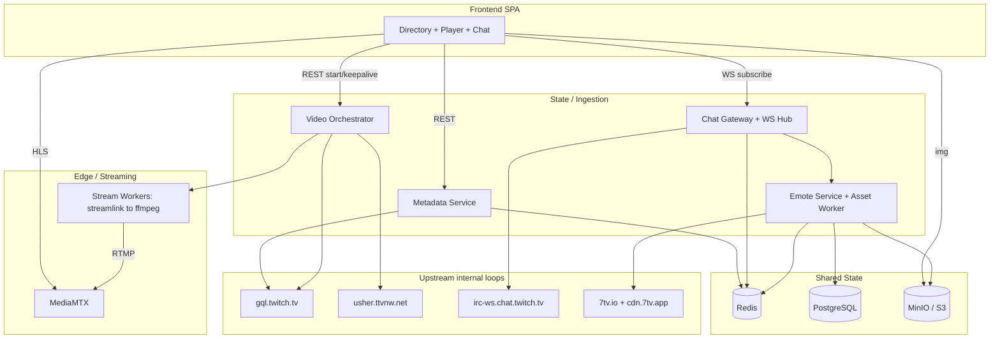
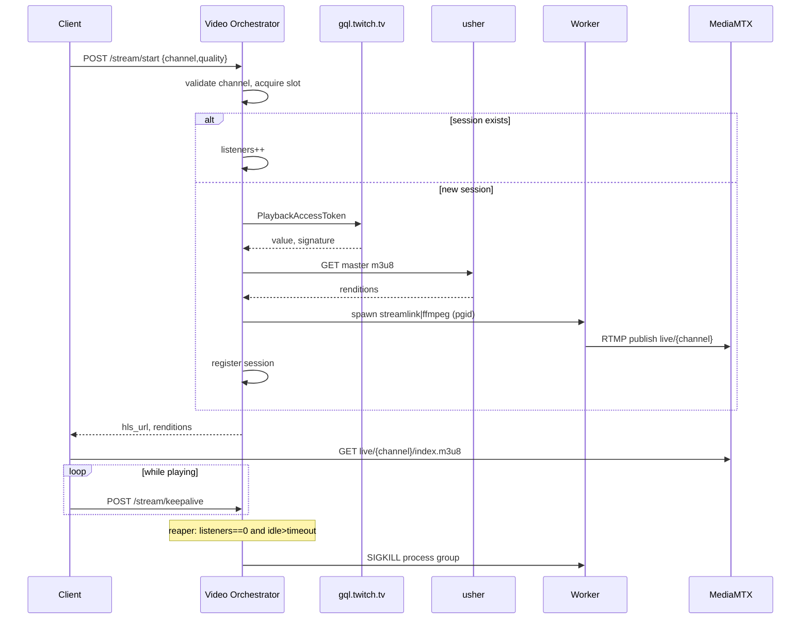
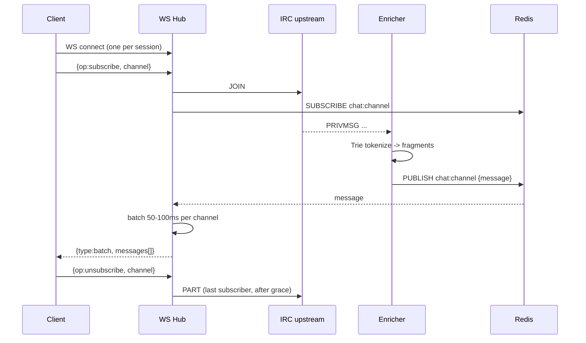
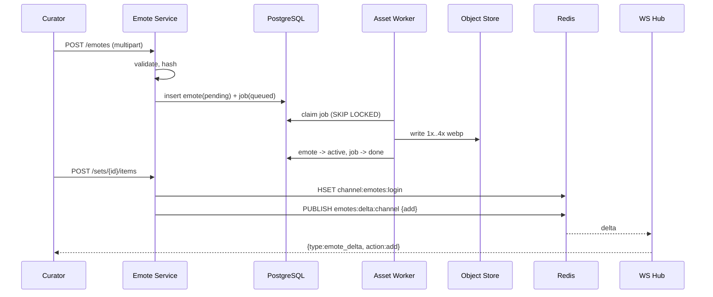

# Design: Open-Source Streaming & Chat Platform Clone

This document describes the architecture and component design that satisfies
`requirements.md`. It is organized as: system overview, per-service design, upstream
data contracts, internal contracts, database and Redis models, core algorithms,
sequence flows, deployment topology, cross-cutting concerns, and a requirements
traceability table. Per project convention PC-1, all code/config blocks below are
comment-free; rationale lives in the surrounding prose.

## 1. System Overview

The platform is a set of stateless-where-possible Go services fronted by a React SPA,
coordinated through Redis (cache + pub/sub) and PostgreSQL (durable emote state), with
MediaMTX as the media edge and MinIO/S3 as the emote object store.

Three zones, matching the requirements:

- **Edge / Streaming** — MediaMTX plus the Stream Worker subprocesses (Streamlink to FFmpeg).
- **State / Ingestion** — Metadata Service, Video Orchestrator, Chat Gateway, Emote Service,
  backed by Redis and PostgreSQL.
- **Frontend** — Vite + React SPA (HLS player, virtualized chat).



Request boundaries: the SPA only ever talks to our services and MediaMTX/object store;
it never contacts upstream directly. Chat enrichment and emote resolution happen
server-side before any byte reaches the browser.

## 2. Technology Stack & Key Decisions

Backend is Go across all services (PC-2). Shared libraries:

| Concern | Choice | Notes |
|---------|--------|-------|
| HTTP routing | `go-chi/chi` (net/http) | One ecosystem for REST + WS + middleware |
| WebSocket | `coder/websocket` | Context-aware, net/http native, idiomatic |
| Redis | `redis/go-redis/v9` | Cache, hashes, pub/sub |
| PostgreSQL | `jackc/pgx/v5` + `pgxpool` | Native driver, pooling |
| Migrations | `golang-migrate/migrate` | Versioned SQL migrations |
| Image processing | `davidbyttow/govips` (libvips) | Animated WebP, low memory |
| Config | env vars via `caarlos0/env` | 12-factor, no secrets in source |
| Logging | stdlib `log/slog` | Structured JSON logs |
| Metrics | `prometheus/client_golang` | `/metrics` per service |
| Coalescing | `golang.org/x/sync/singleflight` | Dedup concurrent upstream calls |
| Subprocess | stdlib `os/exec` + `syscall` | Process groups for tree-kill |

Frontend: Vite + React + TypeScript, TailwindCSS, `hls.js` (playback),
`@tanstack/react-virtual` (chat virtualization), `@tanstack/react-query` (metadata
fetching/caching), `zustand` (player/chat session state), native `WebSocket`.

Virtualization only bounds the DOM, not the backing array, so the chat store enforces a rolling
buffer of `MAX_RETAINED_MESSAGES` (default 200): when an incoming batch pushes the array past the
cap, the oldest messages are shifted out in the same update, preventing unbounded heap growth on
long sessions (Req. 6 AC-12).

Key decisions and rationale:

- **D1 — chi + coder/websocket over Fiber.** The plans suggested Fiber, but the Chat
  Gateway and WS Hub need first-class, context-cancellable WebSockets and standard
  middleware. Standardizing on the `net/http` ecosystem (chi + coder/websocket) keeps a
  single HTTP stack across all services and avoids mixing `fasthttp` and `net/http`. This
  is a deliberate deviation from the plan's Fiber suggestion.
- **D2 — Streamlink is the puller; our pipeline drives liveness + rendition discovery.**
  The Video Orchestrator performs the GQL PlaybackAccessToken + Usher handshake to confirm
  the channel is live, enumerate renditions for quality selection, and obtain the master
  playlist. The actual chunk pulling is delegated to Streamlink (piped to FFmpeg `-c copy`),
  because Streamlink robustly handles token refresh, ad-segment stitching, and integrity
  quirks far better than raw FFmpeg against a master URL. This satisfies Req. 2 AC-1/2/6
  (we do the handshake and select rendition) and AC-3 (a worker pulls the stream).
- **D3 — Redis pub/sub is the chat fan-out boundary.** The Chat Gateway publishes enriched,
  batched frames to `chat:{channel}`; the WS Hub subscribes only to topics for channels its
  connected clients have subscribed to. For V1 both run in one process, but the Redis seam
  lets the Hub scale horizontally later without code changes.
- **D4 — Emote dictionary is a Redis hash of JSON values.** Field = emote name, value =
  `{"u":url,"zw":bool}`. This supports atomic per-emote delta updates (`HSET`/`HDEL`) while
  still allowing a single `HGETALL` to rebuild the in-memory Trie.
- **D5 — Durable async asset jobs via a `processing_jobs` table.** Uploads/seeds enqueue a
  row; asset workers claim rows with `SELECT ... FOR UPDATE SKIP LOCKED`. This survives
  restarts and is idempotent by `(emote_id, source_hash)`, avoiding a separate queue system.

## 3. Service Designs

### 3.1 Metadata Service

Responsibilities: serve directory, categories, search, and channel-id resolution by reading
the internal GQL endpoint, with Redis caching, request coalescing, and integrity resilience.

HTTP surface (chi):

```
GET /v1/streams?limit=&cursor=
GET /v1/categories?limit=&cursor=
GET /v1/categories/{id}/streams?limit=&cursor=
GET /v1/search?q=
GET /v1/channels/{login}
GET /healthz
GET /readyz
GET /metrics
```

Internal structure:

```
metadata/
  http        chi handlers, input validation, pagination
  gql         upstream client, persisted-query payloads, response decoding
  cache       go-redis wrapper, TTL policy, stale fallback
  headers     HeaderProvider: client-id, user-agent, integrity rotation hook
```

Flow for a directory request: handler builds a cache key (`meta:streams:top:{limit}:{cursor}`),
checks Redis; on hit it returns immediately; on miss it calls `gql` through `singleflight`
keyed by the cache key so concurrent identical misses share one upstream call. `singleflight`
collapses requests only within one process, which suffices for single-node V1; for multi-node
deployments behind a load balancer, request coordination moves into Redis via a
stale-while-revalidate entry or a short-lived per-key lock so separate nodes do not issue
redundant upstream hits on the same key (future-proofing, not required for V1). The decoded
result is normalized (thumbnail templates resolved to a width/height-substitutable URL) and
written to Redis with a 60s TTL plus a longer-lived `:stale` copy used only when upstream
fails. Schema-decode failures are surfaced as a distinct `ErrUpstreamSchema` error class so
they are alertable (Req. 8 AC-3).

The `HeaderProvider` returns the static public `Client-ID`, a browser-like `User-Agent`, and,
when configured, a `Client-Integrity` / `X-Device-Id` pair from an optional integrity worker.
A `403`/integrity response triggers `Refresh()` then one retry before falling back to stale.

### 3.2 Video Orchestrator

Responsibilities: handshake for tokens, discover renditions, spawn/track/reap Stream Workers,
expose the local HLS URL, enforce concurrency and lifecycle (Req. 2, 13).

HTTP surface:

```
POST /v1/stream/start    {channel, quality?}  -> {hls_url, renditions, session_id}
POST /v1/stream/keepalive {channel, session_id}
POST /v1/stream/stop      {channel, session_id}
GET  /v1/stream/status    -> active sessions snapshot
```

Internal structure:

```
video/
  http        handlers, channel-name validation, concurrency semaphore
  token       GQL PlaybackAccessToken client
  usher       master m3u8 fetch + rendition parse
  worker      exec of streamlink|ffmpeg in a dedicated process group
  registry    channel -> session state (PID, PGID, listeners, lastSeen)
  reaper      ticker loop applying the idle-timeout kill rule
```

`start` validates the channel name (Req. 12 AC-7), acquires a slot from the concurrency
semaphore (Req. 2 AC-13), and if a session already exists it increments listeners and returns
the existing `hls_url` (AC-5). Otherwise it runs token + usher to confirm liveness and parse
renditions, selects the requested or default rendition, spawns the worker, registers the
session, and returns the local manifest URL `http://mediamtx:8888/live/{channel}/index.m3u8`.

Each `keepalive` updates `lastSeen`; the SPA pings on an interval while playing. The reaper
ticks every 10s and kills any session whose `listeners == 0` and `now - lastSeen > timeout`
(default 30s). Worker spawn uses a process group so the reaper can SIGKILL the entire
Streamlink+FFmpeg tree (detailed in Section 7). Unexpected worker exit while listeners remain
triggers bounded restarts (AC-11); on restart the orchestrator reconciles the registry with
live PIDs and reaps untracked stream processes (Req. 13 AC-5).

### 3.3 Chat Gateway + WS Hub

Responsibilities: maintain anonymous upstream IRC connections, parse and enrich messages,
fan out batched frames to clients over one persistent socket per session, and apply
backpressure (Req. 3, 5, 11).

Internal structure:

```
chat/
  upstream    pooled IRC connections, JOIN/PART, PING/PONG, reconnect
  parse       IRCv3 tag + PRIVMSG decoder
  enrich      per-channel dictionary + Trie, fragment builder
  hub         client WS sessions, SUBSCRIBE/UNSUBSCRIBE, conn<->channel maps
  batch       per-channel 50-100ms accumulator
  pubsub      publish chat:{channel}, subscribe per active channel
```

Upstream connections are pooled with a strict hard cap of `MAX_CHANNELS_PER_SOCKET` (default 30)
JOINs per socket: a single anonymous read loop bottlenecks and Twitch silently clips traffic on
overloaded sockets, so the connection manager tracks per-socket channel allocation and spins up a
new anonymous WebSocket client once the current socket is full. All subscribers of a channel still
share the one room subscription on whichever socket owns that channel (Req. 3 AC-7). Connection
drop triggers exponential backoff with jitter and rejoin of channels that still have subscribers
(AC-9). The parser requests `twitch.tv/tags twitch.tv/commands` caps to obtain color,
display-name, badges, and emote ranges.

Enrichment looks up the channel's in-memory `Trie` (Section 7) to produce ordered fragments;
the enriched message is published to Redis `chat:{channel}`. The `batch` stage accumulates
published messages per channel for the configured window and emits one array frame.

The Hub owns client sockets. On connect it holds one `coder/websocket` per session. It maintains
`conn -> set(channel)` and `channel -> set(conn)` maps. A `SUBSCRIBE` control frame adds the
channel (and triggers a Redis subscription + upstream JOIN if first subscriber); `UNSUBSCRIBE`
or disconnect removes it (and triggers PART when it was the last subscriber, after a grace
period — Req. 3 AC-8). Per-connection send queues are bounded; when a slow client overflows,
the oldest frames are dropped rather than growing memory (Req. 3 AC-10, Req. 11 AC-1).

### 3.4 Emote Service + Asset Worker

Responsibilities: curator CRUD, durable async asset processing to WebP, object storage,
7TV seeding, and dictionary/delta publication (Req. 4, 5, 14).

HTTP surface (curator endpoints require auth — Section 9):

```
POST   /v1/emotes              multipart upload -> enqueue job
GET    /v1/emotes/{id}
POST   /v1/sets                {name}
POST   /v1/sets/{id}/items     {emote_id, alias?}
DELETE /v1/sets/{id}/items/{emote_id}
PUT    /v1/channels/{twitch_id}/active-set  {set_id}
POST   /v1/seed/twitch/{twitch_id}          import from 7TV
```

Internal structure:

```
emote/
  http        curator API, auth middleware, upload validation
  repo        pgx queries for emotes/sets/items/channels/jobs
  storage     S3-compatible client (MinIO or AWS/R2)
  worker      claims jobs SKIP LOCKED, govips -> webp scales, idempotent
  seeder      provider fetch (7TV/FFZ) -> download selected assets -> reprocess -> upsert
  dict        rebuild channel:emotes:{login}, publish emotes:delta:{channel}
```

Upload flow: validate type/size (AC-5), compute `source_hash`, upsert an `emotes` row in
`pending` status, store the original to a temp object, and insert a `processing_jobs` row.
The asset worker claims jobs with `SELECT ... FOR UPDATE SKIP LOCKED`, runs the libvips scale
pipeline (Section 7), writes `/emotes/{id}/{scale}.webp` objects, and on full success marks the
emote `active`; on failure it records `last_error`, retries up to a cap, and leaves no partial
objects (AC-12). Idempotency is keyed by `(emote_id, source_hash)` so re-runs are safe.

The viewer-facing ensure endpoint accepts selected providers for a channel (`seventv`, `ffz`, or
both), starts a background provider import when needed, and returns per-provider processing state.
Provider imports record external provider identity on local emote rows while continuing to use the
existing local WebP asset worker and object-storage layout.

Any change to a channel's active set or its items causes `dict` to rebuild the Redis hash and
publish an `emotes:delta:{channel}` event carrying the add/remove so gateways swap their Trie
without a full DB reload (Req. 5 AC-9).

## 4. Upstream Data Contracts

All upstream endpoints, identifiers, and the GQL operation payloads are centralized in
configuration/one module (Req. 8 AC-1/4) so contract drift is a single-point change.

### 4.1 Twitch internal GQL

`POST https://gql.twitch.tv/gql` with headers `Client-ID: <public-web-id>`,
`User-Agent: <browser-like>`, and optional `Client-Integrity` / `Device-ID`.

PlaybackAccessToken request body:

```json
{
  "operationName": "PlaybackAccessToken_Template",
  "variables": {
    "isLive": true,
    "login": "{channel}",
    "isVod": false,
    "vodID": "",
    "playerType": "site"
  },
  "query": "query PlaybackAccessToken_Template($login: String!, $isLive: Boolean!, $vodID: ID!, $isVod: Boolean!, $playerType: String!) { streamPlaybackAccessToken(channelName: $login, params: {platform: \"web\", playerBackend: \"mediaplayer\", playerType: $playerType}) @include(if: $isLive) { value signature __typename } videoPlaybackAccessToken(id: $vodID, params: {platform: \"web\", playerBackend: \"mediaplayer\", playerType: $playerType}) @include(if: $isVod) { value signature __typename } }"
}
```

Response of interest:

```json
{ "data": { "streamPlaybackAccessToken": { "value": "<json-string>", "signature": "<hex>" } } }
```

Directory/category/search use the same endpoint via persisted-query hashes or inline queries;
the `gql` package decodes only the fields it needs and raises `ErrUpstreamSchema` on mismatch.

### 4.2 Usher (master playlist)

```
GET https://usher.ttvnw.net/api/channel/hls/{channel}.m3u8
    ?client_id={public-web-id}
    &token={value}
    &sig={signature}
    &allow_source=true
    &player_backend=mediaplayer
    &playlist_include_framerate=true
    &fast_bread=true
```

Returns a master `#EXTM3U` listing variant playlists with `#EXT-X-MEDIA` / `#EXT-X-STREAM-INF`
(`VIDEO="chunked"` is source). The `usher` package parses group-id, resolution, and framerate
into a rendition list returned to the client for quality selection.

### 4.3 Anonymous IRC over WebSocket

Connect `wss://irc-ws.chat.twitch.tv:443`. Handshake (anonymous, read-only):

```
PASS SCHMOOPIIE
NICK justinfan{random}
CAP REQ :twitch.tv/tags twitch.tv/commands
JOIN #{channel}
```

Respond to `PING :tmi.twitch.tv` with `PONG :tmi.twitch.tv`. Message line shape:

```
@badge-info=;badges=moderator/1;color=#1E90FF;display-name=Viewer;emotes=;tmi-sent-ts=1730000000000 :viewer!viewer@viewer.tmi.twitch.tv PRIVMSG #channel :Hello KEKW Clap
```

The `parse` package splits tags (`@k=v;...`), prefix, command, and trailing text; unknown tags
and non-PRIVMSG commands (`ROOMSTATE`, `USERNOTICE`, membership) are tolerated (Req. 3 AC-11).

### 4.4 7TV v3

```
GET https://7tv.io/v3/users/twitch/{twitch_user_id}
```

Returns the user mapping including `emote_set.emotes[]`, each with `id`, `name`, and
`data.animated` plus host file listing. Asset bytes come from
`https://cdn.7tv.app/emote/{emote_id}/{scale}x.webp`. The seeder downloads originals and
reprocesses them through our own libvips pipeline into our object store, then upserts rows
idempotently (Req. 14 AC-3); global emotes are flagged `is_global = true`.

## 5. Internal Contracts (WebSocket payloads)

One persistent client socket carries control frames upstream (client to hub) and data frames
downstream (hub to client). All frames are JSON objects discriminated by `op`/`type`.

Client to hub (control):

```json
{ "op": "subscribe", "channel": "streamer" }
{ "op": "unsubscribe", "channel": "streamer" }
```

Hub to client (batched chat, one frame per channel per window):

```json
{
  "type": "batch",
  "channel": "streamer",
  "messages": [
    {
      "id": "01J0X...",
      "user": "viewer123",
      "color": "#1E90FF",
      "badges": ["moderator/1"],
      "ts": 1730000000000,
      "fragments": [
        { "t": "text", "c": "Hello " },
        { "t": "emote", "c": "KEKW", "u": "/emotes/uuid1/1x.webp", "zw": false },
        { "t": "text", "c": " " },
        { "t": "emote", "c": "Clap", "u": "/emotes/uuid3/1x.webp", "zw": false }
      ]
    }
  ]
}
```

Concatenating `fragments[].c` reproduces the original message text and spacing (Req. 5 AC-5).
`zw: true` marks a zero-width emote the frontend renders overlapping the previous emote
(Req. 5 AC-6, Req. 6 AC-9). Emote URLs are scale-relative (`/emotes/{id}/{scale}.webp`);
the client picks the scale and prefixes the CDN/object base.

Hub to client (live emote delta):

```json
{ "type": "emote_delta", "channel": "streamer", "action": "add",
  "emote": { "name": "Pog", "u": "/emotes/uuid9/1x.webp", "zw": false } }
{ "type": "emote_delta", "channel": "streamer", "action": "remove", "emote": { "name": "Pog" } }
```

Hub to client (status):

```json
{ "type": "status", "channel": "streamer", "state": "subscribed" }
{ "type": "error", "code": "rate_limited", "message": "..." }
```

These data frames are produced by the Chat Gateway/Emote Service and relayed via Redis pub/sub
topics `chat:{channel}` and `emotes:delta:{channel}`; the hub forwards them only to connections
currently subscribed to that channel.

## 6. Data Model

### 6.1 PostgreSQL schema

```sql
CREATE EXTENSION IF NOT EXISTS pgcrypto;

CREATE TABLE emotes (
    id          UUID PRIMARY KEY DEFAULT gen_random_uuid(),
    name        VARCHAR(64) NOT NULL,
    owner_id    VARCHAR(100),
    is_global   BOOLEAN NOT NULL DEFAULT false,
    flags       INT NOT NULL DEFAULT 0,
    animated    BOOLEAN NOT NULL DEFAULT false,
    mime_type   VARCHAR(20) NOT NULL DEFAULT 'image/webp',
    source_hash CHAR(64),
    status      SMALLINT NOT NULL DEFAULT 0,
    created_at  TIMESTAMPTZ NOT NULL DEFAULT now(),
    updated_at  TIMESTAMPTZ NOT NULL DEFAULT now()
);

CREATE TABLE emote_sets (
    id         UUID PRIMARY KEY DEFAULT gen_random_uuid(),
    name       VARCHAR(100) NOT NULL,
    owner_id   VARCHAR(100),
    created_at TIMESTAMPTZ NOT NULL DEFAULT now()
);

CREATE TABLE emote_set_items (
    id           BIGSERIAL PRIMARY KEY,
    emote_set_id UUID NOT NULL REFERENCES emote_sets(id) ON DELETE CASCADE,
    emote_id     UUID NOT NULL REFERENCES emotes(id) ON DELETE CASCADE,
    alias        VARCHAR(64),
    status       SMALLINT NOT NULL DEFAULT 1,
    added_at     TIMESTAMPTZ NOT NULL DEFAULT now(),
    UNIQUE (emote_set_id, emote_id)
);

CREATE TABLE channels (
    twitch_id           VARCHAR(100) PRIMARY KEY,
    login               VARCHAR(50) NOT NULL UNIQUE,
    display_name        VARCHAR(100),
    active_emote_set_id UUID REFERENCES emote_sets(id) ON DELETE SET NULL,
    updated_at          TIMESTAMPTZ NOT NULL DEFAULT now()
);

CREATE TABLE processing_jobs (
    id         BIGSERIAL PRIMARY KEY,
    emote_id   UUID NOT NULL REFERENCES emotes(id) ON DELETE CASCADE,
    source_key TEXT NOT NULL,
    state      SMALLINT NOT NULL DEFAULT 0,
    attempts   INT NOT NULL DEFAULT 0,
    last_error TEXT,
    created_at TIMESTAMPTZ NOT NULL DEFAULT now(),
    updated_at TIMESTAMPTZ NOT NULL DEFAULT now()
);

CREATE INDEX idx_emotes_name ON emotes (name);
CREATE INDEX idx_emotes_global ON emotes (is_global) WHERE is_global = true;
CREATE INDEX idx_set_items_set ON emote_set_items (emote_set_id);
CREATE INDEX idx_jobs_claimable ON processing_jobs (state, id) WHERE state IN (0, 2);
```

Enum conventions (stored as SMALLINT/INT for portability):

- `emotes.status`: 0 pending, 1 active, 2 failed.
- `emote_set_items.status`: 1 active, 2 pending, 3 disabled.
- `processing_jobs.state`: 0 queued, 1 processing, 2 retry, 3 done, 4 failed.
- `emotes.flags` bitfield: 1 zero-width, 2 animated, 4 hidden.

Referential integrity (Req. 14 AC-2): set/item deletes cascade; clearing a set nulls a
channel's `active_emote_set_id`. The asset key is always derivable as `/emotes/{id}/{scale}.webp`
from the emote id (Req. 14 AC-4). High-frequency `channels.login` lookups (parsed from inbound
traffic by the Chat Gateway and Video Orchestrator) are served by the B-tree index PostgreSQL
creates implicitly for the `login ... UNIQUE` constraint; a separate `CREATE INDEX` on `login`
is intentionally omitted because it would be a redundant duplicate of that unique index, adding
write and storage cost for no read benefit.

### 6.2 Redis key model

| Key | Type | Purpose | TTL |
|-----|------|---------|-----|
| `meta:streams:top:{limit}:{cursor}` | string | cached directory page | 60s |
| `meta:streams:top:...:stale` | string | last-good fallback | 1h |
| `meta:category:{id}:streams:{cursor}` | string | cached category page | 60s |
| `meta:search:{hash}` | string | cached search result | 30s |
| `meta:channelid:{login}` | string | login to twitch id | 1h |
| `channel:emotes:{login}` | hash | field=name value=`{"u":..,"zw":bool}` | none |
| `stream:session:{channel}` | hash | optional multi-node session mirror | idle+grace |

Pub/sub topics: `chat:{channel}` (enriched batches), `emotes:delta:{channel}` (live deltas).
The emote dictionary hash has no TTL; it is authoritative cache rebuilt from PostgreSQL on miss
and mutated by delta operations (`HSET`/`HDEL`) so individual edits avoid a full reload.

## 7. Core Algorithms & Configuration

### 7.1 Trie tokenizer with atomic swap

Matching is whitespace-delimited whole-word, so the Trie is traversed once per word; total work
is linear in message length and independent of dictionary size (Req. 5 AC-3/AC-4). A per-channel
dictionary holds the Trie behind an `atomic.Pointer`, enabling lock-free reads and a race-free
swap when a delta arrives (Req. 5 AC-12).

```go
type Node struct {
    children map[rune]*Node
    emote    *Emote
}

type Trie struct {
    root *Node
}

func (t *Trie) Match(word string) (*Emote, bool) {
    n := t.root
    for _, r := range word {
        next, ok := n.children[r]
        if !ok {
            return nil, false
        }
        n = next
    }
    if n.emote == nil {
        return nil, false
    }
    return n.emote, true
}

type ChannelDict struct {
    ptr atomic.Pointer[Trie]
}

func (d *ChannelDict) Swap(t *Trie) { d.ptr.Store(t) }

func (d *ChannelDict) Tokenize(msg string) []Fragment {
    return d.ptr.Load().tokenize(msg)
}
```

On `emotes:delta:{channel}`, the gateway debounces for a configurable window (`DELTA_DEBOUNCE_MS`,
default 300ms): successive deltas arriving within the window are accumulated and collapsed, so a
curator editing dozens of emotes in a burst triggers one reconstruction rather than dozens (the
in-memory Trie is briefly stale by at most the window, an acceptable sub-second tradeoff). After
the window the gateway builds a fresh `Trie` from the current Redis hash off the hot path, then
calls `Swap`; in-flight `Tokenize` calls keep using the old pointer until the store completes. `tokenize` walks words, emitting `emote` fragments for matches (preserving the
`zw` flag) and coalescing runs of non-matching words plus their separators into `text` fragments
so the original spacing round-trips.

### 7.2 Process-group reaper

Workers spawn inside a new process group so the whole Streamlink+FFmpeg tree is killable with one
signal (Req. 2 AC-9, Req. 13 AC-4). Channel names are validated against `^[a-z0-9][a-z0-9_]{2,24}$`
before any exec, and arguments are passed as an argv slice (no shell string), preventing command
injection (Req. 12 AC-7).

```go
cmd := exec.CommandContext(ctx, "streamlink",
    "twitch.tv/"+channel, quality, "--stdout")
cmd.SysProcAttr = &syscall.SysProcAttr{Setpgid: true}

func killTree(pgid int) error {
    return syscall.Kill(-pgid, syscall.SIGKILL)
}
```

Streamlink's stdout pipes into FFmpeg (`-i pipe:0 -c copy -f flv`) publishing to
`rtmp://mediamtx:1935/live/{channel}`. The reaper loop:

```go
func (r *Reaper) tick(now int64) {
    for _, s := range r.registry.Snapshot() {
        if s.Listeners.Load() == 0 && now-s.LastSeen.Load() > r.timeoutMs {
            killTree(s.PGID)
            r.registry.Remove(s.Channel)
        }
    }
}
```

### 7.3 libvips scale pipeline

Emotes scale by height, preserving aspect ratio and animation, exported as WebP (WebP-only per
requirements). Animated sources are loaded with all pages so animation survives the resize.

```go
type Scale struct {
    Name   string
    Height int
}

var scales = []Scale{{"1x", 32}, {"2x", 64}, {"3x", 96}, {"4x", 128}}
```

For each scale the worker thumbnails the source to the target height and exports WebP, writing
`/emotes/{id}/{scale}.webp` to object storage; all four must succeed before the emote flips to
`active`, otherwise objects written so far are deleted (Req. 4 AC-12).

### 7.4 MediaMTX HLS ring buffer

MediaMTX serves HLS from a bounded in-memory ring buffer; `hlsSegmentCount` caps live segments so
long streams cannot grow storage without bound (Req. 2 AC-15).

```yaml
hlsAlwaysRemux: yes
hlsVariant: mpegts
hlsSegmentCount: 5
hlsSegmentDuration: 1s
hlsSegmentMaxSize: 50M
paths:
  ~^live/.*$:
    source: publisher
```

If a deployment instead muxes HLS to disk via FFmpeg, the equivalent bound is
`-hls_list_size 5 -hls_flags delete_segments`.

## 8. Sequence Flows

### 8.1 Stream start and reap



### 8.2 Chat subscribe, enrich, batch



### 8.3 Emote upload and live delta



## 9. Deployment Topology & Configuration

A single `docker-compose.yml` brings up infrastructure, a one-shot migration job, the four Go
services, and the frontend (Req. 9 AC-1). Services start independently so one failing service
does not block unrelated ones (Req. 9 AC-6).

```yaml
services:
  redis:
    image: redis:7-alpine
    volumes: ["redis-data:/data"]
  postgres:
    image: postgres:16-alpine
    environment:
      POSTGRES_USER: app
      POSTGRES_PASSWORD: ${PG_PASSWORD}
      POSTGRES_DB: emotes
    volumes: ["pg-data:/var/lib/postgresql/data"]
  minio:
    image: minio/minio
    command: server /data --console-address ":9001"
    environment:
      MINIO_ROOT_USER: ${S3_ACCESS_KEY}
      MINIO_ROOT_PASSWORD: ${S3_SECRET_KEY}
    volumes: ["minio-data:/data"]
  mediamtx:
    image: bluenviron/mediamtx:latest
    volumes: ["./mediamtx.yml:/mediamtx.yml"]
    ports: ["8888:8888", "1935:1935"]
  migrate:
    build: ./services/migrate
    depends_on: [postgres]
  metadata:
    build: ./services/metadata
    depends_on: [redis]
  video:
    build: ./services/video
    depends_on: [mediamtx]
  chat:
    build: ./services/chat
    depends_on: [redis, emote]
  emote:
    build: ./services/emote
    depends_on: [postgres, redis, minio, migrate]
  frontend:
    build: ./frontend
    depends_on: [metadata, video, chat]
    ports: ["5173:5173"]

volumes:
  redis-data:
  pg-data:
  minio-data:
```

Configuration is environment-driven (Req. 9 AC-2); no secrets in source. Selected variables:

| Variable | Service | Meaning |
|----------|---------|---------|
| `TWITCH_GQL_URL`, `TWITCH_CLIENT_ID` | metadata, video | upstream GQL endpoint + public id |
| `TWITCH_USHER_URL`, `TWITCH_IRC_URL` | video, chat | usher + IRC endpoints |
| `SEVENTV_API_URL`, `SEVENTV_CDN_URL` | emote | 7TV seed endpoints |
| `META_CACHE_TTL`, `STALE_TTL` | metadata | cache freshness |
| `STREAM_IDLE_TIMEOUT`, `MAX_CONCURRENT_STREAMS` | video | reaper + concurrency |
| `BATCH_WINDOW_MS`, `CLIENT_SEND_QUEUE`, `MAX_CHANNELS_PER_SOCKET`, `DELTA_DEBOUNCE_MS` | chat | batching, backpressure bound, IRC socket cap, delta debounce |
| `MAX_RETAINED_MESSAGES` | frontend | rolling chat-buffer cap |
| `DATABASE_URL`, `REDIS_URL` | all | datastore connections |
| `S3_ENDPOINT`, `S3_BUCKET`, `S3_ACCESS_KEY`, `S3_SECRET_KEY` | emote | object store (MinIO/R2/S3) |
| `CDN_PUBLIC_BASE` | emote, frontend | public base for emote URLs |
| `CURATOR_API_TOKEN` | emote | admin auth secret |

Switching object storage between MinIO and S3/R2 is purely `S3_ENDPOINT`/credentials (Req. 9
AC-4). The `migrate` job runs `golang-migrate` against `DATABASE_URL` on fresh deploys (AC-3).

## 10. Cross-Cutting Concerns

### 10.1 Observability

Every service emits structured `slog` JSON with a request/correlation id propagated across
service hops, exposes `/healthz` (liveness) and `/readyz` (dependency checks) for orchestration
probes, and publishes Prometheus metrics on `/metrics` (Req. 10). Tracked metrics include:

- `streams_active`, `stream_listeners{channel}`, `streams_reaped_total`, `stream_restart_total`
- `chat_messages_in_total`, `chat_messages_out_total`, `tokenize_seconds` (histogram)
- `cache_hits_total` / `cache_misses_total`, `upstream_requests_total{op,result}`
- `asset_jobs_total{state}`, `asset_process_seconds`

Worker spawn/reap log channel, PID, and reason; integrity challenges and `ErrUpstreamSchema`
log at a severity wired for alerting (Req. 10 AC-4/5).

### 10.2 Security

- **Admin auth.** Curator endpoints require `CURATOR_API_TOKEN` (bearer) middleware; viewer read
  APIs are intentionally anonymous and documented as such. Exposing curator/write routes without
  auth is a defect (Req. 12 AC-5).
- **Input validation.** Channel names match `^[a-z0-9][a-z0-9_]{2,24}$`; pagination bounds, search
  length, and upload type/size are enforced (Req. 12 AC-3).
- **Injection prevention.** Subprocess args are an argv slice, never a shell string; SQL uses pgx
  parameterized queries (Req. 12 AC-7).
- **Output safety.** Chat text is delivered as data in `fragments[].c`; the SPA renders it as text
  nodes (never `innerHTML`), so chat cannot inject markup (Req. 12 AC-2).
- **Rate limiting.** Per-IP token-bucket middleware on `stream/start`, `search`, and WS connect
  (Req. 12 AC-4).
- **Secrets.** Loaded from env/secret store only; never logged (Req. 12 AC-6).

### 10.3 Error handling & resilience

All upstream and inter-service calls take a `context` deadline (Req. 13 AC-3). Each upstream has
a retry-with-backoff wrapper and a circuit breaker; an open breaker on metadata serves the
`:stale` copy. Per-channel failures are isolated: one bad worker or IRC socket does not affect
other channels (Req. 13 AC-1/2). `ErrUpstreamSchema` is a distinct class so parser drift is
diagnosable rather than a generic 500 (Req. 8 AC-3). On orchestrator restart the registry is
reconciled with live PIDs and untracked stream processes are killed (Req. 13 AC-5).

### 10.4 Testing strategy

- **Unit:** Trie tokenizer + fragment round-trip, reaper idle rule, header rotation, cache stale
  fallback, IRC tag parser, Usher rendition parser, libvips scale count (Req. 15 AC-4).
- **Contract:** recorded upstream fixtures (GQL, Usher m3u8, IRC lines, 7TV JSON) replayed against
  parsers so upstream-shape regressions fail fast.
- **Integration:** Testcontainers for PostgreSQL, Redis, and MinIO covering upload to active and
  set-change to delta publish.
- **Load:** synthetic high-velocity chat (target thousands msg/s on one channel) asserting bounded
  memory and batch-window latency under the cap (Req. 11 AC-1/3).

## 11. Requirements Coverage

| Requirement | Design coverage |
|-------------|-----------------|
| 1. Metadata Service | 3.1, 4.1; cache keys 6.2; coalescing/stale 3.1, 10.3 |
| 2. Video Pipeline | 3.2, 4.1, 4.2; reaper/process-group 7.2; ring buffer 7.4; flow 8.1 |
| 3. Chat Gateway | 3.3, 4.3; control frames 5; conn maps + grace PART 3.3 |
| 4. 7TV Emote DB & assets | 3.4, 6.1; libvips WebP-only 7.3; storage 9 |
| 5. Tokenization & integration | 3.3, 5; Trie + atomic swap 7.1; dict hash 6.2/D4 |
| 6. Frontend | 2 (stack); persistent socket + fragments 5; flows 8.1/8.2 |
| 7. Caching & pub/sub | 6.2; fan-out boundary D3; degradation 10.3 |
| 8. Upstream resilience | 4 (centralized contracts); 3.1 headers; ErrUpstreamSchema 10.3 |
| 9. Config & deployment | 9 (compose, env table, storage switch, migrate) |
| 10. Observability | 10.1 |
| 11. Performance | 7.1 (linear tokenize), 3.3 (batch/backpressure), 10.4 (load) |
| 12. Security | 10.2 |
| 13. Resilience | 10.3; reaper 7.2; reconcile 3.2 |
| 14. Data integrity | 6.1 (FKs, derivable keys); idempotent seed/jobs 3.4/D5 |
| 15. Non-functional | PC-1 throughout; 10.4 testing; 9 portability |
| 16. Constraints/scope | honored: Go-only, WebP-only, anonymous read-only IRC |

PC-1 compliance: all SQL, Go, YAML, and JSON blocks above are comment-free; explanation is in
prose. Open items deferred to the tasks phase: concrete persisted-query hashes for directory GQL
operations (to be captured from a live session during implementation) and the optional headless
integrity-token worker (interface defined in 3.1, implementation optional).
