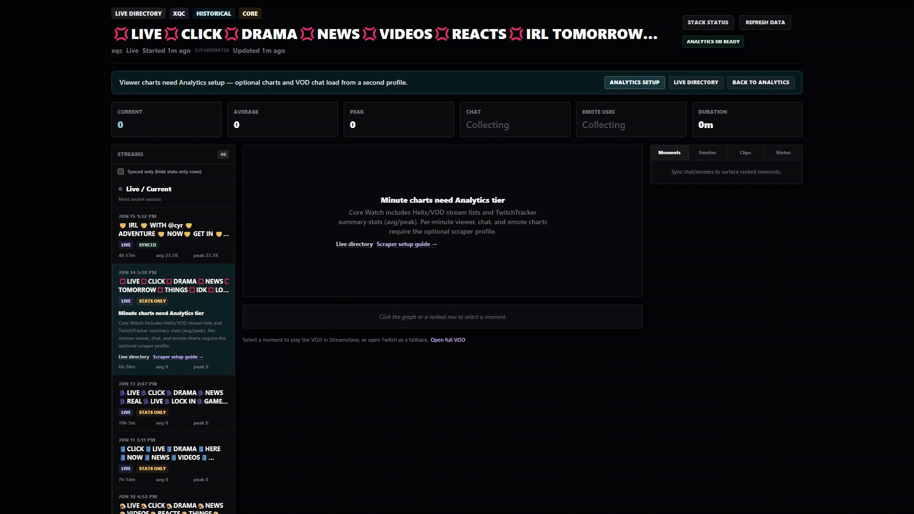
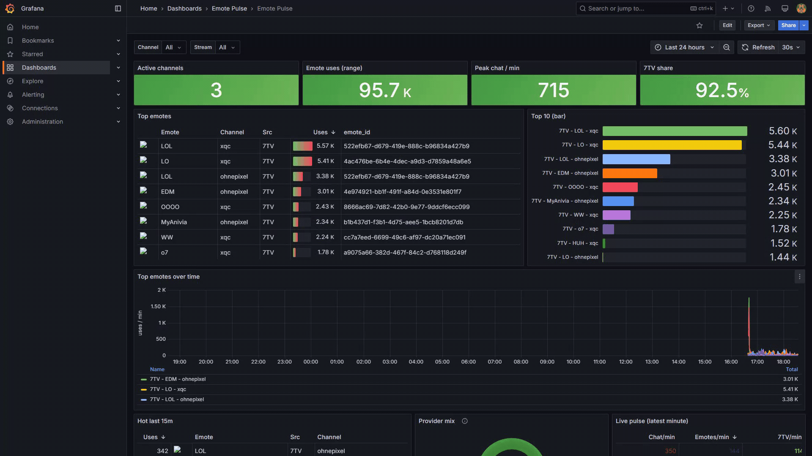

<p align="center">
  
</p>

# Streamclone

Self-hosted Twitch-style directory with live HLS playback, chat, 7TV emotes, Analytics with chat and emote spike views, optional Clip Studio, and Pulse dashboards. Apache-2.0. Not affiliated with Twitch or 7TV.

## Start Here

Need: Docker Desktop running.

1. Download `Streamclone-Setup-v*.exe` from [Releases](https://github.com/Aron-Chu/streamclone/releases/latest).
2. Run it.
   If Windows or antivirus blocks the unsigned EXE, use `Install Streamclone.cmd` from the release ZIP instead.

Daily use: launch **Streamclone** from the Desktop shortcut. Stop, repair, update, and uninstall are in the manager menu.

Developers:

```sh
git clone https://github.com/Aron-Chu/streamclone.git
cd streamclone
make setup
```

## Docs

- [Install and lifecycle](docs/install-desktop.md)
- [Optional features](docs/options.md)
- [Security](SECURITY.md)
- [Contributing](CONTRIBUTING.md)
- [Roadmap](docs/product-roadmap.md)

## Preview






Regenerate preview media with `powershell -File scripts\capture-showcase-media.ps1` while the stack and Pulse dashboard are running.

## Stack

Browser `:8090` -> Caddy -> Go services, MediaMTX, MinIO, PostgreSQL, and Redis. Optional services add the scraper, Clip Studio, and Pulse dashboards; Pulse is started from Stack status.

## License

[Apache License 2.0](LICENSE). You are responsible for complying with Twitch, 7TV, and local laws when operating this software.
