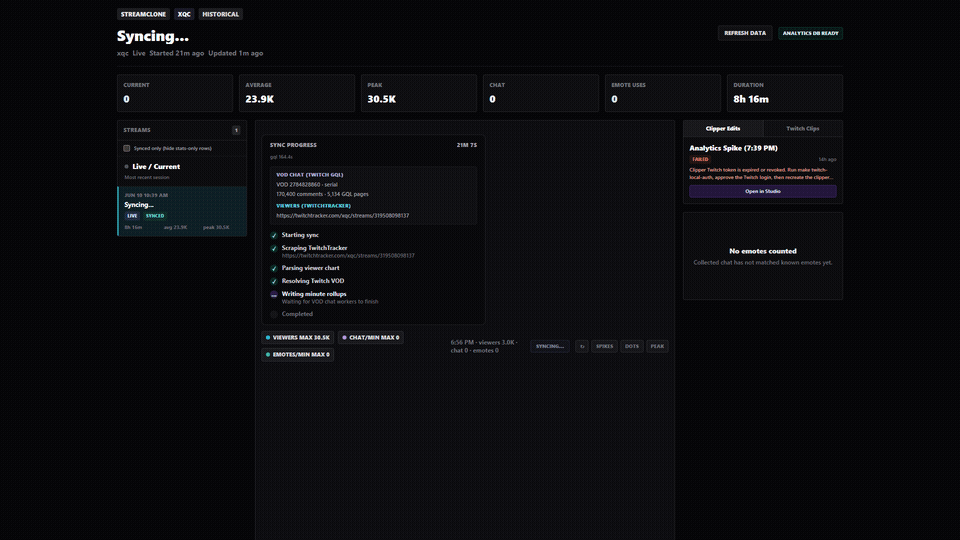
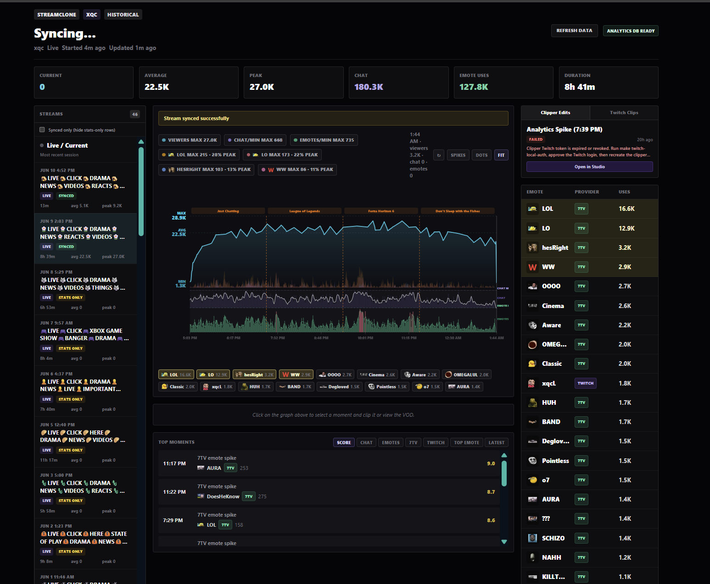

<p align="center">
  
</p>

# Streamclone

Self-hosted Twitch-style directory with HLS playback, analytics, and optional Clip Studio — no ads, fast 7TV emotes.

## Install

**Prerequisites:** [Docker Desktop](https://docs.docker.com/desktop/) running.

1. Download **`Streamclone-Setup-*.exe`** (or **`Install Streamclone.cmd`**) from **[latest release](https://github.com/Aron-Chu/streamclone/releases/latest)**
2. Run the installer (~3–5 min) — sets up Docker, opens **`http://localhost:8090/`**
3. Next time: double-click **`Start Streamclone`** on your Desktop
4. Pause: **`Stop Streamclone`** · Remove everything: **`Uninstall Streamclone`**

| Platform | Install | Daily | Pause | Uninstall |
|----------|---------|-------|-------|-----------|
| Windows | `Streamclone-Setup-*.exe` or `Install Streamclone.cmd` | `Start Streamclone.cmd` | `Stop Streamclone.cmd` | Settings → Apps, or `Uninstall Streamclone.cmd` |
| macOS | `launchers/Install Streamclone.command` | `launchers/Start Streamclone.command` | `launchers/Stop Streamclone.command` | `launchers/Uninstall Streamclone.command` |
| Developers | `git clone` + `make setup` | `make start` | `make down` | `scripts/uninstall-streamclone.ps1` |

Full guide: [docs/install-desktop.md](docs/install-desktop.md) · Optional features: [docs/options.md](docs/options.md)

**Profiles:** `core` (default) · `scraper` · `clipper` · `full`

---

## See it in action

Regenerate (stack must be up): `powershell -File scripts/capture-readme-media.ps1`

**Directory**


**Channel — live playback + chat**


**Analytics — sync in progress**



**Analytics — finished chart**



---

## Stack

```
Browser :8090 → Caddy → frontend, metadata, video, chat, emote, analytics, MediaMTX, MinIO
```

PostgreSQL + Redis behind the Go services.

## License

Apache License 2.0 (open source) — [LICENSE](LICENSE). Not affiliated with Twitch or 7TV; compliance is your responsibility.
