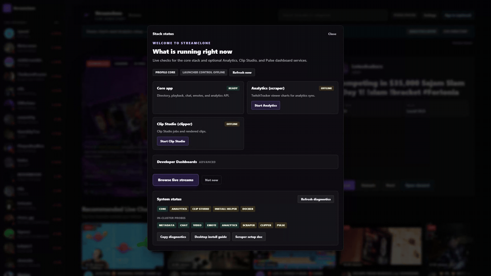
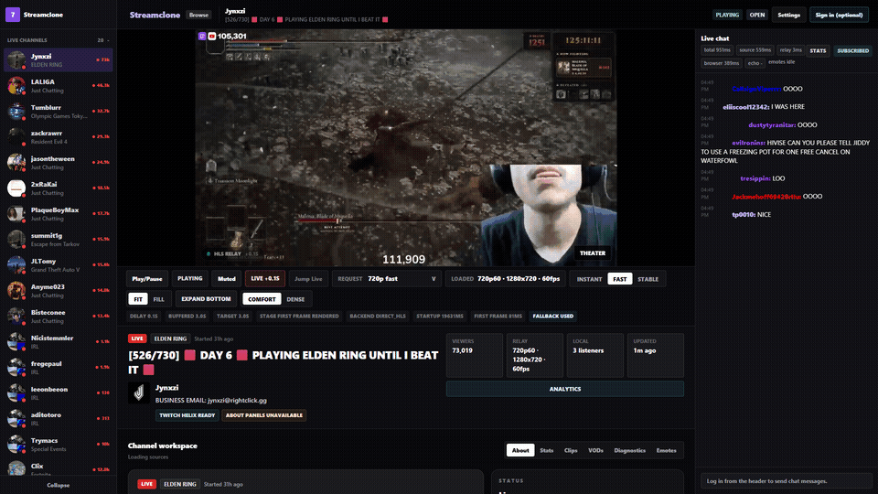

<p align="center">
  
</p>

# Streamclone

Self-hosted Twitch-style directory with live HLS playback, chat, 7TV emotes, Analytics, and optional Clip Studio. Apache-2.0. Not affiliated with Twitch or 7TV.

## Start Here

Need: Docker Desktop running.

1. Download `Streamclone-Setup-*.exe` from [Releases](https://github.com/Aron-Chu/streamclone/releases/latest).
2. Run it.
3. Open `http://localhost:8090/`.

Daily use: launch **Streamclone** from the Desktop shortcut. Stop, repair, update, and uninstall are in the manager menu.

Developers:

```sh
git clone https://github.com/Aron-Chu/streamclone.git
cd streamclone
make setup
```

## Docs

- [Install and lifecycle](docs/install-desktop.md)
- [Optional features](docs/options.md)
- [Security](SECURITY.md)
- [Contributing](CONTRIBUTING.md)
- [Roadmap](docs/product-roadmap.md)

## Preview





Regenerate preview media with `make docs-media` while the stack is running.

## Stack

Browser `:8090` -> Caddy -> Go services, MediaMTX, MinIO, PostgreSQL, and Redis. Optional profiles add the scraper, Clip Studio, and Pulse dashboards.

## License

[Apache License 2.0](LICENSE). You are responsible for complying with Twitch, 7TV, and local laws when operating this software.
