# Streamclone

Self-hosted Twitch-style live directory, HLS playback, emote-rich chat, and stream analytics — with a local 7TV-style emote pipeline, no ads, and optional spike-based clipping.

After `make bootstrap`, open **`http://localhost:8090`**. Everything below is what you should see on a healthy local stack.

---

## Directory

Live channel grid with categories and search.

**Home — live channels**

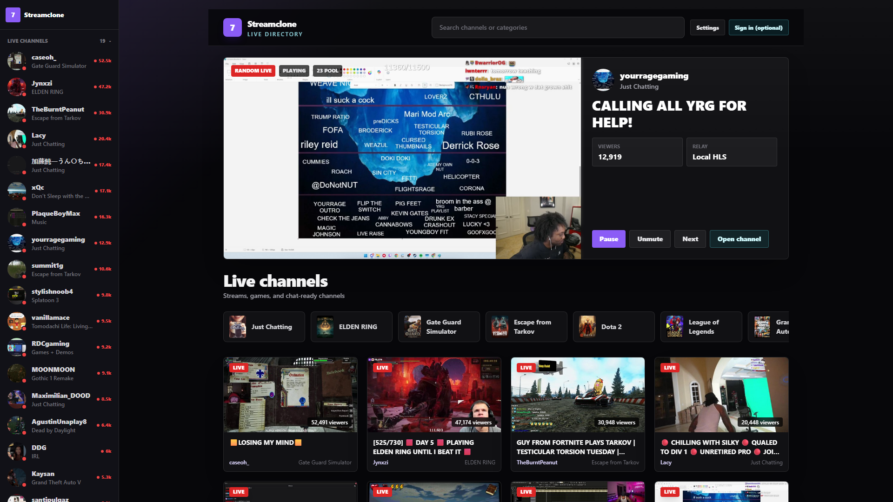

**Browse by category**

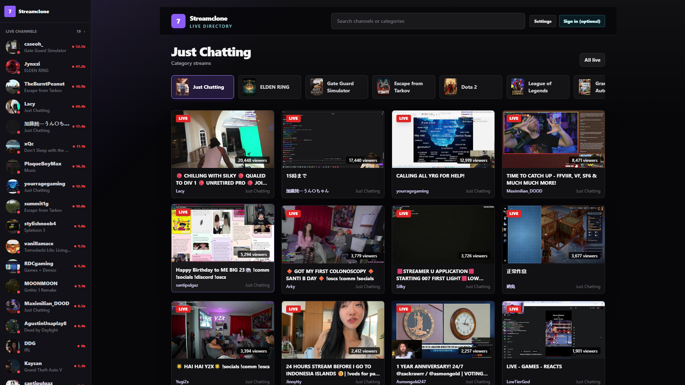

**Search channels**

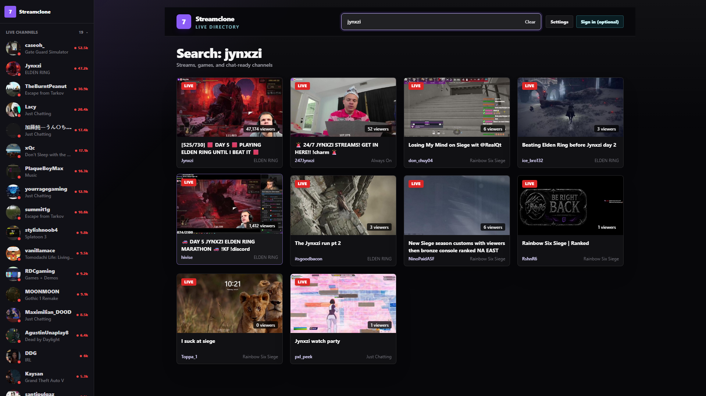

---

## Channel

Player, IRC chat with 7TV / FFZ / Twitch emotes, stats, and tabs.

**Channel workspace (player + chat + sidebar)**

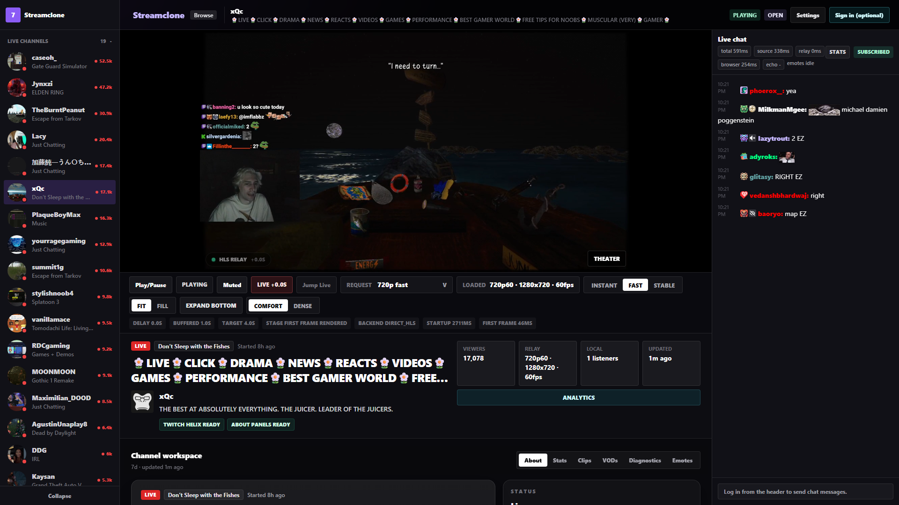

**Live playback**

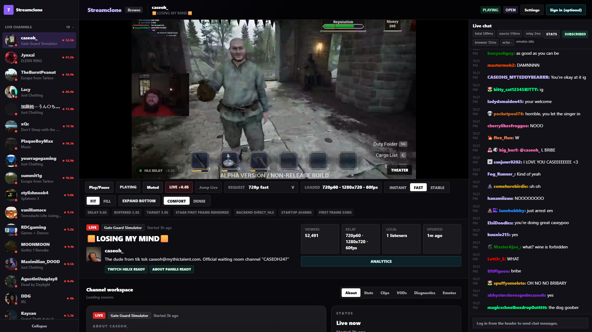

**Emotes tab**

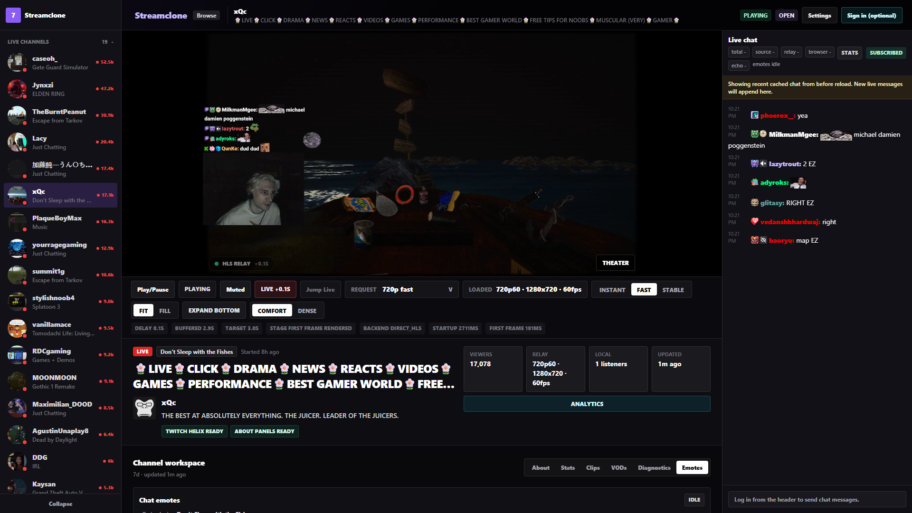

**Stats tab**

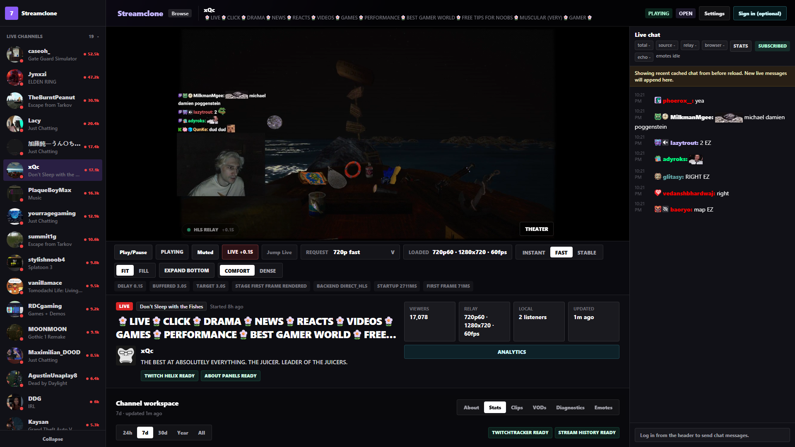

---

## Analytics

Historical streams, minute rollups, chat/emote counts, and optional TwitchTracker viewer sync.

**Past streams list**

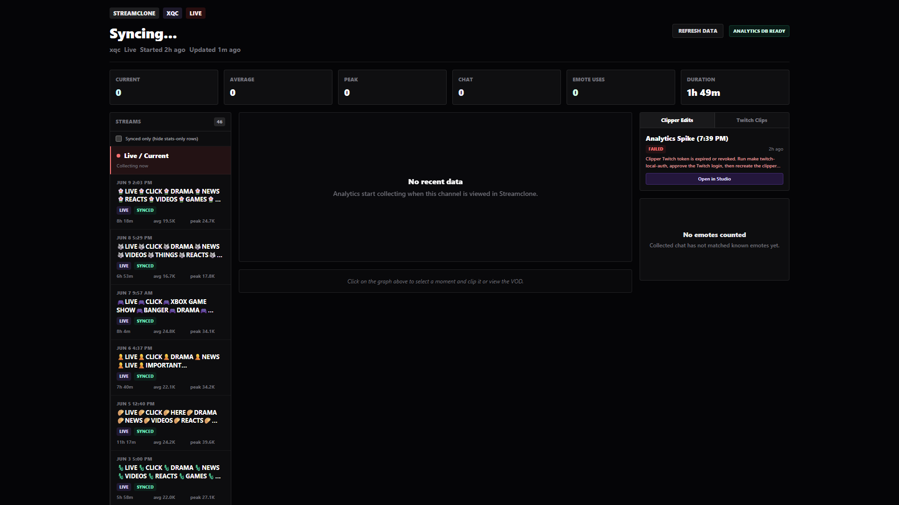

**Stream detail with charts**

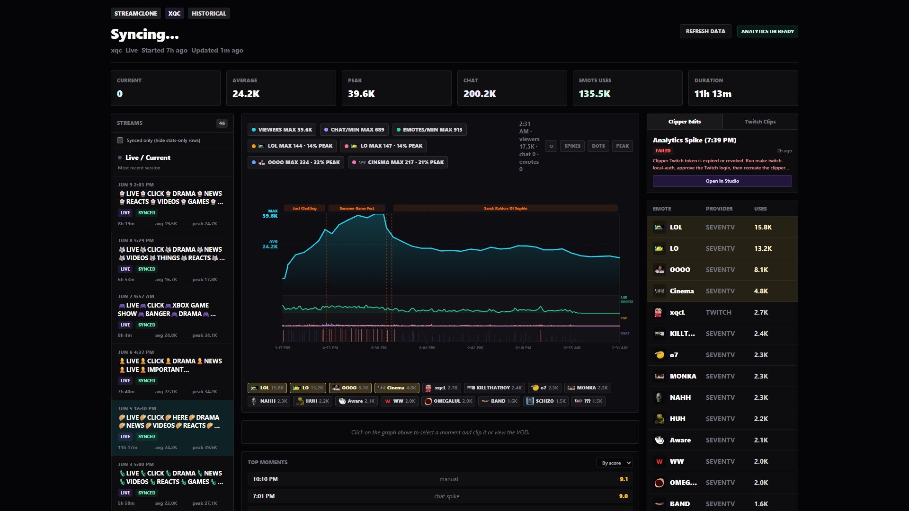

**Synced minute rollups**

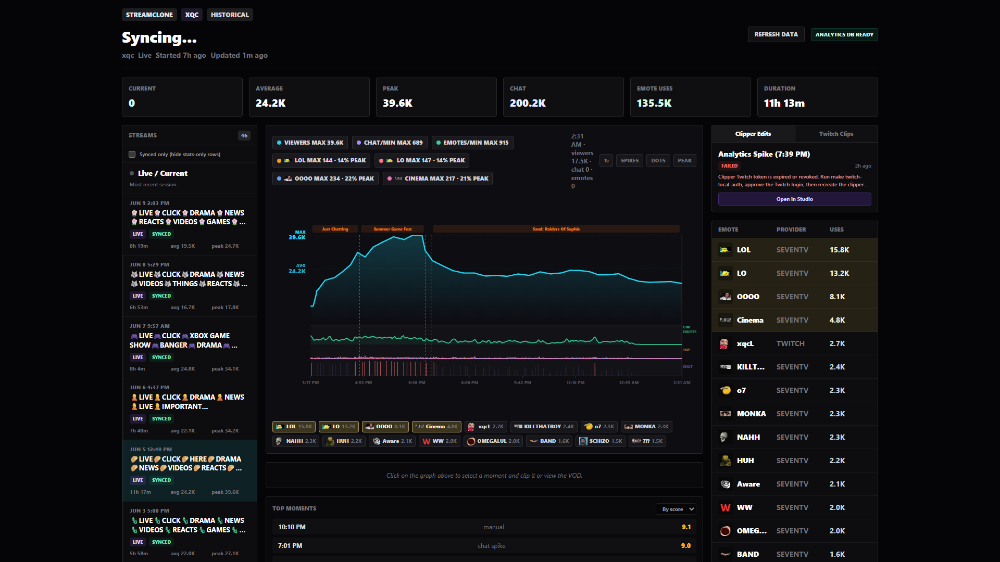

**Historical sync in progress**

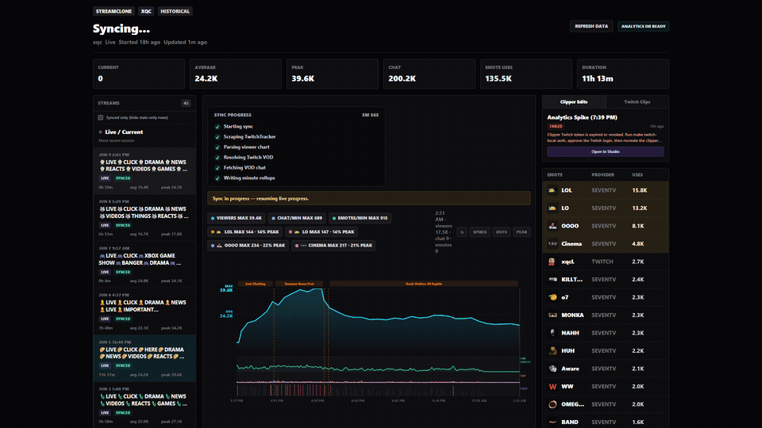

---

## Quick start

**Prerequisites:** Docker Desktop with `docker compose` on PATH.

```sh
git clone https://github.com/Aron-Chu/streamclone.git
cd streamclone
make bootstrap    # creates .env, starts core stack
make smoke        # health checks once services are up
```

**Windows (no make):**

```powershell
powershell -ExecutionPolicy Bypass -File scripts/bootstrap.ps1
powershell -ExecutionPolicy Bypass -File scripts/smoke-core.ps1
```

### Optional profiles

| Command | What it adds |
|---|---|
| `make up` | Core stack only (default) |
| `make up-scraper` | TwitchTracker scraper for historical viewer charts |
| `make up-full` | Scraper + live clipper / Clip Studio |

Scraper builds from sibling repo [streamclone-scraper](https://github.com/Aron-Chu/streamclone-scraper) — clone it next to this repo, then `make up-scraper`.

**Local proxy:** Open `http://localhost:8090` only. Caddy (`local-proxy`) reverse-proxies all services for same-origin auth, chat WebSocket, and HLS — do not point the browser at raw service ports.

**Optional scraper egress:** `make up-scraper` may use `PROXY_*` vars in your private `.env` for TwitchTracker — configure via [streamclone-scraper](https://github.com/Aron-Chu/streamclone-scraper). Never commit proxy URLs, credentials, or session vault keys.

**Refresh README screenshots** (1920×1080, stack must be up):

```powershell
powershell -ExecutionPolicy Bypass -File scripts/capture-readme-media.ps1
```

Or drop your own PNG/GIF files into `docs/images/` with the same filenames. Use a **1920×1080** browser window at 100% zoom so GitHub does not squash them.

Install hooks: `make install-hooks`.

## Architecture

```
Browser  ──REST──►  Metadata :8081   (directory, search, categories)
         ──REST──►  Video     :8082   (Usher handshake, stream workers)
         ──WS────►  Chat      :8083   (IRC gateway, emote tokenization)
         ──REST──►  Emote     :8084   (CRUD, sets, asset pipeline)
         ──REST──►  Analytics :8086   (rollups, historical sync)
         ──HLS───►  MediaMTX  :8888   (RTMP ingest → HLS edge)
         ──img───►  MinIO     :9000   (emote WebP assets)
```

Caddy on `:8090` proxies everything for local dev. PostgreSQL 16 + Redis 7 behind the services.

## License

MIT — see [LICENSE](LICENSE).

## Legal notice

This project accesses third-party internal endpoints (Twitch GraphQL, Usher, IRC, 7TV) for **educational and personal self-hosting only**. It is **not affiliated with or endorsed by Twitch or 7TV**. Use may violate upstream Terms of Service; **the operator is solely responsible for compliance**.
