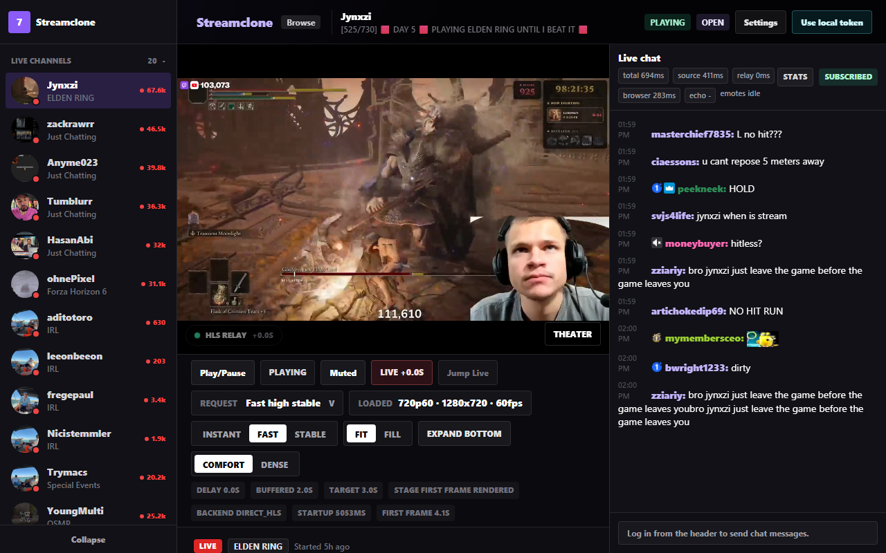

# Streamclone

Self-hosted Twitch-style live directory, HLS playback, emote-rich chat, stream analytics, and a live clipper — Go microservices plus a React/Vite SPA, with a self-hosted 7TV-style emote database.

Open **`http://localhost:8090`** after setup. All browser traffic goes through a single Caddy reverse proxy.

## Screenshots

| Directory | Channel workspace |
|---|---|
|  |  |

Regenerate with `make docs-screenshots` (requires a running stack and at least one live channel). See [docs/screenshots.md](docs/screenshots.md).

## Features

- **Live directory and channel workspace** — browse categories, search, and open channels with HLS playback via MediaMTX and hls.js latency modes (normal, low, ultra-low).
- **IRC chat with emotes** — anonymous read-only IRC; 7TV, FFZ, and Twitch emotes rendered from a local emote service and Redis dictionary.
- **Stream analytics** — minute rollups, Helix viewer samples, IRC chat/emote counts, TwitchTracker historical sync, and VOD chat import. See [docs/architecture.md](docs/architecture.md).
- **Clip Studio / live clipper** — Helix clip creation, Whisper transcription, and a browser-based editor at `/studio`. See [clipper/README.md](clipper/README.md).
- **Curator emote API** — upload, set management, 7TV/FFZ ensure, and async WebP processing (libvips).

## Architecture

The browser talks only to Streamclone services — never directly to Twitch, 7TV, or other upstream providers.

```
Browser  ──REST──►  Metadata :8081   (directory, search, categories)
         ──REST──►  Video     :8082   (Usher handshake, stream workers)
         ──WS────►  Chat      :8083   (IRC gateway, emote tokenization)
         ──REST──►  Emote     :8084   (CRUD, sets, asset pipeline)
         ──REST──►  Analytics :8086   (rollups, Tracker sync)
         ──HLS───►  MediaMTX  :8888   (RTMP ingest → HLS edge)
         ──img───►  MinIO     :9000   (emote WebP assets)
```

Infrastructure: PostgreSQL 16 (emotes, analytics), Redis 7 (cache, pub/sub), and a sibling **streamclone-scraper** service for TwitchTracker HTML capture.

For HLS relay buffering, latency tuning, and player behavior, see [docs/hls-relay-buffer-latency.md](docs/hls-relay-buffer-latency.md). Full service breakdown: [docs/architecture.md](docs/architecture.md).

## Quick start (two-repo layout)

Streamclone and the analytics scraper are **separate repositories** that must sit beside each other for Docker Compose build paths:

```
parent/
  streamclone/          ← this repo
  streamclone-scraper/  ← sibling (TwitchTracker / Playwright scraper)
```

**Prerequisites:** Docker Desktop with `docker compose` on PATH.

```sh
git clone https://github.com/YOUR_GITHUB_USER/streamclone.git
git clone https://github.com/YOUR_GITHUB_USER/streamclone-scraper.git   # sibling folder

cd streamclone
cp .env.example .env
# Edit .env — set CURATOR_API_TOKEN to a strong random value
make up
```

Open **`http://localhost:8090`**.

On Windows without `make`, run the equivalent compose command from [docs/getting-started.md](docs/getting-started.md).

## Analytics scraper

Historical viewer charts and TwitchTracker sync use a self-hosted Firecrawl-compatible scraper in the sibling [**streamclone-scraper**](../streamclone-scraper) repo. The analytics service calls `FIRECRAWL_API_URL=http://scraper:8000/v2/scrape` inside Compose. See the scraper README for standalone use, browser engines, and Cloudflare troubleshooting.

## Documentation

| Topic | Link |
|---|---|
| Getting started | [docs/getting-started.md](docs/getting-started.md) |
| Architecture | [docs/architecture.md](docs/architecture.md) |
| HLS relay & latency | [docs/hls-relay-buffer-latency.md](docs/hls-relay-buffer-latency.md) |
| Configuration | [docs/configuration.md](docs/configuration.md) |
| Development | [docs/development.md](docs/development.md) |
| Deployment & observability | [docs/deployment.md](docs/deployment.md) |
| Security & legal | [docs/security.md](docs/security.md) |
| Screenshot capture | [docs/screenshots.md](docs/screenshots.md) |
| Sharing & cloud storage | [DISTRIBUTION.md](DISTRIBUTION.md) |
| Local Twitch auth | [oauth.md](oauth.md) |
| AI agents & contributors | [AGENTS.md](AGENTS.md) |
| Live clipper | [clipper/README.md](clipper/README.md) |
| Free VM deployment | [deploy/FREE_DEPLOYMENT.md](deploy/FREE_DEPLOYMENT.md) |
| Local HTTPS tunnel | [deploy/LOCAL_HTTPS_OAUTH.md](deploy/LOCAL_HTTPS_OAUTH.md) |
| Contributing | [CONTRIBUTING.md](CONTRIBUTING.md) |

## Development and CI

```sh
go test ./...
go vet ./...
cd frontend && npm ci && npm run build
make docs-screenshots   # stack must be up; needs a live channel for channel.png
```

GitHub Actions runs Go tests, frontend build, Docker image builds (including analytics), and a compose smoke test that checks out the scraper sibling repo. See [CONTRIBUTING.md](CONTRIBUTING.md) for local CI parity and clone layout.

## License

MIT — see [LICENSE](LICENSE).

## Legal notice

This project accesses third-party internal endpoints (Twitch GraphQL, Usher, IRC, 7TV) for **educational and personal self-hosting only**. It is **not affiliated with or endorsed by Twitch or 7TV**. Use may violate upstream Terms of Service; **the operator is solely responsible for compliance**. Full notice: [docs/security.md](docs/security.md).
