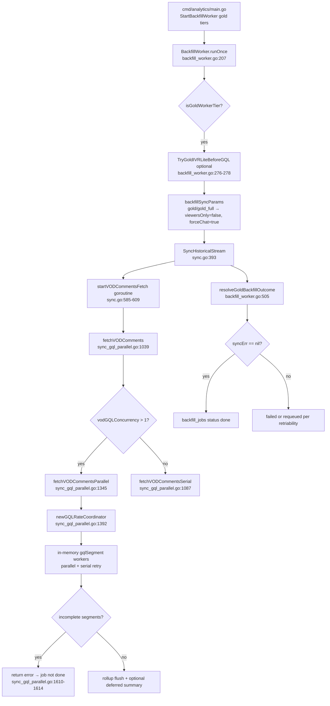

# Corpus PR 0A — archaeology audit

**Date:** 2026-07-01
**Scope:** Read-only audit for [`docs/requirements/corpus-scaling-observability.md`](../requirements/corpus-scaling-observability.md) PR 0A. **No runtime code changes.**
**Audited checkout:** local `master` at `af788cf` (see §1 — behind `origin/master`).

---

## Executive summary

| Question | Verdict |
|----------|---------|
| Local `master` synced with `origin/master` for `migrations/`, `internal/`, `cmd/`? | **No** — 8 commits behind; `migrations/000045`–`000049` missing locally; `internal/` missing 3 portal files on origin |
| Migration `000049_gold_vod_segments` present locally? | **Yes** (restored from `origin/master` in PR 0B-1) |
| `GOLD_PER_VOD_GQL_RPM` wired into GQL throttle? | **No** — config parsed only; production uses `ANALYTICS_VOD_GQL_*` + in-process `gqlRateCoordinator` |
| `gold_vod_rate_limits` | **Dead reference** — no migration/table/tests/writes; **recommend remove SELECT in PR 0B** |
| `gold_vod_segments` store wired to production? | **Yes when `GOLD_VOD_SEGMENTS_ENABLED=true`** (PR 0B-2 implemented locally; pending commit) |
| Public API changes needed for PR 0B? | **No** for sensitivity; segment ledger is internal-only |

---

## 1. Git sync (`migrations/`, `internal/`, `cmd/`)

| Path | Synced? | Evidence |
|------|---------|----------|
| `cmd/` | **Yes** | `git diff --stat HEAD origin/master -- cmd/` → empty |
| `internal/` | **No** | Behind on `portal_analytics_api.go` (+117), `portal_analytics_api_test.go` (+70), `api.go` (-1 route) |
| `migrations/` | **No** | Missing `000045`–`000049` locally; restored on origin in `f4361af` |

```
Local HEAD:     af788cf284ae19fa530a3a79a379df1c0505dff1
origin/master:  ae7501cfe4c129c3dacbe3b4401fae57c114182e
Commits behind: 8 (0 ahead)
```

**Missing migration chain on disk (on origin only):**

- `migrations/000045_emote_name_text.{up,down}.sql`
- `migrations/000046_pulse_guest_principal_kind.{up,down}.sql`
- `migrations/000047_top500_gold_vod_inventory.{up,down}.sql`
- `migrations/000048_emote_history_phase1a.{up,down}.sql`
- `migrations/000049_gold_vod_segments.{up,down}.sql`

**Gate 0 action (before PR 0B):** `git fetch origin && git merge origin/master` (or rebase) so local tree matches origin for migrations and the three `internal/` portal files.

---

## 2. Migration `000049_gold_vod_segments`

| Check | Result |
|-------|--------|
| File on local `master` | **Absent** (`glob migrations/000049*` → 0 files) |
| File on `origin/master` | **Present** — `migrations/000049_gold_vod_segments.up.sql` |
| Creates `gold_vod_rate_limits` | **No** — only `gold_vod_segments` + indexes |
| Referenced by integration tests | Yes — `gold_vod_segment_store_test.go` `applyGoldVODSegmentMigration` reads `migrations/000049_gold_vod_segments.up.sql` |

**Schema (origin):** durable segment queue with `segment_key`, `vod_id`, `stream_id`, `login`, `status` (`queued|running|done|failed|dead_letter|skipped`), lease fields (`lease_owner`, `lease_expires_at`, `heartbeat_at`), `next_run_at`, `comments_fetched`, `cursor`, `error`, `strategy_version`, offset window columns, partial indexes for claim/lease/job lookups.

---

## 3. Gold production call path



### Findings table — production path

| Step | File | Function / lines | Notes |
|------|------|------------------|-------|
| Worker start | `cmd/analytics/main.go` | `StartBackfillWorker` ~387–401 | Tiers: `gold`, `gold_full`, `gold_lite`; `WithGoldSyncTimeout` |
| Job claim + run | `internal/analytics/backfill_worker.go` | `runOnce` 207–304 | Claims from `backfill_jobs` |
| Gold sync params | `internal/analytics/backfill_worker.go` | `backfillSyncParams` 162–170 | `gold`/`gold_full`: full TT + forced GQL |
| IVR pre-pass | `internal/analytics/backfill_worker.go` | `TryGoldIVRLiteBeforeGQL` 276–278 | Optional; shadow reconcile after GQL |
| Historical sync entry | `internal/analytics/sync.go` | `SyncHistoricalStream` 393+ | TT scrape + VOD comment fetch |
| GQL goroutine | `internal/analytics/sync.go` | `startVODCommentsFetch` 585–609 | Skipped when `viewersOnly` or chat complete |
| GQL router | `internal/analytics/sync_gql_parallel.go` | `fetchVODComments` 1039–1084 | Chooses serial vs parallel |
| Parallel fetch | `internal/analytics/sync_gql_parallel.go` | `fetchVODCommentsParallel` 1345+ | **In-memory** `buildGQLSegments` — not `gold_vod_segments` table |
| Rate coordination | `internal/analytics/sync_gql_parallel.go` | `gqlRateCoordinator` 47–150, `newGQLRateCoordinator` 1392 | Adaptive concurrency on 429/throttle |
| Incomplete failure | `internal/analytics/sync_gql_parallel.go` | 1610–1614 | Returns error if segments remain incomplete |
| Job completion | `internal/analytics/backfill_worker.go` | `resolveGoldBackfillOutcome` 505–518 | `syncErr == nil` → `done` via `resolveBackfillOutcome` |
| Sync service wiring | `cmd/analytics/main.go` | `NewSyncService` 241–282 | Passes **`ANALYTICS_VOD_GQL_*`** only — no `GOLD_*` GQL fields |

### Orphaned durable segment store (not on production path)

| File | Symbols | Production callers |
|------|---------|-------------------|
| `internal/analytics/gold_vod_segments.go` | `PlanGoldVODSegments`, `GoldVODSegmentKey` | **None** (tests only) |
| `internal/analytics/gold_vod_segment_store.go` | `UpsertGoldVODSegmentPlans`, `ClaimGoldVODSegment`, `CompleteGoldVODSegment`, `FailGoldVODSegment`, `CorpusGoldSegmentSummary` | **None** (tests + `corpus_readiness.go` read path) |

---

## 4. `GOLD_PER_VOD_GQL_RPM` wiring

| Layer | Wired? | Detail |
|-------|--------|--------|
| `internal/config/config.go` | Parsed | `GoldPerVODGQLRPM` (`GOLD_PER_VOD_GQL_RPM`, default 30), `GoldGlobalGQLRPM` (120) |
| `internal/config/config_test.go` | Tested | Env default / override tests only |
| `cmd/analytics/main.go` | **Not passed** | `NewSyncService` uses `cfg.AnalyticsVODGQL*` |
| `internal/analytics/sync.go` | **No field** | `SyncService` has `vodGQLConcurrency*` — no RPM |
| `internal/analytics/sync_gql_parallel.go` | **Not used** | `gqlRateCoordinator` throttles via **concurrency** + pause/backoff on rate-limit responses, not RPM buckets |
| `deploy/env/*.env` | **Not set** | Corpus profiles set `GOLD_BACKFILL_*`, `ANALYTICS_VOD_GQL_*`; no `GOLD_PER_VOD_GQL_RPM` |

**Related `GOLD_*` env vars (also config-only today):**

| Env | Default | Intended for segment ledger (PR 0B) | Used in analytics today |
|-----|---------|-------------------------------------|-------------------------|
| `GOLD_MAX_PARALLEL_VODS` | 2 | Yes (design) | No |
| `GOLD_MAX_SEGMENTS_PER_VOD` | 4 | Yes — matches `ClaimGoldVODSegment` param in tests | No |
| `GOLD_SEGMENT_SIZE_SECONDS` | 600 | Yes — overlaps `ANALYTICS_VOD_GQL_SEGMENT_SECONDS` | No (parallel path uses `ANALYTICS_VOD_GQL_*`) |
| `GOLD_RETRY_MAX` | 3 | Yes — store `max_attempts` | No |
| `GOLD_LEASE_TTL_SECONDS` | 120 | Yes — store leases | No |

**Actual throttle observability:** Prometheus in `internal/metrics/metrics.go` — `analytics_vod_gql_throttle_total`, `analytics_vod_gql_backoff_seconds_total`, `analytics_vod_gql_worker_pages_total`, etc.

**PR 0B implication:** Either wire `GOLD_PER_VOD_GQL_RPM` / `GOLD_GLOBAL_GQL_RPM` into `gqlRateCoordinator` (or a token bucket), or **document deprecation** and map operators to `ANALYTICS_VOD_GQL_CONCURRENCY_*` + Grafana panels (see `.kiro/steering/analytics.md`).

---

## 5. `gold_vod_rate_limits` audit

### References

| Location | Usage |
|----------|--------|
| `internal/analytics/gold_vod_segment_store.go` | `CorpusGoldSegmentSummary` — `SELECT COUNT(*) FROM gold_vod_rate_limits WHERE last_limited_at IS NOT NULL AND reset_at > now()` → `RateLimitedBuckets` (errors **swallowed**: `_ = ...Scan`) |
| `internal/analytics/corpus_readiness.go` | `rateLimitReadinessComponent` — degrades readiness when `RateLimitedBuckets > 0` |
| `docs/requirements/corpus-scaling-observability.md` | Listed as unresolved design |

### Existence check

| Artifact | Exists? |
|----------|---------|
| Migration / `CREATE TABLE` | **No** |
| Go write path | **No** |
| Tests for table | **No** |
| Deploy env | **No** |

### Recommendation: **remove dead SELECT; do not implement table in PR 0B** (done in PR 0B-1)

**Implemented (2026-07-01):** `CorpusGoldSegmentSummary` now counts recent `gold_vod_segments` rows whose `error` indicates rate limiting (15-minute window). The orphan `gold_vod_rate_limits` table was never migrated.

**Original rationale:**

1. **No schema** — the SELECT always fails silently today; `RateLimitedBuckets` is always `0` in production readiness.
2. **Wrong abstraction for current architecture** — GQL throttling is **in-process** per analytics worker (`gqlRateCoordinator`), not durable cross-worker Postgres buckets.
3. **Observability already exists** — Prometheus throttle/backoff metrics + segment `failed` rows (after PR 0B wiring) are sufficient for ops.
4. **Implement later only if needed** — a durable `gold_vod_rate_limits` table might make sense when **multiple worker identities** share GQL budget (PR 1+, blocked on PR 0B + metrics). That requires an explicit bucket model (`vod_id`, `window_start`, `tokens`, `reset_at`) designed with multi-worker lease owners — not the current orphan SELECT.

**PR 0B action:** Delete the `gold_vod_rate_limits` query from `CorpusGoldSegmentSummary`; change `rateLimitReadinessComponent` to use Prometheus hook or segment failure reason codes (`gql_rate_limited` on `gold_vod_segments.error`) — **not** a new table in 0B.

---

## 6. Gold segment tests gated behind `INTEGRATION=1`

Gate is `setupSessionStore` in `internal/analytics/session_test.go:393-394` (`INTEGRATION` env required for Postgres).

| Test | File | Gating |
|------|------|--------|
| `TestGoldVODSegmentStoreClaimsRespectPerVODLeaseLimit` | `gold_vod_segment_store_test.go:20` | **`INTEGRATION=1`** + applies `000049` SQL from disk |
| `TestGoldVODSegmentStoreMovesToDeadLetterAfterRetries` | `gold_vod_segment_store_test.go:61` | **`INTEGRATION=1`** + migration file |

**Not gated (run in normal `go test ./internal/analytics/...`):**

| Test | File |
|------|------|
| `TestDurationSecondsRoundsUpAndDefaults` | `gold_vod_segment_store_test.go:11` |
| `TestGoldVODSegmentKeyIsDeterministic` | `gold_vod_segments_test.go:5` |
| `TestPlanGoldVODSegmentsCoversTrailingWindow` | `gold_vod_segments_test.go:19` |
| `TestPlanGoldVODSegmentsRejectsInvalidInput` | `gold_vod_segments_test.go:36` |
| `TestRateLimitReadinessComponentFlagsGQLRateLimit` | `corpus_readiness_test.go:170` |
| `TestCorpusActualStateIncludesGoldSegmentCounts` | `corpus_readiness_test.go:185` |

**Related (not `INTEGRATION=1`, should stay in CI):** `gql_dedupe_test.go` (6 tests), `sync_gql_parallel_test.go` segment/coordinator unit tests.

**CI today:** `make check-quick` → `make test` → `go test ./...` **without** `INTEGRATION=1`. Only `make test-integration` runs `INTEGRATION=1 ./internal/integration/` — **not** analytics segment store tests.

**Blocker:** Integration tests **fail to apply migration** until local tree has `migrations/000049_gold_vod_segments.up.sql` (git sync).

---

## 7. CI vs nightly test recommendation

| Suite | Run where | Command / trigger |
|-------|-----------|-------------------|
| Segment planning + key determinism | **CI** (`check-quick`) | `go test ./internal/analytics/... -run 'GoldVODSegmentKey|PlanGoldVOD'` |
| `durationSeconds` helper | **CI** | `TestDurationSecondsRoundsUpAndDefaults` |
| Corpus readiness gold segment fields | **CI** | `TestCorpusActualStateIncludesGoldSegmentCounts`, `TestRateLimitReadinessComponentFlagsGQLRateLimit` |
| GQL comment dedupe | **CI** | `go test ./internal/analytics/... -run 'GQLCommentDeduper'` |
| Parallel GQL segment/coordinator units | **CI** | `sync_gql_parallel_test.go` |
| Segment store claim/lease/dead-letter | **Nightly or dedicated job** | `INTEGRATION=1 go test ./internal/analytics/... -run 'GoldVODSegmentStore' -count=1` with Postgres service + migrated `000049` |
| Full analytics integration (session, emote history, top500 redis) | **Nightly** (optional expand) | Existing `INTEGRATION=1` patterns in `session_test.go`, etc. |

**Suggested PR 0B-1 CI addition:** scheduled workflow or `workflow_dispatch` job with Postgres container, `migrate up` through `000049`, then the two `GoldVODSegmentStore*` tests.

---

## 8. Public API sensitivity (PR 0B scope)

| Check | Result |
|-------|--------|
| PR 0B requires new `/v1/public/*` fields? | **No** — segment ledger is internal; hub stays aggregate-only per requirements |
| Existing guardrail test | `TestPublicHubResponseOmitsSensitiveKeys` in `hub_overview_test.go:51` — forbids rollups, GQL internals, stream IDs in public hub JSON |
| `CorpusGoldSegmentSummary` on public hub? | **No** — consumed by `/v1/internal/corpus/readiness` (`corpus_readiness.go:328`) |
| Internal routes in PR 0B+ | Coverage/gaps/workers APIs are **internal auth** only (requirements § Internal extend) |

**Out of PR 0B scope (note for later PRs):** Requirements acceptance calls for live hub activity graph excluding `chat_source=gql|ivr`. On audited `HEAD`, `Store.AggregateActivityBucketsSince` and `RecentRollupBucketsByStreamID` query `analytics_minute_rollups` **without** `chat_source` filter (`store.go` ~716). That is a **separate** product fix — not required to wire `gold_vod_segments` in PR 0B.

---

## Findings table (consolidated)

| ID | Finding | Severity | Paths |
|----|---------|----------|-------|
| F1 | Local `master` 8 commits behind origin; migrations `000045`–`000049` missing | **Blocker for 0B** | `migrations/` |
| F2 | `internal/` missing portal analytics files from origin | **Sync before 0B** | `portal_analytics_api.go`, tests |
| F3 | `gold_vod_segments` store implemented but **zero production callers** | Expected (0B work) | `gold_vod_segment_store.go`, `gold_vod_segments.go` |
| F4 | Gold GQL uses in-memory parallel segments, not durable ledger | Expected (0B work) | `sync_gql_parallel.go` |
| F5 | `GOLD_PER_VOD_GQL_RPM` / `GOLD_GLOBAL_GQL_RPM` **not wired** | Config drift | `config.go` vs `cmd/analytics/main.go` |
| F6 | Production GQL throttle = `ANALYTICS_VOD_GQL_*` + `gqlRateCoordinator` | Info | `sync_gql_parallel.go`, `metrics.go` |
| F7 | `gold_vod_rate_limits` dead SELECT, no table | **Fix in 0B** | `gold_vod_segment_store.go:289-293` |
| F8 | `resolveGoldBackfillOutcome` marks `done` on `syncErr == nil` only — parallel incomplete segments **do** return error today | Partial mitigation | `backfill_worker.go:505`, `sync_gql_parallel.go:1610` |
| F9 | Segment integration tests skipped in CI; need Postgres + `000049` file | **0B-1** | `gold_vod_segment_store_test.go`, `Makefile` |
| F10 | Public hub sensitivity tests exist; **no PR 0B public API change** | OK | `hub_overview_test.go` |
| F11 | Live activity graph `chat_source` filter not in store queries (doc/code gap) | Future PR | `store.go` |

---

## PR 0B readiness checklist

Complete **before opening PR 0B** (Gate 0 + 0B prerequisites):

### Gate 0 — sync & docs

- [ ] Merge/rebase to `origin/master` (`ae7501c` or later)
- [x] Confirm `migrations/000049_gold_vod_segments.up.sql` on disk
- [ ] Confirm BearHost / streampulse-vps Postgres has `000049` applied (normal migrate path)
- [x] PR 0A audit published (`docs/agent-notes/corpus-pr0a-audit.md`)
- [x] `gold_vod_rate_limits` decision accepted: **remove SELECT** (PR 0B-1 `b3bc4b6`)

### PR 0B-1 — migration + tests + dead query

- [x] Restore migrations `000045`–`000049` on disk (commit `b3bc4b6`)
- [x] Remove `gold_vod_rate_limits` SELECT from `CorpusGoldSegmentSummary`
- [x] Add `make test-analytics-gold-segments` + nightly workflow
- [ ] Confirm BearHost / streampulse-vps Postgres has `000049` applied (operator)

### PR 0B-2 — production wiring

- [x] Implemented locally: `GOLD_VOD_SEGMENTS_ENABLED` (default `false`), ledger hooks in `fetchVODCommentsParallel`
- [ ] Committed / deployed
- [ ] Hosted canary per `docs/agent-notes/corpus-0b2-hosted-verify.md`

### PR 0B-2 split (original checklist)

- [x] Restore migrations `000045`–`000049` on disk (from `origin/master`)
- [x] Remove `gold_vod_rate_limits` SELECT from `CorpusGoldSegmentSummary` (segment error evidence instead)
- [x] Add `make test-analytics-gold-segments` + nightly workflow `.github/workflows/analytics-gold-segments-integration.yml`
- [ ] Confirm BearHost / streampulse-vps Postgres has `000049` applied (normal migrate path)
- [ ] Verify unit tests pass in `check-quick`: `PlanGoldVOD*`, `gql_dedupe_test.go`

### PR 0B-2 — wire durable segment ledger (additive)

- [x] `PlanGoldVODSegments` + `UpsertGoldVODSegmentPlans` at parallel fetch start (flag on)
- [x] `ClaimGoldVODSegmentByKey` / `CompleteGoldVODSegment` / `FailGoldVODSegment` in fetch lifecycle
- [x] `GOLD_MAX_SEGMENTS_PER_VOD`, `GOLD_LEASE_TTL_SECONDS`, `GOLD_RETRY_MAX` via `WithGoldVODSegments`
- [x] `GOLD_VOD_SEGMENTS_ENABLED` wired in `cmd/analytics/main.go` (default false)
- [x] Rollback: flag false; checkpoints + in-memory path unchanged when disabled
- [ ] Committed / deployed / hosted canary (`docs/agent-notes/corpus-0b2-hosted-verify.md`)

### PR 0B-3 — completion semantics

- [x] Design note: `docs/agent-notes/corpus-pr0b3-completion-semantics.md`
- [ ] `resolveGoldBackfillOutcome` / job finish must not mark `done` when durable segments remain unresolved
- [ ] Reclaim expired leases (`status=running` + stale `lease_expires_at`) — integration test proof

### Post-0B (not blocking 0B start)

- [ ] Wire or deprecate `GOLD_PER_VOD_GQL_RPM` / `GOLD_GLOBAL_GQL_RPM` explicitly
- [ ] Live hub `chat_source` filter for public activity graph (requirements acceptance)
- [ ] Internal coverage/gaps/requeue APIs (PR 2+)

---

## References

- Requirements: [`docs/requirements/corpus-scaling-observability.md`](../requirements/corpus-scaling-observability.md)
- VPS corpus hosting: [`docs/streampulse-vps.md`](../streampulse-vps.md)
- Analytics steering (GQL ops): [`.kiro/steering/analytics.md`](../../.kiro/steering/analytics.md)
- Prior IVR ops note: [`docs/agent-notes/ivr-gold-prod-status.md`](ivr-gold-prod-status.md)
