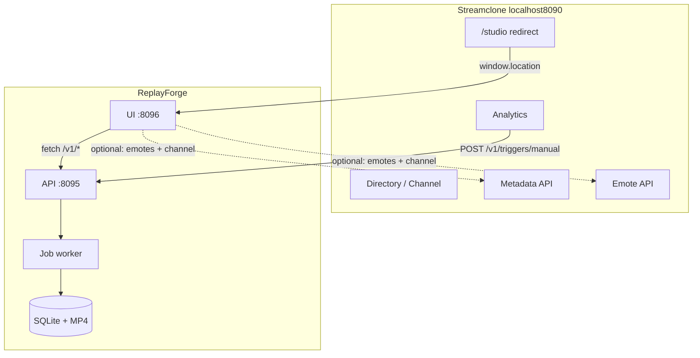

# Agent Guide: Streamclone + ReplayForge

**Audience:** AI agents working in either repository while clip/editing features evolve in **ReplayForge**.

**Product names**

| Name | What it is |
|------|------------|
| **Streamclone** | Local Twitch-style watch desk (directory, HLS, chat, emotes, Analytics, optional Pulse). Repo: `Aron-Chu/streamclone`. Local folder may still be `twitch-7tv-clone`. |
| **ReplayForge** | Standalone clip factory + Clip Studio editor (formerly in-repo `clipper/`). Sibling checkout: `../replayforge`. |

Streamclone **does not embed** the clipper container anymore. It **calls** ReplayForge’s API and **redirects** users to ReplayForge’s UI.

---

## Table of contents

1. [Why two repos](#1-why-two-repos)
2. [Architecture overview](#2-architecture-overview)
3. [Product tiers (Streamclone)](#3-product-tiers-streamclone)
4. [Repository layout](#4-repository-layout)
5. [Streamclone internals](#5-streamclone-internals)
6. [ReplayForge internals](#6-replayforge-internals)
7. [How they connect](#7-how-they-connect)
8. [End-to-end flows](#8-end-to-end-flows)
9. [Environment variables](#9-environment-variables)
10. [API contract](#10-api-contract)
11. [Auth and tokens](#11-auth-and-tokens)
12. [Agent boundaries (what to edit where)](#12-agent-boundaries-what-to-edit-where)
13. [Health, optional services, and UX](#13-health-optional-services-and-ux)
14. [Testing and probes](#14-testing-and-probes)
15. [Deprecated and transitional paths](#15-deprecated-and-transitional-paths)
16. [Roadmap context (formula engine)](#16-roadmap-context-formula-engine)
17. [Related documents](#17-related-documents)

---

## 1. Why two repos

**Streamclone** optimizes for: browse → watch → chat → Analytics moments.

**ReplayForge** optimizes for: ingest clip → transcribe → edit → template → export short-form video.

Splitting them means:

- Core Watch works without ReplayForge running.
- ReplayForge can evolve (export profiles, trend formulas, reference edits) without touching Go viewer services.
- Releases and CI are independent.

**Integration is HTTP + env vars**, not shared database or shared frontend bundle.

---

## 2. Architecture overview

```text
Browser :8090 (Streamclone)
    │
    ├── Caddy ──► Go services (metadata, video, chat, analytics, emote)
    ├── PostgreSQL, Redis, MinIO, MediaMTX
    │
    ├── Analytics UI ──POST──► ReplayForge API :8095  (/v1/triggers/manual)
    ├── /studio/* ──redirect──► ReplayForge UI :8096   (/studio/:jobId)
    └── Emote/metadata APIs ◄── ReplayForge UI may call back for channel emotes

ReplayForge :8095 / :8096
    ├── FastAPI liveclipper (SQLite jobs, FFmpeg, Whisper)
    └── Vite Clip Studio SPA
```



---

## 3. Product tiers (Streamclone)

| Tier | User value | Depends on ReplayForge? |
|------|------------|-------------------------|
| **Core Watch** | Directory, HLS playback, chat read, emotes | No |
| **Analytics** | Viewer/chat/emote rollups, VOD context, moment picker | No (viewing); yes for **Export Moment** |
| **Clip Studio** (label in UI) | Edit and export clips | Yes — runs in ReplayForge UI |
| **Pulse** | Grafana over local rollups | No |
| **Scraper** | TwitchTracker minute charts | No |

See [options.md](./options.md) for compose profiles. The old `clipper` compose profile is **deprecated**; install ReplayForge separately.

---

## 4. Repository layout

### Streamclone (this repo)

```text
cmd/                    # Go service entrypoints
internal/               # metadata, chat, video, analytics, emote logic
frontend/src/           # React app (NO embedded Clip Studio editor anymore)
deploy/                 # docker-compose, Caddy, Dockerfiles
migrations/             # Postgres schema
clipper/                # LEGACY stub — do not add features; see clipper/README.md
.kiro/steering/         # Domain steering for agents
docs/                   # User + agent docs
```

### ReplayForge (sibling)

```text
replayforge/
  backend/liveclipper/  # Python FastAPI + worker (active development)
  backend/templates/    # JSON edit recipes
  frontend/             # Clip Studio SPA
  deploy/               # Docker api + web
  docs/                 # requirements, formula design, INTEGRATION.md
```

Expected developer layout:

```text
parent/
  streamclone/    # or twitch-7tv-clone
  replayforge/
```

---

## 5. Streamclone internals

### Browser boundary

Always use **`http://localhost:8090`** for Streamclone UI and same-origin API unless intentionally bypassing Caddy ([windows-dev steering](../.kiro/steering/windows-dev.md)).

### Go services (behind Caddy)

| Service | Role |
|---------|------|
| **metadata** | Channels, follows, setup welcome/diagnostics |
| **video** | Stream info, HLS relay coordination |
| **chat** | IRC ingest, WebSocket to browser, Twitch OAuth |
| **analytics** | Rollups, streams, VOD sync metadata |
| **emote** | 7TV/Twitch/FFZ pipeline, channel emote dictionaries |

Data: **PostgreSQL** (durable), **Redis** (cache/pubsub), **MinIO** (emote images), **MediaMTX** (HLS).

### Frontend (Streamclone)

| Area | Path | Notes |
|------|------|-------|
| Directory / Channel | `frontend/src/components/Directory.tsx`, `Channel.tsx` | Core Watch |
| Analytics | `frontend/src/components/Analytics.tsx` | Moment export, Recent Clips |
| Clip API client | `frontend/src/api.ts` | `triggerClipperManual`, `getClipperJobs`, etc. |
| Studio routes | `frontend/src/components/StudioRedirect.tsx` | Redirect only — not an editor |
| Moment helpers | `frontend/src/utils/momentClip.ts` | `buildClipRequest`, `clipStudioUrl` |
| Config | `frontend/src/config.ts` | `CLIPPER`, `REPLAYFORGE_UI`, tokens |

### What Streamclone still owns for clips

- Detecting **moments** (Analytics rollups, heatmap, pick reason).
- Building **`ClipperMomentContext`** when user clicks Export Moment.
- **Creating jobs** via HTTP to ReplayForge API.
- **Listing recent jobs** in Analytics (polls ReplayForge).
- **Redirecting** `/studio` and `/studio/:jobId` to ReplayForge UI.
- **Optional:** Twitch sign-in writes tokens that can be copied/synced to ReplayForge.

### What Streamclone does NOT own anymore

- FFmpeg render pipeline
- Clip Studio editor UI (trim, templates, captions canvas)
- Clipper SQLite job store
- IRC chat-spike auto-clip worker (lives in ReplayForge backend if enabled)

---

## 6. ReplayForge internals

### Backend (`backend/liveclipper/`)

| Module | Role |
|--------|------|
| `app.py` | FastAPI routes, render/re-transcribe, file download |
| `worker.py` | Single-thread job processor (live + VOD paths) |
| `db.py` | SQLite jobs, events, watched channels |
| `twitch.py` | Helix clip create/poll (`clips:edit`) |
| `streamlink.py` / `vod.py` | Download source MP4 |
| `transcribe.py` | faster-whisper → caption JSON + ASS |
| `render.py` | FFmpeg templates, layouts, emote overlays |
| `templates.py` | JSON edit recipes |
| `irc.py` | Optional chat-spike auto-triggers |

Default ports: **8095** (API). Data: **`clipper-data`** volume (SQLite + output MP4s).

### Frontend (`replayforge/frontend/`)

| Area | Path |
|------|------|
| Editor | `src/pages/Studio.tsx` |
| Job archive | `src/pages/Archive.tsx` |
| Studio components | `src/components/studio/*` |
| Clipper API | `src/api/clipper.ts` |
| Streamclone upstream | `src/api/emotes.ts`, `src/api/metadata.ts` |

Dev: Vite on **8096**, proxies `/v1` → **8095**.

### Upstream dependency on Streamclone

ReplayForge editor may call Streamclone for:

- `getChannel(login)` — metadata
- `getChannelEmotes(login)` — emote picker
- `ensureChannelEmotes(...)` — warm cache

Configured via **`VITE_STREAMCLONE_ORIGIN=http://localhost:8090`**.

If Streamclone is down, editing still works; emote picker may be empty. **`moment_context.top_emotes`** from Analytics export still flows on the job record.

---

## 7. How they connect

Three links:

| Link | Mechanism |
|------|-----------|
| **Job creation** | Streamclone `POST` → ReplayForge `/v1/triggers/manual` |
| **Editor navigation** | Streamclone `/studio/*` → `window.location` → ReplayForge UI URL |
| **Emotes/metadata** | ReplayForge UI → Streamclone `:8090` emote/metadata APIs (optional) |

There is **no shared database**. Job IDs are created by ReplayForge; Streamclone only stores URLs in UI state and polls ReplayForge for job status.

### Caddy / same-origin note

When `VITE_CLIPPER_URL` is `auto` or matches browser origin (`8090`), Streamclone frontend uses prefix **`/v1/clipper`** (Caddy strips to clipper backend). With external ReplayForge, set **`VITE_CLIPPER_URL=http://localhost:8095`** and paths use **`/v1`** directly.

See [`frontend/src/api.ts`](../frontend/src/api.ts):

```typescript
const CLIPPER_BASE = CLIPPER === browserOrigin ? `${CLIPPER}/v1/clipper` : `${CLIPPER}/v1`
```

---

## 8. End-to-end flows

### A. Export Moment (primary path)

```text
1. User opens Analytics for a channel (/analytics/:login)
2. User selects a moment on heatmap / detail panel
3. Streamclone checks clipperReady (ReplayForge /healthz)
4. Streamclone calls triggerClipperManual(channel, { moment_context, title, ... })
   → POST ReplayForge /v1/triggers/manual
5. ReplayForge enqueues job, worker: Helix clip OR VOD segment → download → ASR
6. UI shows link via clipStudioUrl(job_id)
   → http://localhost:8090/studio/{id} (Streamclone)
   → StudioRedirect → http://localhost:8096/studio/{id} (ReplayForge)
7. User edits in ReplayForge, POST /v1/jobs/{id}/render → final MP4
```

**`ClipperMomentContext`** fields (built in [`momentClip.ts`](../frontend/src/utils/momentClip.ts)):

- `stream_id`, `minute_ts`, `vod_id`, `vod_offset_seconds`
- `viewer_count`, chat/emote rates, `moment_score`, `pick_reason`
- `top_emotes[]` — used for reaction strip on export

### B. Recent Clips (Analytics tab)

Streamclone polls `GET /v1/jobs?channel=login` on ReplayForge. Opens studio via same redirect chain.

### C. IRC chat-spike auto-clip (ReplayForge only)

If ReplayForge IRC monitor is enabled and channel watched, jobs are created **inside ReplayForge** without Streamclone Analytics. User discovers jobs via ReplayForge archive or future Streamclone listing.

### D. Legacy bookmark

`http://localhost:8090/studio/abc` still works → redirects to ReplayForge.

---

## 9. Environment variables

### Streamclone (`.env` + runtime config)

| Variable | Default | Purpose |
|----------|---------|---------|
| `VITE_CLIPPER_URL` | `http://localhost:8095` | ReplayForge **API** for all clipper fetch calls |
| `VITE_REPLAYFORGE_UI_URL` | `http://localhost:8096` | Redirect target for `/studio/*` |
| `VITE_CLIPPER_TOKEN` | empty | Bearer for mutating clipper routes when webhook auth on |
| `STREAMCLONE_PROFILE` | `core` | No longer starts embedded clipper |

Injected at container start: [`frontend/docker-entrypoint.d/40-streamclone-config.sh`](../frontend/docker-entrypoint.d/40-streamclone-config.sh) → `window.__STREAMCLONE_CONFIG__`.

### ReplayForge (`.env`)

| Variable | Purpose |
|----------|---------|
| `CLIPPER_*` | Same names as legacy clipper (host, port, Twitch tokens, Whisper, paths) |
| `CLIPPER_WEBHOOK_TOKEN` | Must match `VITE_CLIPPER_TOKEN` on Streamclone when auth enabled |
| `VITE_STREAMCLONE_ORIGIN` | `http://localhost:8090` for emote/metadata from editor |
| `VITE_CLIPPER_URL` | API base for ReplayForge frontend (often `/v1` via proxy on 8096) |

Full matrix: [`../replayforge/docs/INTEGRATION.md`](../replayforge/docs/INTEGRATION.md) (when sibling checkout exists).

---

## 10. API contract

ReplayForge implements the same REST API the embedded clipper used.

### Health

```http
GET /healthz
→ { "status": "ok", "service": "clipper" }
```

### Create job (Streamclone → ReplayForge)

```http
POST /v1/triggers/manual
Authorization: Bearer {CLIPPER_WEBHOOK_TOKEN}   # if configured
Content-Type: application/json

{
  "channel": "xqc",
  "title": "Chat spike moment",
  "duration": 60,
  "final_duration": 30,
  "moment_context": {
    "stream_id": "...",
    "minute_ts": "...",
    "vod_id": "...",
    "vod_offset_seconds": 1234.5,
    "pick_reason": "chat_spike",
    "top_emotes": [{ "name": "KEKW", "count": 42, "image_url": "..." }]
  }
}

→ { "status": "queued", "job_id": "..." }
```

### Other routes Streamclone uses

| Method | Path | Used by |
|--------|------|---------|
| GET | `/v1/jobs` | Recent Clips list |
| GET | `/v1/jobs/{id}` | Job polling |
| GET | `/v1/twitch/status` | Pre-flight auth check |
| POST | `/v1/jobs/{id}/retry` | Failed job recovery |

Editor/export routes (`/render`, `/captions`, `/project`, `/templates`) are **ReplayForge UI only**.

---

## 11. Auth and tokens

### Twitch OAuth (clips:edit)

- **Streamclone sign-in** (`make twitch-local-auth`) — chat, follows, optional clip token sync file.
- **ReplayForge** needs **`CLIPPER_TWITCH_USER_ACCESS_TOKEN`** with **`clips:edit`** in its own `.env` for live clip creation and VOD download.

Legacy path: Go chat service writes `CLIPPER_AUTH_SYNC_PATH`; setup-control `POST /sync-clipper-auth` merged into embedded container env. For ReplayForge, **copy tokens manually** or point sync at ReplayForge `.env` (Phase 2 improvement).

### Webhook token

When `CLIPPER_WEBHOOK_TOKEN` is set on ReplayForge, Streamclone must set matching **`VITE_CLIPPER_TOKEN`** and rebuild frontend container.

---

## 12. Agent boundaries (what to edit where)

### Work in **ReplayForge** when changing:

- Clip editor UI, templates, captions, timeline, export profiles
- FFmpeg render pipeline, Whisper, formula engine (future)
- Job worker, SQLite schema, clipper API routes
- Docker image for api/web
- DMCA scan, trend formula planner (future)

### Work in **Streamclone** when changing:

- Analytics moments, heatmap, moment scoring
- Export Moment button, Recent Clips, `momentClip.ts`
- `triggerClipperManual` client, clipper types in `api.ts`
- `StudioRedirect`, `REPLAYFORGE_UI` config, OptionalServicesPanel “Open ReplayForge”
- Core Watch, chat, emotes, HLS, install/compose for **non-clip** services

### Do NOT:

- Add FFmpeg/render logic to Streamclone Go services
- Re-embed full Clip Studio in Streamclone `App.tsx` without explicit product decision
- Add new features under `clipper/` in Streamclone (legacy stub only)
- Assume ReplayForge is running — Streamclone must degrade gracefully

---

## 13. Health, optional services, and UX

### clipperReady

Computed in [`useOptionalServices.ts`](../frontend/src/hooks/useOptionalServices.ts):

1. Setup welcome says clipper `ready` (legacy compose), **or**
2. `GET {VITE_CLIPPER_URL}/healthz` returns `{ status: "ok" }`

### OptionalServicesPanel

- **Online:** “Open ReplayForge” → `VITE_REPLAYFORGE_UI_URL`
- **Offline:** instructions to start ReplayForge (`make up` in sibling repo)
- **Deprecated:** `POST /start/clipper` via setup-control (embedded container)

### System health chip

“Clip Studio” chip reflects `clipperReady` — means ReplayForge API reachable, not embedded Docker service.

---

## 14. Testing and probes

### Streamclone

```sh
make up
make check                    # includes clipper-test → prefers ../replayforge/backend/tests
cd frontend && npm run build
```

MCP (if enabled): `stack_health`, `stack_ports` at `:8090`.

### ReplayForge

```sh
cd ../replayforge
make test
make up
curl http://localhost:8095/healthz
```

Manual E2E:

1. Streamclone `:8090` + ReplayForge `:8095`/`:8096`
2. Analytics → Export Moment
3. Confirm redirect to `:8096/studio/{jobId}`
4. Export MP4 from ReplayForge

---

## 15. Deprecated and transitional paths

| Path | Status |
|------|--------|
| `deploy/docker-compose.yml` `clipper` service | Commented out — use ReplayForge |
| `clipper/` in Streamclone | Stub README only — no new features |
| Embedded `ClipStudio.tsx` in Streamclone routes | Removed — `StudioRedirect` only |
| `make clipper-restart` | Legacy; restart ReplayForge instead |
| Setup-control `POST /start/clipper` | Deprecated comment in scripts |
| Caddy `@clipper` route | May remain for same-origin proxy; optional with external URL |

---

## 16. Roadmap context (formula engine)

Product direction (docs in both repos):

- **Phase 0.5:** Export profiles, audio enhancement, preview UI (ReplayForge)
- **Phase 1:** Hand-authored formulas → target analyzer → Faithful/Faster/Cleaner variants
- **Phase 2:** Reference edit extraction (“Clone Edit Style”)

Streamclone’s role in formula engine: **rich `moment_context` at job creation**. ReplayForge owns all formula/render logic.

See:

- [requirements.md](./requirements.md) (Streamclone copy; canonical in ReplayForge)
- [clipper-trend-formula-design.md](./clipper-trend-formula-design.md)

---

## 17. Related documents

| Document | Repo | Purpose |
|----------|------|---------|
| [AGENTS.md](../AGENTS.md) | Streamclone | Task router, codegraph, MCP |
| [INTEGRATION.md](../replayforge/docs/INTEGRATION.md) | ReplayForge | Short integration contract |
| [options.md](./options.md) | Streamclone | Compose profiles |
| [clipper-guide.md](./clipper-guide.md) | Streamclone | As-built clipper reference (pre-split) |
| `.kiro/steering/clipper.md` | Streamclone | Clip domain guardrails (update for ReplayForge over time) |
| [replayforge/README.md](../replayforge/README.md) | ReplayForge | Quick start |

### Agent task router (updated)

| Task | Read first |
|------|------------|
| Streamclone Core Watch / HLS | `.kiro/steering/playback.md` |
| Analytics / moments | `.kiro/steering/analytics.md` |
| Streamclone ↔ ReplayForge integration | **this doc** + `replayforge/docs/INTEGRATION.md` |
| ReplayForge editor / render / worker | `replayforge/docs/clipper-trend-formula-design.md` |
| Emotes | `.kiro/steering/emote-pipeline.md` |
| Install / desktop | `docs/install-desktop.md` |

---

## Quick reference card

```text
Streamclone UI     http://localhost:8090
ReplayForge API    http://localhost:8095/healthz
ReplayForge UI     http://localhost:8096/studio

Export Moment      Streamclone Analytics → POST :8095/v1/triggers/manual
Open editor        :8090/studio/{id} → redirect → :8096/studio/{id}

Agent edits clips  → replayforge/backend + replayforge/frontend
Agent edits moments → streamclone Analytics + momentClip.ts
```
