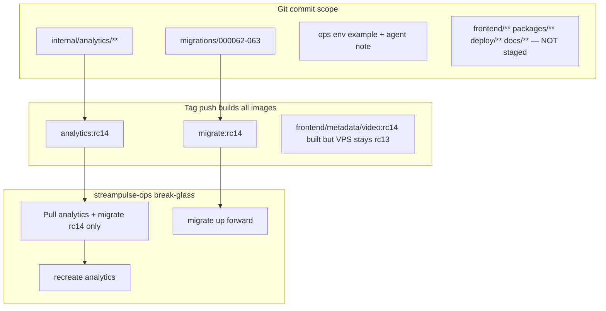

> **ARCHIVED — do not execute (2026-07-05)**
>
> This plan is stale (rc14/rc13 references, false completed todos). **Current state:**
> - Git tag **`v0.3.0-rc16`** @ `ff161ef` pushed
> - Break-glass VPS deploy done (analytics rc16, others rc15)
> - Evidence: [`docs/agent-notes/hosted-live-viewer-coverage-2026-07.md`](../../docs/agent-notes/hosted-live-viewer-coverage-2026-07.md)
> - Active plan: [`.cursor/plans/rc16_post-deploy_probe_37ae01a0.plan.md`](rc16_post-deploy_probe_37ae01a0.plan.md)

# Analytics-only hosted deploy (no frontend/HLS WIP) — HISTORICAL

## Why this does not conflict with local watch UI work

Production uses **separate GHCR images** ([`docs/production-artifact-contract.md`](C:/Users/Aron/twitch-7tv-clone/docs/production-artifact-contract.md)):

| Image | Your local WIP | Hosted deploy |
|-------|------------------|---------------|
| `ghcr.io/aron-chu/streamclone/analytics` | **Ship** (full branch analytics) | Pin new tag on VPS |
| `ghcr.io/aron-chu/streamclone/migrate` | **Ship** (new `000062`/`000063` migrations) | Run once before analytics recreate |
| `ghcr.io/aron-chu/streamclone/frontend` | **Do not ship** | Stay on `v0.3.0-rc13` |
| `ghcr.io/aron-chu/streamclone/video` | unchanged | Stay on rc13 |
| `metadata`, `chat`, `emote` | unchanged | Stay on rc13 |

Local `:8090` can keep using **rc13 frontend image** or [`deploy/docker-compose.frontend-source.yml`](C:/Users/Aron/twitch-7tv-clone/deploy/docker-compose.frontend-source.yml) for HLS experiments — neither is affected by updating **hosted** analytics only.

**Out of this deploy (separate later):** [`streamclone-pulse`](C:/Users/Aron/streamclone-pulse) extension viewer strip / honesty UI — sibling repo, not in analytics container.

---

## Break-glass exception: partial IMAGE_TAG on VPS

The production contract requires matched tags across core services ([`production-artifact-contract.md` § Invariant](C:/Users/Aron/twitch-7tv-clone/docs/production-artifact-contract.md)):

```
IMAGE_TAG(metadata) == IMAGE_TAG(analytics) == IMAGE_TAG(analytics-workers) == IMAGE_TAG(migrate)
```

**This deploy is an explicit operator exception**, not a contract change:

| Service | Tag | Rationale |
|---------|-----|-----------|
| `analytics` (+ workers if split) | **rc14** | Ships admission + viewer flush + branch analytics |
| `migrate` | **rc14** | Forward-only `000062`/`000063` clip tables |
| `metadata`, `video`, `chat`, `emote`, `frontend` | **rc13** | Avoid shipping watch-UI/HLS WIP and unrelated frontend delta |

**Why rc14 analytics does not require rc14 metadata/Caddy/frontend:**

- Viewer flush, `bindStreamIDNow`, and `viewerStartOffsetSeconds` are **self-contained in the analytics binary** (`internal/analytics/collector.go`, `extension_api.go`) — Helix + IRC + Postgres only.
- Public API routes (`/v1/extension/pulse/*`) are served by **analytics + Caddy**; Caddy config on VPS is unchanged (rc13 overlay). No new routes in this delta.
- Analytics does not make compile-time or runtime RPC calls to the metadata service for this feature set.
- Clipper tables (`000062`/`000063`) are **additive**; rc13 siblings ignore them.

Document this exception in streampulse-ops deploy notes when pinning per-service tags.



---

## Phase 0 — Sync branch + isolate WIP

### 0A. Sync with origin (required)

Read-only status: `release/top-live-irc-admission` is **6 commits behind** `origin/release/top-live-irc-admission`. Before commit/tag:

```powershell
cd C:\Users\Aron\twitch-7tv-clone
git fetch origin
git pull --rebase origin release/top-live-irc-admission
```

Resolve any conflicts in `internal/analytics/` before proceeding. **Do not tag on a stale local branch** — CI builds the pushed commit, not your unstaged WIP.

### 0B. Stash everything except analytics deploy set

The tree has broad WIP beyond a few channel files: most of `frontend/`, `packages/analytics-console/`, `packages/pulse-charts/`, plus many `deploy/` and `docs/` changes. Stash **directories**, not cherry-picked paths:

```powershell
# Stash all non-analytics product WIP (adjust if you have intentional analytics-adjacent commits)
git stash push -u -m "non-analytics-deploy-wip" -- `
  frontend/ `
  packages/analytics-console/ `
  packages/pulse-charts/ `
  deploy/ `
  docs/ `
  cmd/ `
  internal/metadata/ `
  internal/video/ `
  internal/chat/ `
  internal/emote/ `
  clipper/ `
  charts/ `
  Makefile `
  AGENTS.md `
  README.md `
  CONTRIBUTING.md
```

**Keep unstaged (working tree) only:**

- `internal/analytics/**`
- `migrations/000062_*` `migrations/000063_*`
- `deploy/env/profile-hosted-pulse-live-250.env.example` (if not stashed — pop this one file from stash or copy back)
- `docs/agent-notes/hosted-live-viewer-coverage-2026-07.md`
- `VERSION` (bump to rc14)

**Verify before commit:**

```powershell
git status --short
# Expect: only internal/analytics/, migrations/000062-063, VERSION, and the two ops doc paths
```

If `git status` still shows frontend/packages noise, repeat stash or use `git restore` on accidental paths — **never** `git add -A`.

---

## Phase 1 — Pre-flight (must pass on the **exact commit** CI will tag)

`make check-quick` ([`Makefile:420`](C:/Users/Aron/twitch-7tv-clone/Makefile)) runs `frontend-test` against **committed** `frontend/` — not your stashed WIP. That is good for CI honesty, but a local pass before stash does **not** guarantee tag CI passes if branch sync introduces conflicts.

**On the analytics-only commit candidate (after stash + sync):**

```powershell
go test ./internal/analytics/ -count=1
make check-quick
```

Key symbols: [`collector.go`](C:/Users/Aron/twitch-7tv-clone/internal/analytics/collector.go) (`bindStreamIDNow`, `flushOpenMinuteToStore`, `TouchAdmissionObservation`); [`extension_api.go`](C:/Users/Aron/twitch-7tv-clone/internal/analytics/extension_api.go) (`viewerStartOffsetSeconds`).

**Migrations (include in deploy):**

- [`migrations/000062_auto_clipper_candidates.up.sql`](C:/Users/Aron/twitch-7tv-clone/migrations/000062_auto_clipper_candidates.up.sql)
- [`migrations/000063_auto_clipper_replayforge_jobs.up.sql`](C:/Users/Aron/twitch-7tv-clone/migrations/000063_auto_clipper_replayforge_jobs.up.sql)

No migration for viewer flush itself — but migrate must run if analytics code references clipper stores.

---

## Phase 2 — Analytics-only commit

Stage **only**:

- `internal/analytics/**`
- `migrations/000062_*` `migrations/000063_*`
- [`deploy/env/profile-hosted-pulse-live-250.env.example`](C:/Users/Aron/twitch-7tv-clone/deploy/env/profile-hosted-pulse-live-250.env.example)
- [`docs/agent-notes/hosted-live-viewer-coverage-2026-07.md`](C:/Users/Aron/twitch-7tv-clone/docs/agent-notes/hosted-live-viewer-coverage-2026-07.md)
- [`VERSION`](C:/Users/Aron/twitch-7tv-clone/VERSION) → **`v0.3.0-rc14`**

**Do not stage:** `frontend/**`, `packages/**`, other `deploy/**`, `.env`, secrets.

```
feat(analytics): hosted admission + live viewer flush for stream start

Ship collector bind/flush, viewerStartOffsetSeconds, and branch analytics
work. Excludes frontend watch-UI and portal console WIP.
```

Tag: `v0.3.0-rc14` (must match `VERSION`). Push branch + tag → CI `make check` + all GHCR images build; VPS pulls analytics + migrate only.

---

## Phase 3 — streampulse-ops deploy (operator)

1. **Migrate forward:** `ghcr.io/aron-chu/streamclone/migrate:v0.3.0-rc14` → schema version **63**.
2. **Recreate analytics** (and workers if split) with `IMAGE_TAG=v0.3.0-rc14`.
3. **Leave** `metadata`, `video`, `chat`, `emote`, `frontend` at **`v0.3.0-rc13`** (per break-glass table above).
4. Confirm env overlay: [`profile-hosted-pulse-live-250.env.example`](C:/Users/Aron/twitch-7tv-clone/deploy/env/profile-hosted-pulse-live-250.env.example).

### Rollback (explicit)

| Action | Safe? | Notes |
|--------|-------|-------|
| Redeploy analytics **rc13** app image | **Yes (app-only)** | Postgres stays at schema 63; `000062`/`000063` are additive clip tables — rc13 analytics should tolerate empty unused tables |
| Run **rc13 migrate down** | **No** | Forward-only policy; do not downgrade schema after 63 |
| Redeploy rc13 **metadata/frontend** | N/A | Already on rc13 in this plan |

**Rollback procedure:** pin analytics back to rc13 container only; **do not re-run migrate**; smoke `/v1/extension/health` and pulse on a known channel; watch for clipper code paths erroring if rc13 binary lacks clip handlers (unlikely if clip APIs were not wired in rc13 — verify in ops).

---

## Phase 4 — Protect **before** go-live (minute-0 validation)

Protecting a channel **mid-stream** only proves “coverage after protect,” not stream-start behavior.

**Required sequence:**

1. Pick a test channel you control (small audience OK).
2. **While offline** (or after ending current stream): add Protect / always-track (`analytics_always_tracked`, watchlist `always_track`, or protected go-live roster — see [`store.go`](C:/Users/Aron/twitch-7tv-clone/internal/analytics/store.go), [`pulse_watchlist.go`](C:/Users/Aron/twitch-7tv-clone/internal/analytics/pulse_watchlist.go)).
3. Deploy rc14 analytics (Phase 3).
4. **Start a new live stream** on that channel.
5. Within 2–3 minutes, run Phase 5 probe.

---

## Phase 5 — Verification probe (rollup truth, not JSON field presence)

`ViewerStartOffsetSeconds` uses `json:"viewerStartOffsetSeconds,omitempty"` ([`extension_api.go:159`](C:/Users/Aron/twitch-7tv-clone/internal/analytics/extension_api.go)). When viewers align from minute 0, the value is **`0`** and JSON **omits the field** — that is **success**, not failure.

```powershell
$login = 'your_protected_test_channel'
$r = Invoke-RestMethod "https://api.streampulse.stream/v1/extension/pulse/channels/$login"
$r.tracking
$r.isLive
$r.coverageStartOffsetSeconds
# Do NOT fail if viewerStartOffsetSeconds is absent — check rollups instead
$r.viewerStartOffsetSeconds
$early = $r.rollups | Select-Object -First 8 offsetSeconds, chatCount, viewerCount
$early | Format-Table -AutoSize
```

### Pass criteria (behavioral)

| Check | Pass |
|-------|------|
| `tracking` | `$true` for protected channel after go-live |
| First chat rollup | First row with `chatCount > 0` has `viewerCount > 0`, **or** next row within ≤60s offset |
| Viewer vs coverage offset | Compute from rollups: first viewer minute − first chat minute ≤ 60s when both start early |
| `viewerStartOffsetSeconds` in JSON | **Optional** — present when >0 (late viewers); **absent when 0** (aligned from start) |
| Late-viewer honesty case | If chat at 120s and viewers at 300s: field present as `300` (see [`TestViewerStartOffsetSeconds`](C:/Users/Aron/twitch-7tv-clone/internal/analytics/extension_api_test.go)) |
| Pre-rc14 baseline | Field absent **and** early rollups chat-only — distinguishes old code from aligned success |

**PowerShell helper (rollup-derived viewer start):**

```powershell
$chatStart = ($r.rollups | Where-Object { $_.chatCount -gt 0 } | Select-Object -First 1).offsetSeconds
$viewerStart = ($r.rollups | Where-Object { $_.viewerCount -gt 0 } | Select-Object -First 1).offsetSeconds
"chatStart=$chatStart viewerStart=$viewerStart delta=$($viewerStart - $chatStart)s"
```

Pass: `delta -le 60` (or `$null` viewerStart only if stream just started and poll is <1 min in).

Record probe output in [`hosted-live-viewer-coverage-2026-07.md`](C:/Users/Aron/twitch-7tv-clone/docs/agent-notes/hosted-live-viewer-coverage-2026-07.md) deploy evidence section.

---

## What stays local (watch UI + HLS — separate task)

Do not commit until watch-UI task is ready:

- Entire `frontend/` stash (Channel, playback, FadeMount, StreamPosterCrossfade, App routes, directory, etc.)
- `packages/pulse-charts/` portal/extension chart WIP
- `packages/analytics-console/` live banner WIP (portal Cloudflare deploy is separate)

Optional follow-up: save watch-UI prompt as `docs/agent-notes/watch-ui-core-only-2026-07.md`.

---

## Risk checklist

| Risk | Mitigation |
|------|------------|
| Accidentally staging frontend/packages | Directory stash + `git status` gate before commit |
| Branch 6 commits behind origin | Pull/rebase before commit; CI builds pushed commit |
| Local `make check-quick` ≠ tag CI | Run check-quick **after** stash on commit candidate |
| Probe false-fail on omitempty `0` | Use rollup alignment + delta helper, not field presence |
| Partial-tag contract violation | Document break-glass in streampulse-ops; analytics has no rc14 metadata dependency |
| Mid-stream protect test | Protect offline → new stream → probe |
| Schema at 63 after migrate | Rollback analytics app only; never migrate down |
| Extension UI unchanged | Deploy `streamclone-pulse` build separately when ready |
