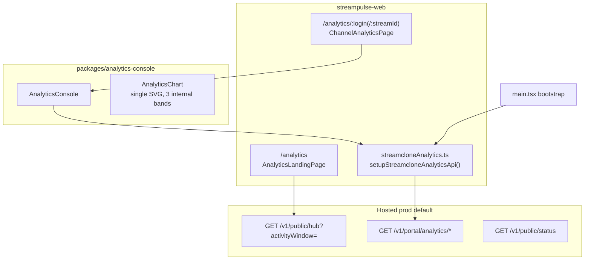

# Analytics Command Center + Dual Channel Charts

## Can we recreate the mockup?

**Yes, for ~70% of it with today’s hosted API.** The mockup’s *layout language* (wide canvas, left sidebar, Pulse Moments as hero, network chart, emote signal, top movers, compact trust strip) maps cleanly to existing `/v1/public/hub` data.

**Do not ship as fake product UI:**
- Sentiment donut / “Positive sentiment” / “Chat magic/min” — no hosted field today
- Sidebar items: Comparisons, Alerts, Reports, Integrations, Settings — no routes/APIs
- Global KPIs like “12.3M viewers” unless derived honestly from hub corpus fields (currently smaller, pool-scoped numbers)
- Moment Inspector clip-save counts — not on public hub contract

Those become **omitted from the first batch**—not disabled “Coming soon” nav, not fabricated metrics. Disabled nav still reads like promised functionality and adds noise.

**Allowed KPI/metric set for this batch:**
- Live channel count from `hub.liveChannels`
- Tracked streams / emotes / chat processed from `hub.corpus`
- Peak viewers and peak chat/min from the selected `hub.activity` window
- Top emotes / top movers from the public hub contract
- Collector coverage from `hub.corpusPipeline`

**Not allowed without a backend contract:**
- Total global viewers claims
- Sentiment / “positive sentiment”
- “Chat magic/min”
- Saved clip/bookmark counts on the public hub
- Any value copied from the mockup that is not present in `/v1/public/hub`

---

## Current architecture (what exists today)



**Prod endpoint default:** [`streampulse-web/src/lib/auth.ts`](c:/Users/Aron/streamclone-pulse/streampulse-web/src/lib/auth.ts) → `https://api.streampulse.stream`. Wired at boot via [`main.tsx`](c:/Users/Aron/streamclone-pulse/streampulse-web/src/main.tsx) → [`streamcloneAnalytics.ts`](c:/Users/Aron/streamclone-pulse/streampulse-web/src/lib/streamcloneAnalytics.ts).

**Guardrails already in repo:**
- [`HubBackendSourceBanner.tsx`](c:/Users/Aron/streamclone-pulse/streampulse-web/src/ui/components/analytics/HubBackendSourceBanner.tsx) warns on localhost/session override
- Portal polls hub via [`usePublicHubData.ts`](c:/Users/Aron/streamclone-pulse/streampulse-web/src/hooks/usePublicHubData.ts) → [`fetchPublicHub()`](c:/Users/Aron/streamclone-pulse/streampulse-web/src/lib/publicHub.ts)

**Route contract (do not break):**
- Hub landing only: Figma/command-center shell — [`analytics-figma-parity-requirements.md`](c:/Users/Aron/streamclone-pulse/docs/website-portal/analytics-figma-parity-requirements.md)
- Channel routes: **`AnalyticsConsole` stays default**; `?figma=1` remains opt-in — [`ChannelAnalyticsPage.tsx`](c:/Users/Aron/streamclone-pulse/streampulse-web/src/routes/analytics/ChannelAnalyticsPage.tsx)
- Do not introduce unauthenticated `/watch`, login gates, `/analytics/emotes` as a real surface, admin/Grafana embeds, or any internal collector controls on public routes.

---

## Mockup → placement → wiring map

| Mockup region | Priority | Real data source | Target component / file | Notes |
|---|---|---|---|---|
| Left sidebar nav | P0 | In-page anchors only | New `AnalyticsHubSidebar.tsx` + shell refactor | Overview, Pulse Moments, Network Activity, Emote Signal, Tracked Channels, Coverage scroll to `#section-*`. No fake routes, no disabled mock-only nav. |
| Header + KPI strip | P0 | `hub.corpus`, `hub.liveChannels`, `hub.activity`, `activitySummary` | New `HubCommandHeader.tsx` | Use honest labels (“Tracked streams”, “Live in pool”, “Network viewers peak”) — not mockup’s inflated globals unless backend adds them. |
| Search + time range | P0 | Existing | `HubSearch` + `ACTIVITY_WINDOW_OPTIONS` in [`AnalyticsLandingPage.tsx`](c:/Users/Aron/streamclone-pulse/streampulse-web/src/routes/analytics/AnalyticsLandingPage.tsx) | Move into header row; default window stays hosted-representative (`7d` today). |
| Live channel cards | P1 | `hub.liveChannels` | Refactor [`FigmaLiveChannelRail.tsx`](c:/Users/Aron/streamclone-pulse/streampulse-web/src/ui/components/analytics/FigmaLiveChannelRail.tsx) | 6–8 larger featured cards; link to `/analytics/{login}`. Must not duplicate the tracked table unless it adds distinct scan value. |
| **Pulse Moments Live + Inspector** | P0 | `resolveLivePulseMoments(hub)` only | [`PulseMomentsLivePanel.tsx`](c:/Users/Aron/streamclone-pulse/streampulse-web/src/ui/components/analytics/PulseMomentsLivePanel.tsx) | **Hero row:** 60/40 table + inspector; move above network chart. Inspector uses public hub moment fields only; deep actions link to `/analytics/{login}/{streamId}`. |
| Network Activity chart | P0 | `hub.activity.points` | [`FigmaGlobalActivityPanel.tsx`](c:/Users/Aron/streamclone-pulse/streampulse-web/src/ui/components/analytics/FigmaGlobalActivityPanel.tsx) + [`HubActivityChart.tsx`](c:/Users/Aron/streamclone-pulse/streampulse-web/src/ui/components/hub/HubActivityChart.tsx) | Keep recent chart fixes (bucket fill, per-minute rates, dual scales). Add editorial header + peak insight line. |
| Emote Signal + Top Movers | P1 | `hub.emoteIntel`, `hub.topEmotes`, `hub.topMovers` | [`FigmaEmoteSignalBlock.tsx`](c:/Users/Aron/streamclone-pulse/streampulse-web/src/ui/components/analytics/FigmaEmoteSignalBlock.tsx) | Secondary band; drop sentiment widgets. |
| Live Tracked Channels table | P1 | `hub.liveChannels`, `hub.corpusPipeline.roster` | Reuse/adapt [`HubSessionsTable.tsx`](c:/Users/Aron/streamclone-pulse/streampulse-web/src/ui/components/analytics/HubSessionsTable.tsx) or [`FigmaLiveSessionsTable.tsx`](c:/Users/Aron/streamclone-pulse/streampulse-web/src/ui/components/analytics/FigmaLiveSessionsTable.tsx) | Include only if it adds detail the rail does not: coverage state, chat/min, viewers, trend. Otherwise cut from P0. |
| Coverage & Trust | P0 | `hub.corpusPipeline` | Replace [`FigmaCorpusPipelineBlock`](c:/Users/Aron/streamclone-pulse/streampulse-web/src/ui/components/analytics/FigmaEmoteSignalBlock.tsx) footer block with compact strip | “54/75 collectors · partial · updated Ns ago” + expandable detail. |
| Footer provenance | P2 | `activitySummary` | [`ChartSourceBanner`](c:/Users/Aron/streamclone-pulse/streampulse-web/src/ui/components/analytics/FigmaGlobalActivityPanel.tsx) | Keep at page bottom. |

**New landing section order** (matches mockup hierarchy):

1. Command header (title, KPIs, search, window picker)
2. Live channel rail (optional row)
3. Pulse Moments Live + Moment Inspector (full width)
4. Network Activity + Top Emotes side panel
5. Emote Signal + Top Movers
6. Tracked channels table (only if not duplicative with the rail)
7. Coverage trust strip + chart provenance footer

**Dedup rule:** each visible section must answer a different user question:
- Live rail: “Who should I open now?”
- Pulse Moments: “What is spiking right now?”
- Network chart: “What is the whole network doing over time?”
- Emote signal/top movers: “Which emotes/channels are moving?”
- Tracked table: “Which live channels have coverage and trend detail?”
- Trust strip: “Can I trust this data right now?”

---

## Channel route: split viewers into two graphs

**Problem:** On `/analytics/{streamer}`, [`AnalyticsChart.tsx`](c:/Users/Aron/twitch-7tv-clone/packages/analytics-console/src/components/analytics/AnalyticsChart.tsx) already uses internal bands (`viewer` / `activity-chat` / `activity-emote`) inside **one 400px SVG**. Viewers (10K–100K) and chat/emotes (10–5K/min) still feel cramped and share hover complexity.

**Target:** Two physically separated charts with **shared cursor/playhead** (mockup-style clarity):

```text
┌─────────────────────────────────────┐
│ Viewers (dedicated Y-axis, ~180px)   │  ← viewer line only
├─────────────────────────────────────┤
│ Chat + emotes (bars/lines, ~220px)   │  ← chat line + emote bars + selected emotes
└─────────────────────────────────────┘
         shared crosshair + time axis
```

**Implementation approach (in `packages/analytics-console`):**
- Start with a **minimal refactor**: split the existing rendered chart area into two stacked visual panels while preserving the current data pipeline.
- Keep existing `buildSeries`, hover state, `computeChartCursorSync`, game segment overlays, `usePlayheadStore`, and `#t=` behavior.
- Only extract shared primitives into `components/analytics/chart/` if the minimal split becomes hard to test or maintain.
- Portal adapter unchanged — still `/v1/portal/analytics/streams/{id}/minutes` via [`streamcloneAnalytics.ts`](c:/Users/Aron/streamclone-pulse/streampulse-web/src/lib/streamcloneAnalytics.ts)
- Streamclone frontend (`frontend/src`) consumes same package — verify parity if it embeds console

**Scope boundary:** Channel shell/nav stays `AnalyticsConsole` layout for this batch; only chart region splits. Optional later: wrap channel page in hub sidebar shell.

---

## Layout / formatting system changes (hub)

Replace narrow centered card shell in [`AnalyticsFigmaShell.tsx`](c:/Users/Aron/streamclone-pulse/streampulse-web/src/ui/components/analytics/AnalyticsFigmaShell.tsx):

| Token / rule | Current | Target |
|---|---|---|
| Content width | `min(1320px)` centered column + border | `min(1440px)` main grid, sidebar ~240px, no outer “card” border |
| Typography | many `0.58–0.74rem` labels | step up body 13–14px, section titles 18–22px in [`figma-analytics.css`](c:/Users/Aron/streamclone-pulse/streampulse-web/src/ui/components/analytics/figma-analytics.css) |
| Color semantics | green overused | enforce: green=live/healthy, purple=viewers, teal=chat/emotes, amber=partial, red=error — use [`analytics-surfaces.css`](c:/Users/Aron/streamclone-pulse/streampulse-web/src/ui/themes/analytics-surfaces.css) tokens only |
| Cards | every section bordered | one strong panel for network chart; secondary sections tint-only |

---

## Phase 0 — Agent + contract prep (gate before UI)

**Must complete first** so agents don’t reintroduce localhost or wrong route contracts.

### Docs to add/update (streamclone-pulse)

1. **New:** `docs/website-portal/analytics-command-center-layout.md`
   - Mockup section map (table above)
   - Real vs deferred features
   - Allowed metric list and forbidden fake metrics
   - Dedup rules for live rail vs tracked table vs trust strip
   - Prod endpoint checklist
   - Section IDs for sidebar anchors

2. **Update:** [`docs/website-portal/analytics-figma-parity-requirements.md`](c:/Users/Aron/streamclone-pulse/docs/website-portal/analytics-figma-parity-requirements.md)
   - Supersede “command-center hero first” section order with new hierarchy
   - Note sidebar shell replaces single-column Make layout

3. **Update:** [`docs/design/streampulse-analytics-hub-design.md`](c:/Users/Aron/streamclone-pulse/docs/design/streampulse-analytics-hub-design.md)
   - Reconcile hub-as-entry-door with command-center landing (both true: hub discovers, console analyzes)

4. **Update:** [`docs/website-portal/tasks.md`](c:/Users/Aron/streamclone-pulse/docs/website-portal/tasks.md)
   - Add TASK-IDs: `HUB-CC-001` (shell), `HUB-CC-002` (section reorder), `HUB-CC-003` (trust strip), `CHART-002` (dual channel charts), `HUB-CC-004` (Playwright parity)

5. **Update:** [`AGENTS.md`](c:/Users/Aron/streamclone-pulse/AGENTS.md) + [`.cursor/rules/streamclone.mdc`](c:/Users/Aron/streamclone-pulse/.cursor/rules/streamclone.mdc)
   - Point hub tasks to new layout doc
   - Explicit: channel default = `AnalyticsConsole`; hub = command center; prod default = hosted
   - Explicit: no mock-only/disabled nav items, no fabricated KPIs, no duplicate live/trust sections

### Docs to update (streamclone sibling)

6. **Update:** [`AGENTS.md`](c:/Users/Aron/twitch-7tv-clone/AGENTS.md) task router — note `packages/analytics-console` chart split affects portal + internal frontend

7. **Run:** `make codegraph` in streamclone **after** chart symbols move/export from `AnalyticsChart.tsx` (codegraph indexes `packages/*`, not `streampulse-web/`). Do not treat a pre-edit codegraph run as validation for the chart refactor.

---

## Phase 1 — Implementation batch (both tracks)

### Track A: Hub command center (streamclone-pulse)

| Step | Files |
|---|---|
| A1. New shell with sidebar + wide grid | `AnalyticsHubSidebar.tsx`, refactor `AnalyticsFigmaShell.tsx`, `figma-analytics.css` |
| A2. Command header + KPI strip | `HubCommandHeader.tsx`, wire in `AnalyticsLandingPage.tsx` |
| A3. Reorder sections + anchor IDs | `AnalyticsLandingPage.tsx` |
| A4. Pulse Moments hero layout | `PulseMomentsLivePanel.tsx` + CSS |
| A5. Network chart header/peak insight | `FigmaGlobalActivityPanel.tsx` |
| A6. Compact coverage strip | extract from `FigmaCorpusPipelineBlock` |
| A7. Live rail + tracked table polish | `FigmaLiveChannelRail.tsx`, sessions table component; keep both only if the table adds non-duplicative coverage/trend detail |

### Track B: Channel dual charts (streamclone package)

| Step | Files |
|---|---|
| B1. Minimal dual-panel split | Keep current `AnalyticsChart.tsx` data/model behavior; split viewer vs activity rendering first |
| B2. Optional primitive extraction | `packages/analytics-console/src/components/analytics/chart/` only if the minimal split becomes too large |
| B3. Wire into `AnalyticsConsole.tsx` | replace single `AnalyticsChart` mount |
| B4. Tests | extend console/chart tests; portal smoke unchanged |

### Track C: Prod wiring verification

| Check | How |
|---|---|
| Default API is hosted | `auth.ts`, `.env.development.local.example`, no committed localhost |
| Hub fetch | `fetchPublicHub` → `/v1/public/hub` on `api.streampulse.stream` |
| Channel fetch | portal adapter paths under `/v1/portal/analytics/` |
| Override visibility | `HubBackendSourceBanner` visible when not hosted |
| CI | existing [`check-backend-url.mjs`](c:/Users/Aron/streamclone-pulse/streampulse-web/scripts/check-backend-url.mjs) + Playwright [`analytics-figma-parity.spec.ts`](c:/Users/Aron/streamclone-pulse/streampulse-web/tests/e2e/analytics-figma-parity.spec.ts) updated for new selectors/sections |

---

## Phase 2 — QA / regression

- **Unit:** `hubActivitySummary.test.ts`, `GlobalActivityChart.test.tsx`, new dual-chart tests
- **Portal Playwright:** hub section visibility, sidebar anchor scroll, hosted API 200 on `/v1/public/hub`
- **Visual:** screenshot hub at 1440px + channel page with dual charts
- **Backend:** deploy analytics fix for coarse-bucket viewers ([`store.go`](c:/Users/Aron/twitch-7tv-clone/internal/analytics/store.go) aggregate) before judging hub 7d/1mo on prod

---

## Risks and mitigations

| Risk | Mitigation |
|---|---|
| Mockup implies features we don’t have | Layout doc marks “deferred”; no fake metrics |
| Disabled mock nav makes fake product promises | Omit mock-only nav in P0; add routes only when real functionality exists |
| Live rail and tracked table duplicate the same list | Keep the rail as featured scan UI; keep the table only if it adds coverage/trend/detail |
| `AnalyticsChart` refactor breaks Streamclone `:8090` | Change in shared package + run `make frontend-test` in streamclone |
| Agents point portal at localhost | Phase 0 AGENTS.md + banner; QA on hosted only |
| Dual charts desync hover | Reuse existing `computeChartCursorSync` + `usePlayheadStore` |
| Doc drift (3 design docs disagree) | Single new layout doc becomes primary for hub; others reference it |

---

## Success criteria

- `/analytics` reads like the mockup’s **information hierarchy** at 1440px: Pulse Moments first, network chart second, trust demoted
- All hub widgets bind to **`/v1/public/hub`** (hosted by default); no localhost unless explicitly debugging
- `/analytics/{streamer}` shows **two stacked charts** with readable viewer vs activity scales
- No sidebar item, KPI, inspector field, or panel appears unless it maps to a real public API field or in-page anchor
- Live rail, tracked table, and coverage/trust do not repeat the same information in three card treatments
- AGENTS.md + layout doc updated **before** merge; codegraph refreshed after console chart extraction
