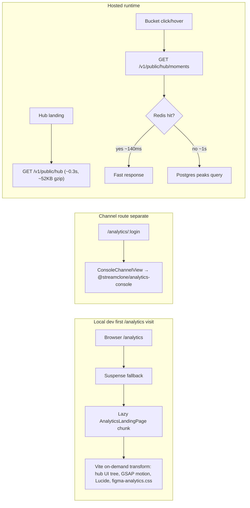

# Analytics hub performance optimizations

## Problem (confirmed by audit)



Two independent bottlenecks — **not** a storage migration issue. Index `idx_analytics_minute_peaks_window_hot` already exists in [`migrations/000061_analytics_minute_peaks.up.sql`](c:/Users/Aron/twitch-7tv-clone/migrations/000061_analytics_minute_peaks.up.sql).

### Landing bottleneck correction

**Do not cite `@streamclone/analytics-console` as the main `/analytics` landing cost.** In current code it is imported by [`ConsoleChannelView.tsx`](c:/Users/Aron/streamclone-pulse/streampulse-web/src/routes/analytics/ConsoleChannelView.tsx) (channel/session routes), not [`AnalyticsLandingPage.tsx`](c:/Users/Aron/streamclone-pulse/streampulse-web/src/routes/analytics/AnalyticsLandingPage.tsx).

The landing lazy chunk is heavy because of:

- Large hub component tree (`FigmaGlobalActivityPanel`, `PulseMomentsLivePanel`, `HubLiveWireFeed`, etc.)
- GSAP motion (`useAnalyticsMotion`, Flip types in rail)
- Lucide-heavy analytics chrome
- [`figma-analytics.css`](c:/Users/Aron/streamclone-pulse/streampulse-web/src/ui/components/analytics/figma-analytics.css) (~139KB built)
- Suspense + first-visit Vite transforms (dev only)

`@streamclone/pulse-charts` / `@streamclone/pulse-core` are not primary landing imports today; keep them in `optimizeDeps.include` only if prebundle validation shows benefit (channel routes or transitive deps).

---

## PR 1 — streamclone-pulse (portal dev + client cache)

### 1a. Vite dev prebundle (validate, do not assume outcome)

Update [`streampulse-web/vite.config.ts`](c:/Users/Aron/streamclone-pulse/streampulse-web/vite.config.ts):

```ts
optimizeDeps: {
  include: [
    '@streamclone/pulse-charts',   // channel/transitive; validate prebundle
    '@streamclone/pulse-core',
    '@streamclone/analytics-console', // helps /analytics/:login, not landing primary
  ],
},
```

**Important:** Aliases point at sibling **source files** outside the web root (`../../twitch-7tv-clone/packages/...`). Vite *can* prebundle linked deps, but source-file aliases behave differently from normal `node_modules` packages. **Do not claim “30–60s → few seconds” until measured.**

**Mandatory manual validation (before/after PR):**

```bash
cd streamclone-pulse/streampulse-web
rm -rf node_modules/.vite
npm run dev
# Confirm intended entries appear under node_modules/.vite/deps/
# Cold-load http://127.0.0.1:5173/analytics and record time-to-interactive
```

If prebundle does not materialize for aliased packages, document result and keep other wins (fallback UX, bucket cache, backend cache).

### 1b. Better Suspense fallback (UX, not perf)

Replace bare `Loading…` in [`streampulse-web/src/routes/index.tsx`](c:/Users/Aron/streamclone-pulse/streampulse-web/src/routes/index.tsx) with `AnalyticsRouteFallback`:

- Copy existing `app-main` / `muted` layout + lightweight spinner (existing tokens)
- **Production copy:** neutral **“Loading command center…”** only
- **Dev copy (optional):** `import.meta.env.DEV` → **“Loading analytics…”** or **“Compiling analytics…”** — never show “Compiling…” in prod builds

Keep `AnalyticsLandingPage` **lazy**; prod build already manual-chunks `vendor-analytics-console` for channel routes.

### 1c. Dev host binding note

In [`scripts/dev-portal.mjs`](c:/Users/Aron/streamclone-pulse/scripts/dev-portal.mjs), log after start:

> Prefer `http://127.0.0.1:5173/analytics` (localhost can stall on IPv6)

Optionally change default args from `--host 127.0.0.1` to `--host` (dual-stack).

Update [`docs/website-portal/local-dev-runbook.md`](c:/Users/Aron/streamclone-pulse/docs/website-portal/local-dev-runbook.md) with IPv6 pitfall.

### 1d. Persist bucket moments in sessionStorage

Upgrade [`streampulse-web/src/lib/bucketMomentsCache.ts`](c:/Users/Aron/streamclone-pulse/streampulse-web/src/lib/bucketMomentsCache.ts) mirroring [`publicHubCache.ts`](c:/Users/Aron/streamclone-pulse/streampulse-web/src/lib/publicHubCache.ts):

| Concern | Choice |
|---------|--------|
| Storage | `sessionStorage` (bucket data session-scoped; hub uses `localStorage`) |
| Key | `sp:bucketMoments:v1:{backendUrl}:{activityWindow}:{bucketT}` |
| TTL | **30 min** ready; **2 min** empty |
| Memory | In-memory `Map` as L1; read-through from sessionStorage |

Preserve `readBucketMomentsCache` / `writeBucketMomentsCache` API for call sites.

**Tests:** [`streampulse-web/tests/bucketMomentsCache.test.ts`](c:/Users/Aron/streamclone-pulse/streampulse-web/tests/bucketMomentsCache.test.ts) — read/write, TTL expiry, backend/window isolation, clear helper.

### 1e. Adjacent-bucket prefetch — single owner, no duplicate hover fetches

**Problem today:** Both [`AnalyticsLandingPage.tsx`](c:/Users/Aron/streamclone-pulse/streampulse-web/src/routes/analytics/AnalyticsLandingPage.tsx) (~L142) and [`PulseMomentsLivePanel.tsx`](c:/Users/Aron/streamclone-pulse/streampulse-web/src/ui/components/analytics/PulseMomentsLivePanel.tsx) (~L180) can `fetchHistoricalHubMoments` on hover → brief **double fanout**.

**Solution:** One module owns all bucket moment network I/O:

New [`streampulse-web/src/lib/prefetchHubBucketMoments.ts`](c:/Users/Aron/streamclone-pulse/streampulse-web/src/lib/prefetchHubBucketMoments.ts):

- `requestHubBucketMoments({ bucketT, activityWindow, signal?, includeAdjacent? })` — **only** public fetch entry
- Global in-flight dedupe: `Map<cacheKey, Promise<...>>` keyed by `{backendUrl}:{activityWindow}:{bucketT}`
- Skip fetch if `readBucketMomentsCache` hit
- Adjacent ±1 via [`activityBucketMs`](c:/Users/Aron/streamclone-pulse/streampulse-web/src/lib/hubActivitySummary.ts) / `activityBucketKey`
- On success: `writeBucketMomentsCache`

**Refactor both call sites** to call this helper only — remove direct `fetchHistoricalHubMoments` from hover/selected effects in landing + panel. Landing may pass `includeAdjacent: true` on hover/select; panel uses same helper.

**Tests:** [`streampulse-web/tests/prefetchHubBucketMoments.test.ts`](c:/Users/Aron/streamclone-pulse/streampulse-web/tests/prefetchHubBucketMoments.test.ts) — dedupe (concurrent same key → one fetch), cache hit skip, adjacent key generation (mock `fetchHistoricalHubMoments`).

**Commit:** `perf(portal): prebundle analytics deps and persist bucket moment cache`

---

## PR 2 — streamclone (backend bucket cache)

All changes in [`internal/analytics/hub_historical_moments.go`](c:/Users/Aron/twitch-7tv-clone/internal/analytics/hub_historical_moments.go); reuse `h.hubGroup` from [`internal/analytics/api.go`](c:/Users/Aron/twitch-7tv-clone/internal/analytics/api.go).

### 2a. Singleflight for `/hub/moments`

Wrap build path in `loadPublicHubMoments` with `h.hubGroup.Do(cacheKey, ...)` — match [`loadPublicHub`](c:/Users/Aron/twitch-7tv-clone/internal/analytics/hub_overview.go):

1. Redis check inside Do (double-check pattern)
2. Build once on miss
3. Write Redis

### 2b. Redis TTL — pass bucket timing into helper

Current `publicHubMomentsCacheTTLForPayload(payload)` cannot distinguish open vs closed buckets. **Change signature** to include timing, e.g.:

```go
publicHubMomentsCacheTTLForPayload(payload PublicHubMomentsResponse, bucketEnd time.Time, now time.Time) time.Duration
```

| Case | TTL |
|------|-----|
| `status=empty` | **20s** (unchanged) |
| `status=ready` && `bucketEnd.Before(now)` (closed/historical) | **45m** |
| `status=ready` && open/current bucket (`bucketEnd >= now`) | **2m** (live merge stays fresh) |

Derive `bucketEnd` from existing `hubBucketTimeRange(bucketT, opts.ActivityWindowMinutes)` at write time; `payload.BucketEnd` is also available for tests.

### 2c. HTTP Cache-Control — open-bucket guard required

In `getPublicHubMoments`, set headers using **bucket end vs now** (same guard as Redis TTL):

- **Closed bucket** (`bucketEnd.Before(now)`): `Cache-Control: public, max-age=900, s-maxage=3600, stale-while-revalidate=300`
- **Open/current bucket**: `Cache-Control: public, max-age=15, s-maxage=30` (mirror hub)
- Errors: no cache header

**Critical:** This endpoint merges corpus + live-in-bucket moments. Long-caching the **current** bucket would make hover/click feel stale during live activity — tests must cover both cases.

**Tests** in [`hub_historical_moments_test.go`](c:/Users/Aron/twitch-7tv-clone/internal/analytics/hub_historical_moments_test.go):

- `TestPublicHubMomentsCacheControl_closedBucket` — long cache headers
- `TestPublicHubMomentsCacheControl_openBucket` — short cache headers (mirror hub)
- Contract-shaped response tests (status, moments cap, bucketT echo) — no extension rebuild required, but protects shared public API surface

**Commit:** `perf(analytics): singleflight and cache headers for public hub moments`

---

## Verification

### Portal
```bash
cd streamclone-pulse/streampulse-web
npm test -- bucketMomentsCache
npm test -- prefetchHubBucketMoments
npm run typecheck

# Prebundle validation (mandatory evidence)
rm -rf node_modules/.vite
npm run dev
# ls node_modules/.vite/deps — confirm prebundled entries
# Cold-load http://127.0.0.1:5173/analytics — record before/after timing
```

### Backend
```bash
cd twitch-7tv-clone
go test ./internal/analytics -run 'HubMoments|PublicHubMoments' -count=1

# After hosted deploy:
curl -s -D - -o /dev/null \
  "https://api.streampulse.stream/v1/public/hub/moments?bucketT=...&activityWindow=24h&limit=10" \
  | grep -iE 'cache-control|x-cache|cf-cache-status'
```

### Explicit non-goals
- No Postgres/Redis migration or managed service cutover
- No new DB migration (index already present)
- No hub payload shape change
- **No extension rebuild** for portal PR; backend changes still warrant **contract tests** on `/v1/public/hub/moments`
- Cloudflare cache rule for `/hub/moments*` — ops follow-up after headers ship

---

## Expected impact (measured, not guaranteed)

| Path | Before | After (realistic) |
|------|--------|-------------------|
| Local first `/analytics` | Long cold Suspense wait (30–60s reported) | **Lower first-route transform cost** if prebundle validates; fallback UX improves perceived wait regardless |
| Repeat bucket click | ~1s on Redis miss | **Instant** when sessionStorage or adjacent prefetch has bucket; otherwise Redis hit **~140ms** |
| Bucket API under fanout | Postgres stampede on TTL expiry | Single build + Redis via singleflight |
| Historical bucket CDN | No Cache-Control on moments | **Edge-cacheable once** headers ship **and** Cloudflare rule behavior agrees |

Ship order: portal PR first (dev UX + client cache), backend PR second (hosted deploy for prod bucket speed).
