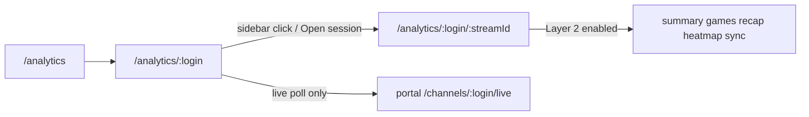

# Analytics hub rc17 fixes

## Product truth (avoid drift)

Resolve doc tension in favor of:

- [`streamclone-pulse/docs/website-portal/tasks.md`](c:/Users/Aron/streamclone-pulse/docs/website-portal/tasks.md) DASH-006 / design §13A.2: **Layer 2 only on explicit stream navigation** (`/analytics/:login/:streamId`), never on channel door poll/load.
- [`streamclone-pulse/docs/design/streampulse-analytics-hub-design.md`](c:/Users/Aron/streamclone-pulse/docs/design/streampulse-analytics-hub-design.md) line 23: **public chart hides game overlays** (`showGameSegments={false}` on portal).
- Channel door (`/analytics/:login`) keeps **live overview only**: portal `/channels/{login}/live`, stream list/history, sidebar—no games/recap/heatmap/summary/sync detail on initial load.



## Slice 1 — Layer-2 gating + failing test (P0)

### 1A. Add regression test first

Add a focused test in [`streampulse-web/tests/`](c:/Users/Aron/streamclone-pulse/streampulse-web/tests/) (new `analyticsLayer2Gating.test.tsx` or extend [`analyticsRoutes.test.tsx`](c:/Users/Aron/streamclone-pulse/streampulse-web/tests/analyticsRoutes.test.tsx)) that:

- Mocks `@streamclone/analytics-console` API layer via [`configureApi`](c:/Users/Aron/twitch-7tv-clone/packages/analytics-console/src/configureApi.ts) / spies on `portalAnalyticsApi` methods.
- Renders `/analytics/xqc` (no `streamId`) and asserts **no calls** to:
  - `getStreamGameSegments`
  - `getPulseStreamRecap`
  - `getReplayHeatmap`
  - `getStreamSummary`
  - `getSyncStatus` (optional: allow if only used on stream route)
- Renders `/analytics/xqc/:streamId` and asserts those **do** fire once chart is ready.

This mirrors the review’s network-guard requirement and prevents regression.

### 1B. Gate queries in shared console

In [`packages/analytics-console/src/components/AnalyticsConsole.tsx`](c:/Users/Aron/twitch-7tv-clone/packages/analytics-console/src/components/AnalyticsConsole.tsx):

Introduce `layer2Enabled = isHistoricalRoute` (route has `:streamId`).

| Query | Current `enabled` | New `enabled` |
|-------|-------------------|---------------|
| `liveQuery` | `isLiveRoute` | unchanged |
| `streamsQuery`, `historyQuery` | channel login | unchanged |
| `historicalDetailQuery` | historical route | unchanged |
| `gamesQuery` | `targetQueryStreamId` | `layer2Enabled && showGameSegments && targetQueryStreamId` |
| `syncQuery`, `summaryQuery`, `recapQuery`, `heatmapQuery` | `targetQueryStreamId && chartDetailReady` | `layer2Enabled && targetQueryStreamId && chartDetailReady` |

Also gate UI that depends on Layer 2 when `!layer2Enabled`:

- Hide [`StreamRecapPanel`](c:/Users/Aron/twitch-7tv-clone/packages/analytics-console/src/components/analytics/StreamRecapPanel.tsx) and heatmap-driven moment UI on channel door.
- Keep existing **Open session page** CTA (already in header ~L682) as the explicit navigation affordance.

Wire the currently-unused prop:

```99:99:c:\Users\Aron\twitch-7tv-clone\packages\analytics-console\src\components\AnalyticsConsole.tsx
  showGameSegments: _showGameSegments = true,
```

Rename to `showGameSegments` and use it for `gamesQuery` + `games={showGameSegments ? chartGames : []}` passed to [`AnalyticsChart`](c:/Users/Aron/twitch-7tv-clone/packages/analytics-console/src/components/analytics/AnalyticsChart.tsx).

### 1C. Portal route props + test drift fix

In [`streampulse-web/src/routes/analytics/ConsoleChannelView.tsx`](c:/Users/Aron/streamclone-pulse/streampulse-web/src/routes/analytics/ConsoleChannelView.tsx):

- Set `showGameSegments={false}` (hub design).
- Optionally pass `mode="public"` (already set).

Update [`streampulse-web/tests/analyticsRoutes.test.tsx`](c:/Users/Aron/streamclone-pulse/streampulse-web/tests/analyticsRoutes.test.tsx) expectation from `true` → `false` (currently contradicts hub design at L46).

## Slice 2 — Honesty contracts (P1, coordinated backend + adapter)

### 2A. `coverageStartOffsetSeconds` end-to-end

Backend already emits on portal minutes ([`PortalStreamMinutesResponse`](c:/Users/Aron/twitch-7tv-clone/internal/analytics/portal_analytics_api.go) L97).

Portal adapter gaps:

- Add field to TS `PortalStreamMinutesResponse` in [`streamcloneAnalytics.ts`](c:/Users/Aron/streamclone-pulse/streampulse-web/src/lib/streamcloneAnalytics.ts).
- Map into `AnalyticsStreamDetail` in `portalDetailToAnalytics` / `portalLiveResponseToAnalytics`.
- Add `coverageStartOffsetSeconds?: number` to [`packages/analytics-console/src/apiTypes.ts`](c:/Users/Aron/twitch-7tv-clone/packages/analytics-console/src/apiTypes.ts).

UI (minimal, extension parity):

- In [`AnalyticsChart.tsx`](c:/Users/Aron/twitch-7tv-clone/packages/analytics-console/src/components/analytics/AnalyticsChart.tsx) or [`StreamQualityBanner.tsx`](c:/Users/Aron/twitch-7tv-clone/packages/analytics-console/src/components/analytics/StreamQualityBanner.tsx), show a banner when `coverageStartOffsetSeconds > 120`: e.g. “Rollups since {offset} — tracking started after stream start”.

Optional backend hardening: add `coverageStartOffsetSeconds` to [`PortalChannelLiveResponse`](c:/Users/Aron/twitch-7tv-clone/internal/analytics/portal_analytics_api.go) using existing `portalCoverageStartOffset()` so live channel door gets the same honesty without a minutes fetch.

### 2B. Game segment source + no silent synthesis

Backend ([`internal/analytics/model.go`](c:/Users/Aron/twitch-7tv-clone/internal/analytics/model.go) `GameSegment`):

- Add `Source string \`json:"source,omitempty"\`` with values like `timeline`, `snapshot`, `stored`, `category_fallback`.
- Tag segments in [`resolveStreamGameSegments`](c:/Users/Aron/twitch-7tv-clone/internal/analytics/game_segments_snapshots.go) and [`fallbackGameSegmentsForStream`](c:/Users/Aron/twitch-7tv-clone/internal/analytics/sync_games_fallback.go).

Shared TS ([`apiTypes.ts`](c:/Users/Aron/twitch-7tv-clone/packages/analytics-console/src/apiTypes.ts) `GameSegment`):

- Add optional `source?: string`.

Console chart policy ([`gameSegmentChart.ts`](c:/Users/Aron/twitch-7tv-clone/packages/analytics-console/src/utils/gameSegmentChart.ts)):

- **Do not** synthesize category band when `showGameSegments` is false (portal default).
- When enabled on stream route: only render API segments; if client fallback is kept for local dev, tag `source: 'category_fallback'` and render with “Estimated category” styling in chart legend.

Update [`streampulse-web/tests/gameSegmentChart.test.ts`](c:/Users/Aron/streamclone-pulse/streampulse-web/tests/gameSegmentChart.test.ts) accordingly.

### 2C. ANALYTICS-001/002 in shared console (not duplicate portal-only libs)

Tasks reference `streampulse-web/src/lib/sourceBadge.ts` / `analyticsQuality.ts` which **do not exist**; portal embeds `@streamclone/analytics-console` directly. Implement in the shared package to avoid two divergent UIs:

| New helper | Location | Purpose |
|------------|----------|---------|
| `mapViewerSourceBadge()` | `packages/analytics-console/src/utils/sourceBadge.ts` | design §13A.3 mapping (`live→Live samples`, etc.) |
| `deriveAnalyticsQualityLabel()` | extend [`streamQuality.ts`](c:/Users/Aron/twitch-7tv-clone/packages/analytics-console/src/utils/streamQuality.ts) | Map metrics + backend `analyticsQuality` → `Good \| Partial \| Limited \| No data` per §13A.4 |

UI in [`ConsoleBits.tsx`](c:/Users/Aron/twitch-7tv-clone/packages/analytics-console/src/components/analytics/ConsoleBits.tsx):

- Add `ViewerSourceBadge` + `AnalyticsQualityChip` + compact `CoverageFacets` row (chat %, viewer %, emote/VOD/sync from summary metrics).
- Replace generic [`SourcePills`](c:/Users/Aron/twitch-7tv-clone/packages/analytics-console/src/components/analytics/ConsoleBits.tsx) usage in console header when `mode === 'public'`.

Backend support for viewer badge:

- Add `viewerSource` to [`PortalStreamDetail`](c:/Users/Aron/twitch-7tv-clone/internal/analytics/portal_analytics_api.go) via existing [`persistedViewerSource`](c:/Users/Aron/twitch-7tv-clone/internal/analytics/viewer_coverage.go).
- Plumb through [`portalDetailToAnalytics`](c:/Users/Aron/streamclone-pulse/streampulse-web/src/lib/streamcloneAnalytics.ts).

Map backend enum drift (`full_pulse`, `partial_pulse`, `warming`, `syncing`, `limited`) → portal labels in the TS helper; do **not** change backend enum in rc17 unless tests require it.

## Slice 3 — API-007 portal-path cleanup (P1, after gating)

In [`streampulse-web/src/lib/streamcloneAnalytics.ts`](c:/Users/Aron/streamclone-pulse/streampulse-web/src/lib/streamcloneAnalytics.ts):

| Method | Hosted change |
|--------|---------------|
| `getChannelStreamHistory` | Use `portalPath(/channels/{login}/streams?limit=…)` instead of raw `/v1/analytics/.../streams/ranked` (guest-safe, portal-sanitized). Client-side sort/filter if period matters. |
| `getChannel` | No-op or portal-safe stub if unused by console; grep confirms only defined in adapter today. |
| `watchAnalyticsChannel` | Keep swallow-on-error; no hosted POST required for public reads. |
| sync/prefetch | Already gated by `enableSyncActions={usesLocalAnalyticsBackend()}` in portal shell. |

Add/extend backend tests in [`portal_analytics_api_test.go`](c:/Users/Aron/twitch-7tv-clone/internal/analytics/portal_analytics_api_test.go) for new fields (`viewerSource`, game `source`, live `coverageStartOffsetSeconds` if added).

## Out of scope (explicitly defer)

- Redis-leased public hub cache writer (P1 hardening only if multi-replica).
- Full ANALYTICS-003 Advanced drawer / ANALYTICS-006 sync CTA mapping (separate tasks).
- Figma route raw `/v1/analytics/channels/.../streams` in [`figmaSessionAnalytics.ts`](c:/Users/Aron/streamclone-pulse/streampulse-web/src/lib/figmaSessionAnalytics.ts) — opt-in design surface; touch only if it blocks rc17.
- Re-adding Pulse Wire, scraper UX, Clip Studio, or local-only product surfaces.

## Verification

**Backend** (streamclone):

```powershell
cd C:\Users\Aron\twitch-7tv-clone
go test ./internal/analytics -run "Portal|Public|Hub|CoverageStart|Games|HostedPortal"
```

**Portal** (streamclone-pulse):

```powershell
cd C:\Users\Aron\streamclone-pulse\streampulse-web
npm run typecheck
npm test -- analyticsRoutes analyticsLayer2Gating streamcloneAnalytics gameSegmentChart
```

**Hosted smoke** (read-only):

```powershell
Invoke-WebRequest https://api.streampulse.stream/v1/portal/analytics/streams/<streamId>/minutes
# assert coverageStartOffsetSeconds present when rollups start late
# assert no forbidden keys: rawChat, gql, corpus, archive, operator, messages
```

## Deploy note

Ship **backend + portal** together for slice 2 contract fields. Slice 1 (gating + `showGameSegments`) can land portal-only if shared `@streamclone/analytics-console` is rebuilt and linked, but prefer one rc17 cut.
