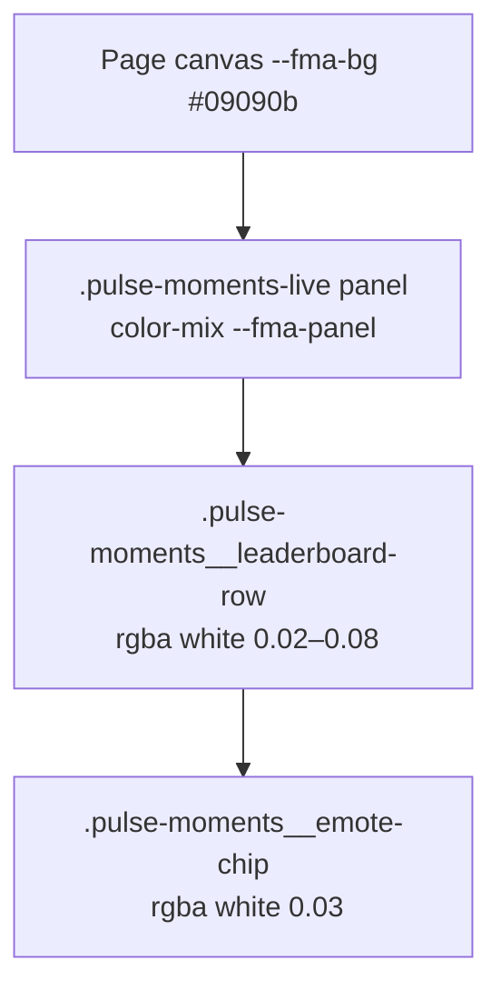
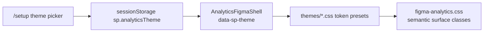

# Analytics hub theme and surface consistency

## Problem

The analytics hub currently runs **multiple overlapping token stacks** that drift apart:


| Stack                   | Location                                                                                                               | Used by                                  |
| ----------------------- | ---------------------------------------------------------------------------------------------------------------------- | ---------------------------------------- |
| `--fma-*`               | [figma-analytics.css](c:/Users/Aron/streamclone-pulse/streampulse-web/src/ui/components/analytics/figma-analytics.css) | `/analytics` Figma shell, panels         |
| `.hubx` shadcn HSL      | [hub.css](c:/Users/Aron/streamclone-pulse/streampulse-web/src/ui/components/hub/hub.css)                               | Embedded `HubActivityChart`, hub widgets |
| `EMOTE_PROVIDER_COLORS` | [hubFormat.ts](c:/Users/Aron/streamclone-pulse/streampulse-web/src/ui/components/analytics/hubFormat.ts)               | Chart lines, Top Emotes labels           |
| `--sc-console-*`        | [analytics-tailwind.css](c:/Users/Aron/streamclone-pulse/streampulse-web/src/ui/analytics-tailwind.css)                | Channel analytics console embed only     |


Surface brightness is inconsistent because **21 hardcoded `rgba(255,255,255,…)` values** in `figma-analytics.css` stack on top of each other. Example chain:




Top Emotes and Most Reacted Minutes end up **visually lifted** compared to the flat page background and the chart card you just attached.

Landing already has a precedent for scoped themes: `data-theme` on `.sl-ext` in [landing.css](c:/Users/Aron/streamclone-pulse/streampulse-web/src/ui/components/landing/landing.css) + [ExtensionDemoCard.tsx](c:/Users/Aron/streamclone-pulse/streampulse-web/src/ui/components/landing/ExtensionDemoCard.tsx). We will mirror that pattern for analytics.

---

## Target architecture




**Scope (per your choices):** analytics routes only (`/analytics`, `/analytics/streams`, channel/session pages). Theme picker lives on `/setup`; analytics nav stays clean.

---

## Phase 1 — Semantic surface tokens (consistency fix)

Add a **surface ladder** on `.figma-analytics` in a new file [streampulse-web/src/ui/themes/analytics-surfaces.css](streampulse-web/src/ui/themes/analytics-surfaces.css):


| Token                               | Role                                                  | Default intent                                                                     |
| ----------------------------------- | ----------------------------------------------------- | ---------------------------------------------------------------------------------- |
| `--sp-bg`                           | Page canvas                                           | Same as current `--fma-bg`                                                         |
| `--sp-surface-1`                    | Primary card (chart+emotes body, pulse-moments shell) | Match canvas; border does the separation                                           |
| `--sp-surface-2`                    | Nested panel head / table container                   | Very subtle lift (≤ current `--fma-panel`)                                         |
| `--sp-surface-3`                    | List rows, chips, hover targets                       | Slightly above surface-2                                                           |
| `--sp-surface-inset`                | Chart plot area                                       | Darker inset (replace `hx-chart2` hardcoded `hsl(240 10% 6%)` via parent override) |
| `--sp-border`, `--sp-border-strong` | Borders/dividers                                      | Alias `--fma-border`                                                               |
| `--sp-text-*`, `--sp-accent-*`      | Typography + brand                                    | Alias existing `--fma-*`                                                           |


**Alias first, migrate second:** keep `--fma-`* as aliases to `--sp-*` so existing rules keep working while we swap call sites incrementally.

### Panels to normalize first (highest visual drift)

1. **Top Emotes** — [TopEmotesPanel.tsx](c:/Users/Aron/streamclone-pulse/streampulse-web/src/ui/components/analytics/TopEmotesPanel.tsx) + `.figma-global-activity__body` / `.figma-global-activity__emotes-panel` in `figma-analytics.css`
  - Use `--sp-surface-1` for the attached card; emotes column shares the same surface (divider only, no second panel fill)
2. **Most Reacted Minutes / Pulse Moments Live** — [PulseMomentsLivePanel.tsx](c:/Users/Aron/streamclone-pulse/streampulse-web/src/ui/components/analytics/PulseMomentsLivePanel.tsx), [MostReactedMinutesTable.tsx](c:/Users/Aron/streamclone-pulse/streampulse-web/src/ui/components/analytics/MostReactedMinutesTable.tsx)
  - Replace `.pulse-moments-live` `color-mix(…)` background with `--sp-surface-1`
  - Replace leaderboard row `rgba(255,255,255,0.02/0.04/0.08)` with `--sp-surface-3` / `--sp-surface-3-hover` / `--sp-surface-active`
  - Replace emote chip `rgba(255,255,255,0.03)` with `--sp-surface-3`
3. **Shared primitives** — extend `.figma-panel` rules in `figma-analytics.css` to consume `--sp-surface-`* instead of raw rgba

### Provider colors → theme tokens

Move [hubFormat.ts](c:/Users/Aron/streamclone-pulse/streampulse-web/src/ui/components/analytics/hubFormat.ts) `EMOTE_PROVIDER_COLORS` to CSS variables on `.figma-analytics`:

```css
--sp-provider-7tv: #4ade80;
--sp-provider-twitch: #9146ff;
--sp-provider-bttv: hsl(340 84% 68%);
--sp-provider-ffz: #fbbf24;
```

Update `emoteProviderColor()` to read `getComputedStyle` fallback or keep JS mirror generated from the same theme file (prefer CSS as source of truth; JS reads custom properties for inline chart SVG strokes).

---

## Phase 2 — Theme presets (for format testing)

Create [streampulse-web/src/ui/themes/](streampulse-web/src/ui/themes/):


| File                          | Purpose                                                                                           |
| ----------------------------- | ------------------------------------------------------------------------------------------------- |
| `index.ts`                    | Theme registry, `applyAnalyticsTheme(id)`, `getAnalyticsTheme()`, storage key `sp.analyticsTheme` |
| `presets/figma-dark.css`      | **Default** — current Figma Make look (baseline)                                                  |
| `presets/figma-flat.css`      | QA preset — all surfaces same level, borders only (tests “no lighter islands”)                    |
| `presets/indigo-contrast.css` | QA preset — stronger accent borders, slightly higher row contrast                                 |


Each preset only overrides `--sp-*` (and provider colors if needed). No component rewrites per theme.

**Hub chart bridge:** when `.hubx` is embedded under `.figma-analytics`, add a small block in `analytics-surfaces.css` to map `--sp-`* → `.hubx` `--background`, `--card`, `--border`, `--chart-*` so chart legend and plot match the active theme without duplicating hub.css.

---

## Phase 3 — `/setup` theme picker

In [Setup.tsx](c:/Users/Aron/streamclone-pulse/streampulse-web/src/routes/public/Setup.tsx):

- Add **“Analytics appearance (dev)”** section with a `<select>` or pill group:
  - Figma Dark (default)
  - Figma Flat
  - Indigo Contrast
- On change: `applyAnalyticsTheme(id)` → `sessionStorage`
- Show current selection + note: “Applies to `/analytics` pages on next load”
- Optional: `?theme=figma-flat` query param support on analytics routes (same storage key) for screenshot automation

Wire theme load in [AnalyticsFigmaShell.tsx](c:/Users/Aron/streamclone-pulse/streampulse-web/src/ui/components/analytics/AnalyticsFigmaShell.tsx):

```tsx
<div className="figma-analytics" data-sp-theme={themeId}>
```

Import theme CSS once from analytics route entry points ([AnalyticsLandingPage.tsx](c:/Users/Aron/streamclone-pulse/streampulse-web/src/routes/analytics/AnalyticsLandingPage.tsx), channel pages).

---

## Phase 4 — Verification

- **Visual:** compare Top Emotes column, chart card, Pulse Moments table — surfaces should sit on one plane unless hovered/selected
- **Theme swap:** change theme on `/setup`, reload `/analytics`, confirm all three presets swap without layout breakage
- **Automated:** extend [analyticsLandingPage.test.tsx](c:/Users/Aron/streamclone-pulse/streampulse-web/tests/analyticsLandingPage.test.tsx) with a test that `applyAnalyticsTheme('figma-flat')` sets `data-sp-theme` on shell mount
- **Typecheck:** `npm run typecheck` in `streampulse-web`

---

## Out of scope (later)

- Landing/setup/global.css unification
- User-facing theme picker in analytics nav
- Full migration of dashboard `hub.css` app shell (Home.tsx)
- Tailwind/analytics-console token merge (channel console can inherit `--sp-*` in a follow-up)

---

## Implementation order

1. Add `themes/` + surface tokens + `--fma-*` aliases
2. Replace hardcoded rgba in pulse-moments + top emotes + figma-panel (grep `rgba(255, 255, 255` in `figma-analytics.css`)
3. Bridge `.hubx` tokens from parent theme
4. Move provider colors to CSS variables; update `hubFormat.ts` / chart
5. `/setup` picker + `AnalyticsFigmaShell` wiring
6. Add second/third preset CSS files for QA
7. Snapshot/test pass
