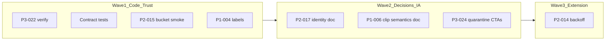

> **HISTORICAL (archived from .cursor/plans).** Not product law. Do not use for routing analytics, ingest, hub, ops, or Pulse work into public Streamclone. See docs/archive/agent-plans/README.md and docs/streampulse-product-boundary.md.
---
name: Audit Pass Items 1-8
overview: "Execute the post-Phase-0–2 audit backlog (items 1–8 in issues.md): verify/close P3-022, fix contract drift tooling and add strict payload tests, add moments bucket smoke, narrow hub label hardening, document identity/clip semantics, quarantine duplicate public surfaces without deleting gated private routes, then implement extension polling backoff."
todos:
  - id: p3-022-verify
    content: "Run analytics-figma-parity e2e; mark P3-022 verified or align test to Command center + #section-pulse-moments"
    status: completed
  - id: contract-keys-fix
    content: Fix contract-keys.py REPO walk + STREAMCLONE_ROOT; sync .cursor/.claude copies and SKILL.md
    status: completed
  - id: contract-tests
    content: Add Go api_contract_test.go + extension/portal TS contract tests for coverage/hub/clip keys
    status: completed
  - id: p2-015-bucket-smoke
    content: Extend analytics-hub-ux e2e for bucket click → hub/moments; optional hosted curl smoke script + doc
    status: completed
  - id: p1-004-labels
    content: Narrow HubCommandHeader/LiveChannelsMatrix label hardening + honesty e2e saturation case
    status: completed
  - id: p2-017-identity-doc
    content: Write identity-model agent note; audit/remove public CTAs to dashboard/clips; quarantine Setup/Login dead copy
    status: completed
  - id: p1-006-clip-doc
    content: Write clip artifact state-machine agent note; honest status labels in clipCandidates/Clips if backend fields allow
    status: completed
  - id: p3-024-quarantine
    content: Quarantine dashboard/Home duplicate hub; StreamsHub redirect; no public /dashboard links
    status: completed
  - id: p2-014-backoff
    content: Implement livePoll jitter + exponential backoff with unit tests
    status: completed
  - id: validation-gate
    content: Run smallest test suite; update issues.md recheck statuses
    status: completed
isProject: false
---

# Audit pass: items 1–8 (post Phases 0–2)

## Constraints (from your decisions)

- **Canonical public hub:** [`/analytics`](c:\Users\Aron\streamclone-pulse\streampulse-web\src\routes\analytics\AnalyticsLandingPage.tsx) only.
- **Do not delete** gated private routes ([`/dashboard/clips`](c:\Users\Aron\streamclone-pulse\streampulse-web\src\routes\dashboard\Clips.tsx), [`RequireAuth`](c:\Users\Aron\streamclone-pulse\streampulse-web\src\routes\guards.tsx)).
- **Blocker for launch-facing work:** any **public** nav/CTA that advertises clips/dashboard as if they are part of the public product — fix by **hide/relabel**, not route deletion.
- **Test authority:** your prior validation + the [Smallest Test Suite](c:\Users\Aron\twitch-7tv-clone\issues.md) in `issues.md`; re-run at end of pass.



---

## 1. P3-022 — Parity heading (verify-first)

**Current code state:** [`analytics-figma-parity.spec.ts`](c:\Users\Aron\streamclone-pulse\streampulse-web\tests\e2e\analytics-figma-parity.spec.ts) already asserts `h1` **Command center** and `#section-pulse-moments` — not `/Pulse Moments Live/i`. The issue body in [`issues.md`](c:\Users\Aron\twitch-7tv-clone\issues.md) is stale.

**Actions:**
- Run `npm run test:e2e -- tests/e2e/analytics-figma-parity.spec.ts --workers=1`.
- If green: mark **P3-022 verified** in `issues.md` recheck; update issue body to note canonical copy is **Command center** + `#section-pulse-moments` section (no product change).
- If red: align test to current [`HubCommandHeader`](c:\Users\Aron\streamclone-pulse\streampulse-web\src\ui\components\analytics\HubCommandHeader.tsx) / [`AnalyticsThemeProvider`](c:\Users\Aron\streamclone-pulse\streampulse-web\src\ui\providers\AnalyticsThemeProvider.tsx) labels — **do not** restore "Pulse Moments Live" as page `h1` unless e2e proves product requires it.

---

## 2. Contract tests + `contract-keys.py` path fix

**Bug:** [`contract-keys.py`](c:\Users\Aron\twitch-7tv-clone\.cursor\skills\pulse\api-contract-drift-check\scripts\contract-keys.py) uses `parents[4]` → resolves to `.cursor/`, not streamclone root.

**Fix script (all mirrors: `.cursor/`, `.claude/`, streamclone-pulse copy if present):**
- Walk parents until `go.mod` exists **or** accept `STREAMCLONE_ROOT` env override.
- Fail loudly when `packages/pulse-core` / `internal/analytics` missing.
- Update all existing copies found in this workspace:
  - `twitch-7tv-clone/.cursor/skills/pulse/api-contract-drift-check/scripts/contract-keys.py`
  - `twitch-7tv-clone/.claude/skills/pulse/api-contract-drift-check/scripts/contract-keys.py`
  - `streamclone-pulse/.cursor/skills/api-contract-drift-check/scripts/contract-keys.py`

**Strict contract tests (new):**

| Layer | File | What |
|-------|------|------|
| Go | [`internal/analytics/api_contract_test.go`](c:\Users\Aron\twitch-7tv-clone\internal\analytics\api_contract_test.go) (new) | Golden JSON key sets for `ExtensionCoverage` ([`pulse_coverage.go`](c:\Users\Aron\twitch-7tv-clone\internal\analytics\pulse_coverage.go)), minimal `PublicHub` subset used by portal normalizer, clip candidate status fields from [`clip_candidates_api.go`](c:\Users\Aron\twitch-7tv-clone\internal\analytics\clip_candidates_api.go). Use struct reflection + `json` tags; fail on add/remove without updating golden. |
| TS extension | [`tests/coverageContract.test.ts`](c:\Users\Aron\streamclone-pulse\tests\coverageContract.test.ts) (new) | Parse [`messages.ts`](c:\Users\Aron\streamclone-pulse\src\shared\messages.ts) `PulseCoverage` keys vs shared golden list (same keys as Go `ExtensionCoverage`). |
| TS portal | [`streampulse-web/tests/publicHub.contract.test.ts`](c:\Users\Aron\streamclone-pulse\streampulse-web\tests\publicHub.contract.test.ts) (new) | Key subset for hub KPI fields consumed by [`HubCommandHeader`](c:\Users\Aron\streamclone-pulse\streampulse-web\src\ui\components\analytics\HubCommandHeader.tsx) / [`hubMetricHelpers.ts`](c:\Users\Aron\streamclone-pulse\streampulse-web\src\lib\hubMetricHelpers.ts). |

**Wire into CI locally:** `go test ./internal/analytics/... -run Contract`, extension `npm test -- coverageContract`, and portal `cd streampulse-web && npm test -- publicHub.contract`.

Update [`api-contract-drift-check/SKILL.md`](c:\Users\Aron\twitch-7tv-clone\.cursor\skills\pulse\api-contract-drift-check\SKILL.md) with correct invocation path.

---

## 3. P2-015 — Hosted moments bucket smoke

**Goal:** Prove bucket click → `/v1/public/hub/moments` → table/inspector rows with viewers + emote breakdown (not client-only repair).

**Portal e2e (mock authority):** Extend [`analytics-hub-ux.spec.ts`](c:\Users\Aron\streamclone-pulse\streampulse-web\tests\e2e\analytics-hub-ux.spec.ts) (existing `hub/moments` route stub ~L61):
- Assert `historicalRequests >= 1` after chart bucket **click** (not just hover).
- Assert [`PulseMomentsLivePanel`](c:\Users\Aron\streamclone-pulse\streampulse-web\src\ui\components\analytics\PulseMomentsLivePanel.tsx) / semantic table shows moment row with `viewers` / emote fields from mock.
- Assert [`ActivityBucketInspector`](c:\Users\Aron\streamclone-pulse\streampulse-web\src\ui\components\analytics\ActivityBucketInspector.tsx) reflects same bucket context (no duplicate streamer ranking — already removed).

**Hosted optional smoke:** Add a small script under [`deploy/smoke/`](c:\Users\Aron\twitch-7tv-clone\deploy\smoke) (or extend existing hosted script) that curls `https://api.streampulse.stream/v1/public/hub/moments?…` with a known window and checks JSON shape (`moments[].login`, `viewers`, emote breakdown keys). Document runbook line in [`analytics-hub-liveness-tasks.md`](c:\Users\Aron\streamclone-pulse\docs\website-portal\analytics-hub-liveness-tasks.md).

**Backend reference:** [`hub_historical_moments.go`](c:\Users\Aron\twitch-7tv-clone\internal\analytics\hub_historical_moments.go) — no behavior change unless smoke exposes a real bug.

---

## 4. P1-004 — Hub live / IRC / roster label hardening (narrow)

**Problem (from audit):** Roster-live vs IRC-collected channels can be conflated in KPI band / matrix headers.

**Target files (surgical copy only):**
- [`HubCommandHeader.tsx`](c:\Users\Aron\streamclone-pulse\streampulse-web\src\ui\components\analytics\HubCommandHeader.tsx) — ensure KPI labels/tooltips distinguish **Live in pool**, **IRC collecting** (`collectorActive/collectorMax`), and **roster live** when `hub.corpusPipeline.roster.live` differs from `poolSize`.
- [`LiveChannelsMatrix.tsx`](c:\Users\Aron\streamclone-pulse\streampulse-web\src\ui\components\analytics\LiveChannelsMatrix.tsx) — header/subtitle when `ircActive < rosterLive` or `poolSize != rosterLive`.
- [`hubMetricHelpers.ts`](c:\Users\Aron\streamclone-pulse\streampulse-web\src\lib\hubMetricHelpers.ts) — only if a shared helper avoids duplicated saturation logic.

**Tests:** Extend [`analytics-hub-metrics-honesty.spec.ts`](c:\Users\Aron\streamclone-pulse\streampulse-web\tests\e2e\analytics-hub-metrics-honesty.spec.ts) with a mock where `roster.live > collectorActive` and assert visible copy mentions IRC cap vs roster (match patterns already referenced in P1-004 issue body). Keep 8/8 green.

**Out of scope:** Rewriting hub layout, backend [`hub_overview.go`](c:\Users\Aron\twitch-7tv-clone\internal\analytics\hub_overview.go) normalization unless labels cannot be honest without a field.

---

## 5. P2-017 — Identity model (document + guard public surfaces)

**Deliverable:** New agent note [`docs/agent-notes/identity-model-2026-07.md`](c:\Users\Aron\twitch-7tv-clone\docs\agent-notes\identity-model-2026-07.md) (or streamclone-pulse mirror) defining MVP:

| Surface | Principal | Persistence |
|---------|-----------|-------------|
| `/analytics` | Guest / none | Read-only public hub |
| Protect / watchlist / bookmarks | Beta-key (hosted) | Per principal in Postgres |
| `/dashboard/*` | Beta-key via [`hasBetaKey()`](c:\Users\Aron\streamclone-pulse\streampulse-web\src\lib\auth.ts) | Private workspace |
| Clips queue | Beta-key + private clip principal checks | Not public product |

**Code (minimal):**
- Route table comment in [`index.tsx`](c:\Users\Aron\streamclone-pulse\streampulse-web\src\routes\index.tsx) already correct — keep.
- **Audit + fix public CTAs:** [`Landing.tsx`](c:\Users\Aron\streamclone-pulse\streampulse-web\src\routes\public\Landing.tsx), analytics shell nav, channel console — `rg` for `/dashboard`, `clips`, `Sign in`, `beta key` in public routes/components. Relabel or remove links that imply public users should open clips/dashboard.
- [`Setup.tsx`](c:\Users\Aron\streamclone-pulse\streampulse-web\src\routes\public\Setup.tsx) / [`Login.tsx`](c:\Users\Aron\streamclone-pulse\streampulse-web\src\routes\public\Login.tsx): dead code behind `/setup` and `/login` redirects — add file-header quarantine comment or move to `_legacy/` only if imports are zero; do **not** re-expose `/login` publicly.

**Out of scope:** OAuth, account model implementation.

---

## 6. P1-006 — Clip artifact semantics (document + honest UI labels)

**Deliverable:** [`docs/agent-notes/clip-artifact-state-machine-2026-07.md`](c:\Users\Aron\twitch-7tv-clone\docs\agent-notes\clip-artifact-state-machine-2026-07.md) capturing desired machine from P1-006 issue (`ReplayForge ready` ≠ `portal playable`).

**Minimal code (if low-risk):**
- [`clipCandidates.ts`](c:\Users\Aron\streamclone-pulse\streampulse-web\src\lib\clipCandidates.ts) + [`Clips.tsx`](c:\Users\Aron\streamclone-pulse\streampulse-web\src\routes\dashboard\Clips.tsx): map backend status to user-visible labels (`Rendering`, `Source unavailable`, `Playable` only when durable flag exists).
- Backend: add TODO constants or separate `artifactMirrorState` field in [`clip_candidates_api.go`](c:\Users\Aron\twitch-7tv-clone\internal\analytics\clip_candidates_api.go) **only if** a field already exists or can be added without migration in this pass — otherwise doc-only.

**Out of scope:** R2 upload drill, full state-machine enforcement.

---

## 7. P3-024 — Quarantine duplicate public surfaces (preserve private routes)

Per your decision — **hide links, don’t delete gated workspace:**

| Surface | Action |
|---------|--------|
| [`dashboard/Home.tsx`](c:\Users\Aron\streamclone-pulse\streampulse-web\src\routes\dashboard\Home.tsx) | Quarantine: replace hub-like demo UI with minimal private landing ("Private workspace — use Clips") **or** redirect `index` → `clips` when beta-key present. Remove duplicate hub panels. |
| [`StreamsHubPlaceholder.tsx`](c:\Users\Aron\streamclone-pulse\streampulse-web\src\routes\analytics\StreamsHubPlaceholder.tsx) | Ensure clear redirect/copy to `/analytics` (not a second directory product). |
| Public landing / docs | Remove nav to `/dashboard` unless gated; extension beta copy must not imply `/analytics` requires login. |
| [`Setup.tsx`](c:\Users\Aron\streamclone-pulse\streampulse-web\src\routes\public\Setup.tsx) | Orphan cleanup — route already redirects; remove misleading `/login` links in file or delete unreachable component if safe. |

**Tests:** Optional e2e: unauthenticated visit to `/dashboard` → `/analytics` (already via `RequireAuth`). Assert public `/analytics` has no link to `/dashboard/clips`.

---

## 8. P2-014 — Extension polling backoff/jitter

**Current:** [`livePoll.ts`](c:\Users\Aron\streamclone-pulse\src\content\livePoll.ts) uses fixed `setInterval(intervalMs)`; errors retry at same cadence.

**Change:**
- Replace interval loop with `scheduleNext()` using base `intervalMs` ± jitter (e.g. 0–15%).
- On `GET_PULSE` failure: exponential backoff capped (e.g. 30s → 60s → 120s max), reset on success.
- Preserve hosted behavior: no extension-initiated `watch: true`.

**Tests:** New [`tests/livePoll.test.ts`](c:\Users\Aron\streamclone-pulse\tests\livePoll.test.ts) with fake timers for backoff schedule; keep existing `shouldRunLivePoll` tests.

---

## Validation gate (end of pass)

Run and record in `issues.md` recheck:

```bash
# Portal
cd c:/Users/Aron/streamclone-pulse/streampulse-web
npm run test:e2e -- tests/e2e/analytics-hub-metrics-honesty.spec.ts --workers=1
npm run test:e2e -- tests/e2e/analytics-figma-parity.spec.ts --workers=1
npm run test:e2e -- tests/e2e/analytics-hub-ux.spec.ts --workers=1

# Extension
cd c:/Users/Aron/streamclone-pulse
npm test -- coverageContract livePoll missedMoments
npm run build

# Backend
cd c:/Users/Aron/twitch-7tv-clone
go test ./internal/analytics/... -run 'Contract|Pulse|Coverage|Hub|Clip'
python .cursor/skills/pulse/api-contract-drift-check/scripts/contract-keys.py
# If Windows `python` resolves to the Store alias or is unavailable:
wsl.exe --cd /mnt/c/Users/Aron/twitch-7tv-clone bash -lc 'python3 .cursor/skills/pulse/api-contract-drift-check/scripts/contract-keys.py'
```

**Known pre-existing gaps (do not block this pass unless regressions):** extension root `typecheck` errors in recap/chart files; `analyticsLandingPage.test.tsx` vitest hang — e2e remains authority for stats-fallback.

---

## issues.md updates

After each item: update **Current Working Tree Recheck** statuses (P3-022 verified, contract tests added, P2-015 smoke, etc.). Do not reopen P0-001 / P1-002 / P1-003 / P1-005 / P3-023 unless validation fails.
