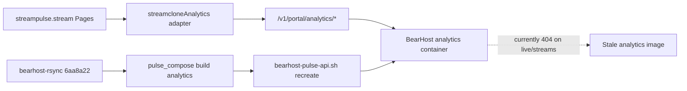

# BearHost analytics redeploy (P4 portal routes)

## Problem

Frontend is live at [https://streampulse.stream/analytics](https://streampulse.stream/analytics) (`streamclone-pulse` master `8347712`). Hosted API still returns **404** on:

- `GET /v1/portal/analytics/channels/ludwig/live`
- `GET /v1/portal/analytics/channels/ludwig/streams`

Baseline (confirmed pre-deploy):

```text
portal live = 404
portal streams = 404
raw live = 401
public hub = 200
```

Those portal handlers were added in streamclone commit **`1129716`** ([`internal/analytics/portal_analytics_api.go`](C:/Users/Aron/streamclone-prod-sync/internal/analytics/portal_analytics_api.go) lines 155–156). Prod analytics **binary** predates that commit — recreating the container alone is not enough; the image must be **rebuilt** from the rsynced source tree.



## Source of truth

Use **[`C:/Users/Aron/streamclone-prod-sync`](C:/Users/Aron/streamclone-prod-sync)** only. Do **not** rsync from dirty `twitch-7tv-clone`.

Target commit: **`6aa8a22`** on **`master`** (includes `1129716` portal routes).

### 0. Hard stop — clean checkout before rsync

`make bearhost-rsync` syncs the **filesystem** (does not exclude `scripts/tmp/`). Current prod-sync state is **not** deploy-ready until clean:

```powershell
cd C:\Users\Aron\streamclone-prod-sync
git fetch origin
git checkout master
git pull --ff-only origin master
git log -1 --oneline   # expect 6aa8a22

# MUST be empty before rsync:
git status --porcelain --untracked-files=all
```

If anything appears (e.g. untracked `scripts/tmp/`): **remove or gitignore it** and re-run until porcelain is empty. **Do not rsync** with stray temp files.

## Deploy sequence (from clean prod-sync root)

Recommended order (matches BearHost ops + explicit rebuild):

```bash
make bearhost-rsync
BEARHOST_ANALYTICS_GATE_REMOTE=1 make bearhost-analytics-predeploy-gate
bash scripts/bearhost-pulse-redeploy-remote.sh
bash scripts/pulse-hosted-boundary-smoke.sh
bash scripts/pulse-hosted-boundary-smoke-auth.sh
```

From Windows PowerShell, run rsync/gate via `make` in prod-sync; run bash steps from WSL in the same tree.

### 1. Sync code to VPS

```powershell
cd C:\Users\Aron\streamclone-prod-sync
make bearhost-rsync
```

Wraps WSL [`scripts/bearhost-rsync-to-vps.sh`](C:/Users/Aron/streamclone-prod-sync/scripts/bearhost-rsync-to-vps.sh) → `/opt/streamclone/app`.

### 2. Verify build-local mode (required for this deploy)

[`scripts/lib/bearhost-compose.sh`](C:/Users/Aron/streamclone-prod-sync/scripts/lib/bearhost-compose.sh) uses **source builds** only when `BEARHOST_BUILD_LOCAL=1` (env var or [`deploy/env/profile-bearhost-prod.env`](C:/Users/Aron/streamclone-prod-sync/deploy/env/profile-bearhost-prod.env)). Otherwise compose merges `docker-compose.release.yml` and pulls GHCR release images — **commit `6aa8a22` would not ship**.

**Hard stop** unless remote profile contains:

```text
BEARHOST_BUILD_LOCAL=1
```

Quick check after rsync (SSH):

```bash
grep BEARHOST_BUILD_LOCAL /opt/streamclone/app/deploy/env/profile-bearhost-prod.env
```

Repo master already has `BEARHOST_BUILD_LOCAL=1` in that file; confirm it survived rsync on VPS.

### 3. Pre-deploy gate (remote, read-only)

```powershell
$env:BEARHOST_ANALYTICS_GATE_REMOTE = "1"
make bearhost-analytics-predeploy-gate
```

**Hard stop** unless output includes:

- `MIGRATION_000050=PASS`
- `ANALYTICS_DEPLOY_GATE=PASS`
- `BLOCK_ANALYTICS_RECREATE=0`

Gate logic: [`scripts/lib/bearhost-analytics-gate-checks.sh`](C:/Users/Aron/streamclone-prod-sync/scripts/lib/bearhost-analytics-gate-checks.sh) — 000050 columns only (no 051+ requirement).

If gate **FAILs**: apply **000050 only** on VPS, re-run gate. **Do not** apply 051–054.

### 4. Rebuild + recreate analytics (use redeploy script, not pulse-api-remote alone)

**Do not use** [`scripts/bearhost-pulse-api-remote.sh`](C:/Users/Aron/streamclone-prod-sync/scripts/bearhost-pulse-api-remote.sh) for this goal. It only runs [`bearhost-pulse-api.sh`](C:/Users/Aron/streamclone-prod-sync/scripts/bearhost-pulse-api.sh), which `force-recreate`s `analytics` **without** `docker compose build analytics`. A stale image leaves portal routes at **404**.

**Use instead:**

```bash
bash scripts/bearhost-pulse-redeploy-remote.sh
```

[`scripts/bearhost-pulse-redeploy-remote.sh`](C:/Users/Aron/streamclone-prod-sync/scripts/bearhost-pulse-redeploy-remote.sh) on VPS:

1. `pulse_compose up -d migrate` — on master @ `6aa8a22` only migration files through **000050** exist; if 000050 already applied, this is a no-op forward check (not 051+)
2. **`pulse_compose build analytics`** — compiles rsynced source at `6aa8a22`
3. `bash scripts/bearhost-pulse-api.sh` — local predeploy gate + `force-recreate analytics pulse-caddy`
4. Localhost smoke via `deploy/smoke/bearhost-pulse-api.sh`

**Do not use** `BEARHOST_SKIP_ANALYTICS_DEPLOY_GATE=1` unless break-glass.

**Explicit holds (do not do):**

- No manual `make migrate` for 000051+ (those files are not on master @ `6aa8a22`)
- Do not enable `profile-bearhost-corpus-ivr-shadow.env` or IVR shadow canary

## Post-deploy smoke

### Scripted gates

```bash
bash scripts/pulse-hosted-boundary-smoke.sh
# PUBLIC_BOUNDARY=PASS

bash scripts/pulse-hosted-boundary-smoke-auth.sh
# CHART_CANARY=PASS — key loaded from BearHost /etc/streamclone/secrets/pulse-beta.env via SSH; never logged
```

[`scripts/pulse-hosted-boundary-smoke-auth.sh`](C:/Users/Aron/streamclone-prod-sync/scripts/pulse-hosted-boundary-smoke-auth.sh) reads first `PULSE_BETA_KEYS=` entry from VPS secrets and execs `pulse-hosted-boundary-smoke.sh`. Do not paste keys into shell history.

### API (curl)

| Endpoint | Unauth expectation | With beta key |
|----------|-------------------|---------------|
| `GET /v1/public/hub` | **200** | n/a |
| `GET /v1/analytics/channels/ludwig/live` | **401** (raw timeline gated) | not required this pass |
| `GET /v1/portal/analytics/channels/ludwig/live` | **not 404** — expect **401** | **200** or empty-state JSON (`state: not_collected`) |
| `GET /v1/portal/analytics/channels/ludwig/streams` | **not 404** — expect **401** | **200** with `items` array |

404 = stale binary still running. 401 = route registered, auth working.

### Browser (prod frontend)

1. Beta key via [https://streampulse.stream/login](https://streampulse.stream/login) (localStorage; separate from smoke script secret source)
2. Open [https://streampulse.stream/analytics/ludwig](https://streampulse.stream/analytics/ludwig)
3. Expect: console shell loads; network calls to portal live/streams return **200** (not 404)

If routes return 200 but charts look wrong → **separate** data/adapter debugging pass (out of scope).

## Success criteria

```
CHECKOUT_CLEAN=PASS (porcelain empty)
BEARHOST_BUILD_LOCAL=1 confirmed on VPS
MIGRATION_000050=PASS
ANALYTICS_DEPLOY_GATE=PASS
PORTAL_CHANNEL_LIVE=not_404 (401 unauth / 200 authed)
PORTAL_CHANNEL_STREAMS=not_404 (401 unauth / 200 authed)
PUBLIC_BOUNDARY=PASS
CHART_CANARY=PASS (auth smoke script)
AUTH_CHANNEL_ROUTE=charts attempt data (browser)
IVR_SHADOW=HOLD
MIGRATIONS_051+=NOT_APPLIED
```

## Rollback note

If analytics fails health after recreate: check VPS `pulse_compose ps analytics` and container logs. Previous image layers remain until prune. Do not apply 051+ migrations as a “fix” for a bad binary deploy.

## Reference

[`docs/bearhost-production.md`](C:/Users/Aron/streamclone-prod-sync/docs/bearhost-production.md) § *Mandatory Pulse analytics deploy order* and portal 404 triage note (redeploy = rsync + **`bearhost-pulse-redeploy-remote.sh`**).
