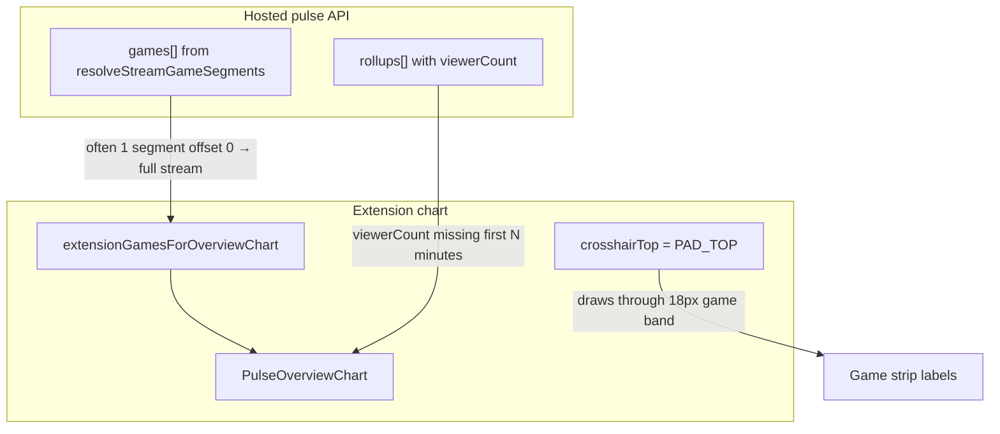

> **HISTORICAL (archived from .cursor/plans).** Not product law. Do not use for routing analytics, ingest, hub, ops, or Pulse work into public Streamclone. See docs/archive/agent-plans/README.md and docs/streampulse-product-boundary.md.
---
name: Chart games viewers crosshair
overview: "Fix three Pulse extension chart issues: (1) live game strip showing one full-width current game instead of per-game segments, (2) ~5 minute viewer line gap at stream start, and (3) selection crosshair painting over the game band. Frontend-only crosshair fix is immediate; game segments and viewer alignment need hosted analytics data fixes plus optional UI honesty."
todos:
  - id: crosshair-clip
    content: "PulseOverviewChart: set crosshairTop = plotTop; verify pin/hover lines and selection column"
    status: completed
  - id: viewer-hint-full
    content: "LiveStatsBand: show lateViewerSamples hint on full-stream chart window"
    status: completed
  - id: probe-games-api
    content: Probe hosted /v1/extension/pulse/channels/{login}?window=full games[] vs expected 3 segments
    status: completed
  - id: snapshot-fallback
    content: "game_segments_snapshots.go: channel_id fallback query + prefer by distinct categories + tests"
    status: completed
  - id: rc16-250-deploy
    content: "Ops: redeploy analytics rc16 with 250 IRC cap; verify viewerStartOffsetSeconds aligns with chat"
    status: completed
  - id: verify-extension
    content: npm test, npm run build, manual Twitch chart check after reload
    status: completed
isProject: false
---

# Pulse chart: game segments, viewer gap, crosshair clip

## What you’re seeing (root causes)



| Symptom | Likely cause | Layer |
|---------|--------------|-------|
| One orange bar = current game only | API returns a **single full-stream segment** (synthetic category fallback or only one category in snapshot timeline). Client passes it through unchanged in [`extensionGamesForOverviewChart`](C:/Users/Aron/streamclone-pulse/src/ui/extensionChartAdapter.ts). | Backend data + adapter |
| Viewer line starts ~5 min late | **Late IRC admission** (60s top-N cycle, 250 cap) + **pre-rc16 viewer flush** (Helix samples invisible until minute closes). Full-stream chart also **densifies** minutes with chat=0 and no `viewerCount`, so the line breaks at 00:00. See [`hosted-live-viewer-coverage-2026-07.md`](C:/Users/Aron/twitch-7tv-clone/docs/agent-notes/hosted-live-viewer-coverage-2026-07.md). | Hosted analytics + chart prep |
| Pin line over game labels | [`crosshairTop = PAD_TOP`](C:/Users/Aron/streamclone-pulse/src/ui/PulseOverviewChart.tsx) (14px) while viewer plot starts at `plotTop = PAD_TOP + 4 + GAME_BAND_HEIGHT` (36px). | Extension UI (quick fix) |

**Important constraint:** Game/category history **before** the channel was tracked (IRC admit or metadata sampling) cannot be reconstructed honestly. Multi-game segments require category timeline samples in `top500_live_snapshots` (Helix metadata ~45s + IRC collector on category change).

---

## Phase 1 — Extension UI fixes (streamclone-pulse, no deploy)

### 1A. Clip crosshair below game band

In [`PulseOverviewChart.tsx`](C:/Users/Aron/streamclone-pulse/src/ui/PulseOverviewChart.tsx):

```ts
// Before
const crosshairTop = PAD_TOP

// After
const crosshairTop = plotTop  // same as viewerBandTop
```

This updates pin/hover `<line>` elements and `selectionColumnRect` highlight columns so they stop at the **top of the viewer lane**, not through [`GameSegmentOverlay`](C:/Users/Aron/twitch-7tv-clone/packages/pulse-charts/src/GameSegmentOverlay.tsx).

Optional follow-up: shorten game-change dashed markers (`y2={gameBandTop + gameBandHeight + 120}`) to stop at `plotTop` so transition markers don’t overlap the viewer strip — separate from the pin line.

### 1B. Viewer-gap honesty on full-stream chart

[`LiveStatsBand.tsx`](C:/Users/Aron/streamclone-pulse/src/ui/LiveStatsBand.tsx) already computes `lateViewerSamples` and shows “Viewer samples from …”, but the hint block is easy to miss on **Full stream** range. Extend the hint so it also appears when `chartWindow === 'full'` and `viewerStartOffsetSeconds > coverageStartOffsetSeconds + 60`.

No fake backfill of viewer points — chart stays honest (`chartViewerValue(point) || null` breaks the line when data is missing).

---

## Phase 2 — Live multi-game segments (streamclone backend)

### 2A. Diagnose the live channel first

Before coding, probe the channel from the screenshot:

```powershell
$r = Invoke-RestMethod "https://api.streampulse.stream/v1/extension/pulse/channels/{login}?window=full"
$r.games | Format-Table gameName, offsetSeconds, durationSeconds
$r.category
$r.coverageStartOffsetSeconds
$r.viewerStartOffsetSeconds
```

- If `games` is **one row** (offset 0, duration ≈ stream length) → backend timeline is empty or single-category; UI cannot invent 3 segments.
- If `games` has **3 rows** but chart shows one bar → frontend plotting bug (unlikely given [`GameSegmentOverlay`](C:/Users/Aron/twitch-7tv-clone/packages/pulse-charts/src/GameSegmentOverlay.tsx) maps each segment independently).

### 2B. Improve snapshot-based segment resolution

Primary files:
- [`game_segments_snapshots.go`](C:/Users/Aron/twitch-7tv-clone/internal/analytics/game_segments_snapshots.go)
- [`live_category_samples.go`](C:/Users/Aron/twitch-7tv-clone/internal/analytics/live_category_samples.go)
- [`extension_api.go`](C:/Users/Aron/twitch-7tv-clone/internal/analytics/extension_api.go) (`resolveStreamGameSegments`, `extendLiveGameSegments`)

Planned backend changes:

1. **Broaden snapshot query** in `GameSegmentsFromTop500Snapshots`:
   - Primary: `stream_id = canonicalID` (current).
   - Fallback when `< 2` distinct categories: also load samples by **`channel_id` + `sampled_at` within [startedAt, endAt]** (catches early Helix ticks where `stream_id` was NULL or alias mismatch).
   - Merge + dedupe samples before `buildGameSegmentsFromCategoryTimeline`.

2. **Smarter `preferGameSegments`**:
   - Prefer snapshot when it has **more distinct normalized category names** than stored segments (not only `len(snapshot) > len(stored)`).
   - Avoid keeping a single stored full-stream segment when snapshot timeline is richer.

3. **Do not mask history on live**:
   - Keep `extendLiveGameSegments` for the **open last segment only** (already correct).
   - Skip `resolveExtensionGames` category synthesis when snapshot produced segments (already gated on `len(segments) > 0`).

4. **Tests** in [`game_segments_snapshots_test.go`](C:/Users/Aron/twitch-7tv-clone/internal/analytics/game_segments_snapshots_test.go):
   - channel_id fallback merges helix samples without stream_id
   - prefer by distinct category count
   - multi-game timeline → 3 extension segments

### 2C. Extension adapter honesty (small)

In [`extensionChartAdapter.ts`](C:/Users/Aron/streamclone-pulse/src/ui/extensionChartAdapter.ts):

- When backend returns a **single synthetic** full-stream segment (same shape as `resolveExtensionGames` / client fallback), optionally annotate or hide via existing `hasMeaningfulGameSegments` — but **only when snapshot data is truly unavailable**. Do **not** hide when backend sends real multi-segment data.
- Consider switching LiveStatsBand to `extensionGamesToChartGames` **only when** `payload.games` is empty (keep current `extensionGamesForOverviewChart` for the rc15 “show current category” case, but don’t double-synthesize when backend already sent one segment).

---

## Phase 3 — Viewer line starts with chat (hosted ops + analytics)

### 3A. Redeploy analytics rc16 **with** 250 IRC cap

Recent VPS break-glass rolled analytics back to **rc15** for CPU relief. rc16 fixes (`bindStreamIDNow`, `flushOpenMinuteToStore`, `viewerStartOffsetSeconds`) address chat-vs-viewer lag **after admission**, but need to ship together with the 250 cap env.

Ops steps (operator, streampulse-ops):
- Set `PULSE_MAX_ACTIVE_CHANNELS=250`, `PULSE_TOP500_ADMISSION_TOP_N=250` in `production.local.env`
- Pin `IMAGE_TAG=v0.3.0-rc16` for **analytics + analytics-workers + migrate** only
- Recreate analytics containers; verify hub fingerprint `t250:irc250:col250`

Pass criteria from evidence doc:
- First rollup with `chatCount > 0` also has `viewerCount > 0`
- `viewerStartOffsetSeconds <= coverageStartOffsetSeconds + 60` (after admission)

### 3B. Remaining prefix gap (expected)

Even after rc16, **minute 0** may stay empty if the channel wasn’t admitted until ~2–4 min (`coverageStartOffsetSeconds > 0`). That is honest — UI hint explains it; Protect/always-track is the product knob for minute-0 channels outside top-N.

---

## Verification checklist

| Check | How |
|-------|-----|
| Crosshair | Select a minute on chart → vertical line stops at viewer lane top, game labels untouched |
| Games | API `games` shows 3 segments with correct offsets; chart shows 3 orange bands on Full stream |
| Viewers | New stream on Protect channel: viewer line within 60s of first chat minute post-admission |
| Extension | `npm test && npm run build` in streamclone-pulse; reload extension on Twitch |
| Backend | `go test ./internal/analytics/... -run GameSegment` in streamclone |

---

## Scope split

| Phase | Repo | Deploy |
|-------|------|--------|
| 1 Crosshair + hints | streamclone-pulse | Extension reload |
| 2 Game segments | streamclone (analytics) | Hosted analytics image |
| 3 Viewer flush | streamclone + streampulse-ops | Hosted analytics recreate |

If the probed channel’s `games` array is already a single segment, Phase 2B is required for real multi-game bars; Phase 1 alone cannot fabricate the two earlier games.
