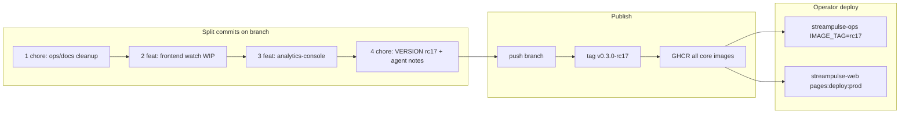

> **HISTORICAL (archived from .cursor/plans).** Not product law. Do not use for routing analytics, ingest, hub, ops, or Pulse work into public Streamclone. See docs/archive/agent-plans/README.md and docs/streampulse-product-boundary.md.
---
name: Commit push rc17 deploy
overview: Unstage the 384-file WIP tree, land it as three focused commits plus rc17 release bump, push to GitHub, run codegraph/docs guardrails, and hand off full-stack VPS + Cloudflare prod deploy (supersedes break-glass rc16-only).
todos:
  - id: unstage-split
    content: git reset HEAD; verify 384-file WIP tree + untracked channel components
    status: pending
  - id: commit-ops
    content: "Commit 1: chore(ops) bearhost/pulse-wire/storygraph removal + docs/scripts/deploy"
    status: pending
  - id: commit-frontend
    content: "Commit 2: feat(frontend) watch WIP + pulse-charts; tsc + npm test"
    status: pending
  - id: commit-portal
    content: "Commit 3: feat(portal) analytics-console live viewer banners"
    status: pending
  - id: commit-rc17
    content: "Commit 4: VERSION rc17 + agent guardrail notes + make codegraph"
    status: pending
  - id: push-tag-rc17
    content: Push branch + tag v0.3.0-rc17; confirm GHCR analytics/frontend/migrate build
    status: pending
  - id: deploy-vps-rc17
    content: "streampulse-ops: full IMAGE_TAG=rc17 deploy + protect + minute-0 probe"
    status: pending
  - id: deploy-portal
    content: "streamclone-pulse: streampulse-web pages:deploy:prod after VPS rc17"
    status: pending
isProject: false
---

# Commit WIP, push rc17, deploy hosted + prod

## Current state (read-only)

| Item | Value |
|------|--------|
| Branch | `release/top-live-irc-admission` @ `ff161ef` (analytics rc16 already pushed) |
| Working tree | **384 files staged** from failed stash pop — not yet committed |
| Untracked frontend | [`FadeMount.tsx`](C:/Users/Aron/twitch-7tv-clone/frontend/src/components/channel/FadeMount.tsx), [`StreamPosterCrossfade.tsx`](C:/Users/Aron/twitch-7tv-clone/frontend/src/components/channel/StreamPosterCrossfade.tsx), [`ChannelRouteSkeleton.tsx`](C:/Users/Aron/twitch-7tv-clone/frontend/src/components/channel/ChannelRouteSkeleton.tsx), [`playbackStartup.ts`](C:/Users/Aron/twitch-7tv-clone/frontend/src/playback.ts) WIP |
| Hosted API | Still **`v0.3.0-rc15`** — rc16 image on GHCR, not deployed to VPS |
| Your choices | **Split commits** + **full rc17 prod** (analytics + frontend + migrate; portal via streamclone-pulse) |

**Important:** Staged diff is mostly **July product-scope cleanup** (bearhost/pulse-wire/storygraph removal, ops doc migration), not the full HLS/Streamlink backend task (no `internal/video/` changes staged). Partial playback work is in [`frontend/src/playback.ts`](C:/Users/Aron/twitch-7tv-clone/frontend/src/playback.ts) (+92 lines staged).



---

## Phase 0 — Reset staging and verify scope

```powershell
cd C:\Users\Aron\twitch-7tv-clone
git reset HEAD          # unstage all 384 files; keep working tree
git status --short      # confirm M/?? paths match intent
```

Drop redundant stashes **after** commits succeed: `non-analytics-deploy-wip`, `pre-rebase-full-wip` (content should match working tree).

---

## Phase 1 — Split commits (3 product + 1 release)

Author on every commit: `Aron-Chu <aroncloudchu@gmail.com>` (env vars per [`.cursor/rules/commits.mdc`](C:/Users/Aron/twitch-7tv-clone/.cursor/rules/commits.mdc)). Run pre-commit hooks; fix failures with **new** commits.

### Commit 1 — `chore(ops): migrate public repo off bearhost and pulse-wire`

**Stage:**

- `scripts/` (bearhost script deletions, ops-stub, env helpers)
- `deploy/` (compose/Caddy/grafana/prometheus cleanup; keep [`profile-hosted-pulse-live-250.env.example`](C:/Users/Aron/twitch-7tv-clone/deploy/env/profile-hosted-pulse-live-250.env.example))
- `docs/` agent notes, ops migration manifests, ENVIRONMENT/SERVICE_MAP updates
- `charts/`, `cmd/storygraph`, `cmd/x-ingest`, `internal/storygraph/**` deletions
- `internal/social/reliability/` moves, `internal/metadata/` non-playback tweaks
- Root/agent config: `AGENTS.md`, `README.md`, `Makefile`, `.github/`, `.kiro/`, `.cursor/`, `.codex/`, `CONTRIBUTING.md`, `.gitleaks.toml`, `tools/`, workspace file

**Exclude:** `frontend/**`, `packages/**`

Message: public repo ops boundary + pulse-wire removal; hosted runbooks live in streampulse-ops.

### Commit 2 — `feat(frontend): watch UI polish and playback startup WIP`

**Stage:**

- All `frontend/**` including **untracked** channel helpers:
  - [`FadeMount.tsx`](C:/Users/Aron/twitch-7tv-clone/frontend/src/components/channel/FadeMount.tsx)
  - [`StreamPosterCrossfade.tsx`](C:/Users/Aron/twitch-7tv-clone/frontend/src/components/channel/StreamPosterCrossfade.tsx)
  - [`ChannelRouteSkeleton.tsx`](C:/Users/Aron/twitch-7tv-clone/frontend/src/components/channel/ChannelRouteSkeleton.tsx)
  - [`playbackStartup.ts`](C:/Users/Aron/twitch-7tv-clone/frontend/src/playbackStartup.ts), hooks, tests if present
- [`packages/pulse-charts/`](C:/Users/Aron/twitch-7tv-clone/packages/pulse-charts/) (game segment overlay — extension/portal shared)

**Pre-commit gate:**

```powershell
cd frontend && npx tsc -b && npm test
```

Wire note: if [`Channel.tsx`](C:/Users/Aron/twitch-7tv-clone/frontend/src/components/Channel.tsx) still imports Pulse/Stats, either finish core-only strip in this commit or document partial state in agent note — avoid half-wired imports that fail tsc.

### Commit 3 — `feat(portal): live viewer warmup banners in analytics-console`

**Stage:**

- [`packages/analytics-console/src/utils/streamQuality.ts`](C:/Users/Aron/twitch-7tv-clone/packages/analytics-console/src/utils/streamQuality.ts) (`diagnoseLiveViewerWarmup`)
- [`packages/analytics-console/src/components/analytics/AnalyticsChart.tsx`](C:/Users/Aron/twitch-7tv-clone/packages/analytics-console/src/components/analytics/AnalyticsChart.tsx)

Run package tests if present (`packages/analytics-console` / root npm scripts).

### Commit 4 — `chore(release): bump VERSION to v0.3.0-rc17 and agent guardrails`

**Stage/update:**

- [`VERSION`](C:/Users/Aron/twitch-7tv-clone/VERSION) → `v0.3.0-rc17`
- New [`docs/agent-notes/watch-ui-hls-wip-2026-07.md`](C:/Users/Aron/twitch-7tv-clone/docs/agent-notes/watch-ui-hls-wip-2026-07.md) — what landed vs **not** landed (HLS backend/Streamlink task still pending)
- Update [`docs/agent-notes/hosted-live-viewer-coverage-2026-07.md`](C:/Users/Aron/twitch-7tv-clone/docs/agent-notes/hosted-live-viewer-coverage-2026-07.md) — rc17 supersedes break-glass rc16-only; full-stack deploy steps
- Update [`docs/agent-notes/product-scope-2026-07.md`](C:/Users/Aron/twitch-7tv-clone/docs/agent-notes/product-scope-2026-07.md) — mark docs synced 2026-07-05
- Append row to [`docs/repo-maintenance.md`](C:/Users/Aron/twitch-7tv-clone/docs/repo-maintenance.md) if install/frontend behavior changed

**Codegraph (required before tag):**

```powershell
make codegraph
make context-verify
```

Rebuild ensures deleted `internal/storygraph` symbols do not mislead MCP; [`AGENTS.md`](C:/Users/Aron/twitch-7tv-clone/AGENTS.md) already tells agents to run `make codegraph` after large moves.

---

## Phase 2 — Push branch + tag rc17

```powershell
git push origin release/top-live-irc-admission
git tag -a v0.3.0-rc17 -m "v0.3.0-rc17: product-scope cleanup, watch UI WIP, portal console banners"
git push origin v0.3.0-rc17
```

Watch [release-images.yml](C:/Users/Aron/twitch-7tv-clone/.github/workflows/release-images.yml):

- **Release gate (`make check`)** must pass (rc16 passed).
- **Image smoke** may fail on health timeout (known for rc14/rc15) — images still publish; document in agent note.

Expected GHCR tags: `analytics`, `migrate`, `frontend`, `metadata`, `video`, `chat`, `emote` @ `v0.3.0-rc17`.

---

## Phase 3 — Hosted VPS deploy (streampulse-ops) — full rc17

**Supersedes** break-glass rc16-only: pin **matched `IMAGE_TAG=v0.3.0-rc17`** across core services per [production-artifact-contract.md](C:/Users/Aron/twitch-7tv-clone/docs/production-artifact-contract.md).

Operator sequence (from [`hosted-rc14-rc15-deploy-evidence-2026-07.md`](C:/Users/Aron/twitch-7tv-clone/docs/agent-notes/hosted-rc14-rc15-deploy-evidence-2026-07.md) pattern):

```bash
# On VPS via streampulse-ops
IMAGE_TAG=v0.3.0-rc17 bash /root/streampulse-ops/scripts/deploy/production-deploy.sh
# Ensures: migrate forward (000062/063 if not yet applied), recreate analytics + frontend + siblings
```

Update `/root/streampulse-ops/env/production.local.env`: `IMAGE_TAG` + `STREAMCLONE_VERSION` → rc17.

**Protect + minute-0 probe** (unchanged semantics):

1. Protect test channel while offline.
2. Deploy rc17.
3. Start **new** stream.
4. Probe rollup delta ≤60s; `viewerStartOffsetSeconds` omitted when 0 is success.

Record results in `hosted-live-viewer-coverage-2026-07.md` deploy evidence table.

---

## Phase 4 — StreamPulse prod site (streamclone-pulse)

Portal consumes `@streamclone/analytics-console` from sibling checkout — deploy **after** commit 3 is on GitHub.

From [`docs/design/pages-deploy-runbook.md`](C:/Users/Aron/streamclone-pulse/docs/design/pages-deploy-runbook.md):

```powershell
# streamclone: hosted API smoke
bash scripts/pulse-hosted-boundary-smoke.sh   # in twitch-7tv-clone

# streamclone-pulse
cd streampulse-web
$env:VITE_BACKEND_URL = 'https://api.streampulse.stream'
npm ci && npm run build && npm run pages:deploy:prod
```

Post-deploy: `/analytics`, channel console routes, live viewer banner visible when chat precedes viewers.

**Extension** (`streamclone-pulse` root `npm run build`) is separate from Cloudflare Pages — only if viewer strip/honesty UI from prior session should ship.

---

## Phase 5 — Local verification (optional but recommended)

```powershell
make compose-config-check
make up
curl http://127.0.0.1:8090/v1/extension/health

# Frontend source overlay (see plan analytics-only doc)
docker compose --env-file .env `
  -f deploy/docker-compose.yml `
  -f deploy/docker-compose.local-tunnel.yml `
  -f deploy/docker-compose.release.yml `
  -f deploy/docker-compose.frontend-source.yml `
  up -d --build --force-recreate frontend
```

Browser smoke `/c/inoxtag` — confirm no stuck route skeleton; playback startup overlay behavior.

---

## Agent guardrails (prevent future overwrite)

| Surface | Action |
|---------|--------|
| [`AGENTS.md`](C:/Users/Aron/twitch-7tv-clone/AGENTS.md) | Already updated in commit 1 — product scope 2026-07 truth |
| [`docs/agent-notes/watch-ui-hls-wip-2026-07.md`](C:/Users/Aron/twitch-7tv-clone/docs/agent-notes/watch-ui-hls-wip-2026-07.md) | **New** — committed vs pending HLS/Streamlink task |
| [`docs/agent-notes/hosted-live-viewer-coverage-2026-07.md`](C:/Users/Aron/twitch-7tv-clone/docs/agent-notes/hosted-live-viewer-coverage-2026-07.md) | rc17 deploy + probe evidence |
| `.codegraph/streamclone.kuzu` | Rebuilt via `make codegraph` in commit 4 (gitignored but MCP uses local DB) |
| [`.kiro/steering/playback.md`](C:/Users/Aron/twitch-7tv-clone/.kiro/steering/playback.md) | Add one line: partial startup WIP in frontend; backend probeHLS task not started |

**Do not** commit: `.env`, secrets, `.cursor/mcp.json`, stashes until verified redundant.

---

## Risks

| Risk | Mitigation |
|------|------------|
| 384-file commit breaks CI | Split commits + `make check` before tag; fix tsc in commit 2 |
| Release smoke timeout | Known; images still usable (rc14–rc16 pattern) |
| Frontend WIP incomplete (Pulse tabs still present) | Agent note + tsc gate; finish core-only strip in commit 2 or document partial |
| Portal deploy before VPS | Deploy VPS first so console banners hit rc17 API |
| HLS backend task conflated with this push | Explicit agent note: `internal/video/` unchanged; next task |

---

## Out of scope for this pass

- HLS/Streamlink stability implementation (`internal/video/worker`, `probeHLS` child playlist) — separate task after rc17 lands
- Direct-browser Twitch HLS proxy — mention only in agent note as future latency project
