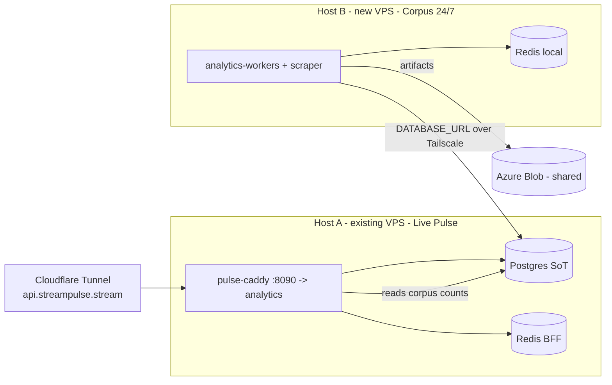

> **HISTORICAL (archived from .cursor/plans).** Not product law. Do not use for routing analytics, ingest, hub, ops, or Pulse work into public Streamclone. See docs/archive/agent-plans/README.md and docs/streampulse-product-boundary.md.
---
name: Coverage and chart fixes
overview: Fix the activity-chart bar color, make BTTV/FFZ actually render in the hub, and split the single 8GB BearHost VPS into two hosts (corpus 24/7 + live-Pulse) sharing one Postgres so backfill drains and IRC can scale toward 100.
todos: []
isProject: false
---

# Coverage + chart fixes, and a 2-host BearHost split

## Confirmed context (from investigation)

- Your portal (even local `npm run dev`) reads the **hosted BearHost backend** `https://api.streampulse.stream` — there is no `.env.development.local`, only the `.example`, so `DEFAULT_BACKEND_URL` falls back to production ([auth.ts](streampulse-web/src/lib/auth.ts) L78-81). All the BearHost 8GB caps apply.
- BearHost is deliberately **one-mode-at-a-time**: `bearhost-pulse-api.sh` stops corpus workers; `bearhost-corpus-only.sh` stops the live/API path. That is why "corpus 24/7 + IRC 100 + backfill" cannot coexist today.
- A 2-host split is already the documented path and needs **one shared Postgres + shared Azure** — the public hub reads Silver/Gold from the same `backfill_jobs` table the corpus workers write ([hub_overview.go](internal/analytics/hub_overview.go) L1006-1028, [coverage_report.go](internal/analytics/coverage_report.go) L291-300). No cross-DB federation exists.

## Phase 0 - Chart bars color (frontend, quick, independent)

You rejected amber and cyan and said pick best. Decision: make the chat-volume bars a **neutral desaturated slate-blue** so they read purely as a volume backdrop and every colored line (violet viewers, green 7TV, blue Twitch, rose BTTV, amber FFZ) pops. Lines already have a dark drop-shadow edge from the last change.

- [hub.css](streampulse-web/src/ui/components/hub/hub.css): set `--chart-bar` to a neutral slate (around `218 18% 60%`), keep bar fill low (~0.3) and the active-hover bar brighter.
- Keep the cohesive line palette already in [HubActivityChart.tsx](streampulse-web/src/ui/components/hub/HubActivityChart.tsx) `PROVIDER_META`; update the "Chat / min" legend/tooltip swatch to the new neutral.

## Phase 1 - Make BTTV/FFZ render (backend data path)

Root cause: only **7TV** has a dedicated per-minute counter (`seventv_emote_count`); BTTV/FFZ live only inside `emotes_json`, and the short-window path (`RecentRollupBucketsByStreamID`) strips `emotes_json`, so BTTV/FFZ/Twitch are structurally `0` (worst on the analytics landing which hardcodes `30m`).

- Step 1 (verify, no fake data): query the shared DB for `bttv:`/`ffz:` keys in `emotes_json` to confirm whether they are even being collected (decides query-fix vs ingestion-fix).
- Step 2 (if data exists): include the provider breakdown in the recent/≤30m bucket path in [store.go](internal/analytics/store.go) + `hubApplyProviderEmotes` ([hub_overview.go](internal/analytics/hub_overview.go) L1133-1150) instead of returning an empty emote map, and stop the analytics landing from hardcoding `30m` ([AnalyticsLandingPage.tsx]).
- Step 3 (if not collected): mirror `sevenTVEmoteCount` with `bttv`/`ffz` counters in [collector.go](internal/analytics/collector.go) `addChat` and ensure the channel emote dict sync tags BTTV/FFZ providers; add the columns via a new forward-only migration.

## Phase 2 - Provision the 2-host split (the real fix for corpus 24/7 + backfill + IRC)

Recommended topology (least disruptive, no data migration):
- **Existing VPS stays Host A** = live-Pulse + public API: keeps Cloudflare tunnel, Postgres (source of truth), Redis BFF. Unchanged routing.
- **New VPS = Host B** = corpus 24/7: `analytics-workers` + `scraper` + `metadata`, **no public ingress**, shared Azure secret, `CORPUS_WORKERS_ENABLED=1`.
- Shared Postgres: start with Host A's Postgres exposed over **Tailscale only** (Host B `DATABASE_URL` -> Host A tailnet IP). Note: docs flag remote-PG-over-Tailscale as a reliability risk for 24/7; a **managed Postgres** (Neon/RDS) is the robust upgrade and a decision point.

Changes:
- New env overlay `deploy/env/profile-bearhost-corpus-remote.env` overriding `DATABASE_URL` to the shared PG.
- Compose: relax `analytics-workers` hard `depends_on: postgres` ([docker-compose.bearhost-prod.yml] L81-83) so Host B doesn't need a local postgres service.
- Adapt `scripts/bearhost-corpus-only.sh` (or a new `bearhost-corpus-remote.sh`) to skip `up -d postgres` when remote DB is set; run `migrate` once against the shared DB.
- Expose Postgres on the Tailscale interface only on Host A (never public UFW).

## Phase 3 - Backfill drains automatically + clear the stale gold job

Once Host B runs corpus 24/7 (`BACKFILL_ENABLED=true`, `GOLD_BACKFILL_ENABLED=true`), the Gold worker drains the queue.
- Diagnose the existing "1 queued · oldest 1d" gold row: confirm it meets the gold claim gate (silver `done` + `export_status=confirmed`, or a `top500_vod_inventory` row) and `next_run_at <= now()` ([backfill_worker_claim.go]); otherwise it stays unclaimed forever.
- Verify via `GET /v1/public/hub` that `corpusPipeline.gold/silver` counts move as Host B drains.

## Phase 4 - Scale IRC toward 100 on the freed Host A (staged)

With corpus off Host A, the live host has headroom. Raise capacity in stages per the CAP-001 gate (do not jump straight to 100):
- `profile-bearhost-pulse.env`: raise `PULSE_MAX_ACTIVE_CHANNELS` + `MAX_CONCURRENT_TRACKED_CHANNELS` together (10 -> 25 -> 50 -> 100), enable `PULSE_TOP500_ADMISSION_ENABLED=true` so live Top-N rows auto-join IRC.
- Soak/monitor each step (Helix QPS, rollup flush latency, IRC reconnects, memory) before the next raise; ~100 joins ≈ 4 IRC sockets (`MAX_CHANNELS_PER_SOCKET=30`).

## Open decision (for plan confirmation)
- Shared Postgres: **Tailscale-remote to Host A's PG** (zero migration, slight reliability risk) vs **managed Postgres** (robust, but migrate existing data once). I recommend starting Tailscale-remote and moving to managed if corpus stability needs it.
</plan>
<todos>[{"id": "color-bars", "content": "Recolor activity-chart chat bars to a neutral slate-blue (--chart-bar) so all colored lines pop; update legend/tooltip swatch (hub.css + HubActivityChart.tsx)"}, {"id": "bttv-ffz-verify", "content": "Query shared DB rollups for bttv:/ffz: keys in emotes_json to determine whether BTTV/FFZ are collected at all (query-fix vs ingestion-fix)"}, {"id": "bttv-ffz-fix", "content": "Surface BTTV/FFZ in hub activity: include provider breakdown in the recent/<=30m bucket path and stop the analytics landing hardcoding 30m; add ingest counters + migration only if not collected"}, {"id": "split-provision", "content": "Provision new corpus VPS (Host B) and decide shared Postgres approach (Tailscale-remote to Host A vs managed PG)"}, {"id": "split-deploy", "content": "Add profile-bearhost-corpus-remote.env, relax analytics-workers postgres dependency, adapt corpus script to use remote DB, run migrations once, bring corpus up 24/7 (CORPUS_WORKERS_ENABLED=1)"}, {"id": "backfill-verify", "content": "Confirm Silver/Gold drain on Host B via /v1/public/hub; diagnose the stale queued gold job against the gold claim gate"}, {"id": "irc-scale", "content": "Stage IRC cap raise on freed Host A (10->25->50->100) with PULSE_TOP500_ADMISSION_ENABLED and per-step soak/monitoring"}]</todos>
</invoke>
