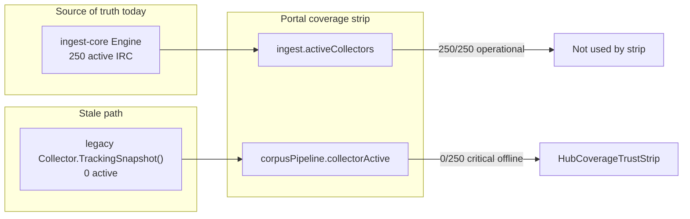

# Coverage fix + optimization roadmap

## Problem (confirmed)

Two hub blocks report different IRC truth after ingest-core cutover:



Root cause in [`internal/analytics/top500_readiness.go`](c:/Users/Aron/twitch-7tv-clone/internal/analytics/top500_readiness.go):

- `CollectorActive/Max` from `h.collector.TrackingSnapshot()` (lines 86–89)
- Per-row `CollectorTracking` from `h.collector.IsTracking(login)` (line 162)

With `INGEST_CORE_ENABLED=1`, legacy collector is idle → `collectorTrackingRows=0` → [`corpusPipelineStateFromReadiness`](c:/Users/Aron/twitch-7tv-clone/internal/analytics/corpus_readiness.go) returns **critical** (line 499) → portal shows "offline".

**Ingest is fine.** This is an observability wiring bug, not an outage.

---

## Part 1 — Backend fix (P0, ship now)

### 1.1 Add ingest-core tracking helper on Handler

In [`internal/analytics/api.go`](c:/Users/Aron/twitch-7tv-clone/internal/analytics/api.go) / small helper file:

```go
func (h *Handler) ircCollectorSnapshot() (active, max int) {
  if h.ingestEngine != nil && h.ingestEngine.OwnsIRCAdmission() {
    snap := h.ingestEngine.ManagerSnapshot()
    cfg := h.ingestEngine.Config()
    return snap.ActiveCollectors, cfg.MaxActiveIRC
  }
  if h.collector != nil {
    snap := h.collector.TrackingSnapshot()
    return snap.Active, snap.Max
  }
  return 0, 0
}

func (h *Handler) isIRCActiveLogin(login string) bool {
  if h.ingestEngine != nil && h.ingestEngine.OwnsIRCAdmission() {
    return h.ingestEngine.IsActiveLogin(login) // thin wrapper on Engine → manager
  }
  if h.collector != nil {
    return h.collector.IsTracking(login)
  }
  return false
}
```

Add `Engine.IsActiveLogin(login string) bool` in [`internal/analytics/ingestcore/engine.go`](c:/Users/Aron/twitch-7tv-clone/internal/analytics/ingestcore/engine.go) delegating to `manager.IsActiveLogin`.

### 1.2 Wire readiness report to ingest-core

In [`buildTop100ReadinessReport`](c:/Users/Aron/twitch-7tv-clone/internal/analytics/top500_readiness.go):

- Replace legacy snapshot block with `h.ircCollectorSnapshot()` for `CollectorActive` / `CollectorMax`.

In [`buildTop100ReadinessRow`](c:/Users/Aron/twitch-7tv-clone/internal/analytics/top500_readiness.go):

- Replace `h.collector.IsTracking(login)` with `h.isIRCActiveLogin(login)`.

**Expected hub after fix** (with ~90 live, 250 IRC):

| Field | Before | After |
|-------|--------|-------|
| `corpusPipeline.collectorActive` | 0 | ~90–250 |
| `corpusPipeline.roster.warming` | 0 | IRC-connected, no rollup yet |
| `corpusPipeline.roster.collectorTracking` | 0 | ~90 |
| `corpusPipeline.roster.liveCollectorDeficitRows` | 91 | ~0 |
| `corpusPipeline.state` | critical | healthy or degraded |
| `coverage.state` | critical | operational / degraded |

Portal [`HubCoverageTrustStrip.tsx`](c:/Users/Aron/streamclone-pulse/streampulse-web/src/ui/components/analytics/HubCoverageTrustStrip.tsx) needs **no contract change** — it already renders backend fields honestly. Optional small copy tweak only if we want ingest-aware fallback (skip unless backend deploy lags).

### 1.3 Hub coverage merge sanity

In [`hub_overview.go`](c:/Users/Aron/twitch-7tv-clone/internal/analytics/hub_overview.go) (~572–581): extend the existing tiering/admit-lag exception so **ingest-core operational with activeCollectors > 0** never downgrades `coverage.state` to critical solely from a stale corpus block. This is belt-and-suspenders after readiness wiring.

### 1.4 Tests

| File | Add |
|------|-----|
| [`top500_readiness_test.go`](c:/Users/Aron/twitch-7tv-clone/internal/analytics/top500_readiness_test.go) | Handler with mock ingest engine: `CollectorTracking=true`, `CollectorActive` from engine |
| [`corpus_readiness_test.go`](c:/Users/Aron/twitch-7tv-clone/internal/analytics/corpus_readiness_test.go) | Ingest-core-on report with tracking rows → not critical |
| [`hub_overview_test.go`](c:/Users/Aron/twitch-7tv-clone/internal/analytics/hub_overview_test.go) | Integration-style: `buildHubCorpusPipeline` + ingest engine → non-zero collectorActive |

Run: `go test ./internal/analytics/... -count=1 -run 'Top100|Corpus|Hub'`

---

## Part 2 — Deploy to hosted (you chose deploy-now)

1. Bump [`VERSION`](c:/Users/Aron/twitch-7tv-clone/VERSION) → `v0.3.0-rc25` (or next rc).
2. Local gate: `make check-quick` (or at minimum `go test ./internal/analytics/...` + `make compose-config-check`).
3. Push tag → GHCR analytics image (existing release workflow).
4. VPS (private ops path):
   ```bash
   IMAGE_TAG=v0.3.0-rc25 bash /root/streampulse-ops/scripts/deploy/production-up.sh --no-deps analytics
   bash /root/streampulse-ops/scripts/smoke/hosted-limits-guard.sh
   curl -s 'https://api.streampulse.stream/v1/public/hub?activityWindow=24h' | jq '.ingest,.corpusPipeline.collectorActive,.corpusPipeline.state,.coverage.state'
   ```
5. Portal verify: hard refresh `:5173/analytics` — coverage strip should show **~90/250** (or higher as live count grows), **warming > 0** where appropriate, state **healthy/degraded**, not "offline".
6. Evidence row in [`PHASE_E_250_CUTOVER.md`](c:/Users/Aron/twitch-7tv-clone/docs/pulse-ingest-v2/evidence/phase-c-20260708T010515Z/PHASE_E_250_CUTOVER.md) or new `06-coverage-fix/` note.

**Do not change scale env** during this deploy — stay on 500/250 tiering-off.

---

## Part 3 — Optimization roadmap (for / against)

### Keep forever (P0 ops) — **FOR**

Your list is correct. Already enforced via `production-up.sh` + `hosted-limits-guard.sh`. No code change; add one line to [`ingest-core-runbook.md`](c:/Users/Aron/twitch-7tv-clone/docs/pulse-ingest-v2/ingest-core-runbook.md): "coverage fix deploys still require limits guard."

### Postgres retention / pruning (P1) — **FOR, next real win**

**Why:** Live ingest RAM is solved (~300–500 MiB at 500/250). Long-term disk + vacuum + query cost is the growth vector.

**Already exists:**
- [`hosted_retention_report.go`](c:/Users/Aron/twitch-7tv-clone/internal/analytics/hosted_retention_report.go) — footprint + `ANALYTICS_RETENTION_DAYS`
- [`chatreplay/live_retention.go`](c:/Users/Aron/twitch-7tv-clone/internal/analytics/chatreplay/live_retention.go) — 14d live chat purge
- VOD chat retention (90d default)

**Not done (high value):**
- Monthly/week partitioning on `analytics_minute_rollups`
- Composite indexes `(stream_id, bucket_minute)` / `(channel_id, bucket_minute)` if missing
- Archive-before-purge for rows beyond retention ([`docs/scraping-archive/requirements.md`](c:/Users/Aron/twitch-7tv-clone/docs/scraping-archive/requirements.md))

**When:** After 12–24h 500/250 soak + baseline `HostedDatabaseFootprint` snapshot. Quiet-window migration for partitioning.

**Against doing it now:** Don't partition during active soak; measure table sizes first.

### Worker / scraper isolation (P1) — **FOR, mostly done**

**Current:** `CORPUS_WORKERS_ENABLED=0`, `SCRAPER_ENABLED_ON_API_NODE=0` on API VPS; scraper in separate capped container.

**Recommendation:** Keep API VPS = live ingest + public API only. If backfill speed matters, add **worker VPS** — don't raise scraper/corpus pressure on the live node.

**Against:** Moving workers before measuring backfill queue depth (Silver/Gold counts on hub) is premature.

### 500/250 tier scheduler quality (P1 in your list) — **DEFER while tiering is OFF**

You are on **500/250 with `INGEST_TIERING_ENABLED=0`**: scheduler assigns top live channels flat IRC up to 250. With ~90 live today, IRC cap is not the bottleneck.

Tier P0/P1/P2/P3 + dwell-time/eviction tuning in [`ingestcore/manager.go`](c:/Users/Aron/twitch-7tv-clone/internal/analytics/ingestcore/manager.go) matters when:
- IRC cap << live count (e.g. 500/50 tiering-on), or
- You re-enable tiering at 500/250 because RAM forces IRC below live count.

**Recommendation:** Finish coverage fix + soak first. Revisit tiering only if RAM or admit-lag metrics force IRC below ~200.

### MinIO / emote asset memory (P2) — **DEFER**

Analytics at ~291 MiB post-flip; MinIO not tight yet. Move cold emote artifacts to R2/CDN when `docker stats minio` or limits guard trends up.

### API cache polish (P2) — **FOR verify-only**

Hub 45s poll + Cloudflare cache already documented. Periodic curl check on `Cache-Control` for `/v1/public/hub` and `/v1/public/hub/moments` — no code unless regression found.

### Do NOT do (agree)

| Item | Verdict |
|------|---------|
| Kubernetes | Against — single VPS ops model works |
| Rust rewrite | Against — ingest-core Go path just validated |
| Kafka/Redpanda | Against — IRC→sharded flush is enough |
| Managed Redis/PG | Against until ops burden exceeds single-host |
| 500 full IRC on same VPS | Against — 250 proven; 500 IRC untested RAM/CPU |

---

## Part 4 — Measured soak checklist (do after deploy)

Run once at T+0, T+6h, T+24h after 500/250 + coverage fix:

| Metric | Where | Pass heuristic |
|--------|-------|----------------|
| analytics RSS | `docker stats` | < 3.5 GiB cap, stable ~400–500 MiB |
| `ingest.activeCollectors` | hub | ~min(live, 250) |
| `corpusPipeline.collectorActive` | hub | matches ingest (post-fix) |
| Redis rejects | redis INFO | flat |
| Rollup flush p95 | Prometheus if available | not worse than Phase D baseline |
| PG size | `HostedDatabaseFootprint` | baseline for retention planning |

Only optimize the metric that regresses.

---

## Summary

| Priority | Action |
|----------|--------|
| **Now** | Wire ingest-core → corpus pipeline + deploy rc25 |
| **Next 24h** | 500/250 soak + footprint baseline |
| **Next sprint** | Postgres retention/partitioning (biggest real optimization) |
| **Later** | Worker VPS if backfill queues grow; tier tuning only if tiering re-enabled or IRC capped |
| **Never (for now)** | K8s, Rust, Kafka, 500 IRC on same box |
