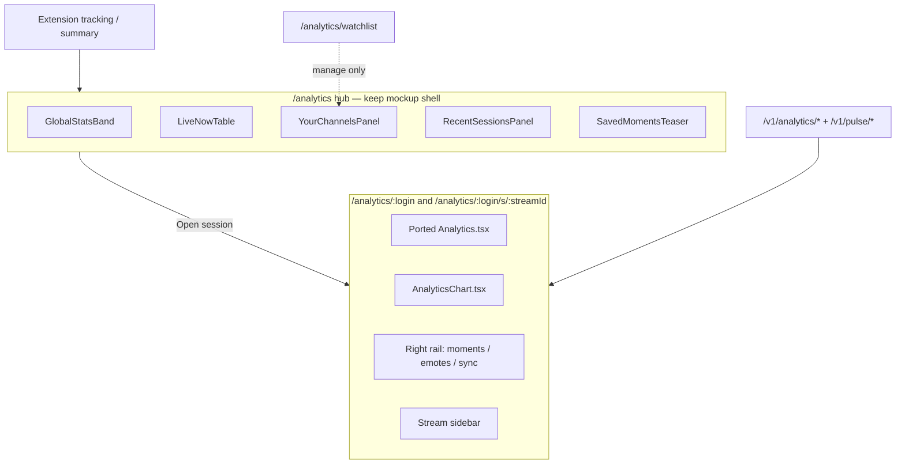

# Full Streamclone Analytics Migration

## What went wrong (why you see an empty hub)

Production on `[feat/analytics-hub-p3-channel](https://github.com/Aron-Chu/streamclone-pulse/tree/feat/analytics-hub-p3-channel)` implements **HUB-P1** (the mockup layout) but gates the **entire page** on an empty portal watchlist:

```tsx
// feat/analytics-hub-p3-channel — DashboardHome.tsx pattern
<HubState empty={hub.watchlistEmpty} ...>
  <GlobalStatsBand />
  <YourChannelsPanel ... />
  <LiveNowTable ... />
  ...
</HubState>
```

When your beta principal has no rows in `pulse_watchlist`, you only see *"Add channels to your watchlist"* — not the hub mockup. That is **not** the design intent.

Your **intended hub** (from WIP `[docs/design/streampulse-analytics-hub-design.md](c:\Users\Aron\streamclone-pulse\docs\design\streampulse-analytics-hub-design.md)` + `[docs/design/references/analytics-hub/streampulse-analytics-hub-mockup.png](c:\Users\Aron\streamclone-pulse\docs\design\references\analytics-hub\streampulse-analytics-hub-mockup.png)`, referenced in `[docs/website-portal/tasks.md` §12](c:\Users\Aron\streamclone-pulse\docs\website-portal\tasks.md) on the P3 branch) is:


| Column                   | Purpose                                                              |
| ------------------------ | -------------------------------------------------------------------- |
| **Global stats band**    | Public/hosted ops tiles at top                                       |
| **Live Now**             | Active sessions across tracked corpus                                |
| **Your Channels**        | Personalization (watchlist / protect) — **one column, not the gate** |
| **Recent Sessions**      | Fastest path into full session analytics                             |
| **Saved moments teaser** | Bookmarks slice                                                      |


Watchlist belongs at `**/analytics/watchlist**` (extension sync / protect context), not as the only way to enter analytics.

**P3 mistake:** channel/stream pages shipped `[MinuteChartRail](c:\Users\Aron\streamclone-pulse\streampulse-web\src\ui\components\analytics\MinuteChartRail.tsx)` + `[AnalyticsSyncRail](c:\Users\Aron\streamclone-pulse\streampulse-web\src\ui\components\analytics\AnalyticsSyncRail.tsx)` via portal BFF — a thin slice of Streamclone, not the real console.

---

## Target architecture




**Source of truth for drill-down UI:** `[twitch-7tv-clone/frontend/src/components/Analytics.tsx](c:\Users\Aron\twitch-7tv-clone\frontend\src\components\Analytics.tsx)` (~~3k lines) + `[AnalyticsChart.tsx](c:\Users\Aron\twitch-7tv-clone\frontend\src\components\analytics\AnalyticsChart.tsx)` (~~1.9k lines) and their dependency tree (~15–20 supporting files under `components/analytics/`, `utils/`, `hooks/`, `types/`).

**Routes (keep P0/P2 scaffolding, fix content):**


| Route                           | Component                                            |
| ------------------------------- | ---------------------------------------------------- |
| `/analytics`                    | Hub mockup (fixed empty states)                      |
| `/analytics/streams`            | Cross-channel history (P2 — keep)                    |
| `/analytics/watchlist`          | Manage tracked channels (supporting)                 |
| `/analytics/:login`             | **Ported `Analytics.tsx`** (live / channel overview) |
| `/analytics/:login/s/:streamId` | **Same component, stream selected**                  |
| `/analytics/:login/:date`       | Session-day resolver (P2 — keep)                     |
| `/dashboard/*`                  | Redirects (P0 — keep)                                |


Use Streamclone URL shape for stream keys where possible (`/analytics/:login/:streamId` redirects already exist via `ChannelSessionKeyRoute`).

---

## API strategy (recommended)

**Call `/v1/analytics/`* and `/v1/pulse/*` directly** with beta key — same contract Streamclone uses locally.

- Hosted Caddy already routes these on `api.streampulse.stream` (`[deploy/Caddyfile.pulse-api](c:\Users\Aron\twitch-7tv-clone\deploy\Caddyfile.pulse-api)`).
- Avoids re-implementing every Analytics field through `[portal_analytics_api.go](c:\Users\Aron\twitch-7tv-clone\internal\analytics\portal_analytics_api.go)`.
- Portal BFF (`/v1/portal/analytics/*`) can remain for any future sanitized surfaces but **will not be the chart data path**.

**Auth adapter:** extend `[streampulse-web/src/lib/apiClient.ts](c:\Users\Aron\streamclone-pulse\streampulse-web\src\lib\apiClient.ts)` with a `streamcloneAnalytics.ts` module mirroring the 20 `api.ts` functions Analytics needs (`getAnalyticsStream`, `getSyncStatus`, `startHistoricalSync`, heatmap, games, bookmarks, recap, etc.) — all with `X-Pulse-Beta-Key` header.

**Hosted guardrails to verify (streamclone backend):** beta key allowed on `POST .../watch`, `POST .../sync`, `prefetch-tracker` in hosted mode; rate limits unchanged.

---

## What to scrap (portal)

Delete or stop routing to these **P3 simplified** pieces on channel/stream pages:

- `[MinuteChartRail.tsx](c:\Users\Aron\streamclone-pulse\streampulse-web\src\ui\components\analytics\MinuteChartRail.tsx)`, `[minuteChartRail.ts](c:\Users\Aron\streamclone-pulse\streampulse-web\src\lib\minuteChartRail.ts)`
- `[AnalyticsSyncRail.tsx](c:\Users\Aron\streamclone-pulse\streampulse-web\src\ui\components\analytics\AnalyticsSyncRail.tsx)`, `[analyticsSyncRail.ts](c:\Users\Aron\streamclone-pulse\streampulse-web\src\lib\analyticsSyncRail.ts)`
- `[ChannelStatBand.tsx](c:\Users\Aron\streamclone-pulse\streampulse-web\src\ui\components\analytics\ChannelStatBand.tsx)` (replaced by Analytics stat cards)
- `[CoverageTierNotice.tsx](c:\Users\Aron\streamclone-pulse\streampulse-web\src\ui\components\analytics\CoverageTierNotice.tsx)` gating on simplified rails (Analytics has its own tier/sync UX)
- Simplified `[Channel.tsx](c:\Users\Aron\streamclone-pulse\streampulse-web\src\routes\dashboard\Channel.tsx)` / `[Stream.tsx](c:\Users\Aron\streamclone-pulse\streampulse-web\src\routes\dashboard\Stream.tsx)` chart integration on the P3 branch

**Keep from P0–P2:** `AnalyticsShell`, `analytics-hub.css`, hub components, route tree, `analyticsLinks.ts`, redirects, `StreamsHubPage`, `ChannelDatePage`, `ChannelSessionKeyRoute`.

---

## What to keep / fix (hub)

### 1. Un-gate the hub (immediate UX fix)

- Change `[HubState](c:\Users\Aron\streamclone-pulse\streampulse-web\src\ui\components\analytics\HubState.tsx)` usage: **never** pass `empty={watchlistEmpty}` at page level.
- Per-column empty copy instead:
  - **Your Channels:** "No pinned channels — add from extension or manage watchlist"
  - **Live Now:** "No tracked channels live right now"
  - **Recent Sessions:** "No recent sessions yet — watch a VOD with the extension or open a channel"
- `[GlobalStatsBand](c:\Users\Aron\streamclone-pulse\streampulse-web\src\ui\components\analytics\GlobalStatsBand.tsx)` always renders (public stats).

### 2. Hub data sources (align with extension context)

Refactor `[useAnalyticsHubData.ts](c:\Users\Aron\streamclone-pulse\streampulse-web\src\hooks\useAnalyticsHubData.ts)`:


| Panel           | Current (wrong)        | Target                                                                                                                |
| --------------- | ---------------------- | --------------------------------------------------------------------------------------------------------------------- |
| Live Now        | watchlist pulse only   | watchlist **+** extension-tracked / always-tracked channels (`GET /v1/pulse/watchlist/summary` + pulse bounded fetch) |
| Recent Sessions | watchlist history only | same channel set **or** backend "recently active for principal" if available; empty column OK                         |
| Your Channels   | watchlist              | unchanged — personalization column                                                                                    |


Watchlist CRUD stays at `/analytics/watchlist`; hub "Manage watchlist" is secondary CTA, not primary blocker.

### 3. Commit design artifacts

The mockup + design doc are indexed but **not in git**. First commit on the migration branch:

- `[docs/design/streampulse-analytics-hub-design.md](c:\Users\Aron\streamclone-pulse\docs\design\streampulse-analytics-hub-design.md)`
- `[docs/design/streampulse-analytics-tasks.md](c:\Users\Aron\streamclone-pulse\docs\design\streampulse-analytics-tasks.md)`
- `[docs/design/references/analytics-hub/streampulse-analytics-hub-mockup.png](c:\Users\Aron\streamclone-pulse\docs\design\references\analytics-hub\streampulse-analytics-hub-mockup.png)`

---

## Port Streamclone Analytics (core work)

### Approach: shared module in streamclone, consumed by portal

Avoid maintaining two copies of 5k+ lines.

1. Create `**packages/analytics-console/**` in streamclone (or `frontend/src/analytics-console/` exported as a path alias) containing the ported tree:
  - `Analytics.tsx`, `analytics/AnalyticsChart.tsx`, `TierIndicator.tsx`, `chartRollupUtils.ts`, `chartTheme.ts`, `LiveCollectionWarmup.tsx`
  - Utils: `syncLabel.ts`, `syncProgressLabels.ts`, `syncedLiveStream.ts`, `statCards.ts`, `analyticsStreamRow.ts`, `chartCursorSync.ts`, `liveEmptyState.ts`, `emoteImageUrl.ts`, `twitchVodUrl.ts`
  - Types: `types/heatmap.ts`
  - Hooks: `useAnalyticsLive.ts`
2. **Inject dependencies** via props/context instead of hard Streamclone imports:
  - `api` adapter (portal passes beta-key client)
  - `Link` / `navigate` (react-router — same)
  - `config.backendUrl` from `VITE_BACKEND_URL`
  - Drop or stub: `[OptionalServicesPanel](c:\Users\Aron\twitch-7tv-clone\frontend\src\components\OptionalServicesPanel.tsx)`, `[StackStatusButton](c:\Users\Aron\twitch-7tv-clone\frontend\src\components\StackStatusButton.tsx)`, local scraper "Start Analytics" (hosted has server-side workers)
  - **Playhead store:** keep chart cursor but wire `?t=` deep-link only; no VOD player sync on portal (link out to Twitch via `buildVodDeepLink`)
3. **Portal route wiring:** replace `Channel.tsx` / `Stream.tsx` bodies with:

```tsx
// streampulse-web — thin wrapper
<AnalyticsConsole login={login} streamId={streamId} api={portalAnalyticsApi} />
```

1. **CSS:** port Analytics-specific styles from streamclone `[frontend/src](c:\Users\Aron\twitch-7tv-clone\frontend\src)` (chart SVG, sync panels, stat cards) into `analytics-console.css` or merge into `[analytics-hub.css](c:\Users\Aron\streamclone-pulse\streampulse-web\src\ui\components\analytics\analytics-hub.css)`.

### Feature parity checklist (must match Streamclone)

- Three-column layout: stream sidebar, chart, right rail tabs (Moments / Emotes / Sync)
- `AnalyticsChart`: overview / emotes / spikes modes, game lane, emote overlays, raw viewer trace, zoom, spike detection, sync frontier overlay
- Sync: full `SyncProgressPanel`, historical sync + chat-only re-sync, ETA/progress breakdown
- Stats band: tier indicator, source pills, chat coverage badge, live vs historical stat cards
- Moments: selected minute, bookmarks CRUD, stream recap, heatmap-ranked moments, jump links with `?t=`
- Emotes: top emote table, emote selection on chart
- Scraper/core-minute blocked notice (read-only on hosted — no local scraper start)
- Chat logs: link to `/logs/:login/:streamId` — **phase 2** port `[ChatLogs` route](c:\Users\Aron\twitch-7tv-clone\frontend\src) if needed; MVP can deep-link "Open in Streamclone" for operators only

---

## Implementation phases


| Phase       | Scope                                                                            | Exit criteria                                                                                                                                                                                             |
| ----------- | -------------------------------------------------------------------------------- | --------------------------------------------------------------------------------------------------------------------------------------------------------------------------------------------------------- |
| **HUB-FIX** | Un-gate hub, per-column empties, commit design docs                              | `/analytics` shows mockup layout even with empty watchlist; mockup PNG in repo                                                                                                                            |
| **P4-A**    | `packages/analytics-console` extract + portal API adapter                        | Vitest on chart utils; portal builds with linked package                                                                                                                                                  |
| **P4-B**    | Wire `/analytics/:login` + `/analytics/:login/s/:streamId` to `AnalyticsConsole` | Manual: same stream in local Streamclone vs portal looks identical                                                                                                                                        |
| **P4-C**    | Delete simplified rails + update tests                                           | Remove `MinuteChartRail`/`AnalyticsSyncRail` tests; add parity smoke tests                                                                                                                                |
| **P4-D**    | Hub data refactor (extension-aware recent/live)                                  | Live Now / Recent Sessions populate without watchlist                                                                                                                                                     |
| **P5**      | `/logs/`* route port (optional but in Streamclone)                               | Searchable chat log browser                                                                                                                                                                               |
| **P6**      | Docs + deploy                                                                    | Update `[website-portal-requirements.md](c:\Users\Aron\streamclone-pulse\docs\pulse-extension\website-portal-requirements.md)` §10 (reverse "do not embed Analytics.tsx"); production deploy + hosted E2E |


**Branch:** continue from `**feat/analytics-hub-p3-channel`** (what production serves today), not `feat/sidebar-refresh-clean` (no `/analytics` routes).

---

## Testing and deploy

- **Vitest:** port `chartRollupUtils`, `syncLabel`, `statCards`, `analyticsSessionKey` tests from streamclone; hub column empty states; `chartFetchDiscipline` updated to allow `/v1/analytics/`* on channel/stream routes (hub stays Layer-1 only).
- **Hosted E2E:** extend `[hosted-website.spec.ts](c:\Users\Aron\streamclone-pulse\streampulse-web\tests\e2e\hosted-website.spec.ts)` — hub renders three columns without watchlist; channel route shows chart toolbar (Spikes / Sync tab).
- **Deploy:** `VITE_BACKEND_URL=https://api.streampulse.stream npx vite build` + wrangler (same as P3-005b).
- **Backend:** no new endpoints required for parity if using direct analytics API; optional: remove dependency on `GET /v1/portal/analytics/streams/{id}/minutes` for charts.

---

## Doc reconciliation (required)

Update committed PRD that **conflicts** with this direction:

- `[docs/pulse-extension/website-portal-requirements.md](c:\Users\Aron\streamclone-pulse\docs\pulse-extension\website-portal-requirements.md)` — replace "Analytics-Lite / do not embed Analytics.tsx" with hub + full console port spec
- `[docs/website-portal/design.md](c:\Users\Aron\streamclone-pulse\docs\website-portal\design.md)` §13A — chart data via `/v1/analytics/*` for session pages
- `[docs/website-portal/tasks.md](c:\Users\Aron\streamclone-pulse\docs\website-portal\tasks.md)` — add **HUB-P4** tasks; mark P3 rails as superseded

---

## Known hosted limitations (honest scope)

These Streamclone features **cannot** be 1:1 on the public portal without extra work:


| Feature                                | Portal behavior                                                   |
| -------------------------------------- | ----------------------------------------------------------------- |
| VOD player + playhead chart sync       | Deep-link to Twitch VOD with `?t=`; chart uses `?t=` on load only |
| Start local scraper / OptionalServices | Hidden on hosted; server-side corpus already running              |
| Grafana / operator admin               | Operator-only links; not in beta portal                           |
| Full internal stack status             | Omit `StackStatusButton`                                          |


Everything else in the analytics **console** should match Streamclone pixel-for-pixel and behavior-for-behavior.
