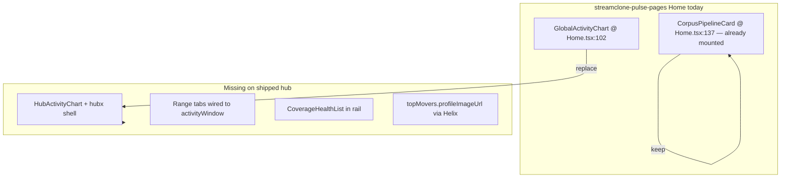

# Hub chart + IVR ops (two tracks)

## Verdict / promise split

| Track | Delivers | Does **not** deliver |
|-------|----------|----------------------|
| **A — Hub UI / image PR** | Screenshot-style combo chart, range tabs, mover PFPs, Gold/IVR-lite labels, Pages deploy | IVR shadow, new public IVR metrics, canonical IVR replace |
| **B — IVR / Gold ops** | Corpus workers, IVR shadow overlay, Ludwig canary, artifact + SQL leakage proof | Hub UI polish (separate PR) |

**Prerequisite (done):** Portal auth hotfix verified — `/v1/portal/analytics/channels/ludwig/streams` returns **401** unauth.

**Chart target:** Combo **bars + chat/emote/7TV lines + corpus gap badge** via [`HubActivityChart`](C:/Users/Aron/streamclone-pulse/streampulse-web/src/ui/components/hub/HubActivityChart.tsx). Do **not** remove bars. Replace [`GlobalActivityChart`](C:/Users/Aron/streamclone-pulse-pages/streampulse-web/src/routes/dashboard/Home.tsx) at **line 102** with the hubx `HubActivityChart` flow.

---

## Problem summary



| Symptom | Root cause |
|---------|------------|
| Chart unlike screenshot | [`Home.tsx`](C:/Users/Aron/streamclone-pulse-pages/streampulse-web/src/routes/dashboard/Home.tsx) uses `GlobalActivityChart`; `HubActivityChart` on master (`4db6947`) is **never mounted** |
| No 24h / 7d / 1m / 1y | API + hook support `?activityWindow=`; `.hx-range-tabs` CSS exists; **no TSX + Home never passes `activityWindow`** |
| Mover PFP empty (e.g. xqc not in liveChannels) | [`hub_overview.go`](C:/Users/Aron/twitch-7tv-clone/internal/analytics/hub_overview.go) builds `topMovers` without `profileImageUrl`; `enrichHubProfileImages` runs on **liveChannels only** — client merge cannot fix movers absent from live roster |
| Pipeline feels disconnected | [`CorpusPipelineCard`](C:/Users/Aron/streamclone-pulse-pages/streampulse-web/src/routes/dashboard/Home.tsx) **already rendered** at line 137; gap is **hubx layout + `CoverageHealthList`** Silver/Gold rows + clearer IVR-lite copy |
| IVR / Gold “not working” | **Not fixable in Track A** — requires Track B ops (shadow enablement + proof) |

---

# Track A — Hub UI / image PR

## Phase A0 — Branch hygiene

1. Branch `feat/hub-activity-ship` from **`origin/master`** (`8347712+`); use clean worktree (`streamclone-pulse-pages` recommended).
2. Replace `GlobalActivityChart` block with **hubx WIP** [`Home.tsx`](C:/Users/Aron/streamclone-pulse/streampulse-web/src/routes/dashboard/Home.tsx): sidebar, `#hx-command` + `HubActivityChart`, rail with `GlobalEmotesList` + **`CoverageHealthList`**.
3. **Retain** existing `CorpusPipelineCard` section (do not duplicate; hubx layout wraps or places it appropriately).
4. Commit any missing support files: [`hubActivitySummary.ts`](C:/Users/Aron/streamclone-pulse/streampulse-web/src/lib/hubActivitySummary.ts), [`backendSource.ts`](C:/Users/Aron/streamclone-pulse/streampulse-web/src/lib/backendSource.ts), tests.

---

## Phase A1 — Activity chart + range tabs

### Range tabs

Add [`HubActivityRangeTabs.tsx`](C:/Users/Aron/streamclone-pulse/streampulse-web/src/ui/components/hub/HubActivityRangeTabs.tsx):

| Tab | Param | `activity.windowMinutes` | `activity.points.length` (verified hosted) |
|-----|-------|--------------------------|---------------------------------------------|
| 30m | `30m` | 30 | ~29 (live bucket) |
| 24h | `24h` | **1440** | **240** (capped) |
| 7d | `7d` | 10080 | **240** |
| 1m | `1m` | 43200 | **240** |
| 1y | `1y` | 525600 | **22** (sparse corpus history) |

Long windows are **bucketed and point-capped** (`hubActivityMaxPoints = 240` in backend). UI footnote should say “~N buckets” from [`summarizeActivity`](C:/Users/Aron/streamclone-pulse/streampulse-web/src/lib/hubActivitySummary.ts), not imply one point per minute.

Wire: `usePublicHubData({ activityWindow, enabled: true })`.

### Chart header (match screenshot)

- Title: **Chat volume & emote velocity · rolling**
- Subtitle: `activitySummary.windowLabel` (e.g. “1 day” for 24h)
- `.hx-legend`: Chat/min (bar), Emotes/min (line), 7TV subset (dashed)
- Range tabs in `.hx-chart-actions` (top-right)

### Tests (correct expectations)

- `fetchPublicHub` with `activityWindow=24h` → query string present
- Hosted/integration: `activity.windowMinutes === 1440` and `points.length === 240` for 24h — **not** 1440 points
- 7d / 1m → `points.length === 240`; 1y → `points.length === 22` (or current prod value; assert cap not minute-for-minute)

---

## Phase A2 — Mover avatars (required) + dev emote loading (secondary)

### A2a. Backend — **required** (streamclone)

In [`hub_overview.go`](C:/Users/Aron/twitch-7tv-clone/internal/analytics/hub_overview.go):

1. Add `ProfileImageURL` to `HubMover` JSON.
2. After building `topMovers`, run **`enrichHubProfileImages` on movers** (Helix batch + Redis cache) — same path as live channels, independent of live roster membership.
3. Optional copy-from-liveChannels when login overlaps (optimization only).

Test: mover with emote velocity but **not** in `liveChannels` still gets `profileImageUrl` when Helix enabled.

**Deploy:** BearHost rsync + analytics rebuild (same gate as portal auth hotfix).

Smoke:

```bash
curl -s "https://api.streampulse.stream/v1/public/hub" | jq '.topMovers[0].profileImageUrl'
# Expect non-empty for top mover when Helix configured
```

**Do not rely on client-side liveChannels → topMovers merge** (xqc counterexample).

### A2b. Dev emote URLs — secondary

CSP/proxy fixes apply to **synced `/emotes/` paths** on localhost:5173 only:

- Vite proxy `/emotes` → backend in [`vite.config.ts`](C:/Users/Aron/streamclone-pulse/streampulse-web/vite.config.ts)
- DEV: keep `/emotes/...` relative in [`publicHub.ts`](C:/Users/Aron/streamclone-pulse/streampulse-web/src/lib/publicHub.ts) `absoluteAssetUrl`

Add `onError` fallbacks on emote `` in [`HubRail.tsx`](C:/Users/Aron/streamclone-pulse/streampulse-web/src/ui/components/hub/HubRail.tsx).

Prod emotes/avatars use HTTPS Twitch CDN — unaffected.

---

## Phase A3 — Pipeline visibility (copy + CoverageHealthList)

**Already on pages Home:** `CorpusPipelineCard` at line 137.

**Add in hubx layout:**

| Component | Purpose |
|-----------|---------|
| [`CoverageHealthList`](C:/Users/Aron/streamclone-pulse/streampulse-web/src/ui/components/hub/HubRail.tsx) | IRC, VOD backfill, DB, **Silver**, **Gold** tier progress |
| [`HubDataHealthBanner`](C:/Users/Aron/streamclone-pulse/streampulse-web/src/ui/components/hub/HubDataHealthBanner.tsx) | Chart gaps, hub fallback |

**Copy updates:**

- **Gold chat backfill** → **Gold chat backfill (includes IVR-lite candidates)**
- Meta: aggregates `gold`, `gold_full`, `gold_lite`; IVR shadow metrics stay internal until Track B PASS

No new `/v1/public/hub` IVR fields in Track A.

---

## Phase A4 — Deploy Pages

1. Merge Track A PR to pulse master.
2. Streamclone BearHost deploy if mover avatar backend merged.
3. Full build gate:

```powershell
cd streampulse-web
$env:VITE_BACKEND_URL = "https://api.streampulse.stream"
npm run build          # tsc + vite + prerender — not npx vite build alone
npm run pages:deploy:prod
```

4. Post-deploy smoke:
   - `/analytics` → hubx, `HubActivityChart`, legend, tabs
   - Tab 24h → `windowMinutes=1440`, ~240 points, multi-hour axis labels
   - Top movers + global emotes show images on prod
   - `/analytics/xqc` → `AnalyticsConsole` unchanged

---

## Track A success criteria

| Check | Expected |
|-------|----------|
| Chart | Combo bars + 3 lines + corpus gap badge |
| Range tabs | 30m / 24h / 7d / 1m / 1y switch API window |
| 24h tab | `windowMinutes==1440`, `points.length==240` |
| Mover PFP | `topMovers[].profileImageUrl` from backend Helix |
| Pipeline | `CorpusPipelineCard` retained + `CoverageHealthList` with Gold/IVR-lite label |
| IVR | Labels only; **no** shadow enablement |

---

# Track B — IVR / Gold ops (separate executable track)

**Track A does not make IVR work.** Run Track B after (or parallel to) Track A merge, with its own evidence doc.

## B0 — Preflight

- [x] Portal auth hotfix — ludwig `/streams` 401 unauth
- [ ] Prod migration **000050** present on BearHost Postgres
- [ ] Corpus preflight script PASS ([`make scraper-preflight`](C:/Users/Aron/twitch-7tv-clone/Makefile) / bearhost corpus profile)
- [ ] Analytics image includes gold/IVR shadow code paths (prod-sync @ known SHA)

## B1 — Corpus workers up

- Deploy/confirm corpus worker profile on BearHost (not laptopworker)
- Verify Silver/Gold queue consumers running; `corpusPipeline.gold` / `.silver` non-idle when jobs queued
- Grafana / `backfill_summary` MCP spot-check

## B2 — IVR shadow overlay (not canonical replace)

- Enable **IVR shadow overlay only** via env/ops flag (per [`hub_hardening_next` plan](C:/Users/Aron/twitch-7tv-clone/.cursor/plans/hub_hardening_next_3e47089f.plan.md) — no canonical replace)
- Hold global emotes materializer 051–054 unless explicitly scoped

## B3 — Ludwig canary

- Run Ludwig (or agreed canary channel) through shadow path
- Verify artifacts written (object store / job completion metrics)
- Capture evidence in [`docs/pulse-extension/evidence/`](C:/Users/Aron/streamclone-pulse/docs/pulse-extension/evidence/)

## B4 — Leakage + promotion gates

SQL check (read-only):

```sql
SELECT count(*) FROM … WHERE chat_source = 'ivr';
-- Expect zero unless explicitly approved for promotion
```

Only after B0–B4 PASS:

- Consider new sanitized public IVR fields on `/v1/public/hub`
- Promote shadow → canonical (separate decision)

Document each gate in evidence markdown with date, SHA, PASS/FAIL.

---

## Risk / out of scope

- **Track A:** Global emotes materializer (051–054), IVR shadow enablement, full desktop `Analytics.tsx` on hub home
- **Track B:** Hub UI, Pages deploy, range tabs
- **Data truth:** Long-window corpus gap badges reflect missing rollups — do not hide
- **Branch:** Ship Track A from clean worktree at `8347712+`, not dirty `1d6ba0f` checkout
