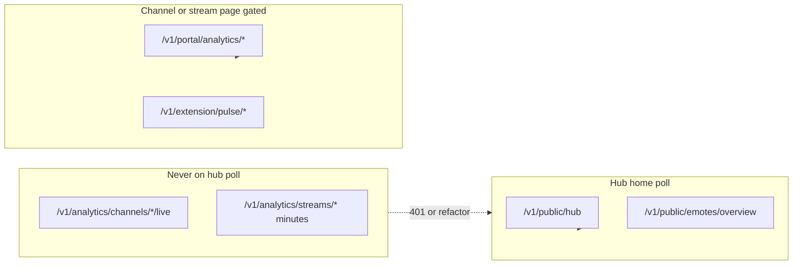

# Post-cleanup next moves: PR merge + Hub hardening

## Context (completed)

Post Phase 2 batches A–D are **done**. Prod is stable at schema **50**, VPS synced from [`streamclone-prod-sync@27a434e`](C:/Users/Aron/streamclone-prod-sync), all gates/smoke **PASS**. Clean truth benches:

- Streamclone: `C:\Users\Aron\streamclone-prod-sync`
- Pulse PR: `C:\Users\Aron\streamclone-pulse-pr`

**Do not** recreate analytics containers or enable IVR shadow.

---

## Phase 0 — Merge PR #13 (immediate)

**PR:** https://github.com/Aron-Chu/streamclone-pulse/pull/13
**Scope:** 2 files only — `publicEmotesOverview.ts` + test
**Checks:** `build` PASS; `Secret scan` FAIL with `403 Resource not accessible by integration` (gitleaks-action token scope — **not a leak**). PR state may show **UNSTABLE** until gitleaks CI is fixed.

### Actions

1. Merge via GitHub (merge commit per repo convention):

```powershell
gh pr merge 13 --repo Aron-Chu/streamclone-pulse --merge --delete-branch=false
```

**Branch protection:** If merge is **blocked** by required checks, do **not** admin-bypass unless explicitly approved. Instead: fix gitleaks workflow permissions (see step 3) and re-run checks, or mark the secret-scan check non-required until fixed.

2. Verify merge on `origin/master`; confirm diff contained only the two files.

3. **Follow-up (non-blocking but recommended before next PR):** fix gitleaks permissions on PR workflows (grant `pull-requests: read` or pin a working gitleaks config) so future PRs report cleanly instead of 403 UNSTABLE.

4. **Pages deploy is separate** — merging does not auto-deploy `streampulse.stream`. Defer Pages until Option 3 hardening PR is ready unless user requests hotfix deploy of fallback-only lib.

---

## Phase 1 — Branch dirty WIP (non-destructive, before hub work)

Preserve creative WIP without touching truth benches. **No** `reset --hard`, `clean`, or stash drops.

### Streamclone (`C:\Users\Aron\twitch-7tv-clone`)

**Preferred:** create a clean worktree and copy WIP files — avoids stash pitfalls with untracked migrations.

```powershell
cd C:\Users\Aron\twitch-7tv-clone
git fetch origin
git worktree add -b feat/public-emotes-materializer C:\Users\Aron\streamclone-materializer origin/master
```

Copy from dirty checkout into the worktree (PowerShell example — adjust if paths differ):

```powershell
$src = 'C:\Users\Aron\twitch-7tv-clone'
$dst = 'C:\Users\Aron\streamclone-materializer'
Copy-Item "$src\internal\analytics\public_emote_materialization_status.go" "$dst\internal\analytics\" -ErrorAction SilentlyContinue
Copy-Item "$src\internal\analytics\public_emote_materialization_status_test.go" "$dst\internal\analytics\" -ErrorAction SilentlyContinue
Copy-Item "$src\internal\analytics\public_emote_provider_materializer.go" "$dst\internal\analytics\" -Force
Copy-Item "$src\internal\analytics\public_emotes_overview.go" "$dst\internal\analytics\" -Force
Copy-Item "$src\migrations\000051_*" "$dst\migrations\" -ErrorAction SilentlyContinue
Copy-Item "$src\migrations\000052_*" "$dst\migrations\" -ErrorAction SilentlyContinue
Copy-Item "$src\migrations\000053_*" "$dst\migrations\" -ErrorAction SilentlyContinue
Copy-Item "$src\migrations\000054_*" "$dst\migrations\" -ErrorAction SilentlyContinue
cd $dst
git status --short
# commit when Option 1 batch starts — not in this plan
```

**Alternative (only if copy is impractical):** stash **including untracked** (`-u`), then branch:

```powershell
git stash push -u -m "wip-materializer-051-054" -- `
  internal/analytics/public_emote_materialization_status.go `
  ... # same paths as above
git switch -c feat/public-emotes-materializer origin/master
git stash pop
```

Note: plain `git stash push -- <paths>` **without `-u` skips untracked files** — most 051–054 migrations and status files are untracked today.

Also copy separately: `packages/analytics-console/` → future `feat/analytics-console-package` or fold into hub branch.

### Streamclone-pulse (`C:\Users\Aron\streamclone-pulse`)

Create branch **`feat/analytics-hub-wip`** from **`origin/master`** (after PR #13 merge) using a **new worktree** — do not reset dirty main checkout:

```powershell
cd C:\Users\Aron\streamclone-pulse
git fetch origin
git worktree add -b feat/analytics-hub-wip C:\Users\Aron\streamclone-pulse-hub origin/master
```

Copy or selectively bring untracked hub WIP from the dirty checkout into the worktree (preferred over `stash pop` for large untracked trees). Target paths:

- [`streampulse-web/src/routes/dashboard/Home.tsx`](C:/Users/Aron/streamclone-pulse/streampulse-web/src/routes/dashboard/Home.tsx)
- [`streampulse-web/src/ui/components/analytics/`](C:/Users/Aron/streamclone-pulse/streampulse-web/src/ui/components/analytics/)
- [`streampulse-web/src/ui/components/hub/`](C:/Users/Aron/streamclone-pulse/streampulse-web/src/ui/components/hub/)
- hooks: `usePublicHubData.ts`, hub tests, tailwind/tokens
- **Exclude** from this branch: `GlobalEmotes.tsx`, emoteverse prototypes, extension VOD/recap (`src/vod/`, recap UI)

Dirty main checkout stays as-is for extension WIP (`feat/extension-vod-recap` later).

---

## Phase 2 — Option 3: Analytics Hub hardening (audit-first)

**Goal:** Ensure hub/chart pages never expose raw stream timelines to unauthenticated users; prefer portal/gated routes. **Out of scope:** migrations 051+, materializer, Global Emotes page, analytics container recreate, IVR shadow.

### Endpoint policy (from [`docs/website-portal/design.md`](C:/Users/Aron/streamclone-pulse/docs/website-portal/design.md))

| Allowed on hub (public / aggregate) | Requires beta key (`apiClient({ gated: true })`) | Forbidden on hub live poll |
|-------------------------------------|--------------------------------------------------|----------------------------|
| `GET /v1/public/hub` | `GET /v1/portal/analytics/streams/{id}[/summary\|/sync/status\|/minutes]` | Raw `GET /v1/analytics/streams/{id}` minute/timeline during poll |
| `GET /v1/public/emotes/overview` | `GET /v1/pulse/watchlist`, portal channel helpers | `GET /v1/analytics/channels/{login}/live` without auth |
| Aggregate readiness: `/v1/analytics/top100/readiness`, `/v1/analytics/top-roster/readiness` (allowlisted aggregate ops endpoints) | **Prefer `/v1/portal/analytics/*` everywhere in `streampulse-web`** | Full-stream `window=full` on hub home poll |

**Raw `/v1/analytics/streams/*` policy (website):** `streampulse-web` should **prefer `/v1/portal/analytics/*`** for chart/stream data. Any raw `/v1/analytics/streams/*` or `/v1/analytics/channels/*/live` call must be (a) behind `apiClient({ gated: true })`, (b) on explicit user navigation to a channel/stream page — never on hub home poll — and (c) **justified in the PR** with an allowlist comment if portal route is unavailable.



### Audit steps (in `feat/analytics-hub-wip` worktree)

1. **Static grep inventory** — fail if new violations without explicit allowlist comment:

```bash
rg '/v1/analytics/' streampulse-web/src --glob '!**/*.test.*'
rg 'gated:\s*false' streampulse-web/src
rg 'getAnalyticsStream|/streams/.*/minutes' streampulse-web/src
```

2. **`origin/master` today vs hub WIP target:** On current `origin/master`, `streampulse-web` does **not** ship `publicHub.ts`, `useAnalyticsHubData.ts`, `streamcloneAnalytics.ts`, or `portalAnalytics.ts` — hub analytics is mostly local untracked WIP. The hardening batch should **introduce** these modules (or equivalents) wired through [`apiClient`](C:/Users/Aron/streamclone-pulse/streampulse-web/src/lib/apiClient.ts) with portal paths first. After PR #13 merge, `publicEmotesOverview.ts` lands on master; hub public data should use `/v1/public/hub` and gated portal routes — not raw stream timelines on poll.

3. **Add gated client module** (`portalAnalytics.ts` or `streamcloneAnalytics.ts`) — single choke point for chart/stream calls using `apiClient(path, { gated: true })` and `/v1/portal/analytics/*` first per [`docs/website-portal/tasks.md`](C:/Users/Aron/streamclone-pulse/docs/website-portal/tasks.md) API-007.

4. **Route guards** — confirm [`guards.tsx`](C:/Users/Aron/streamclone-pulse/streampulse-web/src/routes/guards.tsx) blocks dashboard analytics routes without beta key; hub home remains usable with public endpoints only.

5. **Tests**
   - Unit: assert hub data hooks never construct raw `/v1/analytics/streams/` URLs (allowlist readiness endpoints).
   - Vitest for any new `portalAnalytics` / `streamcloneAnalytics` helpers.
   - Optional Playwright: hub home load does not request raw stream minutes (network allowlist).

### Hosted verification (read-only, no backend deploy)

From [`streamclone-prod-sync`](C:/Users/Aron/streamclone-prod-sync):

```bash
bash scripts/pulse-hosted-boundary-smoke.sh
```

Authenticated smoke (VPS beta key — **never log the key**). Inline one-liner; do **not** depend on untracked `scripts/tmp/` helpers:

```bash
# WSL / bash from streamclone-prod-sync
source scripts/lib/bearhost-ssh.sh
raw="$(bearhost_ssh "grep -E '^PULSE_BETA_KEYS=' /etc/streamclone/secrets/pulse-beta.env | head -1")"
export PULSE_BETA_KEY="${raw#PULSE_BETA_KEYS=}"
PULSE_BETA_KEY="${PULSE_BETA_KEY%%,*}"
PULSE_BETA_KEY="${PULSE_BETA_KEY#\"}"
PULSE_BETA_KEY="${PULSE_BETA_KEY%\"}"
bash scripts/pulse-hosted-boundary-smoke.sh
```

Optional follow-up: commit a redaction-safe wrapper as `scripts/pulse-hosted-boundary-smoke-auth.sh` on `origin/master` so agents do not recreate ad-hoc tmp scripts.

Manual browser check (beta login on portal):

- `/analytics` hub loads without 401 spam in network tab for unauthenticated session
- Direct `https://api.streampulse.stream/v1/analytics/streams/{id}` returns **401** without beta key (already proven in smoke)

### Deliverable

One focused PR from `feat/analytics-hub-wip` → `master`:

- Audit report in PR description (grep results + allowlist)
- Code fixes for any raw timeline usage on hub poll paths
- Tests green; **no** GlobalEmotes, **no** 051+, **no** backend schema changes

---

## Explicitly deferred

| Item | When |
|------|------|
| **Option 1 Full Global Emotes** | Deliberate batch: `feat/public-emotes-materializer`, migrations 051+, API deploy, real aggregate 200 data, Pages deploy |
| **IVR shadow** | HOLD — separate approval + zero `chat_source='ivr'` gate |
| **Analytics recreate / `bearhost-pulse-api.sh`** | Only if gate/smoke prove code drift — ask first |
| **`packages/analytics-console/` landing** | After hub endpoint audit; separate from fallback merge |

---

## Success criteria

```text
PR13_MERGED=YES
GITLEAKS_CI_FOLLOWUP=OPEN
WIP_BRANCHES=feat/public-emotes-materializer + feat/analytics-hub-wip (worktrees, dirty mains preserved)
HUB_AUDIT=zero raw /v1/analytics/streams|live on hub poll paths
PORTAL_ROUTES=chart/stream pages use gated portal client
HOSTED_SMOKE=PASS (PUBLIC_BOUNDARY + CHART_CANARY)
IVR_SHADOW_CANARY=HOLD
ANALYTICS_RECREATE=NO
```
