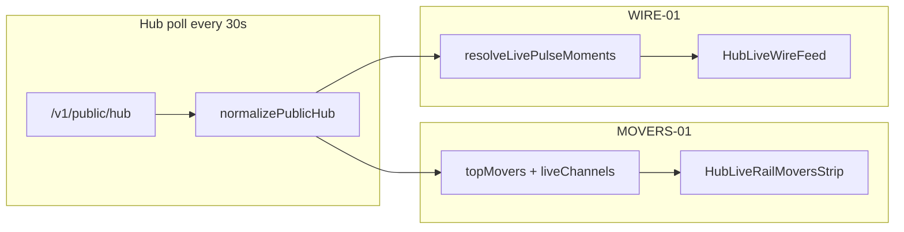

# Analytics Hub Liveness — Implementation Plan

Implementation is mostly present in the current working tree. Treat this as a **finish, verify, and trust-harden** plan, not a from-scratch build plan. Current state:

- [`HubLiveRailMoversStrip.tsx`](c:\Users\Aron\streamclone-pulse\streampulse-web\src\ui\components\analytics\HubLiveRailMoversStrip.tsx) already renders a bar leaderboard with GSAP width motion, Flip reorder support, and reduced-motion tests.
- [`HubLiveWireFeed.tsx`](c:\Users\Aron\streamclone-pulse\streampulse-web\src\ui\components\analytics\HubLiveWireFeed.tsx) already exists and is mounted in [`AnalyticsLandingPage.tsx`](c:\Users\Aron\streamclone-pulse\streampulse-web\src\routes\analytics\AnalyticsLandingPage.tsx) as `section-live-wire`.
- Remaining work is verification plus the trust-audit addendum below. Do not recreate completed components; harden the current implementation.

No backend changes — all data comes from `/v1/public/hub` via existing `usePublicHubData` (30s poll).



---

## Trust-Audit Compatibility Addendum

This plan does **not** conflict with [`issues.md`](c:\Users\Aron\twitch-7tv-clone\issues.md), but the liveness work must not make P1-004/P1-005 worse. Add these guardrails before marking `verify-all` complete:

1. **Stats fallback must be visually degraded on canonical `/analytics`.** If `hub.loadSource === 'stats-fallback'` or `hub.hubEndpointOk === false`, `AnalyticsLandingPage` must show an unmistakable degraded banner on the Figma analytics shell. Reuse `HubDataHealthBanner` or equivalent copy, but verify it appears on `/analytics`, not only the older dashboard home route.
2. **Live Wire must animate only true network feed rows.** Keep `NEW` badges and `gsap.from` enter motion limited to `livePulseFeed.source === 'network'` and `motionEnabled === true`. `featured_fallback`, `legacy_fallback`, `empty`, cache-only, or stats-fallback hub data must render static/degraded copy and must not imply live cadence.
3. **Movers must not hide hub degradation.** The movers leaderboard may animate backend-provided `topMovers`, but when the hub endpoint is degraded the surrounding page must explain that live hub data is partial. Do not label roster-live or metadata-only channels as actively tracked.
4. **Live language must stay poll-based.** Copy may say "detected in the last {window}" or "snapshot". Do not use "real-time", websocket-style wording, or fresh/live badges for fallback/demo/session-derived data.
5. **Hosted moments smoke belongs in final verification.** After liveness UI is green locally, run a hosted `/v1/public/hub/moments` smoke or document why it could not be run. This guards against a lively-looking feed while bucket/table rows are stale or partially enriched.

Add or update tests for these cases:

- `/analytics` with `/v1/public/hub` failing but `/v1/public/stats` succeeding shows degraded copy and does not present Live Wire as network cadence.
- `HubLiveWireFeed` fallback sources never render `NEW` and never call GSAP enter animation.
- E2E console-error guard is clean; fix the known React `fetchPriority` warning before relying on the honesty/parity specs as signal.

---

## MOVERS-01: Top Emote Movers leaderboard race

### 1. Rewrite `HubLiveRailMoversStrip.tsx`

Keep exported signature `{ movers: HubMover[]; loading?: boolean }`.

**Layout (vertical leaderboard, backend order preserved — no client sort):**

| Element | Source |
|---------|--------|
| Rank | `index + 1` |
| Avatar | existing `Avatar` primitive |
| Name | `displayName \|\| login` |
| Bar width | `emotesPerMin / max(emotesPerMin in set)`, min ~8% clamp |
| Metric label | `formatMoverVelocity(mover).emoteLabel` |
| Trend chip | reuse [`MomentumBadge`](c:\Users\Aron\streamclone-pulse\streampulse-web\src\ui\components\analytics\MomentumBadge.tsx) with `classPrefix="hub-live-rail-movers__trend"` and `hasSignal={mover.trendSignal}` |
| Rank delta | `▲N` / `▼N` from prev vs current index keyed by `login` (presentation only) |

**Motion (`useAnalyticsMotion`):**

- On `movers` change: `gsap.to(bar, { width, duration: 0.5, ease: 'power2.out' })`.
- Reorder: GSAP Flip (`import { Flip } from 'gsap/Flip'`) — capture state on container ref before DOM update, `Flip.from(state, { duration: 0.45, ease: 'power3.out' })` after.
- Track `prevRankByLogin` + `prevMaxRef` in refs; skip all GSAP when `motionEnabled === false`.
- Loading skeleton: 4–6 shimmer rows with bars at 0 width.

Preserve: `aria-label="Top emote movers"`, each row is `<Link to={/analytics/${login}}>`, `title` tooltip with emote + chat rates.

### 2. Optional FLIP helper in `useAnalyticsMotion.tsx`

Add `flipReorder(container: HTMLElement | null)` that registers Flip once and no-ops when `!motionEnabled`. Keeps motion logic centralized; strip calls it from a `useLayoutEffect` keyed on `movers`.

### 3. Replace CSS block in `figma-analytics.css` (~L2547)

Replace `.hub-live-rail-movers*` pill styles with leaderboard BEM:

- `.hub-live-rail-movers__list` — vertical stack
- `.hub-live-rail-movers__row` — grid/flex row (rank · avatar · name · bar track · metric · trend)
- `.hub-live-rail-movers__bar-track` / `__bar-fill` — use `--fma-panel`, `--fma-border`, `--sp-accent` for fill
- `.hub-live-rail-movers__rank-delta` — subtle green/red using `--fma-green` / `--fma-red`
- Trend modifiers: `--up`, `--down`, `--flat`, `--none` (mirror `.figma-live-rail__trend` pattern at L2543–2545)
- Skeleton: shimmer on row + empty bar track

### 4. Unit tests — new `tests/hubLiveRailMovers.test.tsx`

```tsx
// Wrap in MemoryRouter + AnalyticsThemeProvider
// Mock gsap + Flip; assert gsap.to / Flip.from called on reorder, not when motion disabled
```

Assertions:

- Rows render in **given array order** (not re-sorted)
- Bar fill `style.width` proportional to `emotesPerMin` (e.g. 400 vs 200 → 100% vs 50%)
- Trend chip reflects `trendPct` sign via `MomentumBadge`
- `motionEnabled=false` (override `matchMedia` to `prefers-reduced-motion: reduce`) → no GSAP calls

---

## WIRE-01: Live Wire moments feed

### 1. New `HubLiveWireFeed.tsx`

**Props (mirror PulseMomentsLivePanel feed pattern):**

```ts
interface HubLiveWireFeedProps {
  hub: PublicHub
  feed: LivePulseMomentsResult  // from resolveLivePulseMoments
  activityWindow?: PublicHubActivityWindow
  loading?: boolean
}
```

**Data pipeline:**

1. `enrichPulseMomentRows(feed.moments, { liveChannels, categoryByLogin })` — reuse [`pulseMomentRow.ts`](c:\Users\Aron\streamclone-pulse\streampulse-web\src\lib\pulseMomentRow.ts)
2. Sort newest-first via existing `compareMomentsChronologically` from [`figmaSessionAnalytics.ts`](c:\Users\Aron\streamclone-pulse\streampulse-web\src\lib\figmaSessionAnalytics.ts)
3. **Noise control (display only):** dedupe by `login` within ~10 min window (keep newest); cap visible list to **10**; cap **3** enter-animations per poll
4. Stable keys: `momentRowKey(moment)`

**Card content per row:**

- Kind chip: map `chat_spike` → "Chat spike", `emote_spike` → "Emote spike", `stream_opening` → "Just went live" (reuse lucide icons pattern from [`MomentsFeed.tsx`](c:\Users\Aron\streamclone-pulse\streampulse-web\src\ui\components\analytics\MomentsFeed.tsx))
- Avatar + display name + category
- Headline: `label` + strongest metric (`chatPerMin` or `emotesPerMin` via `compact`)
- Up to 3 `topEmotes` via `EmoteImg` + `buildEmoteLookupFromMoments`
- Relative time from `at` — `setInterval(1000)` tick, cleared on unmount
- Link: `moment.href` (already built by `mapHubPulseMoment`)

**Motion (only when `feed.source === 'network'` AND `motionEnabled`):**

- Ref `seenKeys: Set<string>` — on poll, keys not in set are "new"
- `gsap.from(el, { height: 0, opacity: 0, y: -8, duration: 0.4, ease: 'power3.out' })` for new rows only
- Brief "NEW" pulse class (CSS animation, disabled under reduced motion)

**Fallback / empty states:**

| `feed.source` | Behavior |
|---------------|----------|
| `network` | Live cadence label + enter animations |
| `featured_fallback` / `legacy_fallback` | Static list + `feed.banner` copy; no "NEW" pulse |
| `empty` | Honest empty reason from `EMPTY_REASONS` map (copy from [`PulseMomentsLivePanel.tsx`](c:\Users\Aron\streamclone-pulse\streampulse-web\src\ui\components\analytics\PulseMomentsLivePanel.tsx) L50–60 keyed on `feed.reason`) |

**Header copy:** `Live wire · detected in the last {activityWindow}` — never "real-time".

### 2. CSS — new `.hub-live-wire*` block in `figma-analytics.css`

Panel using `--fma-panel`, `--fma-border`, `--fma-muted`, `--fma-mono`. Card list with compact emote chips. `@media (prefers-reduced-motion: reduce)` disables NEW pulse keyframes.

### 3. Wire into `AnalyticsLandingPage.tsx`

Insert after `section-live-rail` (L348), before `section-network` (L350):

```tsx
<SectionReveal id="section-live-wire">
  <HubLiveWireFeed
    hub={data}
    feed={livePulseFeed}
    activityWindow={activityWindow}
    loading={loadingInitial}
  />
</SectionReveal>
```

`livePulseFeed` is already computed at L87. Add sidebar anchor in `sidebarSections` (L254–263): `{ id: "section-live-wire", label: "Live Wire" }` between live rail and network — keeps hub nav honest without touching `commandCenterLabels.ts`.

### 4. Unit tests — new `tests/hubLiveWireFeed.test.tsx`

Mock `livePulseMoments` fixtures (pattern from [`hubUxMock.ts`](c:\Users\Aron\streamclone-pulse\streampulse-web\tests\e2e\helpers\hubUxMock.ts) L179+):

- Cards render newest-first with correct `href`, kind chips, emote images
- Re-render with one new moment → enter animation invoked for new key only
- `motionEnabled=false` → no `gsap.from`
- `source: 'featured_fallback'` → banner shown, no NEW badge
- Empty feed → empty-reason copy

---

## Verification (definition of done)

Run after each task, then both together:

```bash
cd streampulse-web
npm run typecheck
npm test
npm run test:e2e -- tests/e2e/analytics-hub-metrics-honesty.spec.ts tests/e2e/analytics-figma-parity.spec.ts --workers=1
```

Hosted bucket smoke after local checks pass:

```bash
curl -fsS "https://api.streampulse.stream/v1/public/hub/moments?activityWindow=24h&limit=10" | jq '{status, reason, count:(.moments|length), first:.moments[0]}'
```

Manual (`npm run dev:hosted` → `/analytics`):

- Movers bars resize and rows FLIP on mock reorder (devtools: tweak hub mock or wait for poll)
- Live Wire shows new moment slide-in at top on poll
- Force or mock stats-fallback (`hubEndpointOk: false`, `loadSource: 'stats-fallback'`) and confirm canonical `/analytics` shows degraded copy; Live Wire should be static/snapshot/empty, not "NEW" animated
- OS "reduce motion" → static final state, no GSAP

Mark checkboxes in [`analytics-hub-liveness-tasks.md`](c:\Users\Aron\streamclone-pulse\docs\website-portal\analytics-hub-liveness-tasks.md) only after all criteria pass.

---

## Guardrails (do not violate)

- **No client-side scoring/ranking** — preserve backend `movers` order; moments from `livePulseMoments` only
- **No "Pulse Wire"** product resurrection — name is "Live Wire", metrics feed only
- **Honest timing** — poll-based labels, relative "ago" timestamps
- **Honest fallback state** — stats-fallback/cache/fallback feeds are degraded or static; never animate them like network-live data
- **Narrow diff** — only files listed in task doc + sidebar entry in same landing page file
- **No `rgba(255,255,255,…)` card backgrounds** — use `--sp-surface-*` / `--fma-panel` tokens

## Risk notes

- E2E [`analytics-hub-ux.spec.ts`](c:\Users\Aron\streamclone-pulse\streampulse-web\tests\e2e\analytics-hub-ux.spec.ts) expects `.hub-live-rail-movers` visible — **keep root class name**
- [`analyticsLandingPage.test.tsx`](c:\Users\Aron\streamclone-pulse\streampulse-web\tests\analyticsLandingPage.test.tsx) asserts Live Activity precedes Pulse Moments — Live Wire inserts **before** `section-network` but inside the same page flow; existing ordering test should remain valid
- GSAP Flip in jsdom: mock in unit tests; manual/e2e validates real motion
- Trust audit: P1-005 is the main conflict risk. If the new liveness sections render during `stats-fallback` without degraded copy, the feature becomes misleading even if the components are technically correct.
