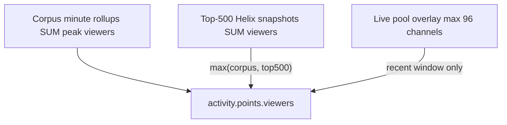
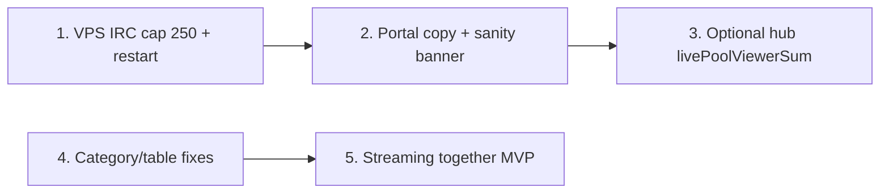

# Hub metrics honesty, IRC cap 250, streaming together MVP

## Why the chart looks wrong today

Three different numbers are being mixed in the UI:

| Metric | What it actually is | Typical hosted value |
|--------|---------------------|----------------------|
| **`corpus.streamsTracked`** (~14.6K) | Lifetime/historical streams in corpus | **Not** “live right now” |
| **`poolSize`** (~494) | Currently live streams in bounded live pool (cap **96** for rollup joins) | Live **now** |
| **`corpusPipeline.collectorActive`** (~500) | IRC websocket tracks (CPU-heavy) | Live IRC cap |
| **Chart peak viewers** (~491K earlier / ~47K now) | Peak **minute** sum from corpus rollups, merged with Top-500 Helix snapshots when higher | Time-varying; **not** `500 × avg CCU` |

**40–47K viewers with ~500 IRC channels is mathematically plausible** (~80–100 avg CCU per contributing stream). The bigger UX bug is copy that implies “14.6K live tracked” or “500 live = 500× big streamers.”

Backend pipeline ([`hub_overview.go`](c:\Users\Aron\twitch-7tv-clone\internal\analytics\hub_overview.go)):



Chat line = IRC/verified only. Viewer line = corpus + optional Top-500 boost ([`finalizeHubActivityViewers`](c:\Users\Aron\twitch-7tv-clone\internal\analytics\hub_overview.go)).

[`publicHub.ts`](c:\Users\Aron\streamclone-pulse\streampulse-web\src\lib\publicHub.ts) already warns when `peakActivityViewers < 0.75 × sum(liveChannels.viewers)` — we should surface that in UI instead of hiding it.

---

## Phase 1 — VPS: top-250 live IRC (operator, Tailscale)

**You apply on VPS** (streampulse-ops); agent cannot SSH from here.

1. Tailscale SSH to production host (see [`docs/laptopworker-dev.md`](c:\Users\Aron\twitch-7tv-clone\docs\laptopworker-dev.md) / streampulse-ops runbooks).
2. Edit analytics env overlay — use [`deploy/env/profile-hosted-pulse-live-250.env.example`](c:\Users\Aron\twitch-7tv-clone\deploy\env\profile-hosted-pulse-live-250.env.example):

```bash
PULSE_MAX_ACTIVE_CHANNELS=250
PULSE_TOP500_ADMISSION_TOP_N=250
PULSE_TOP500_ADMISSION_ENABLED=true
PULSE_TOP500_ADMISSION_SOURCE=helix_top_live
```

3. **Recreate analytics** (required — in-memory 495 tracks won’t drop until restart):

```bash
docker compose up -d --force-recreate analytics
```

4. Verify:

```bash
curl -sS https://api.streampulse.stream/v1/public/hub \
  | jq '.corpusPipeline | {state, maxActiveIrcChannels, liveAdmissionTopN, collectorActive, collectorMax}'
```

Full steps: [`docs/agent-notes/hosted-irc-cap-250-2026-07.md`](c:\Users\Aron\twitch-7tv-clone\docs\agent-notes\hosted-irc-cap-250-2026-07.md).

**Local portal** (`http://localhost:5173/analytics`): ensure [`streampulse-web/.env.development.local`](c:\Users\Aron\streamclone-pulse\streampulse-web) points at `https://api.streampulse.stream` (not `localhost:8090`) unless intentionally debugging local stack.

---

## Phase 2 — Portal: honest Live Activity + tracked-channel labels

**Goal:** Never label `streamsTracked` as “live tracked”; show a compact legend users can sanity-check.

### Copy / KPI fixes ([`streampulse-web`](c:\Users\Aron\streamclone-pulse\streampulse-web))

| File | Change |
|------|--------|
| [`HubCommandHeader.tsx`](c:\Users\Aron\streamclone-pulse\streampulse-web\src\ui\components\analytics\HubCommandHeader.tsx) | Rename KPIs: **“Live in pool”** (poolSize), **“Corpus streams”** (streamsTracked). Fix peak-viewers tooltip — currently says “tracked live pool” but backend is **corpus-wide + Top-500** (lines 42–43). |
| [`FigmaGlobalActivityPanel.tsx`](c:\Users\Aron\streamclone-pulse\streampulse-web\src\ui\components\analytics\FigmaGlobalActivityPanel.tsx) | Replace ambiguous lede with explicit legend, e.g. **“Peak concurrent viewers (corpus rollups + Top-500 Helix when higher) · {poolSize} live in pool · {collectorActive}/{collectorMax} on IRC · {streamsTracked} corpus streams total”**. |
| [`LiveChannelsMatrix.tsx`](c:\Users\Aron\streamclone-pulse\streampulse-web\src\ui\components\analytics\LiveChannelsMatrix.tsx) | Header: distinguish **live pool** vs **IRC slots** vs **roster live** (`coverage.liveChannels` / `corpusPipeline.roster.live`). |
| [`CollectorHealthChip`](c:\Users\Aron\streamclone-pulse\streampulse-web\src\ui\components\analytics\FigmaGlobalActivityPanel.tsx) | After cap change, chip should read **collecting/expected** against **250**; clarify “81/103” means **IRC-collecting live rows**, not 500. |

### Sanity-check banner (new)

When [`validatePublicHub`](c:\Users\Aron\streamclone-pulse\streampulse-web\src\lib\publicHub.ts) emits `activity_viewers_below_live_pool`, show a non-alarming banner on Live Activity:

> “Chart peak is lower than the sum of live pool viewer counts — corpus viewer rollups may be sparse for this window; chat/emote lines require active IRC.”

Optionally show **live pool viewer sum** next to peak stat: `sum(hub.liveChannels[].viewers)` computed client-side (already used in validation).

### Tests

- Update [`hubActivitySummary.test.ts`](c:\Users\Aron\streamclone-pulse\streampulse-web\tests\hubActivitySummary.test.ts), [`coverageTrustCopy.test.tsx`](c:\Users\Aron\streamclone-pulse\streampulse-web\tests\coverageTrustCopy.test.tsx), [`analyticsLandingPage.test.tsx`](c:\Users\Aron\streamclone-pulse\streampulse-web\tests\analyticsLandingPage.test.tsx) for new copy.

---

## Phase 3 — Backend: optional hub fields for UI (small, hosted-safe)

Add to [`HubCoverage`](c:\Users\Aron\twitch-7tv-clone\internal\analytics\hub_overview.go) or activity block (aggregate-only, no PII):

- `livePoolViewerSum` — sum of `buildHubLiveChannels` viewer counts
- `peakViewersAt` — timestamp of max activity point (helps explain 491K vs 47K = different times)

Wire through [`publicHub.ts`](c:\Users\Aron\streamclone-pulse\streampulse-web\src\lib\publicHub.ts) normalizer. Keeps portal honest without guessing.

**Investigate degraded Top-500 merge** if post-250 restart still shows low peaks during prime time: check `top500_live_snapshots` freshness (`metadataSampledAgoSeconds` on hub) — separate ops ticket if sampler stale.

---

## Phase 4 — Category / games loading (finish prior table work)

Continue uncommitted fixes from prior session (verify on `localhost:5173/analytics`):

- [`MostReactedMinutesTable.tsx`](c:\Users\Aron\streamclone-pulse\streampulse-web\src\ui\components\analytics\MostReactedMinutesTable.tsx): no `"Live now"` fallback; wall-clock time; compact chat column
- [`PulseMomentsLivePanel.tsx`](c:\Users\Aron\streamclone-pulse\streampulse-web\src\ui\components\analytics\PulseMomentsLivePanel.tsx): category enrichment from `hub.liveChannels` (already in `allMoments` map)
- [`LiveChannelsMatrix.tsx`](c:\Users\Aron\streamclone-pulse\streampulse-web\src\ui\components\analytics\LiveChannelsMatrix.tsx): show `—` when `category` empty; title tooltip with full game name

Root cause for empty category: Helix `game_name` missing or stale in `top500_current` / `analytics_streams.category` — collector + metadata sampler must keep writing category ([`buildHubLiveChannels`](c:\Users\Aron\twitch-7tv-clone\internal\analytics\hub_overview.go) lines 789–839).

---

## Phase 5 — Streaming together MVP (badge + host category)

**Scope (your choice):** detect together state; show badge; category/game from **primary/host** stream. **No** global viewer dedupe yet.

### Research spike (1 session)

1. Capture Helix + GQL payloads for a known together stream (e.g. cucurucho) — check `tags`, title patterns, GQL `stream` fields beyond current [`MetadataChannelOperation`](c:\Users\Aron\twitch-7tv-clone\internal\upstream\operations.go).
2. Document stable signal in `docs/agent-notes/streaming-together-detection-2026-07.md`.

### Backend (streamclone)

- Extend [`LiveStream`](c:\Users\Aron\twitch-7tv-clone\internal\analytics\helix.go) / top500 snapshot with optional:
  - `streamTogether bool` (or `collaborationType`)
  - `primaryLogin` / `hostLogin` when detectable
- Persist lightweight fields on `top500_current` or `analytics_streams` (new nullable columns via forward migration).
- In [`buildHubLiveChannels`](c:\Users\Aron\twitch-7tv-clone\internal\analytics\hub_overview.go): if together + host known, set `category` from host’s `game_name`; expose `togetherWith?: string[]` on `HubLiveChannel`.

### Portal (streampulse-web)

- [`LiveChannelsMatrix.tsx`](c:\Users\Aron\streamclone-pulse\streampulse-web\src\ui\components\analytics\LiveChannelsMatrix.tsx) + channel rail: badge **“Streaming together”** with tooltip listing collaborators.
- Pulse Moments table: use host category when moment row is together-guest.

---

## Deployment order



1. **Ops first** — CPU relief + collectorMax=250 visible on hub.
2. **Portal deploy** (Cloudflare Pages) — copy fixes; no backend required for Phase 2 alone.
3. **Backend tag** — hub fields + streaming together fields when ready.

---

## Success criteria

- Hub shows `collectorMax: 250`, `collectorActive ≤ 250`, pipeline state improving.
- Live Activity lede never equates 14.6K corpus streams with “live tracked.”
- User can see **peak viewers**, **live pool size**, **IRC active/max**, and **corpus streams** as separate facts.
- Together streams show badge + correct game/category from host (cucurucho case).
- Pulse Moments category/time/table layout fixes visible on `/analytics` after portal rebuild.
