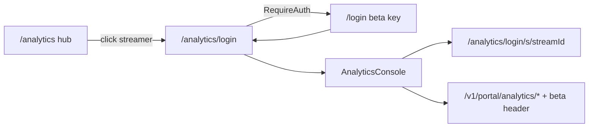

# Hub cleanup, P4 verify, and corpus audit (amended)

## Verdict

Good direction. **Amended** per review: do not regress the hosted boundary, do not overwrite working P4 code, continue the existing worktree diff.

| Guardrail | Rule |
|-----------|------|
| **Portal boundary** | Chart/detail/minutes/live/streams reads stay on **`/v1/portal/analytics/*`**. Never switch reads back to raw `/v1/analytics/streams/*`. |
| **P4 status** | Already wired on `feat/hub-activity-ship` base (`8347712`). Phase 2 = **verify/fill gaps**, not create adapter/routes. |
| **IVR** | Separate Track B ops. This plan cleans hub + P4 UX only; **does not enable IVR**. |
| **Worktree** | Start from existing uncommitted diff in [`streamclone-pulse-pages`](C:/Users/Aron/streamclone-pulse-pages) on branch `feat/hub-activity-ship`. |

---

## Phase 0 — Inspect and continue current diff

**Do not** reset into a new clean worktree unless intentionally starting over.

Current state (2026-06-28):

- Branch: `feat/hub-activity-ship` @ `8347712`
- Uncommitted hub WIP: `Home.tsx`, `HubActivityRangeTabs.tsx`, `HubRail.tsx`, `hub.css`, `publicHub.ts`, `vite.config.ts`, tests
- **Already committed on branch:** P4 portal adapter + hook + routes + tests

| Asset | Path | Status |
|-------|------|--------|
| Portal adapter | [`streamcloneAnalytics.ts`](C:/Users/Aron/streamclone-pulse-pages/streampulse-web/src/lib/streamcloneAnalytics.ts) | Uses `/v1/portal/analytics/*`; `assertPortalChartPath` rejects raw `/v1/analytics/streams` |
| Path helpers | [`portalAnalytics.ts`](C:/Users/Aron/streamclone-pulse-pages/streampulse-web/src/lib/portalAnalytics.ts) | `PORTAL_ANALYTICS_PREFIX = '/v1/portal/analytics'` |
| Console hook | [`usePortalAnalyticsConsoleApi.ts`](C:/Users/Aron/streamclone-pulse-pages/streampulse-web/src/hooks/usePortalAnalyticsConsoleApi.ts) | Called from [`ChannelAnalyticsPage.tsx`](C:/Users/Aron/streamclone-pulse-pages/streampulse-web/src/routes/analytics/ChannelAnalyticsPage.tsx) |
| Session route | [`routes/index.tsx`](C:/Users/Aron/streamclone-pulse-pages/streampulse-web/src/routes/index.tsx) | `/analytics/:login/s/:streamId` + `/analytics/:login` under `RequireAuth` |
| Boundary tests | [`portalAnalytics.test.ts`](C:/Users/Aron/streamclone-pulse-pages/streampulse-web/tests/portalAnalytics.test.ts), [`streamcloneAnalytics.test.ts`](C:/Users/Aron/streamclone-pulse-pages/streampulse-web/tests/streamcloneAnalytics.test.ts) | Forbid raw stream paths |
| Range tabs | [`HubActivityRangeTabs.tsx`](C:/Users/Aron/streamclone-pulse-pages/streampulse-web/src/ui/components/hub/HubActivityRangeTabs.tsx) | Wired in uncommitted `Home.tsx` |

**First agent action:** `git diff` + read existing files before editing. Extend diff; do not replace working P4 modules.

---

## What you reported vs root cause (corrected)

| Symptom | Root cause |
|---------|------------|
| **Top movers, no PFP** | Prod API may lack deployed mover Helix enrich; card shows initials. **Remove or hide** until backend avatars ship — do not block on Helix for hub UX. |
| **"Corpus pipeline" is just text** | Triple redundancy: section `<h2>` in uncommitted [`Home.tsx`](C:/Users/Aron/streamclone-pulse-pages/streampulse-web/src/routes/dashboard/Home.tsx), internal heading in [`CorpusPipelineCard.tsx`](C:/Users/Aron/streamclone-pulse/streampulse-web/src/ui/components/analytics/CorpusPipelineCard.tsx), plus [`CoverageHealthList`](C:/Users/Aron/streamclone-pulse/streampulse-web/src/ui/components/hub/HubRail.tsx) in rail. Data is real ops signal — wrong **placement** for search-first hub. |
| **Click streamer doesn't open full analytics** | P4 **code exists** but may fail in prod due to: (1) Pages not deployed with latest branch; (2) missing beta key → `/login` redirect; (3) [`analyticsLinks.ts`](C:/Users/Aron/streamclone-pulse-pages/streampulse-web/src/lib/analyticsLinks.ts) still builds `/analytics/{login}/streams/{id}` while console uses `/s/{id}`; (4) no legacy redirect for `/streams/` path. **Not** missing adapter — verify deploy + link parity. |
| **Trend / gaps / IVR / Gold** | Chart gaps = missing rollup minutes (collector deficit, sync in progress). **IVR off on prod** (GQL-only Gold). Hub long-window series uses corpus aggregate + 240-point cap. Gold queue depth is live backend state — **do not hardcode example counts in audit docs**. |

Target UX for `/analytics/{login}`: full `@streamclone/analytics-console` (sync rail, stream picker, minute chart) per [design doc](C:/Users/Aron/streamclone-pulse/docs/design/streampulse-analytics-hub-design.md).



---

## Phase 1 — Hub UX

**Worktree:** continue [`streamclone-pulse-pages/streampulse-web`](C:/Users/Aron/streamclone-pulse-pages/streampulse-web).

### 1.1 Remove or hide Top movers

- **Preferred:** delete rail card in `Home.tsx` (~352–361).
- **Alternative:** hide card when every mover lacks `profileImageUrl` (re-show after BearHost deploys mover Helix enrich).
- Stop surfacing movers in search suggestions if card removed (keep live-channel suggestions only).
- Update [`analyticsHubEmpty.test.tsx`](C:/Users/Aron/streamclone-pulse-pages/streampulse-web/tests/analyticsHubEmpty.test.tsx).

### 1.2 Collapse ops / corpus (user choice: collapsed by default)

- **Remove** main-column `<section>` + [`CorpusPipelineCard`](C:/Users/Aron/streamclone-pulse/streampulse-web/src/ui/components/analytics/CorpusPipelineCard.tsx) from `Home.tsx`.
- Add one rail card **"Ops status"**:
  - `<details>` collapsed by default; summary = state badge + one-line issue built from live `corpusPipeline` fields (e.g. `degraded · N IRC uncovered · Gold Q queued`).
  - Expanded body: `CorpusPipelineCard` once with new `hideTitle` prop.
  - Trim [`CoverageHealthList`](C:/Users/Aron/streamclone-pulse/streampulse-web/src/ui/components/hub/HubRail.tsx): IRC + freshness in summary rail; drop duplicate Silver/Gold rows when pipeline present.
- Footer link: `View full status → /status`.

### 1.3 Verify range tabs + hub chart (already in diff)

- Confirm [`HubActivityRangeTabs`](C:/Users/Aron/streamclone-pulse-pages/streampulse-web/src/ui/components/hub/HubActivityRangeTabs.tsx) passes `activityWindow` through [`usePublicHubData`](C:/Users/Aron/streamclone-pulse/streampulse-web/src/hooks/usePublicHubData.ts).
- Smoke: `?activityWindow=24h` → `windowMinutes=1440`, `points.length=240` (not 1440 points).
- Keep combo chart + gap badge in [`HubActivityChart`](C:/Users/Aron/streamclone-pulse/streampulse-web/src/ui/components/hub/HubActivityChart.tsx).

---

## Phase 2 — P4 verify / fill gaps only

**Do not** recreate `streamcloneAnalytics.ts`, rewire to raw `/v1/analytics/*`, or overwrite [`createPortalAnalyticsApi`](C:/Users/Aron/streamclone-pulse-pages/streampulse-web/src/lib/streamcloneAnalytics.ts).

### 2.1 Boundary checklist (must pass)

- [ ] All chart/detail/minutes/live/streams reads use [`portalAnalytics.ts`](C:/Users/Aron/streamclone-pulse-pages/streampulse-web/src/lib/portalAnalytics.ts) paths only.
- [ ] [`assertPortalChartPath`](C:/Users/Aron/streamclone-pulse-pages/streampulse-web/src/lib/streamcloneAnalytics.ts) still throws on `/v1/analytics/streams`.
- [ ] [`portalAnalytics.test.ts`](C:/Users/Aron/streamclone-pulse-pages/streampulse-web/tests/portalAnalytics.test.ts) + [`streamcloneAnalytics.test.ts`](C:/Users/Aron/streamclone-pulse-pages/streampulse-web/tests/streamcloneAnalytics.test.ts) pass unchanged intent.
- [ ] [`usePortalAnalyticsConsoleApi`](C:/Users/Aron/streamclone-pulse-pages/streampulse-web/src/hooks/usePortalAnalyticsConsoleApi.ts) runs before console fetch (already in `ChannelAnalyticsPage`).
- [ ] Console styles: [`analytics-console.css`](C:/Users/Aron/streamclone-pulse-pages/streampulse-web/src/ui/components/analytics/analytics-console.css) imported on channel page (already). Add [`analytics-tailwind.css`](C:/Users/Aron/streamclone-pulse/streampulse-web/src/ui/analytics-tailwind.css) to build only if chart Tailwind classes are missing in smoke — do not duplicate if console CSS suffices.

### 2.2 Link + route gaps to fix if still broken

| Gap | Fix |
|-----|-----|
| `analyticsLinks.ts` uses `/streams/{id}` | Change to `/s/{streamId}` to match console + [`HubRail`](C:/Users/Aron/streamclone-pulse/streampulse-web/src/ui/components/hub/HubRail.tsx) recent sessions |
| Legacy `/analytics/:login/streams/:streamId` bookmarks | Add small redirect component — **not** `Navigate to="../s/:streamId"` (does not interpolate params) |

```tsx
// AnalyticsStreamsLegacyRedirect.tsx
function AnalyticsStreamsLegacyRedirect() {
  const { login = '', streamId = '' } = useParams()
  return <Navigate to={`/analytics/${encodeURIComponent(login)}/s/${encodeURIComponent(streamId)}`} replace />
}
```

Register under `RequireAuth`:

```tsx
<Route path="/analytics/:login/streams/:streamId" element={<AnalyticsStreamsLegacyRedirect />} />
```

Routes for `/s/:streamId` and `/:login` **already exist** — do not duplicate.

### 2.3 Verify channel page end-to-end

- Beta key on `/login` (or extension options) before testing.
- Pass: `/analytics` → search or click live row → `/analytics/ludwig` shows stream sidebar + sync panel + chart.
- Fail signals: redirect to login (no key), blank console (CSS), 401 on portal paths (key/backend), wrong route (link parity).

---

## Phase 3 — Ship + smoke

```bash
cd streamclone-pulse-pages/streampulse-web
npm run test
npm run build   # VITE_BACKEND_URL=https://api.streampulse.stream
npm run pages:deploy:prod   # when ready
```

**Browser / Playwright smoke:**

- `/analytics` — hubx chart, range tabs, no duplicate corpus headings, no Top movers (or hidden).
- `/analytics/ludwig` — full AnalyticsConsole with sync/chart (beta key set).
- Hub click from live table → channel route (not stuck on hub).

---

## Phase 4 — Audit playbook (live values only)

Run when chart gaps or pipeline numbers look wrong. **Never hardcode queue counts** — always read from live API/SQL.

### A. Hub chart (public)

```bash
curl -s "https://api.streampulse.stream/v1/public/hub?activityWindow=24h" \
  | jq '{window: .activity.windowMinutes, points: (.activity.points|length), channelCount: .activity.channelCount, pipeline: .corpusPipeline.gold | {queued, running, done, total}}'
```

Compare `corpusPipeline.gold.queued/running` to Postgres — counts change over time (e.g. hundreds queued is normal on BearHost backlog).

### B. Channel console (portal paths, beta key)

```bash
curl -s -H "X-Streamclone-Beta-Key: $KEY" \
  "https://api.streampulse.stream/v1/portal/analytics/channels/ludwig/streams?limit=5" \
  | jq '.items[0].streamId'

curl -s -H "X-Streamclone-Beta-Key: $KEY" \
  "https://api.streampulse.stream/v1/portal/analytics/streams/STREAM_ID/minutes" \
  | jq '{minuteCount: (.minutes|length)}'

curl -s -H "X-Streamclone-Beta-Key: $KEY" \
  "https://api.streampulse.stream/v1/portal/analytics/streams/STREAM_ID" \
  | jq '{syncPhase, chatCoveragePct, channel}'
```

**Do not** use raw `/v1/analytics/streams/{id}` for portal audit — that bypasses sanitization boundary.

### C. Gold / Silver queue (Postgres)

```sql
SELECT tier, status, COUNT(*)::int FROM backfill_jobs
WHERE tier IN ('silver','gold','gold_full','gold_lite') GROUP BY 1,2 ORDER BY 1,2;
```

Interpret against live hub `corpusPipeline.silver` / `.gold` fields — not fixed examples.

### D. IVR (expect OFF — separate track)

- [`docs/agent-notes/ivr-gold-prod-status.md`](C:/Users/Aron/twitch-7tv-clone/docs/agent-notes/ivr-gold-prod-status.md) — GQL-only Gold on prod.
- Track B: [`docs/pulse-extension/evidence/ivr-gold-ops-track-20260628.md`](C:/Users/Aron/streamclone-pulse/docs/pulse-extension/evidence/ivr-gold-ops-track-20260628.md).
- Chart gaps today are **not** IVR-related.

### E. Optional automation

`streampulse-web/scripts/hub-audit.mjs` — jq summary from live `/v1/public/hub` + portal channel probe; no hardcoded thresholds except structural checks (24h → 240 points).

---

## Out of scope

- Switching portal reads to raw `/v1/analytics/*` (hosted boundary regression).
- Track B IVR shadow enablement or public IVR hub fields.
- BearHost mover avatar deploy (optional follow-up if movers re-enabled later).
- Commit/merge to master (when you ask).

## Suggested order

1. Phase 0 — inspect diff, run existing tests.
2. Phase 1 — remove movers, collapse ops, confirm range tabs.
3. Phase 2 — fix link/redirect gaps only; re-run boundary tests.
4. Phase 3 — test, build, deploy, Playwright smoke.
5. Phase 4 — audit script with live jq (optional).
