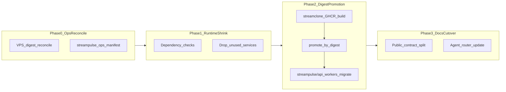

# StreamPulse image namespace migration — doc and agent wiring

## Audit review (go / no-go)

The audit at [`streamclone-pulse/docs/pulse-extension/evidence/streamclone-image-exit-audit-2026-07.md`](c:/Users/Aron/streamclone-pulse/docs/pulse-extension/evidence/streamclone-image-exit-audit-2026-07.md) is **sound and actionable**. Recommended path:



**Accept:**
- Phase 0 private ops evidence **before** renaming images (VPS reconcile block, digest traceability).
- Runtime dependency checks before removing `frontend`, `video`, `chat`, `scraper`, `metadata`, `emote`.
- Digest promotion targets: `streampulse/api`, `streampulse/workers`, `streampulse/migrate`, optional `metadata`/`emote`.
- Rollback = compose/image reference only (no schema down-migration when digest-identical).
- Phase 4 source split is **explicitly deferred**.

**Reconcile with launch decision:** [`production-artifact-decision-2026-07.md`](c:/Users/Aron/streamclone-pulse/docs/pulse-extension/evidence/production-artifact-decision-2026-07.md) remains valid for **launch hardening on streamclone-named images today**. The exit audit is the **successor plan for production manifests**, not a contradiction. Wording pattern everywhere:

| Layer | Today (pre-cutover) | Target (post-cutover) | Unchanged |
|-------|---------------------|------------------------|-----------|
| Backend source | `Aron-Chu/streamclone` | Same until Phase 4 | Go BFF, migrations, CI |
| CI build output | `ghcr.io/aron-chu/streamclone/*` | Still built here; becomes **source artifacts** | `release-images.yml` |
| Production manifests | `streamclone/*` tags in private ops | `streampulse/*` promoted by digest | `streampulse-ops` owns deploy |
| Public API identity | `IMAGE_TAG` e.g. `v0.3.0-rc18` | Same tag; different registry path | migrate == api SHA |

**Do not claim cutover complete** in public docs until private `streampulse-ops` compose shows zero `ghcr.io/aron-chu/streamclone/*` and post-promotion smoke is attached.

**Two boundaries this plan covers:**

| Boundary | What it separates |
|----------|-------------------|
| **Production image ownership** | Source-build (`streamclone/*`) vs promoted production (`streampulse/*`) vs private deploy (`streampulse-ops`) |
| **Workspace / context ownership** | Extension vs portal vs backend vs ReplayForge vs Auto Clipper vs private ops — smallest workspace wins for daily work |

---

## Contract split (your choice)

### 1. Narrow [`docs/production-artifact-contract.md`](c:/Users/Aron/twitch-7tv-clone/docs/production-artifact-contract.md) → **source-build contract**

- Retitle intro: Streamclone builds and publishes **source images** to GHCR.
- Remove/replace “StreamPulse production **intentionally** deploys Streamclone images” with: “StreamPulse production **promotion** is defined in [`docs/production-promotion-contract.md`](c:/Users/Aron/twitch-7tv-clone/docs/production-promotion-contract.md).”
- Keep: `IMAGE_TAG`, `release-images.yml` matrix, local/self-hosted compose, migrate baked at tag, scraper exception rules.
- Add banner: **Migration in progress** → link exit audit + promotion contract.

### 2. Add new [`docs/production-promotion-contract.md`](c:/Users/Aron/twitch-7tv-clone/docs/production-promotion-contract.md) → **production promotion contract**

Canonical public doc for hosted StreamPulse deploys (extracted from audit):

- **Status block:** `pre-cutover` until ops evidence says otherwise; link exit audit as active migration spec.
- **Promotion invariant:** `api` + `workers` + `migrate` share one source SHA; promote by digest, not rebuild.
- **Target image map** (from audit):

| Runtime role | Target namespace | Source digest of |
|---|---|---|
| API/BFF | `ghcr.io/aron-chu/streampulse/api:${IMAGE_TAG}` | `streamclone/analytics` |
| Workers | `ghcr.io/aron-chu/streampulse/workers:${IMAGE_TAG}` | same as API |
| Migrate | `ghcr.io/aron-chu/streampulse/migrate:${IMAGE_TAG}` | `streamclone/migrate` |
| Metadata | `streampulse/metadata` | if still required after shrink |
| Emote | `streampulse/emote` | if still required after shrink |

- **Required manifest fields:** source SHA, per-service digest, rollback digests, smoke evidence paths.
- **Agent guardrails:** do not suggest backend repo split; do not rename images without Phase 0 evidence; do not edit private ops from public repos without operator scope.
- **Links:** exit audit, `hosted-production-ops.md`, promotion manifest template, private ops (name only).

Place the file in **streamclone** (public contract hub) and mirror-link from **streamclone-pulse** evidence index.

---

## Phase A — Commit untracked evidence (streamclone-pulse)

When you ask for commits, stage only:

- [`docs/pulse-extension/evidence/streamclone-image-exit-audit-2026-07.md`](c:/Users/Aron/streamclone-pulse/docs/pulse-extension/evidence/streamclone-image-exit-audit-2026-07.md)
- [`docs/pulse-extension/evidence/production-artifact-decision-2026-07.md`](c:/Users/Aron/streamclone-pulse/docs/pulse-extension/evidence/production-artifact-decision-2026-07.md)

Suggested commit: `docs(evidence): add streamclone image exit audit and launch artifact decision`

Add to `production-artifact-decision` header (if not already):

```markdown
Supersession: the "keep Streamclone images" decision applies until image namespace cutover.
After cutover, promoted StreamPulse images per [streamclone-image-exit-audit-2026-07.md] are authoritative for production manifests.
```

---

## Phase B — Agent router updates (scoped, both repos)

These are **cutover-blocker for agent correctness** per audit SDLC register. Update only docs that affect **hosted production image decisions**. This migration is **not** a ReplayForge or Auto Clipper migration — avoid broad doc churn.

**Update now (in scope):**

| File | Change |
|------|--------|
| [`streamclone/AGENTS.md`](c:/Users/Aron/twitch-7tv-clone/AGENTS.md) | Golden rule #11 + Hosted production router row → dual-contract + exit audit; risky files: promotion contract |
| [`streamclone-pulse/AGENTS.md`](c:/Users/Aron/streamclone-pulse/AGENTS.md) | Fix prod image wording; add Image namespace exit evidence row |
| [`streamclone-pulse/docs/CONTEXT.md`](c:/Users/Aron/streamclone-pulse/docs/CONTEXT.md) | One row: hosted production images → promotion contract + exit audit |
| [`streamclone/docs/hosted-production-ops.md`](c:/Users/Aron/twitch-7tv-clone/docs/hosted-production-ops.md) | Link promotion contract; list exit audit |
| [`streamclone/docs/streampulse-vps.md`](c:/Users/Aron/twitch-7tv-clone/docs/streampulse-vps.md) | Add exit audit alongside production-artifact-decision |
| [`streamclone-pulse/.cursor/rules/streamclone.mdc`](c:/Users/Aron/streamclone-pulse/.cursor/rules/streamclone.mdc) | Prod promotion ≠ streamclone registry path |
| [`streamclone/docs/CLAUDE.md`](c:/Users/Aron/twitch-7tv-clone/docs/CLAUDE.md) / pulse `CLAUDE.md` | Hosted ops read-first links |
| Subagents [`backend-safety-reviewer.md`](c:/Users/Aron/streamclone-pulse/.cursor/agents/backend-safety-reviewer.md), [`ops-diagnostics-reviewer.md`](c:/Users/Aron/streamclone-pulse/.cursor/agents/ops-diagnostics-reviewer.md) | Before prod image changes → exit audit + promotion contract |

**Pulse skills (hosted scope only):** one-line pointer in `streamclone-task-runner`, `pulse-live-coverage-review` (and mirrors) if they mention production deploy.

**Defer unless file explicitly mentions Streamclone production images:**

- [`streamclone/.kiro/steering/clipper.md`](c:/Users/Aron/twitch-7tv-clone/.kiro/steering/clipper.md) — ReplayForge surface; no image-exit wiring unless prod image line appears
- [`streamclone/docs/agents-streamclone-and-replayforge.md`](c:/Users/Aron/twitch-7tv-clone/docs/agents-streamclone-and-replayforge.md) — skip in this pass; integration contract unchanged
- Portal `design.md`, `website-portal-requirements.md`, extension `design.md` — defer per audit depends on scope

Run `make codex-sync-skills` in streamclone only if mirrored pulse skills reference hosting.

**Workspace doc touch (minimal in Phase B):** one cross-link from [`streamclone/docs/workspace.md`](c:/Users/Aron/twitch-7tv-clone/docs/workspace.md) to Phase E boundary matrix (full matrix added in Phase E).

---

## Phase C — Ops templates and evidence ledgers

### Promotion manifests (streamclone)

Update [`docs/ops/promotion-manifest.template.md`](c:/Users/Aron/twitch-7tv-clone/docs/ops/promotion-manifest.template.md) and [`docs/ops/examples/promotion-manifest-rc18.example.md`](c:/Users/Aron/twitch-7tv-clone/docs/ops/examples/promotion-manifest-rc18.example.md):

- Add **dual column** table: `source_image (streamclone/*)` + `production_image (streampulse/*)` + digest.
- Add checkbox: “Phase 0 VPS reconcile attached” / “no streamclone/* in production compose”.
- Keep current streamclone rows labeled **pre-cutover example** until ops cutover.

### Historical docs (banner only, no rewrite)

Add “historical — see promotion contract” top banner:

- [`docs/ops-migration-plan.md`](c:/Users/Aron/twitch-7tv-clone/docs/ops-migration-plan.md)
- [`docs/ops-migration-manifest.md`](c:/Users/Aron/twitch-7tv-clone/docs/ops-migration-manifest.md)

Skip `agents-streamclone-and-replayforge.md` in this pass unless grep shows Streamclone prod image assumptions that would mislead operators (integration contract unchanged by image namespace exit).

### Pulse evidence

| File | Change |
|------|--------|
| [`improvements.md`](c:/Users/Aron/streamclone-pulse/docs/pulse-extension/evidence/improvements.md) | Add row: image namespace exit (in progress); link audit |
| [`release-status.md`](c:/Users/Aron/streamclone-pulse/docs/website-portal/release-status.md) | Expand “Image namespace exit audit” section: current state, blocker = Phase 0 ops evidence + promotion |
| [`release-gap-closure-tasks.md`](c:/Users/Aron/streamclone-pulse/docs/website-portal/release-gap-closure-tasks.md) | Generic deployed version / digest check wording |

Defer full rewrites of portal `design.md` / `website-portal-requirements.md` until runtime shrink proves which services remain (audit timing: “depends on scope”).

---

## Phase E — Workspace / context boundaries

The image-exit plan separates **production image ownership** well. This phase separates **daily engineering context** so agents do not open the full ecosystem by default and blur StreamPulse, Streamclone, ReplayForge, and Auto Clipper.

### Private ops is never in public workspaces

**`streampulse-ops` must remain a separate operator workspace only.** Do not add it to [`streamclone-full.code-workspace`](c:/Users/Aron/twitch-7tv-clone/streamclone-full.code-workspace) or any public multi-root file. Rationale: secrets, private manifests, production compose. Agents reference it by name in docs only.

### `streamclone-pulse` dual product (one repo, two context modes)

Extension and StreamPulse web share a repo but differ in build/test loops and mental models. Document **context modes** in [`streamclone-pulse/AGENTS.md`](c:/Users/Aron/streamclone-pulse/AGENTS.md) and [`docs/CONTEXT.md`](c:/Users/Aron/streamclone-pulse/docs/CONTEXT.md):

| Mode | Scope | Do not load by default |
|------|-------|------------------------|
| **Extension** | `src/`, extension docs, MV3 build/test | Portal e2e, `streampulse-web` tasks |
| **Portal / web** | `streampulse-web/`, `docs/website-portal/` | Content scripts, service worker unless API contract work |

Separate repos not required; separate **workspace profiles** are.

### Workspace matrix (canonical — add to [`docs/workspace.md`](c:/Users/Aron/twitch-7tv-clone/docs/workspace.md))

| Workspace | Folders | Use for | Keep out |
|---|---|---|---|
| **StreamPulse Extension** | `streamclone-pulse` | MV3 extension, content scripts, service worker, options/popup, extension API contract checks | ReplayForge, private ops, full streamclone unless BFF contract |
| **StreamPulse Web / Portal** | `streamclone-pulse` (portal context: `streampulse-web/` + `docs/website-portal/`) | Public site, portal, analytics hub, website release docs | ReplayForge, Streamclone internals unless API contract work |
| **Streamclone Backend** | `streamclone` | Go APIs, migrations, analytics BFF/workers, `pulse-core`, release image source builds | ReplayForge UI/editor |
| **ReplayForge** | `replayforge` | Clip Studio, render pipeline, FFmpeg/Whisper, templates, artifacts | StreamPulse portal/extension |
| **Auto Clipper Integration** | `streamclone` + `replayforge` | Analytics candidates, moment export, ReplayForge trigger contract, job mirroring/callbacks | StreamPulse web/extension unless UI contract changes |
| **Full Ecosystem** | `streamclone` + `streamclone-pulse` + `replayforge` ([`streamclone-full.code-workspace`](c:/Users/Aron/twitch-7tv-clone/streamclone-full.code-workspace)) | Cross-repo planning, broad audits, release/context checks | Daily feature work; **never** private ops |
| **Private Ops** | `streampulse-ops` only (separate checkout) | Production compose, secrets, deployment manifests, promotion cutover | All public repo workspaces |

Existing [`streamclone-pulse-extension.code-workspace`](c:/Users/Aron/twitch-7tv-clone/streamclone-pulse-extension.code-workspace) stays the default **StreamPulse product** workspace (backend + pulse client). Reframe in docs: default for extension **and** portal when backend contract is needed; prefer focused profiles below for daily work.

### Optional new workspace files (streamclone repo root)

Add only if useful on disk (lightweight JSON, no secrets):

| File | Folders |
|------|---------|
| `streampulse-extension.code-workspace` | `../streamclone-pulse` only |
| `streampulse-portal.code-workspace` | `../streamclone-pulse` (named folder; doc points agents at `streampulse-web/`) |
| `streamclone-backend.code-workspace` | `.` only |
| `replayforge.code-workspace` | `../replayforge` only |
| `auto-clipper-integration.code-workspace` | `.` + `../replayforge` |

Update AGENTS.md task router: “pick smallest workspace from matrix before broad reads.”

---

## Phase D — Private ops (operator, out of public repo)

Not editable from these checkouts, but **must** happen before public docs claim success:

1. Run audit VPS reconcile command block; store under `streampulse-ops/docs/deployments/`.
2. Update private compose template: `streampulse/*` image rows.
3. Execute cutover checklist (audit § Cutover Checklist) + backout plan dry-run.
4. Attach soak/smoke transcript to manifest.

Gate 2 work (Redis bounds, soak rerun) can proceed **in parallel** with doc wiring; image cutover waits on Phase 0 evidence.

---

## Commit strategy (when requested)

| Repo | Commit | Scope |
|------|--------|-------|
| **streamclone-pulse** | `docs(evidence): image exit audit and launch artifact decision` | Untracked evidence only |
| **streamclone-pulse** | `docs(agents): wire image namespace exit migration` | Scoped Phase B files + pulse evidence |
| **streamclone** | `docs(ops): split source-build and production-promotion contracts` | Promotion contract, artifact contract, AGENTS, hosted ops, manifests |
| **streamclone** | `docs(workspace): add context boundary matrix and focused workspaces` | workspace.md, optional `.code-workspace` files |

Keep commits narrow; no `.env.local`, no code behavior changes.

---

## Agent behavior checklist (post-merge)

Agents working on hosted production MUST:

1. Read exit audit before proposing image name / compose changes.
2. Treat **streamclone** as backend **source**; **streampulse** as production **promotion namespace**.
3. Never recommend backend repo split as step 1.
4. Never remove a runtime service without audit dependency checks.
5. Require digest + source SHA in any promotion manifest suggestion.
6. Distinguish “local dev `:8090`” from “hosted promotion” (existing portal guardrails unchanged).

## Workspace / context boundaries

Default to the **smallest workspace** that owns the task:

- **Extension work:** `streamclone-pulse` only (or `streampulse-extension.code-workspace`); do not open ReplayForge.
- **StreamPulse web/portal work:** `streampulse-web` + `docs/website-portal/`; consult Streamclone only for API contracts.
- **Backend/API/migration work:** `streamclone` only; consult `streamclone-pulse` only for contract drift.
- **ReplayForge work:** `replayforge` only.
- **Auto Clipper integration:** `streamclone` + `replayforge`.
- **Cross-repo audits:** `streamclone-full.code-workspace`.
- **Production ops:** private `streampulse-ops` workspace only; **never** include in public full workspace.

The full ecosystem workspace is for audits and integration planning, not daily development.

---

## Verification

- Grep both repos for `intentionally deploys` / bare `streamclone/*` in **agent routers and hosted ops docs** → should resolve to dual-contract links.
- Grep confirms ReplayForge/clipper docs were not churned unless they mentioned prod Streamclone images.
- `make context-verify` in streamclone (rules freshness).
- Manual: AGENTS.md task router surfaces exit audit + workspace matrix from both repos.
- Confirm no `.code-workspace` file references `streampulse-ops`.
- No trailing whitespace in touched markdown (user validation standard).
