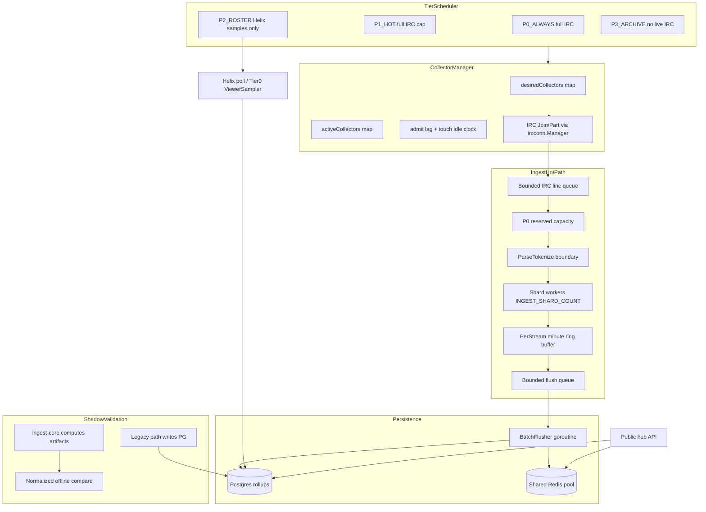

# StreamPulse ingest-core rewrite (250-safe first, 500/50 ready)

**Status: APPROVED** with guardrails below. Do not expand scope to portal rewrite, scraper rewrite, K8s, Kafka, Rust, DB replacement, or 500 full IRC.

## Context and constraints

**Proven today:** ~249/250 full IRC on one VPS, stable soak. **Target architecture:** 500 roster channels with 25–50 full IRC (default **50**), P2 viewer/session visibility without IRC, future sharding via existing [`CollectorLeaseManager`](c:/Users/Aron/twitch-7tv-clone/internal/analytics/pulse_collector_lease_manager.go).

**Out of scope:** portal, full API rewrite, Postgres/Redis replacement, K8s/Kafka/Rust, scraper rewrite. **Corpus:** not needed on the hot path — keep `CORPUS_WORKERS_ENABLED=0` on the API node; recent-data focus via Helix/Tier0 sampling for P2.

**Rollout (B+ safety profile):**
1. Build new pipeline + shadow compare at **250/250** (production-equivalent).
2. Cut over ingest-core only after gates pass; **do not** change caps in the same deploy.
3. Second ops flip to **500/50** via env only after a second soak.

No forward-only DB migrations that block rollback.

### Hard implementation rule (scope creep prevention)

```text
Phase A/B must compile with INGEST_CORE_ENABLED=0 and produce NO behavior change.
No production behavior change until Phase C shadow artifacts prove parity.
Do not move large chunks of collector.go in one PR — incremental delegate/wrap only.
```

---

## Architecture



### Tier model (maps to existing priorities)

| Tier | IRC | Maps from | Visibility for P2 |
|------|-----|-----------|-------------------|
| `P0_ALWAYS` | Full | `TrackPriorityGlobalProtected`, `TrackPriorityPrincipalAlwaysTrack` | N/A |
| `P1_HOT` | Full up to cap | Helix top-live rank ≤ `INGEST_P1_HOT_LIMIT` (default 50) + manual watch | N/A |
| `P2_ROSTER` | None | Roster rows ≤ `HUB_ROSTER_LIMIT` not in P0/P1 | Helix poll + optional `TIER0_ENABLED` viewer samples → sessions + viewer rollups |
| `P3_ARCHIVE` | None | Offline / not in roster | Post-stream backfill only (existing worker, capped) |

When `INGEST_TIERING_ENABLED=0`, behavior matches today: admission top-N clamped to IRC cap (250/250 prod profile).

---

## New package layout

Create [`internal/analytics/ingestcore/`](c:/Users/Aron/twitch-7tv-clone/internal/analytics/ingestcore/) (keeps hot path isolated from BFF/hub):

| File | Responsibility |
|------|----------------|
| `config.go` | `IngestConfigFromEnv()` — tier caps, queue sizes, flush tuning, shard count |
| `tiers.go` | `IngestTier` enum, tier assignment from login + Helix rank + priority |
| `manager.go` | **CollectorManager** — sole owner of IRC admit/evict; wraps `ircconn.Manager` |
| `scheduler.go` | **TierScheduler** — periodic reconcile: desired vs active, anti-churn, admit lag |
| `parse.go` | **Parse boundary** — `ParseIRCLine(line) → ParsedChat`; delegates tokenization to existing `enrich.Enricher` |
| `aggregate.go` | **ShardAggregator** — `INGEST_SHARD_COUNT` workers, bounded ingress queue per shard |
| `ring.go` | **MinuteRing** — compact per-stream open minute + closed slots (counters + top-emote heap, no raw message arrays) |
| `flush.go` | **BatchFlusher** — interval + max-batch flush to store |
| `shadow.go` | Dual-read shadow compute + normalized compare artifacts |
| `metrics.go` | Prometheus gauges/histograms (depth + age) |
| `engine.go` | **Engine** facade wired from `cmd/analytics/main.go` |

**Refactor, don’t duplicate:** move logic out of [`collector.go`](c:/Users/Aron/twitch-7tv-clone/internal/analytics/collector.go) incrementally; keep `Collector` as a thin compatibility wrapper during migration (`INGEST_CORE_ENABLED=0` uses legacy path).

---

## Key design decisions

### 1. CollectorManager (single IRC admission owner)

Replace scattered `WatchWithPriority` + poller direct calls with:

- `Reconcile(ctx, candidates []DesiredChannel) → ReconcileResult` (join/part lists)
- Reuse anti-churn: [`TouchAdmissionObservation`](c:/Users/Aron/twitch-7tv-clone/internal/analytics/collector.go) semantics for `duplicate_stream` / `already_tracking`
- Eviction: extend [`pulse_tracking_priority.go`](c:/Users/Aron/twitch-7tv-clone/internal/analytics/pulse_tracking_priority.go) with tier-aware victim selection (P1 hot rank tie-break, then idle time)
- Expose snapshots for hub: `ActiveCount`, `DesiredCount`, `AdmitLagSeconds`, `JoinRate`, `PartRate`

Wire [`LiveAdmissionPoller`](c:/Users/Aron/twitch-7tv-clone/internal/analytics/live_admission_poller.go) and [`ProtectedGoLivePoller`](c:/Users/Aron/twitch-7tv-clone/internal/analytics/pulse_golive_poller.go) to call **scheduler → manager**, not `Collector.WatchWithPriority` directly.

Future sharding: scheduler produces `DesiredChannel`; when `INGEST_SHARD_COUNT>1` (worker count) and `INGEST_LEASE_SHARD_COUNT>1` (future), filter through [`CollectorLeaseManager.Reconcile`](c:/Users/Aron/twitch-7tv-clone/internal/analytics/pulse_collector_lease_manager.go) before manager applies JOIN/PART.

### 2. Bounded queues — admission priority, not post-queue dropping

All hot-path queues fixed capacity (env-tunable defaults):

| Queue | Default max | On full |
|-------|-------------|---------|
| IRC line ingress (global) | 8192 | reject new P1 first; metric `ingest_messages_dropped_total{tier}` |
| P0 reserved IRC capacity | 2048 (configurable fraction) | P0 always admitted if reserved slot free |
| Per-shard aggregate inbox | 256 | reject new P1 at shard ingress; never evict accepted P0 |
| Flush pending rollups | 4096 | coalesce by stream/minute; Phase E only: defer lowest-tier streams |

**Backpressure rule (queue admission priority):**

```text
P0 messages enter reserved queue capacity first.
P1 messages use normal queue capacity.
If global pressure exists, reject NEW P1 messages at enqueue time.
Never evict already-accepted P0 messages from any queue.
Never drop Helix viewer samples for P2 roster.
Do NOT drop randomly from the middle of a queue.
```

**Rules:** no `go func()` per message; fixed worker pool (`INGEST_SHARD_COUNT` workers + 1 flusher goroutine + 1 scheduler tick).

**Phase D vs Phase E drop policy:**
- **Phase D (250/250):** any sustained `ingest_messages_dropped_total` increase **aborts cutover** — must be zero or statistically indistinguishable from legacy (which should also be ~0).
- **Phase E (500/50):** small controlled P1 rejections at enqueue under extreme pressure may be acceptable; P0 drops remain a failure.

### 3. Aggregation model

Extract [`minuteAccumulator`](c:/Users/Aron/twitch-7tv-clone/internal/analytics/collector.go) + [`snapshotRollup`](c:/Users/Aron/twitch-7tv-clone/internal/analytics/collector.go) into `ingestcore/ring.go`:

- Keep fields already used by UI: `chatCount`, emote counts, `emotes map[string]int` capped at `ANALYTICS_TOP_EMOTES_PER_MINUTE`, viewer samples
- **Minute ring:** 2 slots (previous closed + current open) per active IRC stream — bounds memory vs unbounded `map[string]*minuteAccumulator` growth on churn
- Shard by `streamID` FNV (same as today); shard count from `INGEST_SHARD_COUNT` (default **32**, not hardcoded)

### 4. Batch flusher — idempotent absolute snapshots

New store helper in [`store.go`](c:/Users/Aron/twitch-7tv-clone/internal/analytics/store.go):

```go
// BulkUpsertLiveMinuteRollupsBatch — one transaction, multiple streams, pgx.Batch
func (s *Store) BulkUpsertLiveMinuteRollupsBatch(ctx context.Context, byStream map[string][]MinuteRollup, opts LiveRollupWriteOptions) error
```

**Idempotency rule (required):**

```text
Rollup writes MUST be idempotent.
Use absolute minute snapshot upserts keyed by (stream_id, minute_ts) — last-write-wins
for open-minute partial flushes and completed-minute closes.
Each flush writes the current known totals for that minute, NOT deltas.
Duplicate/retry flushes must converge to the same row state.
Preserve existing ON CONFLICT GREATEST merge semantics where canonical/VOD sources apply.
Do NOT introduce delta-increment writes unless existing schema explicitly requires it.
```

Flusher policy (env):

- `INGEST_FLUSH_INTERVAL` default **5s**
- `INGEST_FLUSH_MAX_BATCH` default **500** rollups
- `INGEST_OPEN_MINUTE_FLUSH_INTERVAL` default **10s** (preserve current behavior)
- Reuse existing metrics: `analytics_rollup_write_duration_seconds`, `analytics_rollup_write_batch_size`
- Add queue depth **and age** gauges (see Metrics section)

### 5. Redis (shared pool)

In [`cmd/analytics/main.go`](c:/Users/Aron/twitch-7tv-clone/cmd/analytics/main.go), after `redis.ParseURL`:

- Set `PoolSize`, `MinIdleConns`, `PoolTimeout`, `ReadTimeout`, `WriteTimeout` from env (`REDIS_POOL_SIZE` default 32)
- New helper [`internal/redisutil/client.go`](c:/Users/Aron/twitch-7tv-clone/internal/redisutil/client.go) used by analytics only (narrow scope)
- Audit ingest path: **no** `redis.NewClient` in ingestcore
- Document TTL families for cache keys (hub already TTL’d); add TTL helper for any new ingest cache keys

### 6. Background work isolation

New hosted profile [`deploy/env/profile-hosted-ingest-core.env.example`](c:/Users/Aron/twitch-7tv-clone/deploy/env/profile-hosted-ingest-core.env.example):

**Phase 1 (250/250 prod-equivalent):**
```env
INGEST_CORE_ENABLED=1
INGEST_TIERING_ENABLED=0
HUB_ROSTER_LIMIT=250
MAX_ACTIVE_IRC_CHANNELS=250
CORPUS_WORKERS_ENABLED=0
SCRAPER_ENABLED_ON_API_NODE=0
BACKFILL_MAX_PARALLEL_STREAMS=1
PULSE_MAX_BACKFILLS=1
```

**Phase 2 (500/50 — ops flip only):**
```env
INGEST_TIERING_ENABLED=1
HUB_ROSTER_LIMIT=500
MAX_ACTIVE_IRC_CHANNELS=50
INGEST_P1_HOT_LIMIT=50
TIER0_ENABLED=1
TIER0_ROSTER_TOP_N=500
```

Gate scraper/worker compose services via new env checks in [`cmd/analytics/main.go`](c:/Users/Aron/twitch-7tv-clone/cmd/analytics/main.go) and document in streampulse-ops overlay (no scraper profile on API node).

### 7. Public API compatibility

No response shape breaks. Extend hub payload **additively** in [`hub_overview.go`](c:/Users/Aron/twitch-7tv-clone/internal/analytics/hub_overview.go):

```json
"ingest": {
  "tieringEnabled": true,
  "activeCollectors": 49,
  "desiredCollectors": 52,
  "admitLagSeconds": 12,
  "joinRate1m": 0.4,
  "partRate1m": 0.2,
  "state": "admit_lag" | "operational" | "saturated" | "outage"
}
```

Change [`corpusPipelineStateFromReadiness`](c:/Users/Aron/twitch-7tv-clone/internal/analytics/corpus_readiness.go): when `INGEST_TIERING_ENABLED=1` and corpus disabled, **do not** mark hub `degraded` solely for expected P2 deficit; use `ingest.state=admit_lag` instead of lumping with metadata/corpus failures.

**Public API compatibility tests (required before Phase D):**

Snapshot/golden tests asserting stable JSON shape for existing fields on:
- `GET /v1/public/hub`
- `GET /v1/public/hub/moments`
- `GET /v1/extension/health`

New `ingest` block is additive only — existing keys, types, and required fields must not change. Tests live in `internal/analytics/public_api_compat_test.go` (or extend `hub_overview_test.go` + `hub_historical_moments_test.go`).

### 8. Shadow / dual-read validation (two modes)

Pattern from [`gold_ivr.go`](c:/Users/Aron/twitch-7tv-clone/internal/analytics/gold_ivr.go). **Split into two explicit modes:**

| Mode | Env | Behavior |
|------|-----|----------|
| **Dual-read shadow** | `INGEST_CORE_DUAL_READ_MODE=1` | Legacy path **writes production rollups**. ingest-core **computes shadow rollups only**. Hub/API **read legacy production data**. Shadow artifacts compared offline. |
| **Compare-only (no writes from new path)** | `INGEST_CORE_SHADOW_MODE=1` | New aggregator runs parallel; **no PG writes** from ingest-core (subset/allowlist testing) |
| **Cutover** | `INGEST_CORE_ENABLED=1`, both shadow flags `=0` | ingest-core writes production; legacy hot path disabled |
| **Rollback** | `INGEST_CORE_ENABLED=0` | Instant return to legacy collector flush |

**After shadow passes, cutover env:**

```env
INGEST_CORE_ENABLED=1
INGEST_CORE_SHADOW_MODE=0
INGEST_CORE_DUAL_READ_MODE=0
```

This prevents accidental "new path affects reads" before intentional cutover.

**Shadow compare normalization (required):**

Compare old vs new only after aligning on:
- same `stream_id`
- same `channel_id` / login
- same `bucket_minute` (UTC truncated)
- same open vs closed minute status
- same emote provider/id normalization (reuse enricher key format)

Metrics compared: `chatCount`, `totalEmoteCount`, viewer samples within tolerance (default ±2% chat, ±1 viewer sample).

Artifacts: `runtime/ingest-shadow/` (JSONL, rotated). Script: `scripts/ingest-shadow-compare.sh`.

Shadow runs on subset first: `INGEST_SHADOW_CHANNEL_ALLOWLIST=xqc,ludwig,...` then expand to full fleet.

---

## Metrics required

### Collector / IRC
- `ingest_active_collectors`
- `ingest_desired_collectors`
- `ingest_admit_lag_seconds`
- `ingest_irc_join_rate` / `ingest_irc_part_rate`
- `rate(analytics_irc_lines_processed_total[5m])` (existing)
- `ingest_messages_dropped_total{tier}`

### Queue depth **and age** (new — user requirement)
- `ingest_irc_queue_depth`
- `ingest_shard_queue_depth{shard}`
- `ingest_flush_queue_depth`
- `ingest_irc_queue_age_seconds` (histogram: now - enqueue timestamp)
- `ingest_shard_queue_age_seconds{shard}`
- `ingest_flush_queue_age_seconds`

Queue age catches "rollups 45s late" even when queue is not full.

### Flush / Postgres / Redis
- `analytics_rollup_write_duration_seconds` p50/p95/p99 (existing)
- `analytics_rollup_write_batch_size` (existing)
- `ingest_postgres_write_errors_total`
- `ingest_redis_write_errors_total`
- Hub/moments cache hit/miss (existing `X-Cache` + Redis keys)

---

## Env vars added

| Env | Default | Purpose |
|-----|---------|---------|
| `INGEST_CORE_ENABLED` | `0` | Master switch for new hot path writes |
| `INGEST_CORE_DUAL_READ_MODE` | `0` | Legacy writes PG; ingest-core shadow compute only |
| `INGEST_CORE_SHADOW_MODE` | `0` | Compare-only subset mode; no PG writes from new path |
| `INGEST_TIERING_ENABLED` | `0` | P0/P1/P2/P3 split |
| `HUB_ROSTER_LIMIT` | `250` | P2 roster cap |
| `INGEST_P1_HOT_LIMIT` | `50` | P1 full-IRC hot set size |
| `INGEST_SHARD_COUNT` | `32` | Aggregate worker count (tune 16 vs 32 on 8-core VPS) |
| `INGEST_P0_QUEUE_RESERVE` | `2048` | Reserved IRC queue slots for P0 |
| `INGEST_IRC_QUEUE_SIZE` | `8192` | Global IRC line queue |
| `INGEST_SHARD_QUEUE_SIZE` | `256` | Per-shard queue |
| `INGEST_FLUSH_QUEUE_SIZE` | `4096` | Pending rollup queue |
| `INGEST_FLUSH_INTERVAL` | `5s` | Batch flush tick |
| `INGEST_FLUSH_MAX_BATCH` | `500` | Max rollups per PG batch |
| `INGEST_OPEN_MINUTE_FLUSH_INTERVAL` | `10s` | Open-minute partial flush |
| `INGEST_SHADOW_CHANNEL_ALLOWLIST` | `` | Shadow subset |
| `INGEST_SHADOW_TOLERANCE_CHAT_PCT` | `2` | Shadow compare tolerance |
| `SCRAPER_ENABLED_ON_API_NODE` | `0` | Block scraper on analytics VPS |
| `BACKFILL_MAX_PARALLEL_STREAMS` | `1` | Cap parallel backfill on API node |
| `REDIS_POOL_SIZE` | `32` | go-redis pool |
| `REDIS_READ_TIMEOUT` / `REDIS_WRITE_TIMEOUT` | `3s` | Client timeouts |

Existing vars retained: `MAX_ACTIVE_IRC_CHANNELS`, `PULSE_LIVE_ADMISSION_*`, `TIER0_*`, `CORPUS_WORKERS_ENABLED`.

Config wiring: [`internal/config/config.go`](c:/Users/Aron/twitch-7tv-clone/internal/config/config.go) + [`.env.example`](c:/Users/Aron/twitch-7tv-clone/.env.example).

---

## Before / after hot path

| Stage | Before (today) | After (ingest-core) |
|-------|----------------|---------------------|
| Admission | Pollers → `Collector.WatchWithPriority` → IRC Join | Scheduler → **CollectorManager** → Join (single owner) |
| IRC read | Sync `HandleIRCLine` on read goroutine | Bounded queue → shard workers |
| Parse | Inline in collector | `ingestcore/parse.go` boundary |
| Aggregate | 32 shard maps, unbounded bucket keys | Per-stream **minute ring** + env-tuned shards |
| Flush | Per-stream tx on poll/10s open flush | **BatchFlusher**: idempotent multi-stream tx |
| P2 roster | Partially via metadata/corpus | **Helix + Tier0** only, no IRC, no corpus |
| Backpressure | Implicit (full pool returns error) | P0-reserved admission priority + metrics |
| Shadow | N/A | Dual-read: legacy writes, ingest-core compares |
| Metrics | IRC lines + rollup write hist | + depth, **age**, drops, admit lag |

---

## Expected CPU/RAM impact

| Mode | CPU | RAM |
|------|-----|-----|
| **250/250 + ingest-core (tiering off)** | ~same to **-5%** | **Lower bound** — minute ring vs open-ended bucket maps |
| **500/50 + tiering on** | **Target -30% to -50%** vs 250 full IRC | **Lower** — 50 IRC streams + bounded queues |
| Redis | Fewer connection spikes with pool limits | Stable |
| Postgres | Fewer transactions (batched flush) | Write load similar at 50 IRC; less at 250 |

---

## Files changed (expected)

### New
- `internal/analytics/ingestcore/*.go` (~10 files)
- `internal/redisutil/client.go`
- `internal/analytics/public_api_compat_test.go`
- `deploy/env/profile-hosted-ingest-core.env.example`
- `docs/pulse-ingest-v2/ingest-core-runbook.md`
- `scripts/ingest-shadow-compare.sh`

### Modified
- [`cmd/analytics/main.go`](c:/Users/Aron/twitch-7tv-clone/cmd/analytics/main.go)
- [`internal/config/config.go`](c:/Users/Aron/twitch-7tv-clone/internal/config/config.go)
- [`internal/analytics/collector.go`](c:/Users/Aron/twitch-7tv-clone/internal/analytics/collector.go) — incremental delegate only
- [`internal/analytics/live_admission_poller.go`](c:/Users/Aron/twitch-7tv-clone/internal/analytics/live_admission_poller.go)
- [`internal/analytics/pulse_golive_poller.go`](c:/Users/Aron/twitch-7tv-clone/internal/analytics/pulse_golive_poller.go)
- [`internal/analytics/store.go`](c:/Users/Aron/twitch-7tv-clone/internal/analytics/store.go)
- [`internal/analytics/hub_overview.go`](c:/Users/Aron/twitch-7tv-clone/internal/analytics/hub_overview.go)
- [`internal/analytics/corpus_readiness.go`](c:/Users/Aron/twitch-7tv-clone/internal/analytics/corpus_readiness.go)
- [`internal/metrics/ingest_metrics.go`](c:/Users/Aron/twitch-7tv-clone/internal/metrics/ingest_metrics.go) (new)
- [`.env.example`](c:/Users/Aron/twitch-7tv-clone/.env.example)

### Not changed
- `streampulse-web/**`, scraper internals, worker job logic (only caps/isolation env)

---

## Implementation phases

### Phase A — Skeleton + metrics + manager (no cutover)
- ingestcore package, config, metrics registration (depth + age)
- CollectorManager + TierScheduler with tests
- Hub `ingest` snapshot (zeros when disabled)
- **Gate:** `INGEST_CORE_ENABLED=0` → identical behavior; all tests green

### Phase B — Bounded aggregation + batch flusher
- Parse boundary, admission-priority queues, minute ring, flush queue
- `BulkUpsertLiveMinuteRollupsBatch` with idempotent absolute upserts
- Wire behind `INGEST_CORE_ENABLED=0` default
- **Gate:** no behavior change with flag off

### Phase C — Shadow validation (dual-read)
- `INGEST_CORE_DUAL_READ_MODE=1`: legacy writes, ingest-core computes, normalized compare
- Public API compat snapshot tests
- Run on VPS at 250/250: allowlist → full fleet
- **Gate:** ≥99% minutes within tolerance after normalization

### Phase D — Production cutover (250/250)

**Preconditions (P0 — independent of ingest-core, required before cutover):**
1. **Moments Cache-Control deployed** — verify `/v1/public/hub/moments` returns `Cache-Control` on closed buckets (merged in rc19+ hub_historical_moments.go; audit showed missing on prod)
2. **Docker resource limits applied** via staged ops overlay from [`deploy/compose/hosted-resource-limits.compose.yml`](c:/Users/Aron/twitch-7tv-clone/deploy/compose/hosted-resource-limits.compose.yml) for: analytics, analytics-workers, redis, postgres, scraper, minio

**Cutover env:**
```env
INGEST_CORE_ENABLED=1
INGEST_CORE_DUAL_READ_MODE=0
INGEST_CORE_SHADOW_MODE=0
INGEST_TIERING_ENABLED=0
HUB_ROSTER_LIMIT=250
MAX_ACTIVE_IRC_CHANNELS=250
```

Monitor gates 1–9 for 12–24h.

### Phase E — 500/50 ops flip (separate deploy)
- `INGEST_TIERING_ENABLED=1`, `HUB_ROSTER_LIMIT=500`, `MAX_ACTIVE_IRC_CHANNELS=50`
- Controlled P1 enqueue rejects under pressure allowed; P0 drops still abort
- Second soak; CPU lower than 250/250 baseline

---

## Smoke test commands

```bash
# Health + caps + new ingest block
curl -s https://api.streampulse.stream/v1/extension/health | jq .
curl -s 'https://api.streampulse.stream/v1/public/hub?activityWindow=24h' | jq '.ingest, .corpusPipeline, .coverage'

# Phase D precondition: moments Cache-Control
curl -sD - -o /dev/null \
  'https://api.streampulse.stream/v1/public/hub/moments?bucketT=1719000000000&activityWindow=24h' \
  | grep -i cache-control

# Shadow artifact tail (on VPS)
tail -f /opt/streamclone/app/runtime/ingest-shadow/latest.jsonl

# Queue age + drops (VPS Prometheus)
curl -s 'localhost:9090/api/v1/query?query=histogram_quantile(0.95,ingest_flush_queue_age_seconds_bucket)'
curl -s 'localhost:9090/api/v1/query?query=rate(ingest_messages_dropped_total[5m])'

# Public API compat tests
go test ./internal/analytics/... -run 'PublicAPICompat|HubOverview|HubMoments' -count=1
go test ./internal/analytics/ingestcore/... -count=1
```

## Load test commands

```bash
for i in $(seq 1 30); do curl -s -o /dev/null -w '%{time_total}\n' \
  'https://api.streampulse.stream/v1/public/hub?activityWindow=24h'; done

bash scripts/ingest-shadow-compare.sh --tolerance-chat-pct 2 --min-samples 1000 --normalize
bash scripts/hosted-launch-probes.sh
```

---

## Rollback plan

1. **Instant:** `INGEST_CORE_ENABLED=0` (or prior image tag) → recreate analytics. No DB migration.
2. **Env:** restore `profile-hosted-pulse-live-250.env` overlay.
3. **Tiering:** keep `INGEST_TIERING_ENABLED=0` until Phase E approved.
4. **Abort triggers:** sustained drops (Phase D), shadow mismatch, flush p95 regression, queue age p95 > threshold, Redis rejected_connections delta, hub `ingest.state=outage`, Docker OOM on hot services.

---

## Success metrics

| Metric | Phase D target | Phase E target |
|--------|--------------|----------------|
| `ingest_active_collectors` | ~249–250 | ~45–50 |
| `rate(ingest_messages_dropped_total[5m])` | **Zero** (abort if sustained) | P1-only under pressure OK |
| `ingest_flush_queue_age_seconds` p95 | Stable vs baseline | Stable |
| Shadow compare (normalized) | ≥99% within tolerance | Same |
| Flush p95 | Stable | Stable |
| Redis rejected_connections delta | Not climbing | Not climbing |
| Analytics RSS | Flat 12–24h | Flat |
| Hub + moments | 200 + Cache-Control | Same |
| CPU | ~same or lower | **Lower** than 250/250 full IRC |

---

## Cutover gates

**Phase D (250/250 ingest-core on):**
1. Preconditions: moments Cache-Control verified; Docker limits applied
2. Active IRC ~249/250 stable
3. **`rate(ingest_messages_dropped_total[5m])` = 0** or indistinguishable from legacy (~0); **sustained increase aborts**
4. Shadow rollup counts within tolerance (normalized keys)
5. Flush p95 + flush queue age p95 stable
6. Redis rejected_connections flat
7. Analytics memory stable 12–24h
8. Hub + moments healthy; public API compat tests pass
9. `ingest.state` = admit_lag or operational, not outage

**Phase E (500/50 flip):** repeat all gates + CPU lower than 250/250 baseline; P1 enqueue rejects logged and bounded.
