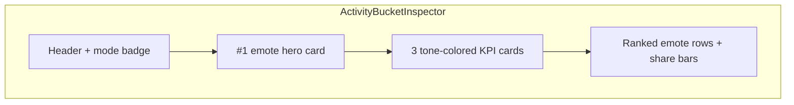

> **HISTORICAL (archived from .cursor/plans).** Not product law. Do not use for routing analytics, ingest, hub, ops, or Pulse work into public Streamclone. See docs/archive/agent-plans/README.md and docs/streampulse-product-boundary.md.
---
name: Inspector visual polish
overview: "Polish the activity bucket / Top Emotes inspector with Pulse Moments–aligned stat tones, a compact #1 emote hero card, and a richer ranked emote list — CSS-first using existing `--sp-surface-*` tokens, scoped to the inspector column only."
todos:
  - id: extract-hero
    content: Extract InspectorTopEmoteCard to shared component; update FigmaMomentInspector import
    status: completed
  - id: inspector-hero-stats
    content: "ActivityBucketInspector: mode badge, hero card, stat tone classes"
    status: completed
  - id: inspector-list-layout
    content: "HubTopEmotesTable: add layout=inspector with rank, provider icon, share micro-bar"
    status: pending
  - id: inspector-css
    content: "figma-analytics.css: inspector shell, stats, hero, list polish (sp-surface tokens only)"
    status: completed
  - id: verify-polish
    content: Run unit/e2e tests; update hub-global-activity-shell screenshot baseline
    status: completed
isProject: false
---

# Activity bucket inspector visual polish

## Problem

The right-rail inspector ([`ActivityBucketInspector.tsx`](c:/Users/Aron/streamclone-pulse/streampulse-web/src/ui/components/analytics/ActivityBucketInspector.tsx)) reads flat compared to the Pulse Moments inspector:

- Header is all-caps mono grey text; meta line is plain prose (`Busiest emote: …`).
- Stat cards use tiny labels (`0.48rem`), transparent backgrounds, and no tone colors — unlike [`FigmaMomentInspector.tsx`](c:/Users/Aron/streamclone-pulse/streampulse-web/src/ui/components/analytics/FigmaMomentInspector.tsx) which wires `--high` / `--mid` / `--emote` modifiers.
- Emote list uses `layout="leaderboard"` with text provider labels and no rank or share bars; the richer [`hub-top-emotes-table`](c:/Users/Aron/streamclone-pulse/streampulse-web/src/ui/components/analytics/HubTopEmotesTable.tsx) table variant (provider accent + share bar) is unused here.
- Selected state is a barely visible background tint (`--active` at 35% mix).

User chose **richer polish**: stat tones + hero strip + improved list (all three modes: range, preview, selected).

## Design direction

Align with existing Pulse Moments inspector patterns — reuse CSS classes already in [`figma-analytics.css`](c:/Users/Aron/streamclone-pulse/streampulse-web/src/ui/components/analytics/figma-analytics.css) (`pulse-moments__inspector-emote-card`, `pulse-moments__inspector-stat--*`) rather than inventing a new visual language.

Guardrails: only `--sp-surface-*` / `--sp-border` on cards (no new `rgba(255,255,255,…)` backgrounds).



## Implementation

### 1. Extract shared top-emote hero component

Move [`InspectorTopEmoteCard`](c:/Users/Aron/streamclone-pulse/streampulse-web/src/ui/components/analytics/FigmaMomentInspector.tsx) (lines 111–174) into a small shared file:

**New:** [`InspectorTopEmoteCard.tsx`](c:/Users/Aron/streamclone-pulse/streampulse-web/src/ui/components/analytics/InspectorTopEmoteCard.tsx)

Props:

```ts
interface InspectorTopEmoteCardProps {
  emote: { name: string; provider?: string; imageUrl?: string; count?: number }
  headline: string          // e.g. "Top emote this bucket" | "Leading emote — 1 day"
  countUnit?: string        // "uses this bucket" | "uses in window"
  topShare?: number
}
```

- Update `FigmaMomentInspector` to import from the shared file (no behavior change).
- Reuse existing `pulse-moments__inspector-emote-card*` CSS as-is.

### 2. Wire hero + stat tones in ActivityBucketInspector

**File:** [`ActivityBucketInspector.tsx`](c:/Users/Aron/streamclone-pulse/streampulse-web/src/ui/components/analytics/ActivityBucketInspector.tsx)

**Header**
- Split label into title row + optional mode badge:
  - `selected` → badge `Selected`
  - `preview` → badge `Preview`
  - `range` → no badge (title stays `Top emotes — {window}`)
- Keep time string in title for bucket modes; move busiest-emote prose out of `headMeta` (hero replaces it).

**Hero** (when `tableEmotes[0]` exists)
- Render `<InspectorTopEmoteCard />` between header and stats.
- Headlines:
  - bucket modes: `"Top emote this bucket"`
  - range: `"Leading emote — {windowLabel}"`
- Pass `topShare` from `tableEmotes[0].sharePct`.

**Stats** — extend stat objects with optional `tone`:

| Mode | Cards | Tones |
|------|-------|-------|
| range | Unique emotes / Avg emotes/min / Top share | `neutral` / `emote` / `mid` |
| bucket | Viewers then / Chat/min then / Emotes then | `mid` / `high` / `emote` |

Apply `pulse-moments__inspector-stat--{tone}` on each stat div (pattern from `FigmaMomentInspector`).

**InspectorChrome** — accept optional `hero` slot + stat `tone`; render hero between head and stats grid.

### 3. Richer emote list (`layout="inspector"`)

**File:** [`HubTopEmotesTable.tsx`](c:/Users/Aron/streamclone-pulse/streampulse-web/src/ui/components/analytics/HubTopEmotesTable.tsx)

Add third layout variant `inspector` (used only by `ActivityBucketInspector`):

| Column | Content |
|--------|---------|
| Rank | `#1`–`#10` in muted mono |
| Emote | icon + truncated name |
| Provider | `EmoteProviderIcon` (16px) — drop text label |
| Uses | compact count |
| Share | `SharePctDisplay` + inline micro-bar |

Markup per row:

```tsx
<li data-rank={index + 1} data-provider={providerKey}>
  <span className="hub-top-emotes-inspector__rank">{index + 1}</span>
  ...
  <span className="hub-top-emotes-inspector__share-cell">
    <span className="hub-top-emotes-inspector__bar"><i style={{ width, background }} /></span>
    <SharePctDisplay ... />
  </span>
</li>
```

Micro-bar reuses the same `count / max` logic as table layout (lines 132–138).

Switch inspector call:

```tsx
<HubTopEmotesTable emotes={emotes} maxRows={10} layout="inspector" />
```

### 4. CSS (scoped to inspector column)

**File:** [`figma-analytics.css`](c:/Users/Aron/streamclone-pulse/streampulse-web/src/ui/components/analytics/figma-analytics.css)

Under `.activity-bucket-inspector`:

**Panel shell**
- `--active`: left `3px` accent (`var(--sp-accent)`), `background: var(--sp-surface-2)`, subtle inner border-radius.
- `--preview`: keep top accent; add dashed outline on hero card only.
- Range: default surface unchanged.

**Header**
- `.activity-bucket-inspector__mode-badge` — pill using `var(--sp-surface-3)` + accent border.
- Slightly larger title (`0.68rem`), meta stays mono muted.

**Stats** (override inspector-specific sizing)
- Bump label to `0.52rem`, value to `0.88rem` (currently forced down to `0.72rem` at line ~986).
- Stat card background: `var(--sp-surface-2)` instead of transparent.

**Hero card** (scoped override)
- `.activity-bucket-inspector .pulse-moments__inspector-emote-card { background: var(--sp-surface-2); }`
- Compact padding for narrow ~220–280px column.

**Inspector list** (new block `.hub-top-emotes-inspector`)
- Grid: `1.1rem minmax(0,1fr) 1.1rem 2.4rem minmax(2.8rem,1fr)`
- Row: `var(--sp-surface-2)` base, provider-colored `inset 2px` left edge (same as table rows).
- `[data-rank="1"]`: slightly stronger surface + accent-tinted border.
- Larger emote thumb (`1.65rem`), rank `#1` in accent color.
- Share micro-bar: 2rem × 0.28rem track, provider-colored fill.

Remove or reduce fixed `min-height: calc(10 * 2.35rem)` on sidebar if it creates dead space; let list height follow content with `flex: 1; overflow-y: auto` on table slot when panel is tall.

### 5. Verification

| Check | Command |
|-------|---------|
| Unit | `npm test -- tests/activityBucketInspectorUtils.test.ts` (unchanged logic) |
| E2E UX | `npx playwright test tests/e2e/analytics-hub-ux.spec.ts -g "default inspector"` |
| Screenshot baseline | Update `hub-global-activity-shell.png` — visual diff expected after polish |

Manual: hover preview, click bucket, confirm hero + tones swap; range mode shows leading emote hero + economy KPIs.

## Files touched

| File | Change |
|------|--------|
| `InspectorTopEmoteCard.tsx` | **New** — shared hero |
| `FigmaMomentInspector.tsx` | Import shared hero |
| `ActivityBucketInspector.tsx` | Hero, badges, stat tones, layout switch |
| `HubTopEmotesTable.tsx` | `layout="inspector"` variant |
| `figma-analytics.css` | Inspector-scoped polish |
| `analytics-hub-ux.spec.ts` | Optional assertion for hero visible on bucket select |
| `hub-global-activity-shell.png` | Regenerate screenshot baseline |

## Out of scope

- Backend / API changes
- Clickable emote external links in list (future)
- Changing chart or Pulse Moments table styling
