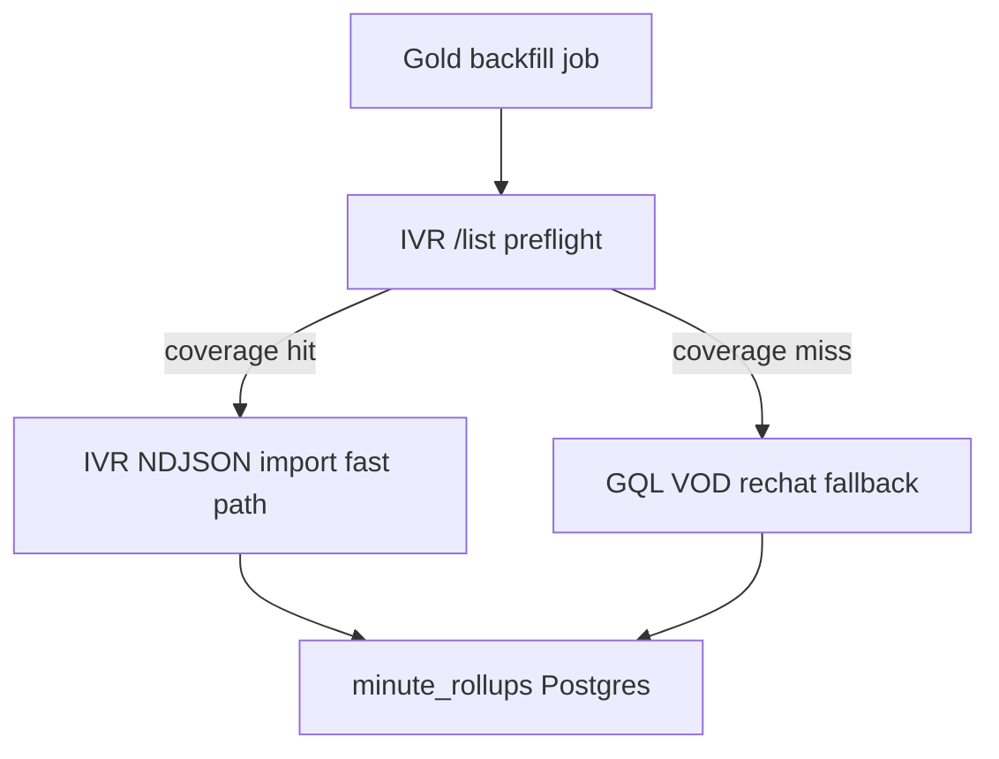

# IVR + Gold: benchmark-first, IVR-first with GQL fallback

## Short answer

**Yes** — IVR can run **in conjunction with Gold**, but it should **not replace GQL**. IVR only has chat for channels/dates Rustlog logs; many Top-500 targets (e.g. Jynxzi) are **GQL-only today**. The correct production shape is:

**Do not ship production `gold_ivr` until BENCH-IVR-001 passes** — that is already policy in [`bench-ivr-001.md`](c:\Users\Aron\streamclone-pulse\docs\pulse-extension\evidence\bench-ivr-001.md).

---

## What IVR vs GQL means for Gold today

| Source | What it is | Coverage | Speed (smoke) | Accuracy tradeoff |
|--------|------------|----------|---------------|-------------------|
| **GQL** | Twitch VOD `VideoCommentsByOffsetOrCursor` | Any public VOD with chat replay | ~304 msgs / 60s in **~8.5s** (Jynxzi fixture) | Omits some deleted/moderated; canonical for **gold_full** |
| **IVR** | Rustlog IRC NDJSON at `logs.ivr.fi` | Only logged channels/dates | ~95 msgs / 60s in **~0.8s** (Ludwig fixture) | May include IRC-only messages GQL lacks; needs **same-window compare** for gold_lite |

Gold worker today always goes through [`SyncHistoricalStream`](c:\Users\Aron\twitch-7tv-clone\internal\analytics\sync.go) → GQL path in [`backfill_worker.go`](c:\Users\Aron\twitch-7tv-clone\internal\analytics\backfill_worker.go). **No `gold_ivr` Go code exists yet** — only the evidence harness [`ivr_chat_benchmark.py`](c:\Users\Aron\twitch-7tv-clone\scripts\bench\ivr_chat_benchmark.py).

Existing tiers already split rollup depth:
- **`gold_lite`** — minute aggregates (good IVR target if ≥95% per-minute agreement)
- **`gold` / `gold_full`** — full GQL replay + optional raw export

---

## Why benchmark must come first

Current status (**HOLD**):

| Done | Blocked |
|------|---------|
| Ludwig IVR smoke (list/stats/NDJSON) | Same-window **IVR vs GQL compare** |
| Jynxzi GQL smoke (hot-chat baseline) | Ludwig fixture has `vod_id: "deferred"` |
| Coverage gate (`ivr_coverage=miss` for Jynxzi) | 5× speed + gold-lite **95%** / gold-full **98%** thresholds untested |

**Your choice (both):** prove accuracy on **IVR-covered** Ludwig + document **GQL-only** path for **uncovered** Jynxzi — matches existing fixture design.

### Pass thresholds (from evidence doc)

Promote to `gold_ivr` design only if **same window**:

- IVR ≥ **5×** faster than GQL (target 10×+)
- **Gold-lite:** ≥95% per-minute volume agreement; gaps ≤60s; parser errors <0.1%
- **Gold-full:** ≥98% message overlap (if raw replay needed)
- Negative control: `ivr_coverage_miss` → clean GQL fallback (Jynxzi fixture)

---

## Phase 1 — Complete BENCH-IVR-001 (evidence only, no prod writes)

### 1a. Add compare-capable Ludwig fixture

Extend or add JSON fixture under [`docs/pulse-extension/fixtures/`](c:\Users\Aron\streamclone-pulse\docs\pulse-extension\fixtures):

- Set verified `vod_id`, `vod_url`, `started_at` aligned to IVR smoke window (`2026-06-25T00:00:00Z` …)
- Enable lanes: `ivr-direct`, `gql`, `compare`
- Keep [`bench-ivr-jynxzi-gql.json`](c:\Users\Aron\streamclone-pulse\docs\pulse-extension\fixtures\bench-ivr-jynxzi-gql.json) as **negative control** (`ivr_expected=false`)

**Operator step:** pick a public Ludwig VOD whose broadcast window overlaps the IVR log dates (Helix lookup or manual Twitch URL verification).

### 1b. Run benchmark matrix

From [`scripts/bench/README.md`](c:\Users\Aron\twitch-7tv-clone\scripts\bench\README.md):

1. **1-min smoke compare** (Ludwig) — `--lane all --window smoke --allow-live`
2. **5-min benchmark compare** (Ludwig) — `--window benchmark`
3. **Jynxzi GQL-only** — confirm `ivr_coverage=miss`, GQL baseline unchanged
4. Optional **15-min Jynxzi GQL stress** — rate-limit acceptance only (not IVR comparison)

Artifacts → `runtime/bench-evidence/`; update [`bench-ivr-001.md`](c:\Users\Aron\streamclone-pulse\docs\pulse-extension\evidence\bench-ivr-001.md) with PASS/HOLD/REJECT decision.

### 1c. Automate decision summary

Small enhancement to [`ivr_chat_benchmark.py`](c:\Users\Aron\twitch-7tv-clone\scripts\bench\ivr_chat_benchmark.py) compare output:

- Emit `speedup_ratio`, `gold_lite_pass`, `gold_full_pass`, `recommendation` (`promote` | `experimental` | `reject`)
- Add regression test in [`test_ivr_chat_benchmark.py`](c:\Users\Aron\twitch-7tv-clone\scripts\bench\tests\test_ivr_chat_benchmark.py)

---

## Phase 2 — Design `gold_ivr` source router (only if Phase 1 promotes)

Add design section to streamclone-pulse [`docs/pulse-extension/top-500-design.md`](c:\Users\Aron\streamclone-pulse\docs\pulse-extension\top-500-design.md) or new `gold-ivr-design.md`:

### Source order (per Gold job)

1. Resolve `channel_user_id`, stream `[started_at, ended_at]` from Postgres session
2. **`GET /list?channelid=`** — if miss → **GQL** (record `chat_source=gql`)
3. If hit → stream NDJSON for stream window → normalize to existing rollup writer
4. If IVR import fails or gold-lite quality check fails mid-run → **fallback GQL** for that job (never silent partial)

### Prioritization (enqueue, not fetch)

In [`top500_gold_vod_inventory.go`](c:\Users\Aron\twitch-7tv-clone\internal\analytics\top500_gold_vod_inventory.go) / gold enqueuer:

- Optional **IVR coverage cache** (daily `/list` per channel_id) — prefer IVR-covered jobs when queue is deep (faster corpus progress)
- Never skip uncovered channels — they stay on GQL path

### Tier mapping

| Benchmark outcome | Production tier | Source |
|-------------------|-----------------|--------|
| gold_lite pass | `gold_lite` job | IVR → rollups |
| gold_lite fail, gold_full pass | `gold_full` | GQL |
| IVR miss | `gold` / `gold_full` | GQL only |

### Safety (reuse harness rules)

- Rate limits + kill switches on IVR bytes/messages/duration
- No writes from benchmark harness; production writes only via existing backfill worker + rollup flush
- Feature flag: `GOLD_IVR_ENABLED=false` default on BearHost corpus profile

---

## Phase 3 — Implement Go adapter (after design approval)

Narrow first slice in **streamclone**:

| File | Work |
|------|------|
| New `internal/analytics/gold_ivr.go` + `ivr_client` port (or call Python-less HTTP client mirroring [`ivr_client.py`](c:\Users\Aron\twitch-7tv-clone\scripts\bench\ivr_client.py)) | NDJSON fetch + parse |
| [`sync.go`](c:\Users\Aron\twitch-7tv-clone\internal\analytics\sync.go) `SyncHistoricalStream` | Branch: if `GOLD_IVR_ENABLED` && preflight hit → IVR import path before GQL |
| [`backfill_worker.go`](c:\Users\Aron\twitch-7tv-clone\internal\analytics\backfill_worker.go) | Record `chat_source` on job outcome / metrics |
| [`internal/config/config.go`](c:\Users\Aron\twitch-7tv-clone\internal\config\config.go) | `GOLD_IVR_ENABLED`, `GOLD_IVR_BASE_URL`, caps |
| Metrics | `gold_ivr_preflight_hit/miss`, `gold_ivr_fallback_total` |

Tests: unit tests for coverage gate + minute bucketing; integration test with recorded NDJSON fixture (no live IVR in CI).

**Out of scope for v1:** self-hosted Rustlog, raising GQL RPM, portal UI changes.

---

## Phase 4 — Corpus ops (separate from Pulse VPS)

Gold workers run on **BearHost corpus profile** ([`profile-bearhost-corpus.env`](c:\Users\Aron\twitch-7tv-clone\deploy\env\profile-bearhost-corpus.env)), not the Pulse API box (`CORPUS_WORKERS_ENABLED=0` on pulse). IVR acceleration only helps if:

- Corpus workers are up
- Gold jobs are enqueued (`GOLD_BACKFILL_ENABLED`, queue not starved)

No change to Pulse `PULSE_MAX_ACTIVE_CHANNELS=10` — IVR is **VOD chat backfill**, not live IRC slots.

---

## Recommendation

| Question | Answer |
|----------|--------|
| Can we add IVR with Gold? | **Yes** — IVR-first, GQL fallback |
| Should we prioritize IVR? | **Yes for covered channels** after benchmark proves ≥95% gold-lite accuracy |
| Is IVR “as accurate” as GQL? | **Unknown until Ludwig same-window compare** — semantics differ by design |
| Is IVR better for all VODs? | **No** — Jynxzi proves GQL remains required for uncovered channels |

**Next concrete step:** Phase 1 only — verify Ludwig VOD ID, run 1-minute compare, update evidence doc with promote/hold/reject. Do **not** start Phase 3 until compare passes or explicitly accepts “experimental gold_lite only.”

---

## Verification

- Phase 1: evidence JSON + updated `bench-ivr-001.md` with decision table filled
- Phase 3 (later): `go test ./internal/analytics/... -run IVR` + manual corpus job on Ludwig stream shows `chat_source=ivr` and rollups match GQL within gold-lite tolerance
- Regression: Jynxzi job still uses GQL with `ivr_coverage=miss`
