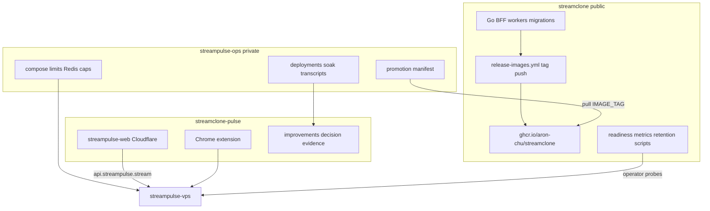

# Launch hardening forward plan

## Decision (locked)

Your new docs state the correct mental model:

- **StreamPulse** = product surface (`streampulse.stream`, extension, portal)
- **Streamclone** = backend source + GHCR release train (`ghcr.io/aron-chu/streamclone/*`)
- **streampulse-ops** = promotion boundary (tags, caps, limits, evidence)
- **streamclone-pulse** = client repo only

Do **not** rebrand/split backend images before launch. The tagging confusion was **ops promotion drift** (rc18 containers, rc8 scraper, rc4 host `VERSION`), not wrong registry namespace.

Canonical docs today:

| Doc | Location |
|-----|----------|
| Decision record | [streamclone-pulse/docs/pulse-extension/evidence/production-artifact-decision-2026-07.md](c:/Users/Aron/streamclone-pulse/docs/pulse-extension/evidence/production-artifact-decision-2026-07.md) |
| Full review + 7-day soak | [streamclone-pulse/docs/pulse-extension/evidence/improvements.md](c:/Users/Aron/streamclone-pulse/docs/pulse-extension/evidence/improvements.md) |
| Public artifact contract | [streamclone/docs/production-artifact-contract.md](c:/Users/Aron/twitch-7tv-clone/docs/production-artifact-contract.md) |

**Doc sync gap:** cross-link these from [streamclone/docs/streampulse-vps.md](c:/Users/Aron/twitch-7tv-clone/docs/streampulse-vps.md) and [streamclone/AGENTS.md](c:/Users/Aron/twitch-7tv-clone/AGENTS.md) so agents reading only the backend repo still find the decision + improvements ledger.

---

## Architecture (who fixes what)

---

## What improvements.md says (prioritized)

**HOLD for full public launch** — OK for constrained beta reads only until blockers close.

| Rank | Blocker | Owner |
|------|---------|-------|
| 1 | Cap 250 + corpus active without **current** soak | streampulse-ops + evidence |
| 2 | Redis unbounded + 3.98M rejected connections | streampulse-ops (+ streamclone metrics) |
| 3 | No Docker memory/CPU/PID limits | streampulse-ops |
| 4 | Missing 24h soak with p95 metrics | streampulse-ops evidence |
| 5 | Deploy identity drift (rc18/rc8/rc4) | streampulse-ops manifest |

**Cheapest-first tuning** (from improvements §Concrete Tuning): reconcile cap **with evidence**, Redis policy, key/TTL audit, compose limits, MinIO off hot path, PG retention, probe repair, Prometheus proof, edge cache/rate limits.

You chose **aggressive posture**: **keep cap 250** — but public launch still waits on a **new cap-250 soak bundle** (improvements explicitly requires this).

---

## Phase 0 — Promotion manifest (streampulse-ops, do first)

Create one deploy artifact per promotion (markdown or `runtime/deploy-manifest.json`) with fields from the decision record:

- `IMAGE_TAG` (analytics == metadata == emote == migrate)
- `SOURCE_SHA`, `SCRAPER_IMAGE_TAG` (explicit exception)
- `DEPLOYED_AT`, `ROLLBACK_TAG`
- `CAPS` (250/250/250 admission, backfills=1, scraper concurrency=1)
- `KILL_SWITCHES` (GQL, backfill, go-live, read-only, Helix, corpus/silver/gold)
- `SMOKE_RESULTS` (boundary, launch probes, health, hub)
- Container **image digests** (not just tags)

**Immediate reconcile deploy** (no cap change):

1. Set `IMAGE_TAG=v0.3.0-rc18` (or chosen tag) across all core services.
2. Bump scraper to matching tag **or** document rc8 exception with reason.
3. Set `STREAMCLONE_VERSION` env to match `IMAGE_TAG`.
4. Stop using host [`VERSION`](c:/Users/Aron/twitch-7tv-clone/VERSION) file as audit truth — either update it on every deploy or exclude from smoke checks ([`scripts/hosted-launch-probes.sh`](c:/Users/Aron/twitch-7tv-clone/scripts/hosted-launch-probes.sh) already prefers `DEPLOYED_SHA` when SSH is set).

Template location: `streampulse-ops/docs/deployments/2026-07-07-cap250-hold-remediation.md`.

---

## Phase 1 — Redis + container limits (streampulse-ops, before soak)

From improvements evidence (Critical/High):

**Redis**

- Alert on memory, `rejected_connections`, connected clients **before** changing traffic.
- Inventory key prefixes + TTL coverage (only 245/13,555 keys expiring today).
- Add `maxmemory` + policy only after separating cache-safe keys from locks/quotas (or split Redis DBs).
- Fix connection churn (pooling / maxclients) — rejected connections already in millions.

**Compose limits** (start conservative, tune after soak):

| Service | Suggested starting guard |
|---------|-------------------------|
| redis | memory cap + restart policy |
| analytics | memory + CPU cap |
| analytics-workers | memory + CPU + pids |
| scraper | memory + pids |
| postgres | shared memory / mem limit |
| minio | memory cap or move off API node |

Keep enforced: `PULSE_MAX_BACKFILLS=1`, GQL concurrency 1, `SCRAPER_MAX_CONCURRENT=1`.

**Q4 isolation decision (cap 250 path):** corpus workers + scraper stay on API node **only during soak** with limits; if Day 5 of soak shows Q0 regression, move Q4 to worker VPS per improvements worker-split diagram.

---

## Phase 2 — Cap-250 soak evidence (streampulse-ops, 7 days)

Follow the day-by-day plan in [improvements.md § Seven-Day Soak Plan](c:/Users/Aron/streamclone-pulse/docs/pulse-extension/evidence/improvements.md):

| Day | Focus | Pass highlights |
|-----|-------|-----------------|
| 0 | Manifest + tag reconcile | Single IMAGE_TAG evidence |
| 1 | Baseline probes | [`hosted-launch-probes.sh`](c:/Users/Aron/twitch-7tv-clone/scripts/hosted-launch-probes.sh), [`pulse-hosted-boundary-smoke.sh`](c:/Users/Aron/twitch-7tv-clone/scripts/pulse-hosted-boundary-smoke.sh), hub not degraded by collector deficit |
| 2 | Redis + limits | rejected connections stable; no Q0 regression |
| 3 | PG retention/write | write p95 < 250ms; growth plan |
| 4 | Q0 isolation | memory <85%; rollup flush p95 <5s; go-live p95 <120s |
| 5 | Corpus canary | hosted p95 stable; stop if Q0 regresses |
| 6 | Public fanout | BFF cache hit/miss p95 targets |
| 7 | Rollback drill + backup proof | dated pg_dump/restore |

Store evidence on VPS at a **known path** (replace missing `metadata-overnight-soak.txt`) and copy summary into `streampulse-ops/docs/deployments/`.

**Stop conditions** (improvements §Stop Conditions): Redis rejections rising, memory >85% 10m, PG write p95 >250ms, BFF 5xx >1%, disk <20GB, tunnel impact — abort soak and roll back cap or tag.

---

## Phase 3 — streamclone backend PRs (public repo)

These unblock operator proof without splitting images:

### 3a. Readiness / launch probes (P0)

Public `/v1/analytics/top100/readiness` is **intentionally 404 at Caddy edge** ([pulse-api-boundary evidence](c:/Users/Aron/twitch-7tv-clone/docs/pulse-extension/evidence/pulse-api-boundary-edge-block-2026-07-01.txt)). [`hosted-launch-probes.sh`](c:/Users/Aron/twitch-7tv-clone/scripts/hosted-launch-probes.sh) warns on this today.

**Fix:** add **operator-only** readiness path (tailnet/localhost or authenticated internal route) that exposes: admission enabled, collector max/active, metadata stale rows, cap, queue ages — mirroring what [`internal/analytics/api.go`](c:/Users/Aron/twitch-7tv-clone/internal/analytics/api.go) already serves on blocked routes. Update launch probes to use private path when `PULSE_PROBE_SSH_TARGET` is set (curl localhost via SSH).

### 3b. Health / metrics for soak (P1)

Extend health or internal diagnostics (non-secret) with:

- cap + kill-switch snapshot
- Redis BFF hit/miss + rejected connection counter
- PG write / rollup flush latency hooks (Prometheus or structured log aggregates)

Align with improvements Top Five PRs #2 and #4.

### 3c. Retention package (P2)

Forward-only jobs/migrations for rollups, top500 snapshots, VOD chat staging, old `backfill_jobs` — improvements §3 and §6. Reduces PG 6.9GB growth pressure before public fanout.

### 3d. Desktop v0.5.0 vs hosted prod

[`v0.5.0`](c:/Users/Aron/twitch-7tv-clone/VERSION) tag is **desktop install** (slim core, no scraper). **Does not auto-update VPS.** Hosted promotion remains a separate streampulse-ops pin (currently rc18 until you promote).

---

## Phase 4 — streamclone-pulse (client only)

Per decision record §5:

- Keep hosted default `https://api.streampulse.stream`; no backend image ownership.
- Portal: review poll cadence on `/v1/public/hub` and hot channel routes; add Cloudflare cache where semantics allow (improvements #10, #14).
- Extension: unchanged backend contract; launch blocker is ops-side.
- **Evidence home:** keep [improvements.md](c:/Users/Aron/streamclone-pulse/docs/pulse-extension/evidence/improvements.md) as the launch ledger; link from portal release notes when go/no-go happens.

Optional: mirror a **stub pointer** in streamclone `docs/pulse-extension/evidence/` → pulse repo (same pattern as other extension docs).

---

## Go / no-go criteria (full public launch)

Launch when **all** are true:

1. Promotion manifest shows single `IMAGE_TAG` + documented scraper exception + digests.
2. Cap-250 **7-day soak** attached with thresholds from improvements (memory, Redis, PG p95, BFF p95, rollup flush, tunnel).
3. Redis has bounded memory policy **or** proven headroom + stable rejections.
4. Compose resource limits applied and no OOM during soak.
5. Boundary smoke still PASS; beta quota tests run when key available.
6. Backup/restore drill dated; rollback tag tested.
7. Edge rate limits on `/v1/public/*` evidenced.

Until then: **constrained beta / read-only traffic only** (improvements final decision).

---

## What not to do (pre-launch)

- Split `ghcr.io/aron-chu/streampulse/*` backend images without promotion-from-digest pipeline
- Fork backend repo or duplicate migrations CI
- Raise backfill/GQL/scraper concurrency during soak
- Treat host `VERSION` file as deploy truth
- Use desktop **v0.5.0** as proof of hosted prod state

---

## Suggested execution order

1. **streampulse-ops:** promotion manifest + tag reconcile (Day 0)
2. **streampulse-ops:** Redis alerts + compose limits (Day 2 prep)
3. **streamclone:** private readiness probe + update `hosted-launch-probes.sh`
4. **streampulse-ops:** run 7-day cap-250 soak; attach evidence
5. **streamclone:** metrics + retention PRs in parallel if soak is clean
6. **streamclone-pulse:** edge cache / poll discipline if Day 6 fanout fails
7. **Go/no-go meeting** against improvements stop conditions

Stronger agent handoff: give **ops-diagnostics-reviewer** SSH + `streampulse-ops` with Phase 0–2 checklist; give **backend-safety-reviewer** Phase 3 readiness/metrics scope.
