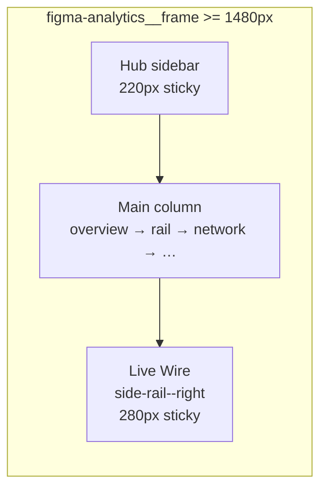
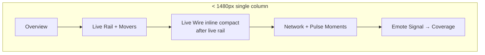

# Live Wire sticky right rail (revised)

## Audit summary

**Shipped and keep as-is:** Movers leaderboard race; [`HubLiveWireFeed`](c:\Users\Aron\streamclone-pulse\streampulse-web\src\ui\components\analytics\HubLiveWireFeed.tsx) trust gating, dedupe, caps, honest copy, GSAP gating. No logic rewrites needed.

**Naming (non-negotiable):** Product label is **Live Wire** everywhere — `hub-live-wire`, `section-live-wire`, title "Live wire". Do **not** rename to "Pulse Wire" (destroyed news product; guardrail collision).

**Follow-up (out of scope):** Movers appear twice (leaderboard race + Emote Signal "Top Movers") — dedup decision later.

---

## Problem

Live Wire is an inline full-width block between Live Rail and Network Activity (~10 tall rows). On the live page it reads as a heavy vertical slab. A sticky right rail fixes desktop UX **without crushing** the Pulse Moments two-up (`grid-template-columns: minmax(0, 1.85fr) minmax(240px, 0.72fr)` at [`figma-analytics.css:1838`](c:\Users\Aron\streamclone-pulse\streampulse-web\src\ui\components\analytics\figma-analytics.css)).

### Blocker #1 — main-column squeeze at 1100px

Current frame: `max-width: min(1520px, 100%)`, left nav `220px + 1fr` at ≥1100px ([`figma-analytics.css:260`](c:\Users\Aron\streamclone-pulse\streampulse-web\src\ui\components\analytics\figma-analytics.css)). Adding a ~280px rail at 1100px leaves main ≈540px on 1280–1366px laptops — insufficient for chart + embedded Pulse Moments inspector.

**Fix:** Right rail only at **≥1440px** (align with spare horizontal room). Below 1440px: **inline compact** in main (not sticky).

### Blocker #2 — dead rail system already exists

Do **not** invent `figma-analytics__right-rail` at 1100px. Reuse existing primitives:

| Existing | Location |
|----------|----------|
| `.figma-analytics__side-rail--right` | `grid-column: 3`, `width: min(100%, 280px)` |
| `.figma-side-rail__sticky` | `position: sticky; top: 4.75rem` |
| Breakpoint | `@media (min-width: 1480px)` — side rails `display: block` |

[`AnalyticsAmbientFrame.tsx`](c:\Users\Aron\streamclone-pulse\streampulse-web\src\ui\components\analytics\AnalyticsAmbientFrame.tsx) exports `AnalyticsSideRailLeft` / `AnalyticsAmbientBackdrop` — **zero importers**. Delete this file in the same PR. Trim unused `--left`-only scaffolding CSS if nothing references it after deletion; keep `--right` + `__sticky` + shared card/ticker tokens Live Wire may need.

---

## Target layout





| Viewport | Live Wire placement |
|----------|---------------------|
| **≥1480px** | Sticky right column via `figma-analytics__side-rail--right` + `figma-side-rail__sticky` |
| **1100–1479px** | Inline compact after Live Rail (main column keeps full width for chart two-up) |
| **<1100px** | Same inline slot after Live Rail; left section nav hidden (existing behavior) |

Preserve all trust gating in `HubLiveWireFeed`: `hubDegraded`, `isLiveNetwork`, `feed.source === 'network'`, no client scoring.

---

## 1. Shell: reuse side-rail, extend frame grid

**File:** [`AnalyticsFigmaShell.tsx`](c:\Users\Aron\streamclone-pulse\streampulse-web\src\ui\components\analytics\AnalyticsFigmaShell.tsx)

- Add optional `rightRail?: ReactNode`.
- At **≥1480px**, extend `.figma-analytics__frame` grid from `220px minmax(0,1fr)` to **`220px minmax(0,1fr) minmax(0, 280px)`** (third column for right rail).
- Render `rightRail` as a **direct child of frame** (sibling of sidebar + center), matching existing `grid-column: 3` on `--right`:

```tsx
<aside className="figma-analytics__side-rail figma-analytics__side-rail--right" aria-label="Live Wire">
  <div className="figma-side-rail__sticky">
    {rightRail}
  </div>
</aside>
```

- Inner sticky wrapper gets `max-height: calc(100vh - 5.5rem); overflow-y: auto; min-width: 0` on the **list** inside Live Wire (not necessarily on `__sticky` itself — see §3).
- Channel views unchanged — no `rightRail`.

**Cleanup:** Delete [`AnalyticsAmbientFrame.tsx`](c:\Users\Aron\streamclone-pulse\streampulse-web\src\ui\components\analytics\AnalyticsAmbientFrame.tsx).

---

## 2. Landing page: dual CSS-gated slots

**File:** [`AnalyticsLandingPage.tsx`](c:\Users\Aron\streamclone-pulse\streampulse-web\src\routes\analytics\AnalyticsLandingPage.tsx)

### Remove

Inline full-width block between live rail and network (~L365–374).

### Add two slots (one visible at a time — prerender-safe, no `matchMedia` fork)

| Slot | Class | Breakpoint | `id` |
|------|-------|------------|------|
| Inline | `hub-live-wire-slot hub-live-wire-slot--inline` | visible `<1480px` | `section-live-wire` |
| Rail | `hub-live-wire-slot hub-live-wire-slot--rail` | visible `≥1480px` | none (sidebar item hidden on wide) |

- **Inline:** `SectionReveal id="section-live-wire"` immediately **after** `section-live-rail`, before `section-network`.
- **Rail:** pass same `<HubLiveWireFeed layout="rail" … />` via `rightRail` prop (wrapped in slot div, not duplicate `id`).

Both slots mount the same props; only one visible (`display: none` on hidden slot). Acceptable overhead for prerender/hydration safety.

Main desktop flow (≥1480): overview → live rail → network → … (wire in right column, not in vertical stack).

---

## 3. Rail feed UX — compact but legible + scroll-jump guard

**Files:** [`HubLiveWireFeed.tsx`](c:\Users\Aron\streamclone-pulse\streampulse-web\src\ui\components\analytics\HubLiveWireFeed.tsx), [`figma-analytics.css`](c:\Users\Aron\streamclone-pulse\streampulse-web\src\ui\components\analytics\figma-analytics.css)

### `layout?: 'section' | 'rail'`

- Root class `hub-live-wire--rail` when `layout="rail"`.
- Rail width: **280–300px** (match `min(100%, 280px)` precedent; allow up to 300px inside 1520px frame max).
- `VISIBLE_CAP` **8** in rail mode (10 inline).

### Compact styling (not over-truncated)

- Tighter padding; single-column cards.
- Headline: `line-clamp: 2` (keep legible — do **not** single-line ellipsis).
- **Keep category** when it fits; show up to **3 emotes** (same as inline).
- Degraded banner: compact one-line, not removed.

### Scroll-jump guard (blocker #4)

When `layout="rail"` and the list has `overflow-y: auto`:

1. Track list `scrollTop` via ref.
2. On poll with new moments at top:
   - **`scrollTop` ≈ 0:** existing behavior — NEW badges + `animateEnter` (max `MAX_NEW_ANIMATIONS_PER_POLL = 3`).
   - **`scrollTop` > threshold (~8px):** skip prepend animation; show subtle **"N new"** pill in rail header; clicking pill scrolls list to top and clears count.
3. Optional: `content-visibility: auto` on offscreen `.hub-live-wire__card` rows in rail list.

Unit test: mock scrollTop > 0 → no `gsap.from` on new rows; pill visible.

---

## 4. Sidebar nav (blocker #3)

**File:** [`AnalyticsHubSidebar.tsx`](c:\Users\Aron\streamclone-pulse\streampulse-web\src\ui\components\analytics\AnalyticsHubSidebar.tsx)

- Do **not** use `hidden: true` on `section-live-wire` (would break mobile scroll-to).
- Add `data-section-id={section.id}` on nav buttons.
- CSS: `@media (min-width: 1480px) { [data-section-id="section-live-wire"] { display: none; } }` on the `<li>` or button.
- **A11y check:** on mobile/tablet, Live Wire nav item remains focusable and scrolls to `#section-live-wire` (inline slot).

---

## 5. Playwright verification

**New:** [`tests/e2e/analytics-hub-live-wire-rail.spec.ts`](c:\Users\Aron\streamclone-pulse\streampulse-web\tests\e2e\analytics-hub-live-wire-rail.spec.ts)

Use [`installHubUxMock`](c:\Users\Aron\streamclone-pulse\streampulse-web\tests\e2e\helpers\hubUxMock.ts) + overflow/console guards.

| Viewport | Expect |
|----------|--------|
| **390×844**, **768×1024** | Inline slot visible; `#section-live-wire` after `#section-live-rail`; no `.figma-analytics__side-rail--right` visible; no horizontal overflow |
| **1280×900**, **1366×900** | **No right rail**; inline visible; **Pulse Moments two-up does not overflow** (assert `.pulse-moments-live__grid` within main bounds) |
| **1440**, **1600** | `.figma-analytics__side-rail--right` visible; rail slot has Live Wire; main `right` < rail `left`; sticky scroll test |
| **1440 + `deviceScaleFactor` 1.25, 1.5** | no overflow; rail visible |

**Sticky scroll test** (≥1480 only): scroll main ~2400px; `#section-live-wire` or rail wrapper `getBoundingClientRect().top` stays in ~4.75rem band.

**Update** [`analytics-figma-parity.spec.ts`](c:\Users\Aron\streamclone-pulse\streampulse-web\tests\e2e\analytics-figma-parity.spec.ts):

- At 1366: wire inline, not in side rail.
- At 1440+: wire in `.figma-analytics__side-rail--right`.

---

## 6. Unit tests + doc

- [`hubLiveWireFeed.test.tsx`](c:\Users\Aron\streamclone-pulse\streampulse-web\tests\hubLiveWireFeed.test.tsx): `layout="rail"` class; scroll-jump pill when list scrolled.
- [`analyticsLandingPage.test.tsx`](c:\Users\Aron\streamclone-pulse\streampulse-web\tests\analyticsLandingPage.test.tsx): degraded/stats-fallback unchanged.

[`analytics-command-center-layout.md`](c:\Users\Aron\streamclone-pulse\docs\website-portal\analytics-command-center-layout.md): Live Wire = sticky right side rail **≥1480px**; inline after Live Rail **<1480px**; never full-width slab between rail and network on wide screens.

---

## Thought experiments (deferred)

| Option | Notes |
|--------|-------|
| **A — Rail ≥1440 only** | **This PR** |
| **B — Unified "Live" cockpit rail** (movers + wire) | Follow-up; frees main column further |
| **C — Collapsible rail** | YAGNI |
| **D — Horizontal ticker** | Loses always-visible vertical feed |

---

## Verification

```bash
cd streamclone-pulse/streampulse-web
npm run typecheck
npm test
npx playwright test tests/e2e/analytics-hub-live-wire-rail.spec.ts tests/e2e/analytics-figma-parity.spec.ts
```

Manual: `/analytics` at 1440px+ — scroll network/Pulse Moments; Live Wire stays pinned right. At 1366px — no right rail; chart two-up intact.

## Risk notes

- **Dual mount** of `HubLiveWireFeed` (hidden slot) — low cost; both receive same props; only visible slot animates.
- **Prerender:** CSS-only visibility — no `matchMedia` render fork.
- **Do not** reintroduce Pulse Wire routes or change movers trust behavior.
