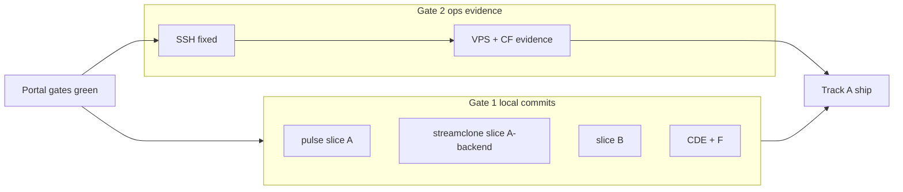

# Release/ops hygiene — what remains

## Two gates (independent)

| Gate | Scope | Blocks website/API ship? |
|------|-------|--------------------------|
| **Gate 1 — Reviewable commits ready** | Local repo hygiene: slice commits, no generated junk, portal gates stay green | No (prep for review/tag) |
| **Gate 2 — Ops launch evidence ready** | SSH + VPS + Cloudflare dashboard evidence | **Yes** (Track A hosted stability) |

Gate 2 does **not** block Gate 1. Finish commit packaging whenever convenient; ops evidence runs after SSH is fixed.

## Already done (do not re-litigate stale failures)

| Area | Status |
|------|--------|
| Portal `typecheck` / `build` / `npm test` | Green (62 files, 342 tests) |
| App vs test tsconfig split + deploy pin | [`tsconfig.json`](c:/Users/Aron/streamclone-pulse/streampulse-web/tsconfig.json), [`pages-deploy-prod.mjs`](c:/Users/Aron/streamclone-pulse/streampulse-web/scripts/pages-deploy-prod.mjs) |
| Console bootstrap race | [`ConsoleChannelView.tsx`](c:/Users/Aron/streamclone-pulse/streampulse-web/src/routes/analytics/ConsoleChannelView.tsx) module-top setup |
| Vitest exclusions documented | [`release-status.md`](c:/Users/Aron/streamclone-pulse/docs/website-portal/release-status.md), [`CONTEXT.md`](c:/Users/Aron/streamclone-pulse/docs/CONTEXT.md) — **no further doc work unless desired** |
| Slice guide + staging commands | [`release-commit-slices.md`](c:/Users/Aron/streamclone-pulse/docs/website-portal/release-commit-slices.md) |
| Ops scripts + remote probe stub | [`release-gap-vps-execute.sh`](c:/Users/Aron/twitch-7tv-clone/scripts/ops/release-gap-vps-execute.sh), [`release-gap-2026-07-07-remote.md`](c:/Users/Aron/twitch-7tv-clone/docs/ops/evidence/release-gap-2026-07-07-remote.md) |

**Stale `exit_code=1` background Vitest/SSH runs are not blockers.**



---

## Gate 1 — Package dirty work (repo hygiene)

**Goal:** Reviewable commits with no generated artifacts. **Two separate git histories** — never one commit row spanning both repos.

### 1.1 Strict staging (required)

No `git add .`. For each slice:

1. `git add -- <explicit paths from release-commit-slices.md>`
2. `git diff --cached --name-only` — review every staged path
3. Compare staged list to the slice path list in [`release-commit-slices.md`](c:/Users/Aron/streamclone-pulse/docs/website-portal/release-commit-slices.md); reject anything not in slice or on deny-list
4. `git diff --check` on staged paths
5. After **pulse A + B**: `cd streampulse-web && npm run typecheck && npm run build && npm test`

**Deny-list** (never stage): `dist*`, `dist.before-*`, `runtime/`, `test-results/`, `playwright-report/`, `.playwright-mcp/`, `tsconfig.tsbuildinfo`, `.codegraph/`, `.env.local`, root `*.png`, `scripts/tmp/`, `firefox-review/`, `lighthouse-report.json`.

### 1.2 Commit order (when you ask to commit)

Slice **A** is **two coordinated commits** (same release intent, separate repos):

| Order | Repo | Slice ID | Paths (summary) | Message (suggested) |
|-------|------|----------|-------------------|---------------------|
| 1a | **streamclone-pulse** | **A** portal perf | `index.html`, `main.tsx`, `routes/index.tsx`, `usePublicHubData*`, `vite.config.ts`, `hub-fanout-edge-cache.md` | `perf(portal): hub first-load, poll discipline, and cache docs` |
| 1b | **streamclone** | **A-backend** hub cache tests | `internal/analytics/hub_overview_test.go` only | `test(analytics): public hub cache-control and list caps` |
| 2 | streamclone-pulse | **B** build gate | tsconfig split, `ConsoleChannelView`, vitest aliases, test fixes, `pages-deploy-prod.mjs` | `fix(portal): split app/test typecheck and sync console API setup` |
| 3 | streamclone-pulse | **C** hub UI | landing, `HubCommandHeader`, related hub CSS/components | `feat(portal): hub command header and landing polish` |
| 4 | streamclone-pulse | **D** extension | `src/ui/Overlay.tsx` + panel/chart WIP | `fix(extension): overlay and panel updates` |
| 5 | streamclone-pulse | **E** docs/agent | release-status, release-commit-slices, `.cursor/*`, `AGENTS.md` | `docs: release gap closure and agent runbooks` |
| 6 | streamclone | **F** ops scripts | `scripts/ops/*`, `docs/ops/*`, evidence stub | `docs(ops): release gap closure runbooks and hosted probes` |

**Defer** unrelated WIP: [`extension_api.go`](c:/Users/Aron/twitch-7tv-clone/internal/analytics/extension_api.go), `pulse-charts`, `chartRollupUtils`, `streampulse-web/README.md`, dev scripts, design PNGs.

**Align docs when executing:** update [`release-commit-slices.md`](c:/Users/Aron/streamclone-pulse/docs/website-portal/release-commit-slices.md) to name **A** (pulse) and **A-backend** (streamclone) as separate commits, not one combined slice row.

### Gate 1 acceptance

- Each slice committed with explicit path staging + cached name verification
- No generated artifacts in any commit
- Portal `typecheck` / `build` / `npm test` green after slice B
- Vitest exclusions already documented — **no change required**

---

## Vitest exclusions (accept as-is)

Unit suite intentionally skips two hub landing tests; E2E owns honesty. Documented in `release-status.md`, `vitest.config.ts`, and `CONTEXT.md`. **Do not spend time** on doc-link comments unless you want a tiny follow-up.

| Excluded unit test | Reason | E2E owner |
|--------------------|--------|-----------|
| `analyticsLandingPage.test.tsx` | stats-fallback OOM/hang | `tests/e2e/analytics-hub-metrics-honesty.spec.ts` |
| `analyticsHubEmpty.test.tsx` | full landing render hang | above + `tests/e2e/analytics-hub-ux.spec.ts` |

---

## Optional — `usePublicHubData` act() warnings (non-blocking)

Tests pass; stderr shows React `act(...)` warnings. Fix when convenient in a separate `test(portal):` commit — **not** a release gate.

---

## Gate 2 — Ops launch evidence (after SSH)

**Prerequisite:** SSH to streampulse-vps (`aron-wsl` key or Tailscale SSH auth). Does **not** block Gate 1.

```bash
ssh -i ~/.ssh/aron-wsl aron@streampulse-vps hostname
export PULSE_PROBE_SSH_TARGET=streampulse-vps
export PULSE_PROBE_REMOTE_APP=/opt/streamclone/app
```

Run on VPS at `/opt/streamclone/app`. Attach outputs to **streampulse-ops** manifest from [`promotion-manifest-rc18.example.md`](c:/Users/Aron/twitch-7tv-clone/docs/ops/examples/promotion-manifest-rc18.example.md).

| Task | Command / action | Pass criteria |
|------|------------------|---------------|
| Promotion reconcile | `bash scripts/ops/release-gap-vps-execute.sh` | Health `version` = `IMAGE_TAG`; digests in manifest |
| Redis TTL/memory | `hosted-redis-audit.sh` → [`hosted-redis-bounds-runbook.md`](c:/Users/Aron/twitch-7tv-clone/docs/ops/hosted-redis-bounds-runbook.md) | Audit before/after; `rejected_connections` flat |
| Staged limits | [`hosted-limits-staged-runbook.md`](c:/Users/Aron/twitch-7tv-clone/docs/ops/hosted-limits-staged-runbook.md) one stage at a time | No OOM loops; rollback ready |
| Release-check soak | `RELEASE_CHECK_HOURS=2 bash scripts/load/hosted-release-check-soak-loop.sh` | 2–6h transcript; stop conditions clean |
| Cloudflare cache | Dashboard per [`hub-fanout-edge-cache.md`](c:/Users/Aron/streamclone-pulse/docs/website-portal/hub-fanout-edge-cache.md) | `CF-Cache-Status: HIT` or `REVALIDATED` |
| Cloudflare WAF | [`cloudflare-public-hub-waf.md`](c:/Users/Aron/twitch-7tv-clone/docs/ops/cloudflare-public-hub-waf.md) | Hub 200; 45s portal poll OK |

Update [`release-status.md`](c:/Users/Aron/streamclone-pulse/docs/website-portal/release-status.md) Track A ops rows when evidence lands.

### Gate 2 acceptance

- streampulse-ops manifest filled with digests, smoke, soak transcript, CF rule IDs
- `release-status.md` ops checklist reflects evidence paths
- Track A hosted stability gate satisfied for website/API ship

---

## Full Track A ship

Requires **both** gates for production sign-off: Gate 1 (clean reviewable history) + Gate 2 (hosted ops evidence). Gate 1 can complete entirely offline.
