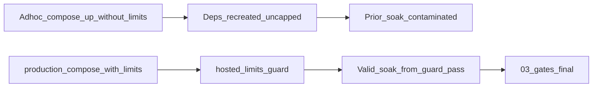

> **HISTORICAL (archived from .cursor/plans).** Not product law. Do not use for routing analytics, ingest, hub, ops, or Pulse work into public Streamclone. See docs/archive/agent-plans/README.md and docs/streampulse-product-boundary.md.
---
name: Persistent limits rc23 gates
overview: "COMPLETE for persistent limits/deploy-path. Limits overlay, guard, production-up, capped rc23 verify, and 03-gates-final executed. Phase D still NO-GO (0% shadow match). Superseded by Shadow Compare Diagnostics workstream."
todos:
  - id: ops-limits-overlay
    content: Add hosted-resource-limits.yml to streampulse-ops and wire into production-compose.sh (always included)
    status: completed
  - id: ops-production-up-guard
    content: Add production-up.sh + hosted-limits-guard.sh (existence + memory + min limits + shm + cpu + pids); hook deploy/smoke
    status: completed
  - id: streamclone-verify-scripts
    content: Add verify-capped-state, fix enable-shadow (--no-deps analytics), hard-fail preconditions/gates on guard
    status: completed
  - id: operator-rc23-verify
    content: "VPS: pull ops, production-up (minimal recreate), guard PASS, verify-capped-state → 04-final-rc23-capped/ + soak-window.md"
    status: completed
  - id: operator-soak-regate
    content: Continue rc23 shadow from guard-pass timestamp; rerun gates → 03-gates-final/; PHASE_D_GO_NOGO
    status: completed
  - id: docs-runbook-update
    content: Update runbook, preconditions, supersede 03-gates; document compose identity in evidence
    status: completed
isProject: false
---

# Persistent limits + final rc23 Phase C gates

**Status: COMPLETE for persistent limits** (infrastructure/deploy-path). **Phase D: still NO-GO.** **Next blocker:** shadow compare 0% match. **Next workstream:** [Shadow Compare Diagnostics](shadow_compare_diagnosis_867490e3.plan.md).

This plan resolves the persistent Docker limits/deploy-path issue. It does not resolve Phase C shadow parity. Since `03-gates-final/` returned 0% shadow match, the next workstream is shadow compare diagnostics. Phase D remains blocked.

Do not keep iterating on limits unless `hosted-limits-guard.sh` fails again.

## Current target

```text
rc23 shadow continues
legacy remains writer
all hot containers capped
old uncapped soak excluded
rerun gates into 03-gates-final
only then decide Phase D
```

**Hard stops:** No `INGEST_CORE_ENABLED=1`. No 500/50. No raw `docker compose up` in production.

---

## Problem (confirmed)

[`streampulse-ops/scripts/lib/production-compose.sh`](c:/Users/Aron/streampulse-ops/scripts/lib/production-compose.sh) merges four compose files but **no limits overlay**. Phase C ad-hoc compose recreated **redis/postgres uncapped**. Repair passes prove caps work when applied manually, but **prior Phase C gate evidence is contaminated** — treat [`03-gates/summary.md`](c:/Users/Aron/streampulse-ops/docs/deployments/ingest-core-phase-c-20260708T010515Z/03-gates/summary.md) as **not final proof**.



---

## Approved execution order

Execute in this exact sequence:

1. Implement ops overlay + `production-up.sh` + `hosted-limits-guard.sh` (streamclone verify/gates scripts in parallel).
2. Pull ops changes on VPS.
3. Run production compose through the new wrapper/path (**minimal recreate** — see Step A).
4. Run `hosted-limits-guard.sh` — must PASS.
5. Run `ingest-phase-c-verify-capped-state.sh` → `04-final-rc23-capped/`.
6. Write `soak-window.md` with **guard-pass timestamp** + compose identity.
7. Continue rc23 shadow **from that timestamp only**.
8. Rerun `ingest-phase-c-gates.sh` → `03-gates-final/`.
9. Produce explicit **`PHASE_D_GO_NOGO`**.

---

## Part 1 — Make limits persistent (streampulse-ops)

### 1a. Add limits overlay

- Source: [`deploy/compose/hosted-resource-limits.compose.yml`](c:/Users/Aron/twitch-7tv-clone/deploy/compose/hosted-resource-limits.compose.yml)
- Target: **`streampulse-ops/compose/production/overlays/hosted-resource-limits.yml`**

| Service | Limit |
|---------|-------|
| redis | 2560m |
| postgres | 2560m + shm 256mb |
| analytics | 3584m, 2 CPU |
| analytics-workers | 1280m, 1 CPU, pids 256 |
| scraper | 1280m, pids 256 |
| minio | 3584m |

### 1b. Wire into `production_compose_args()`

Always append:

```bash
-f "${COMPOSE_DIR}/overlays/hosted-resource-limits.yml"
```

Break-glass only: `HOSTED_LIMITS_OVERLAY=0` (documented; not for Phase C/D).

### 1c. Add `production-up.sh`

**`streampulse-ops/scripts/deploy/production-up.sh`** — sources `production-compose.sh`, forwards `--no-deps` and service list.

**Hard rule — Phase C shadow env edits:**

```text
Any Phase C shadow env edit MUST restart analytics via:
  production-up.sh --no-deps analytics

If redis/postgres are recreated during a shadow env change,
  invalidate that soak window and restart evidence clock.
```

No raw `docker compose up` on VPS for prod.

### 1d. Post-deploy guard (strict)

**`streampulse-ops/scripts/smoke/hosted-limits-guard.sh`**

For each hot service (redis, postgres, analytics, analytics-workers, scraper, minio):

| Check | Fail if |
|-------|---------|
| Container exists | Missing / not running |
| `HostConfig.Memory` | `0` (uncapped) |
| Memory minimum | Below expected floor (e.g. redis ≥ 2GiB, analytics ≥ 3GiB, …) |
| Postgres `ShmSize` | `< 256MiB` |
| Analytics `NanoCpus` | `0` when CPU cap expected |
| Workers/scraper `PidsLimit` | `0` when pids cap expected |

Print raw `docker inspect` evidence for each service on pass or fail.

Wire into:

- [`scripts/deploy/production-deploy.sh`](c:/Users/Aron/streampulse-ops/scripts/deploy/production-deploy.sh) — after `up`
- [`scripts/smoke/production-smoke.sh`](c:/Users/Aron/streampulse-ops/scripts/smoke/production-smoke.sh) — before API probes

---

## Part 2 — Streamclone scripts (sync to VPS)

### 2a. `scripts/ingest-phase-c-verify-capped-state.sh`

Captures: `docker stats`, `docker inspect` (memory/cpu/shm/pids), Redis INFO, extension health, hub ingest/coverage, moments Cache-Control.

Output: `04-final-rc23-capped/` including **`summary.md`** with **compose deploy identity**:

```text
compose files used:
- docker-compose.services.yml
- docker-compose.release.yml
- docker-compose.prod.yml
- overlays/streampulse-vps-production.yml
- overlays/hosted-resource-limits.yml
```

Proves final state came from corrected deploy path, not manual repair.

### 2b. `scripts/ingest-phase-c-enable-shadow.sh`

1. Edit `production.local.env` (Phase C vars only).
2. **`production-up.sh --no-deps analytics`** only.
3. `INGEST_SHADOW_ARTIFACT_DIR=/runtime/ingest-shadow`.

### 2c. Preconditions + gates hard-fail on guard

- [`ingest-phase-c-preconditions.sh`](c:/Users/Aron/twitch-7tv-clone/scripts/ingest-phase-c-preconditions.sh): invoke guard — exit 1 if any hot service uncapped/missing.
- [`ingest-phase-c-gates.sh`](c:/Users/Aron/twitch-7tv-clone/scripts/ingest-phase-c-gates.sh): guard at start; fix `ingest-shadow-compare.sh` path (use script dir, not CWD).

---

## Part 3 — Operator execution (VPS evidence)

### Step A — Deploy limits wiring (minimal recreate)

**Prefer smallest safe operation:**

```text
Analytics-only env/image changes:
  production-up.sh --no-deps analytics

Full-stack recreate ONLY if:
  limits overlay itself is new and must apply to all services, OR
  IMAGE_TAG bump requires migrate + full up
```

When full recreate is needed, use `production-deploy.sh` or `production-up.sh` without `--no-deps` — limits overlay is always included.

### Step B — New baselines after guard PASS

**Guard-pass timestamp** resets all comparison baselines. Do **not** compare final gates to Step 0 or pre-repair uncapped windows.

Record in `04-final-rc23-capped/baselines.md`:

```text
guard_pass_utc: <timestamp>
redis rejected_connections: <value at guard pass>
redis used_memory_human: <value>
docker stats snapshot: <attached>
rollup p95: first stable Prometheus sample after guard pass (or METRIC ABSENT)
```

### Step C — Soak window exclusion

**`04-final-rc23-capped/soak-window.md`:**

```text
Prior Phase C evidence contaminated: redis/postgres recreated uncapped during rc22 shadow restarts.
Manual limit re-applies do not count as deploy-path proof.
Valid soak window starts: <guard_pass_utc>
Excluded: all intervals before guard_pass_utc
```

### Step D — Continue rc23 shadow

- `IMAGE_TAG=v0.3.0-rc23`
- `INGEST_CORE_ENABLED=0`, dual+shadow on, legacy writer
- Allowlist: stage 1 done → top 50 → full 250
- Minimum ≥1000 compare samples before re-gate

### Step E — Final gates

```bash
INGEST_SHADOW_ARTIFACT_DIR=/root/streampulse-ops/compose/runtime/ingest-shadow \
  bash scripts/ingest-phase-c-gates.sh 2 1000 \
  docs/deployments/ingest-core-phase-c-20260708T010515Z/03-gates-final
```

**`03-gates-final/summary.md`** → explicit **`PHASE_D_GO_NOGO`**.

Prior [`03-gates/summary.md`](c:/Users/Aron/streampulse-ops/docs/deployments/ingest-core-phase-c-20260708T010515Z/03-gates/summary.md): banner **superseded — not final proof**.

---

## Part 4 — Docs

| File | Change |
|------|--------|
| [`ingest-core-runbook.md`](c:/Users/Aron/twitch-7tv-clone/docs/pulse-ingest-v2/ingest-core-runbook.md) | Limits in `production_compose`; `--no-deps analytics` mandatory; guard post-deploy; soak invalidation rule |
| [`phase-c-step1-preconditions.md`](c:/Users/Aron/twitch-7tv-clone/docs/pulse-ingest-v2/evidence/phase-c-step1-preconditions.md) | Guard required hard-fail |
| streampulse-ops runbook | `production-up.sh`; forbid raw compose; guard checks table |

---

## Phase D criteria (all required under `03-gates-final/`)

- Shadow compare ≥99% (≥1000 samples)
- No sustained ingest drops
- Redis `rejected_connections` flat vs **guard-pass baseline**
- Analytics memory flat under cap
- Hub healthy + moments Cache-Control
- Artifacts bounded (128MiB rotation)
- **`hosted-limits-guard.sh` PASS** after every restart

**Phase D: NO-GO until all pass.**

---

## Repo split

| Change | Repo |
|--------|------|
| Limits overlay, `production-compose.sh`, `production-up.sh`, `hosted-limits-guard.sh` | **streampulse-ops** |
| Verify/gates/preconditions/enable-shadow scripts, runbook | **streamclone** |
| Evidence | **streampulse-ops** `docs/deployments/ingest-core-phase-c-20260708T010515Z/` |
