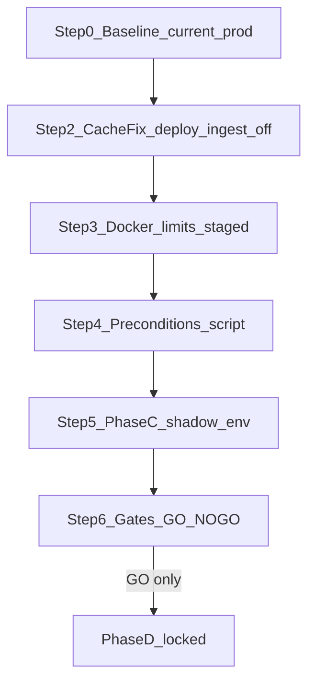

# Phase C operator validation (production)

Repo implementation is **complete**. This plan is **operator-only** execution on production via private **streampulse-ops** (SSH read-only for baseline; deploy/restart only where each step explicitly requires it).

**Hard stops (unchanged):**
- Never set `INGEST_CORE_ENABLED=1` until Phase D is explicitly approved
- Never flip 500/50 until Phase E after Phase D soak
- Never combine Docker limit changes and shadow env in the same analytics restart

**Runtime safety posture for Phase C:** legacy [`Collector`](c:/Users/Aron/twitch-7tv-clone/internal/analytics/collector.go) admits IRC and writes Postgres; ingest-core computes shadow artifacts only (`WritesProduction()` false in [`ingestcore/config.go`](c:/Users/Aron/twitch-7tv-clone/internal/analytics/ingestcore/config.go)).



**Prerequisite at execution start:** user provides local **streampulse-ops** checkout path for SSH/deploy scripts and evidence storage under `docs/deployments/ingest-core-phase-c-<date>/`.

---

## Current production status (known)

From partial Step 0 public probes ([`docs/pulse-ingest-v2/evidence/phase-c-step0-20260708T0047Z/summary.md`](c:/Users/Aron/twitch-7tv-clone/docs/pulse-ingest-v2/evidence/phase-c-step0-20260708T0047Z/summary.md)):

| Check | Status |
|-------|--------|
| Hub / extension health | PASS (`v0.3.0-rc19`, 250/250 IRC) |
| Moments Cache-Control | **FAIL** — valid `bucketT` returns 200 but no `Cache-Control` |
| VPS docker/redis/Postgres/Prometheus | **Pending** |
| Phase C shadow | **NO-GO** |

---

## Step 1 — VPS Step 0 baseline (current prod, read-only)

**Action:** SSH to production host from streampulse-ops; run on **current** image/env before any deploy.

```bash
cd /opt/streamclone/app   # or ops-documented app root
bash scripts/ingest-phase-c-step0-baseline.sh \
  streampulse-ops/docs/deployments/ingest-core-phase-c-<ISO8601>/00-baseline
```

Script: [`scripts/ingest-phase-c-step0-baseline.sh`](c:/Users/Aron/twitch-7tv-clone/scripts/ingest-phase-c-step0-baseline.sh)

**Must capture:**
- `docker ps`, `docker stats --no-stream`
- `redis-cli INFO stats|memory|clients` (record `rejected_connections` baseline)
- `df -h`, `free -h`
- Postgres db size + top-20 tables dead tuples (script uses `docker exec postgres psql`)
- Prometheus queries if `:9090` reachable; else note **metric absent pre-release** for `ingest_*`
- Rollback anchors: analytics image ref/digest, `STREAMCLONE_VERSION`/`IMAGE_TAG`, redacted ingest env vars
- Public API headers/body (hub, moments with aligned `bucketT`, extension health)

**Deliverable:** `00-baseline/summary.md` with pass/fail table and explicit “safe to deploy cache-fix?” recommendation.

**Rules:** no deploy, restart, env edits, compose changes, Redis/Postgres mutations. Redact secrets.

---

## Step 2 — Deploy cache-fix release (ingest-core still disabled)

**Goal:** ship [`hub_historical_moments.go`](c:/Users/Aron/twitch-7tv-clone/internal/analytics/hub_historical_moments.go) Cache-Control + ingest-core code in image; **zero behavior change**.

**Production env (must remain):**

```env
INGEST_CORE_ENABLED=0
INGEST_CORE_DUAL_READ_MODE=0
INGEST_CORE_SHADOW_MODE=0
INGEST_TIERING_ENABLED=0
HUB_ROSTER_LIMIT=250
MAX_ACTIVE_IRC_CHANNELS=250
```

Use streampulse-ops production deploy (pinned `IMAGE_TAG` per [`docs/production-artifact-contract.md`](c:/Users/Aron/twitch-7tv-clone/docs/production-artifact-contract.md)).

**Verify immediately after deploy:**

```bash
bucketT=$(( ($(date +%s)/300*300 - 600) * 1000 ))
curl -I "https://api.streampulse.stream/v1/public/hub/moments?bucketT=${bucketT}&activityWindow=1440"
curl -I 'https://api.streampulse.stream/v1/public/hub?activityWindow=24h'
curl -s 'https://api.streampulse.stream/v1/extension/health' | jq .
```

**Stop condition:** if moments still lacks `Cache-Control` on 200 response — **do not proceed** to limits or shadow.

**Evidence:** `01-preconditions/cache-fix-deploy.md` — new IMAGE_TAG, deploy time, header proof, rollback tag recorded.

---

## Step 3 — Docker limits (separate restarts, staged soak)

Apply fragments from [`deploy/compose/hosted-resource-limits.compose.yml`](c:/Users/Aron/twitch-7tv-clone/deploy/compose/hosted-resource-limits.compose.yml) via streampulse-ops overlay **one service at a time**.

**Suggested order:**
1. scraper / workers caps or disablement
2. MinIO limit
3. Redis limit (+ maxmemory policy if in overlay)
4. Postgres limit
5. analytics limit **last**

**After each change:** wait **15–30 minutes**, then capture:

```bash
docker stats --no-stream
redis-cli INFO stats | grep rejected_connections
curl -s 'https://api.streampulse.stream/v1/extension/health' | jq .
curl -I 'https://api.streampulse.stream/v1/public/hub?activityWindow=24h'
```

If unstable, rollback **that service’s limit** before touching the next.

**Evidence:** `01-preconditions/docker-limits-<service>-<timestamp>.txt` per step.

**Do not** apply limits and Phase C shadow env in the same analytics restart.

---

## Step 4 — Preconditions script

On VPS (or with docker reachable):

```bash
bash scripts/ingest-phase-c-preconditions.sh
```

Script: [`scripts/ingest-phase-c-preconditions.sh`](c:/Users/Aron/twitch-7tv-clone/scripts/ingest-phase-c-preconditions.sh)

**Must exit 0** before shadow. Currently fails only on missing moments Cache-Control (expected until Step 2).

---

## Step 5 — Enable Phase C shadow only

Merge overlay from [`deploy/env/profile-hosted-ingest-core-phase-c.env.example`](c:/Users/Aron/twitch-7tv-clone/deploy/env/profile-hosted-ingest-core-phase-c.env.example):

```env
INGEST_CORE_ENABLED=0
INGEST_CORE_DUAL_READ_MODE=1
INGEST_CORE_SHADOW_MODE=1
INGEST_TIERING_ENABLED=0
HUB_ROSTER_LIMIT=250
MAX_ACTIVE_IRC_CHANNELS=250
CORPUS_WORKERS_ENABLED=0
SCRAPER_ENABLED_ON_API_NODE=0
BACKFILL_MAX_PARALLEL_STREAMS=1
PULSE_MAX_BACKFILLS=1
```

**Restart analytics only** (dedicated restart — not combined with limits).

**Prove legacy writer / shadow-only compute:**

```bash
docker logs <analytics> 2>&1 | grep 'ingest-core active' | tail -3
# expect core_enabled=false dual_read=true shadow=true
curl -s 'https://api.streampulse.stream/v1/public/hub?activityWindow=24h' | jq .ingest
ls -la runtime/ingest-shadow/
```

**Staged allowlist** (allowlist parse fix already in repo [`engine_test.go`](c:/Users/Aron/twitch-7tv-clone/internal/analytics/ingestcore/engine_test.go)):

| Window | Allowlist |
|--------|-----------|
| ~1h | `INGEST_SHADOW_CHANNEL_ALLOWLIST=xqc,ludwig,tarik,kaicenat` (+5–10 total) |
| 3–6h | top 50 |
| 12h | remove allowlist (full 250) |

Restart analytics on each allowlist env change (same image).

**Evidence:** `02-shadow-deploy/` — env diff, startup log, first JSONL lines, `du -sh runtime/ingest-shadow/`.

---

## Step 6 — Gates and Phase D GO/NO-GO

After each allowlist stage and after full 250 soak:

```bash
bash scripts/ingest-phase-c-gates.sh 2 1000
bash scripts/ingest-shadow-compare.sh 2 1000
du -sh runtime/ingest-shadow/
```

Script: [`scripts/ingest-phase-c-gates.sh`](c:/Users/Aron/twitch-7tv-clone/scripts/ingest-phase-c-gates.sh)

**Phase D GO requires all:**

| Gate | Pass |
|------|------|
| Shadow compare | ≥99% (`ingest-shadow-compare.sh`) |
| Drops | `rate(ingest_messages_dropped_total[5m])` ~0 |
| Redis | `rejected_connections` delta flat vs Step 0 |
| Memory | analytics RSS/container flat |
| Rollup p95 | not worse than Step 0 baseline |
| Hub/moments | healthy; Cache-Control present |
| Artifacts | bounded; 128MiB rotation working |
| Logs | no repeated parser/flush/queue errors |
| Writer safety | `INGEST_CORE_ENABLED=0`, dual+shadow on, legacy sole PG writer |

**Deliverable:** `03-gates/summary.md` with explicit **`PHASE_D_GO_NOGO: GO`** or **`NO-GO`**.

Phase D and Phase E remain **locked** until operator sign-off on a clean GO.

---

## Repo artifacts already in place (no code changes expected)

- Ops scripts: `scripts/ingest-phase-c-{step0-baseline,preconditions,gates}.sh`
- Runbook: [`docs/pulse-ingest-v2/ingest-core-runbook.md`](c:/Users/Aron/twitch-7tv-clone/docs/pulse-ingest-v2/ingest-core-runbook.md)
- Checklists: `docs/pulse-ingest-v2/evidence/phase-c-step{1,2,3}-*.md`
- Allowlist fix + tests + shadow rotation (128MiB) in `internal/analytics/ingestcore/`

**Do not edit** [`.cursor/plans/phase_c_shadow_validation_a1cede04.plan.md`](c:/Users/Aron/.cursor/plans/phase_c_shadow_validation_a1cede04.plan.md).
