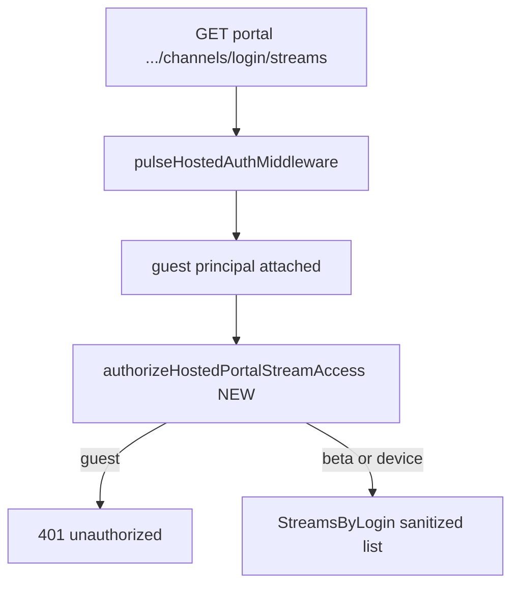

# Portal channel streams auth hotfix

## Root cause

On hosted BearHost, [`pulseHostedAuthMiddleware`](C:/Users/Aron/streamclone-prod-sync/internal/analytics/pulse_device_auth.go) **always forwards** requests — it attaches a `guest` principal when no beta key/device token is present (lines 175–177). Timeline leakage is blocked **per handler** via [`authorizeHostedStreamTimelineAccess`](C:/Users/Aron/streamclone-prod-sync/internal/analytics/pulse_hosted.go).

| Handler | Guard today | Prod unauth |
|---------|-------------|-------------|
| `portalChannelLive` | yes (line 552) | **401** |
| `portalChannelStreams` | **missing** | **200** (leak) |
| `portalStreamMinutes` | yes (line 391) | **401** |

Fix: one guard at the top of `portalChannelStreams`, before store lookup — same as live/minutes.

```go
func (h *Handler) portalChannelStreams(w http.ResponseWriter, r *http.Request) {
    if !h.authorizeHostedPortalStreamAccess(w, r) {
        return
    }
    // existing store/login/limit logic unchanged
}
```

File: [`internal/analytics/portal_analytics_api.go`](C:/Users/Aron/streamclone-prod-sync/internal/analytics/portal_analytics_api.go) (~line 508).

## Code change (streamclone)

Work in **[`streamclone-prod-sync`](C:/Users/Aron/streamclone-prod-sync)** only. Production change: handler guard + tests + smoke script (same commit).

### 0. Hard stop — branch + clean tree (before any edit)

Porcelain-empty alone is **not** sufficient. `streamclone-prod-sync` has been on `feat/analytics-console-package...origin/master` at the right SHA — commits from that branch can push to the wrong ref or fail oddly.

**Required pre-edit sequence:**

```bash
cd /mnt/c/Users/Aron/streamclone-prod-sync   # or C:\Users\Aron\streamclone-prod-sync
git fetch origin
git switch master
git pull --ff-only origin master
git log -1 --oneline                        # expect at or after 6aa8a22
git branch --show-current                   # MUST print: master
git status --porcelain --untracked-files=all  # MUST be empty
```

**Hard stop** unless:

- Current branch is **`master`** tracking **`origin/master`** (or an explicit hotfix branch e.g. `fix/portal-streams-auth` cut from `origin/master` — if using hotfix branch, push/merge to `master` before deploy)
- Porcelain is empty (remove any `scripts/tmp/` before rsync)

Do **not** rsync from dirty tree or from `feat/*` worktree branch.

## Tests

Add to [`internal/analytics/portal_analytics_api_test.go`](C:/Users/Aron/streamclone-prod-sync/internal/analytics/portal_analytics_api_test.go) (mirror [`TestPortalStreamMinutesUnauthorizedHosted`](C:/Users/Aron/streamclone-prod-sync/internal/analytics/portal_analytics_api_test.go)):

| Test | Setup | Request | Expect |
|------|-------|---------|--------|
| `TestHostedPortalChannelStreamsUnauthorizedWithoutAuth` | `Hosted: true`, `store: nil` | `GET /v1/portal/analytics/channels/ludwig/streams` (no headers) | **401**; decode JSON — `error == "unauthorized"`; body must **not** contain `"items"` |
| `TestHostedPortalChannelStreamsAllowsBetaKey` | `Hosted: true`, `BetaKeys: []string{"secret-one"}`, `store: nil` | same path + `X-Streamclone-Beta-Key: secret-one` | **503** exactly; payload `error == "store_unavailable"` (proves guard passed, handler reached store check) |
| `TestNonHostedPortalChannelStreamsAllowsGuest` | `Hosted: false`, `store: nil` | same path, no auth | **503** exactly; payload `error == "store_unavailable"` (local mode unchanged — no 401 from guard) |

Optional: device bearer token route test via pattern in [`TestHostedStreamTimelineAuthMiddlewareAcceptsBetaKey`](C:/Users/Aron/streamclone-prod-sync/internal/analytics/hosted_analytics_auth_test.go).

Run focused gate:

```bash
go test ./internal/analytics -run "TestHostedPortalChannelStreams|TestPortalStreamMinutesUnauthorizedHosted|TestHostedChannelLive"
```

## Smoke script regression (mandatory, same commit)

[`scripts/pulse-hosted-boundary-smoke.sh`](C:/Users/Aron/streamclone-prod-sync/scripts/pulse-hosted-boundary-smoke.sh) Phase A currently checks raw analytics paths (lines 115–126) but **does not** check portal channel routes — which is why the streams leak shipped.

**Required change** in `phase_a_public_boundary`: extend the unauth 401 loop to include portal channel routes alongside raw live:

```bash
for path in \
  "/v1/analytics/channels/ludwig/live" \
  "/v1/analytics/channels/ludwig/live?sparse=false" \
  "/v1/analytics/streams/${STREAM_ID}" \
  "/v1/portal/analytics/channels/ludwig/live" \
  "/v1/portal/analytics/channels/ludwig/streams"; do
  # expect HTTP 401 unauthenticated
done
```

This is **not** optional — it prevents recurrence. `PUBLIC_BOUNDARY=PASS` must cover portal streams (and portal live) after deploy.

## Commit

Conventional commit on streamclone **`master`** (handler + tests + smoke script):

```
fix(analytics): gate hosted portal channel streams list
```

Author: Aron-Chu per repo rules. Push to `origin/master` before deploy.

## BearHost redeploy (same machinery as P4)

From **prod-sync on `master`**, porcelain empty (WSL for bash steps):

```bash
make bearhost-rsync   # or: powershell scripts/bearhost-rsync-to-vps.ps1
BEARHOST_ANALYTICS_GATE_REMOTE=1 make bearhost-analytics-predeploy-gate
bash scripts/bearhost-pulse-redeploy-remote.sh   # build analytics + recreate
```

**Hard stops:** `MIGRATION_000050=PASS`, `ANALYTICS_DEPLOY_GATE=PASS`, `BEARHOST_BUILD_LOCAL=1` on VPS.

**Do not:** apply 051+ migrations; enable IVR shadow; use `bearhost-pulse-api-remote.sh` alone (no rebuild).

## Post-deploy smoke

```bash
curl -sS -o /dev/null -w '%{http_code}\n' \
  https://api.streampulse.stream/v1/portal/analytics/channels/ludwig/streams
# expect 401

bash scripts/pulse-hosted-boundary-smoke.sh          # PUBLIC_BOUNDARY=PASS (includes new portal paths)
bash scripts/pulse-hosted-boundary-smoke-auth.sh     # CHART_CANARY=PASS
```

## Success criteria

```text
CHECKOUT_ON_MASTER=PASS
portal streams unauth = 401   (was 200)
portal live unauth = 401      (unchanged)
raw live unauth = 401
public hub = 200
PUBLIC_BOUNDARY=PASS          (smoke Phase A includes portal live + streams)
CHART_CANARY=PASS
MIGRATIONS_051+=NOT_APPLIED
IVR_SHADOW=HOLD
```

After this, chart/data quality issues are adapter/data debugging — security boundary is closed.


