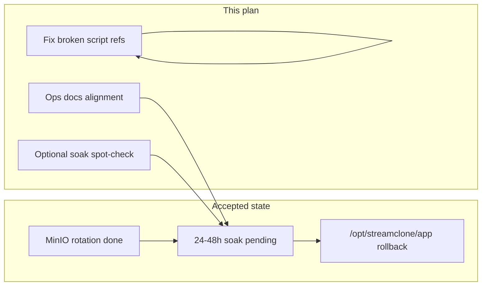
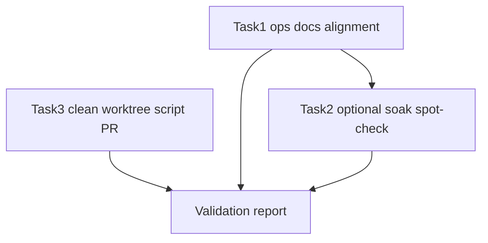

# Post-migration follow-ups (revised)

## Hard rules

- **Use clean worktrees** — not `/mnt/c/Users/Aron/twitch-7tv-clone` dirty checkout (local HEAD ≠ GitHub `master` @ `0e4704a`).
- **No deploy**, **no MinIO rotation**, **no** `/opt/streamclone/app` deletion, **no release tags**, **no TOP500 rename**.
- **Do not regenerate or commit codegraph** unless a documented tracked generated artifact is stale (none expected).

## Current truth (authoritative)

| Item | State |
|------|--------|
| Public **streamclone** `master` | **`0e4704a`** — PR #42 + #43 merged |
| Live production | **`v0.3.0-rc8`** |
| MinIO app cred rotation | **Done** — evidence [`streampulse-ops/docs/deployments/2026-07-04-minio-rotation.md`](../../streampulse-ops/docs/deployments/2026-07-04-minio-rotation.md) (strict env/compose, smoke, bucket, emote health passed post-rotation) |
| `/opt/streamclone/app` | **Rollback only** until MinIO **soak sign-off** |
| Public docs on `master` | [`docs/hosted-production-ops.md`](../../docs/hosted-production-ops.md) and [`docs/production-artifact-contract.md`](../../docs/production-artifact-contract.md) **already exist** — do not recreate |
| `scripts/lib/bearhost-*` on GitHub `master` | **Absent** (removed with PR #42) |
| Active broken references | Scripts still **source or call deleted** BearHost helpers — fix these |



---

## Task 1 — streampulse-ops docs-only cleanup

**Worktree:** clean checkout of `streampulse-ops` `main` (not dirty local copy if diverged).

**Goal:** Single coherent story — rotation **done**, strict validation **passes post-rotation**, **soak pending** before legacy app cleanup.

### Files to align

| File | Fix |
|------|-----|
| [`docs/deployments/2026-07-04-v0.3.0-rc8.md`](../../streampulse-ops/docs/deployments/2026-07-04-v0.3.0-rc8.md) | Remove contradiction: deploy-time “validation skipped / minioadmin debt” vs later “rotation completed.” Split into **at deploy** (skipped) vs **post-rotation** (passes — link rotation evidence). Remove any line still saying rotation is “scheduled.” |
| [`docs/deployments/POST-SOAK-FOLLOWUPS.md`](../../streampulse-ops/docs/deployments/POST-SOAK-FOLLOWUPS.md) | MinIO rotation = **Done**; add explicit **Soak in progress / pending sign-off** row with start date from rotation evidence (`2026-07-04`); legacy app cleanup = **Deferred until soak complete** |
| [`docs/runbooks/minio-credential-rotation.md`](../../streampulse-ops/docs/runbooks/minio-credential-rotation.md) | Update “Current known state” and strict-validation wording: **post-rotation** strict validation **passes** when `S3_*` are rotated; `MINIO_ROOT_*` may remain volume root. Mark runbook status **Executed 2026-07-04** + **Soak phase** (not “execute only / scheduled”). Trim duplicate blank lines if editing (avoid CRLF-only churn). |

### New doc (ops)

[`docs/runbooks/legacy-app-checkout-archival.md`](../../streampulse-ops/docs/runbooks/legacy-app-checkout-archival.md):

- Preconditions: MinIO soak complete; active deploy = `~/streampulse-ops`; rollback tag `v0.3.0-rc7`
- Do not delete `minio-data` or run `down -v`
- Steps: tarball → verify ops-only deploy → remove/rename checkout → evidence in `docs/deployments/`
- Link from minio runbook soak section + POST-SOAK

**Commit:** `docs(ops): align MinIO post-rotation state and soak gates` (Aron-Chu only).

**Validation:**

```bash
git diff --check
# manual: no "scheduled" / "fails until" for app S3_* post-rotation in active runbook state tables
```

**Do not push** unless explicitly requested.

---

## Task 2 — P0 reframe: post-rotation soak validation (optional spot-check)

**Not** “does rotation stand?” — evidence already accepted in [`2026-07-04-minio-rotation.md`](../../streampulse-ops/docs/deployments/2026-07-04-minio-rotation.md).

**Optional** read-only VPS spot-check to **start or confirm soak clock** (no mutations):

```bash
cd ~/streampulse-ops
export IMAGE_TAG=v0.3.0-rc8
bash scripts/smoke/validate-production-env.sh --strict env/production.local.env
IMAGE_TAG=$IMAGE_TAG bash scripts/smoke/validate-production-compose.sh
bash scripts/smoke/production-smoke.sh
test -d /opt/streamclone/app && echo LEGACY_APP=present
```

**Record:** append soak start timestamp to POST-SOAK (not a new “reconciliation” doc unless spot-check **fails** — then file `docs/deployments/2026-07-04-minio-soak-anomaly.md` with failure summary only).

**Soak pass criteria (24–48h):** recurring smoke + strict validation green; extension `degraded.*` false; hub not critical/missing; no sustained emote S3 errors.

---

## Task 3 — Public streamclone: fix broken script dependents (narrow PR)

**Worktree setup:**

```powershell
git worktree add ..\streamclone-post-migration-fix origin/master
# verify: git rev-parse HEAD == 0e4704a (or current remote master)
cd ..\streamclone-post-migration-fix
git checkout -b fix/broken-bearhost-script-refs
```

**Do not** commit from dirty `twitch-7tv-clone` checkout. **Do not** recreate `docs/hosted-production-ops.md` or `production-artifact-contract.md`.

### Scope (only broken active scripts)

| Script | Problem | Fix approach |
|--------|---------|--------------|
| [`scripts/archive-restore-drill.sh`](../../scripts/archive-restore-drill.sh) | Sources deleted `bearhost-corpus-preflight.sh`, calls deleted `bearhost-go-run.sh` | Inline Azure secret path check (`ARCHIVE_AZURE_CONNECTION_STRING_FILE` / `/etc/streamclone/secrets/`); use `go run` directly or existing local helper |
| [`scripts/ops-000-archive-preflight.sh`](../../scripts/ops-000-archive-preflight.sh) | Sources deleted `bearhost-compose.sh` / bearhost compose overlays | Convert to local `deploy/docker-compose.yml` + archive profile **or** delegate to [`scripts/ops-stub.sh`](../../scripts/ops-stub.sh) with message that archive preflight moved to streampulse-ops |

### Also grep (master worktree)

- `scripts/pulse-hosted-boundary-smoke*.sh` — if they still reference `bearhost-ssh` on **GitHub master**, refactor to neutral helper or skip-remote; if already fixed on master, **no change**.
- Confirm **`scripts/lib/bearhost-*` remains absent** — do not delete libs that are already gone.

### Out of scope for this PR

- Deleting `scripts/lib/bearhost-*` (already gone on master)
- Recreating hosted-production-ops stub
- Bulk audit doc commits from local dirty tree
- Rewriting historical `docs/scraping-archive/*` (classify as historical only)

**Optional manifest note:** one line in [`docs/ops-migration-manifest.md`](../../docs/ops-migration-manifest.md) §5 — “lib bearhost removed PR #42; this PR fixes remaining script references.”

**Validation:**

```bash
git diff --check
rg 'bearhost-corpus-preflight|bearhost-go-run|bearhost-compose|scripts/lib/bearhost' scripts/ --glob '!*.md'
make check-quick   # if scripts changed materially
```

**PR:** `fix(ops): repair archive scripts after bearhost helper removal`

---

## Task 4 — Codegraph

- **No action** unless P2 script moves cause local MCP staleness → `make codegraph` locally only.
- CI codegraph rebuild **passed** after PR #43 (`28693467644`).

---

## Task 5 — Deferred

- **TOP500 / live-roster naming** — no changes.
- **Branch protection on public master** — manual, noted in POST-SOAK only.

---

## Execution order



1. **Task 1** — ops docs (unblocks coherent soak narrative)
2. **Task 3** — public script PR from clean worktree (parallel OK)
3. **Task 2** — optional VPS soak spot-check (operator)
4. **Report** — files changed, validation, stale ref classification, soak readiness for legacy app archival

---

## Deliverables / report template

| Output | Content |
|--------|---------|
| Files changed | List per repo; no dirty-checkout accidental files |
| Validation | `git diff --check`, `rg` proof for active script refs |
| Stale refs | Table: historical doc vs active broken vs fixed |
| Soak readiness | Ready for legacy app **planning** after docs aligned; **execution** only after 24–48h soak spot-checks green |
| Codegraph | Regenerated? yes/no |

---

## Removed from prior plan (superseded)

- ~~P0 MinIO “reconciliation” doc questioning rotation~~
- ~~P5 commit audit docs from dirty local checkout~~
- ~~P3 create hosted-production-ops.md~~ (exists on `master`)
- ~~P2 delete 7× `scripts/lib/bearhost-*`~~ (already gone on `master`; fix dependents only)
