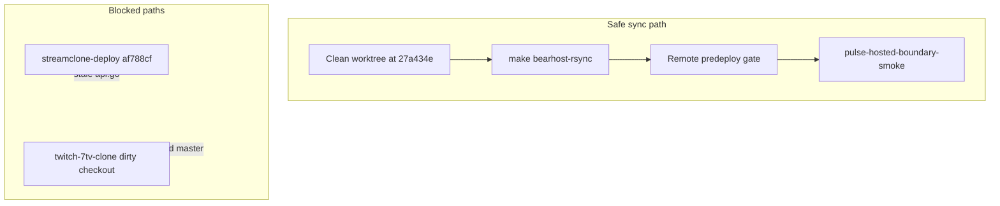

# Post Phase 2 cleanup batches A–D

## Current state (verified)

| Item | Status |
|------|--------|
| [`origin/master`](https://github.com/Aron-Chu/streamclone) | `27a434e` — compile fix, migrations 045–049, jq smoke |
| Prod API | Good (health 200, live 401, emotes overview 200 unavailable) |
| Prod schema | Version **50** (no recreate needed) |
| [`fix/public-emotes-overview-fallback`](https://github.com/Aron-Chu/streamclone-pulse) | Remote `2394af3` — **exactly 2 files** vs `origin/master`; **no GitHub PR opened yet** |
| **Do not use for sync** | [`C:\Users\Aron\streamclone-deploy`](C:\Users\Aron\streamclone-deploy) at `af788cf` (pre-cleanup, dirty `api.go`); local [`master`](C:\Users\Aron\twitch-7tv-clone) at `af788cf` (3 commits behind) |
| [`streamclone-master-cleanup`](C:\Users\Aron\streamclone-master-cleanup) | Exists but at older `f76493f`; refresh to `27a434e` before use |



---

## Batch A — Prod reproducibility sync (execute)

### A1. Prepare clean deploy checkout

Use **one** of these (prefer refresh existing worktree):

```powershell
# Option A: refresh existing cleanup worktree
cd C:\Users\Aron\streamclone-master-cleanup
git fetch origin
git checkout --detach 27a434e   # or: git checkout -B prod-sync origin/master
git status --short              # must be empty — no untracked files under rsync path
git log -1 --oneline            # must show 27a434e or newer
```

**Rsync source must be truly clean.** [`bearhost-rsync-to-vps.sh`](C:/Users/Aron/twitch-7tv-clone/scripts/bearhost-rsync-to-vps.sh) does **not** exclude `scripts/tmp/` — untracked temp files **will** sync to VPS. Remove or relocate `scripts/tmp/` before rsync, or use a fresh worktree with zero untracked files.

If worktree is unusable, create a new one from main repo:

```powershell
cd C:\Users\Aron\twitch-7tv-clone
git fetch origin
git worktree add C:\Users\Aron\streamclone-prod-sync 27a434e
```

**Pre-flight file check** (in clean worktree only):

```powershell
Test-Path migrations/000045_emote_name_text.up.sql
Test-Path migrations/000049_gold_vod_segments.up.sql
Test-Path migrations/000050_stream_chat_source.up.sql
# All must be True
```

Confirm [`internal/analytics/api.go`](C:/Users/Aron/streamclone-master-cleanup/internal/analytics/api.go) on clean checkout has **no** `PublicEmoteMaterializationRoutes` call (dirty local repo still has it at line 99 — expected WIP divergence).

### A2. Rsync to VPS

From clean worktree via WSL (rsync + SSH key):

```bash
cd /mnt/c/Users/Aron/streamclone-prod-sync   # or streamclone-master-cleanup
make bearhost-rsync
```

[`scripts/bearhost-rsync-to-vps.sh`](C:/Users/Aron/twitch-7tv-clone/scripts/bearhost-rsync-to-vps.sh) uses `rsync --delete` — safe **now** because 045–049 are committed on `27a434e`. This restores missing migration files on VPS without changing prod schema.

**Optional read-only post-rsync check** (SSH, no migrate):

```bash
bearhost_ssh "ls /opt/streamclone/app/migrations/00004{5,6,7,8,9}_*.sql /opt/streamclone/app/migrations/000050_*.sql | wc -l"
# Expect 12 files
```

**Do not run** `make migrate` or `bearhost-pulse-api.sh` unless gate/smoke fail in a way that indicates code/schema drift — ask first.

### A3. Read-only gates (no recreate)

```bash
BEARHOST_ANALYTICS_GATE_REMOTE=1 make bearhost-analytics-predeploy-gate
```

Require:

- `MIGRATION_000050=PASS`
- `BLOCK_ANALYTICS_RECREATE=0`
- `ANALYTICS_DEPLOY_GATE=PASS`

### A4. Smoke (unauthenticated)

From clean worktree:

```bash
bash scripts/pulse-hosted-boundary-smoke.sh
```

Require: `PUBLIC_BOUNDARY=PASS`, `VOD_EXTENSION_CANARY=PASS` (DB-backed fixture path).

### A5. Smoke (authenticated — beta key from VPS, redacted)

Read first key read-only via BearHost SSH from `/etc/streamclone/secrets/pulse-beta.env` (same pattern as [`deploy/env/profile-bearhost-pulse.env`](C:/Users/Aron/twitch-7tv-clone/deploy/env/profile-bearhost-pulse.env) `PULSE_BETA_KEYS`):

```bash
# Agent: parse first comma-separated key into env var only; never echo/log it
PULSE_BETA_KEY=<from_vps_secret> bash scripts/pulse-hosted-boundary-smoke.sh
```

Require: `CHART_CANARY=PASS` (and re-confirm `VOD_EXTENSION_CANARY=PASS` with auth if applicable).

### A6. Stop conditions

| Signal | Action |
|--------|--------|
| Gate PASS + smoke PASS | Report verdict lines; **stop** (no redeploy) |
| Gate FAIL on migration columns | Investigate VPS schema read-only; **do not** recreate analytics without approval |
| Smoke FAIL on emotes/VOD | Re-run with fixed script at `27a434e` (curl body capture fix is already on master); if still failing, report blocker |
| Code on VPS differs from running container | Ask before `bearhost-pulse-api.sh` |

---

## Batch B — streamclone-pulse narrow fallback PR (execute)

### B1. Trust remote branch as SoT

Remote [`origin/fix/public-emotes-overview-fallback`](https://github.com/Aron-Chu/streamclone-pulse) at `2394af3` diff vs `origin/master`:

- [`streampulse-web/src/lib/publicEmotesOverview.ts`](C:/Users/Aron/streamclone-pulse/streampulse-web/src/lib/publicEmotesOverview.ts)
- [`streampulse-web/tests/publicEmotesOverview.test.ts`](C:/Users/Aron/streamclone-pulse/streampulse-web/tests/publicEmotesOverview.test.ts)

**Do not** run `git reset --hard` inside [`C:\Users\Aron\streamclone-pulse`](C:\Users\Aron\streamclone-pulse) — that checkout is dirty with tracked and untracked WIP. Use a **clean worktree** at the remote PR branch instead:

```powershell
cd C:\Users\Aron\streamclone-pulse
git fetch origin
git worktree add C:\Users\Aron\streamclone-pulse-pr origin/fix/public-emotes-overview-fallback
cd C:\Users\Aron\streamclone-pulse-pr
git status --short    # must be empty
git log -1 --oneline  # 2394af3
```

Inspect or verify the two-file diff from the worktree or GitHub — never reset the dirty main checkout.

**Do not** merge or cherry-pick from `fix/global-emotes-fallback` (118 commits / 424 files).

### B2. Test

```powershell
cd C:\Users\Aron\streamclone-pulse-pr\streampulse-web
npm run test -- tests/publicEmotesOverview.test.ts
```

### B3. PR readiness

- Open PR if not exists: `gh pr create --base master --head fix/public-emotes-overview-fallback`
- Verify PR files tab shows **only** the two files above
- Explicitly exclude: `GlobalEmotes.tsx`, route wiring, atlas CSS, hubFormat, analytics hub, Emoteverse prototypes
- Mark **safe to merge** if tests pass and diff stays two files

---

## Batch C — Dirty worktree triage (read-only, no deletes)

### Streamclone [`C:\Users\Aron\twitch-7tv-clone`](C:\Users\Aron\twitch-7tv-clone)

| Class | Paths | Recommendation |
|-------|-------|----------------|
| **Already shipped** (on `27a434e`) | Compile fix, 045–049, jq smoke — local `master` still at `af788cf` | Inspect `origin/master` from a **clean worktree** (`git log origin/master`). Fast-forward local `master` only **after** tracked WIP is branched or stashed — never merge into a dirty checkout |
| **Full Global Emotes batch** | `public_emote_materialization_status*.go`, `public_emote_provider_materializer.go`, `public_emotes_overview.go`, `migrations/000051–000054` | Branch: `feat/public-emotes-materializer` from `27a434e` |
| **Analytics console package** | `packages/analytics-console/` (local only — **not** on `origin/master`; only `packages/pulse-core/` is shipped) | Branch: `feat/analytics-console-package` or fold into hub batch |
| **Secrets / temp** | `scraper.env`, `scripts/tmp/` | Keep gitignored; never commit |

### Streamclone-pulse [`C:\Users\Aron\streamclone-pulse`](C:\Users\Aron\streamclone-pulse)

| Class | Paths | Recommendation |
|-------|-------|----------------|
| **Shipped separately** | `publicEmotesOverview.ts` + test | Use PR branch only; untracked copies elsewhere are redundant |
| **Analytics hub WIP** | `streampulse-web/src/routes/dashboard/Home.tsx`, `GlobalEmotes.tsx`, `src/ui/components/hub/`, hub tests, tailwind/tokens | Branch: `feat/analytics-hub-wip` or restore `stash@{2}`/`stash@{3}` (`feat/analytics-hub-p3-channel`) |
| **Global emotes page WIP** | Overlaps hub + `fix/global-emotes-fallback` | Keep on `fix/global-emotes-fallback` + `stash@{0}` |
| **Extension VOD/recap WIP** | `src/vod/`, `VodReplayPulse.tsx`, `recap*.ts`, `livePoll.ts`, `pulsePayloadMerge.ts` | Branch: `feat/extension-vod-recap` or `stash@{1}` (`feat/sidebar-refresh-clean`) |
| **Emoteverse prototypes** | `streampulse-web/prototypes/emoteverse/` | No branch merge; prototype-only folder |
| **Secrets / temp** | `.env.local`, `cloudflaresecrets.txt`, `playwright-report/`, `runtime/`, `.playwright-mcp/` | Keep local; add to `.gitignore` if missing |

**No** `git reset --hard`, `git clean`, or stash drops in dirty checkouts. Use **worktrees** for Batch A/B instead.

---

## Batch D — Next-option menu (plan only, do not execute)

### Option 1: Full Global Emotes

**Readiness:** Low — WIP exists locally (051–054 migrations, materializer, status route) but **not** on master; prod returns `state=unavailable`.

**Scope:**

- Commit migrations 051–054 + materializer/status route (or remove dangling WIP cleanly)
- Wire [`PublicEmoteMaterializationRoutes`](C:/Users/Aron/twitch-7tv-clone/internal/analytics/api.go) only when handler file ships
- Replace placeholder overview with real aggregate data (`aggregateOnly=false`, meaningful previews)
- Tests: Go materializer + portal `GlobalEmotes.tsx` + hosted smoke with real 200 data
- Pages deploy after API deploy + gate pass

**Risk:** Schema migration on prod; analytics recreate may be required after 051+ apply.

### Option 2: IVR shadow canary

**Readiness:** **HOLD** — [`profile-bearhost-corpus-ivr-shadow.env`](C:/Users/Aron/twitch-7tv-clone/deploy/env/profile-bearhost-corpus-ivr-shadow.env) exists but must not enable.

**Prerequisites:**

- Explicit approval
- Corpus workers running; Ludwig/benchmark artifacts present
- Gate: zero `chat_source='ivr'` rows in prod rollups
- Shadow-only overlay; no chart rollup writes from IVR

**Risk:** High — can pollute Gold/corpus paths if gates skipped.

### Option 3: Analytics Hub hardening

**Readiness:** Medium — large untracked hub WIP in pulse repo. **`@streamclone/analytics-console`** / [`packages/analytics-console/`](C:/Users/Aron/twitch-7tv-clone/packages/analytics-console/) is **local WIP only** (not on `origin/master`); portal channel/stream AnalyticsConsole integration is a **future batch**, not current shipped master state.

**Scope:**

- Audit [`streampulse-web/src`](C:/Users/Aron/streamclone-pulse/streampulse-web/src) for raw `/v1/analytics/*` usage; enforce portal/gated client ([`streamcloneAnalytics.ts`](C:/Users/Aron/streamclone-pulse/streampulse-web/src/lib/streamcloneAnalytics.ts))
- Hub home stays search-first; full charts only on `/analytics/{login}` once AnalyticsConsole package lands
- Playwright smoke against `https://api.streampulse.stream` with beta key

**Risk:** Low if limited to routing/client audit; medium if merging full hub WIP in one batch.

### Option 4: Emoteverse prototype

**Readiness:** High for docs/polish; **no prod impact**.

**Scope:** [`streampulse-web/prototypes/emoteverse/`](C:/Users/Aron/streamclone-pulse/streampulse-web/prototypes/emoteverse/) — labeling, index page, design tokens only unless explicitly promoted.

**Risk:** None to prod.

### Recommended sequencing

1. **Batch A** (prod sync) — immediate, lowest risk
2. **Batch B** (merge two-file pulse PR) — client-side fallback only
3. **Option 3** (hub hardening) **or** **Option 1** (Global Emotes) — product choice; Option 3 is safer next step
4. **Option 2** remains HOLD
5. **Option 4** parallel / anytime

---

## Final report template (fill after execution)

```text
PROD_SYNC=PASS|FAIL (rsync + VPS migration files present)
MIGRATION_000050=PASS|FAIL
BLOCK_ANALYTICS_RECREATE=0|1
ANALYTICS_DEPLOY_GATE=PASS|FAIL
PUBLIC_BOUNDARY=PASS|FAIL
CHART_CANARY=PASS|SKIP|FAIL
VOD_EXTENSION_CANARY=PASS|FAIL
PULSE_PR_STATUS=OPEN_READY|OPEN_NEEDS_FIX|NOT_OPEN
DIRTY_WORKTREE_SUMMARY=<one-line per repo>
RECOMMENDED_NEXT_OPTION=<Option 1|2|3|4 + rationale>
IVR_SHADOW_CANARY=HOLD
```
