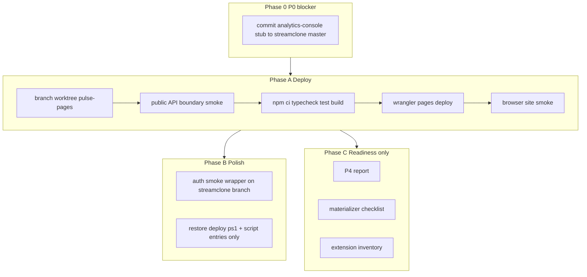

# Post–PR #15 safe forward progress (rev 2)

## Verdict

**Do not Pages-deploy until the `analytics-console` dependency is reproducible on streamclone `master`.** That is the one real blocker. Everything else is ordering and ops cleanup.

Recommended order:

1. Commit minimal `packages/analytics-console` stub/package to streamclone `master` (or remove the `file:` dependency from pulse until P4).
2. Recreate clean Pages worktree on an explicit branch.
3. Run public API boundary smoke **before** deploy.
4. Run `streampulse-web` gates (ci, typecheck, test, build).
5. Deploy Pages.
6. Browser smoke `/analytics`, `/analytics/ludwig`, `/analytics/streams`.

Hard boundaries unchanged: **no IVR**, **no 051+**, **no extension mix**, **no analytics recreate**, **clean worktrees only**.

---

## What PR #15 shipped (portal frontend context)

Pulse `origin/master` @ `55012d4` (merge PR #15) — this is what Pages will deploy:

| Surface | Behavior |
|---------|----------|
| **`/analytics` (public)** | Search-first analytics hub — [`Home.tsx`](C:/Users/Aron/streamclone-pulse/streampulse-web/src/routes/dashboard/Home.tsx) polls **`GET /v1/public/hub`** via [`usePublicHubData`](C:/Users/Aron/streamclone-pulse/streampulse-web/src/hooks/usePublicHubData.ts) + [`normalizePublicHub`](C:/Users/Aron/streamclone-pulse/streampulse-web/src/lib/publicHub.ts). Allowlisted readiness only (`top100/readiness`, `top-roster/readiness`). No raw stream timelines on poll. |
| **Hub UI** | Corpus cards, global activity chart, emote signal, live matrix, pipeline card, moments feed — new hub components under `streampulse-web/src/ui/components/analytics/`. |
| **`/analytics/:login` (gated)** | [`ChannelAnalyticsPage`](C:/Users/Aron/streamclone-pulse/streampulse-web/src/routes/analytics/ChannelAnalyticsPage.tsx) — beta-gated placeholder shell rendering stub [`AnalyticsConsole`](C:/Users/Aron/twitch-7tv-clone/packages/analytics-console/src/index.tsx). Full charts are **P4**, not this deploy. |
| **`/analytics/streams` (gated)** | [`StreamsHubPlaceholder`](C:/Users/Aron/streamclone-pulse/streampulse-web/src/routes/analytics/StreamsHubPlaceholder.tsx). |
| **Removed from this batch** | `/analytics/emotes` (`GlobalEmotes`), raw `/v1/analytics/streams/*` on hub poll. |
| **Portal client** | [`portalAnalytics.ts`](C:/Users/Aron/streamclone-pulse/streampulse-web/src/lib/portalAnalytics.ts) — choke point for future gated `/v1/portal/analytics/*` chart calls. |
| **Prod site today** | `streampulse.stream/analytics` is still **pre–PR #15** until Pages deploy completes. Local dev validated from `streamclone-pulse-hub` @ `c718dac`. |

Backend prod analytics is already deployed and smoke-passing; Pages deploy is **frontend-only**.

---

## Current truth (verified)

| Item | State |
|------|--------|
| **Pulse master** | `55012d4` — merge of PR #15 |
| **Streamclone `pulse-core`** | On `origin/master` (`packages/pulse-core`) |
| **Streamclone `analytics-console`** | **P0 BLOCKER:** entire `packages/analytics-console/` is **untracked** (`??`) in dirty `twitch-7tv-clone`; **not on `origin/master`**. Pulse `file:../../twitch-7tv-clone/packages/analytics-console` resolves to **dirty local disk** — not reproducible on another machine and could ship uncommitted P4 WIP. |
| **Deploy script gap** | `npm run pages:deploy:prod` absent on pulse `origin/master`. Historical: `scripts/cf-pages-deploy-personal.ps1` + wrangler from commit `a065c21` — **do not cherry-pick that commit wholesale** (predates PR #15 deps/scripts). |
| **Auth smoke wrapper** | [`scripts/pulse-hosted-boundary-smoke-auth.sh`](C:/Users/Aron/streamclone-prod-sync/scripts/pulse-hosted-boundary-smoke-auth.sh) on prod-sync worktree, uncommitted |



---

## Phase 0 — P0 blocker: reproducible `analytics-console` (before any Pages deploy)

**Pick one path (required):**

### Option 0A (recommended): commit minimal stub to streamclone `master`

From clean **`streamclone-prod-sync`** worktree (not dirty `twitch-7tv-clone`):

1. Add `packages/analytics-console/` with **stub only** — current [`index.tsx`](C:/Users/Aron/twitch-7tv-clone/packages/analytics-console/src/index.tsx) exports placeholder `AnalyticsConsole` + `configureAnalyticsApi` types. **Do not** commit full P4 WIP from dirty checkout.
2. Include `package.json` with `file:../pulse-core` peer deps matching pulse expectations.
3. PR/commit to streamclone `master`; push.
4. Verify: fresh clone + `npm ci` in pulse `streampulse-web` resolves committed stub, not local WIP.

### Option 0B (alternative): remove dependency until P4

1. Pulse PR: drop `@streamclone/analytics-console` from [`streampulse-web/package.json`](C:/Users/Aron/streamclone-pulse/streampulse-web/package.json).
2. Replace `ChannelAnalyticsPage` import with inline placeholder component (no package import).
3. Merge to pulse `master` before Pages deploy.

**Stop:** Do not proceed to Phase A until Option 0A or 0B is on `origin/master` for both repos as applicable.

---

## Phase A — Deploy StreamPulse portal to Pages

### A0. Clean worktree + explicit branch

Deploy-only may use detached HEAD; **if Phase B commits are possible, use a branch:**

```powershell
cd C:\Users\Aron\streamclone-pulse   # any clean git dir, not dirty main
git fetch origin
git worktree add -b chore/pages-deploy-55012d4 C:\Users\Aron\streamclone-pulse-pages origin/master
cd C:\Users\Aron\streamclone-pulse-pages
git rev-parse HEAD   # must be 55012d4
```

**Do not deploy from:** dirty `streamclone-pulse`, stale `streamclone-pulse-hub`.

**Sibling check (after Phase 0):**

- `C:\Users\Aron\streamclone-prod-sync\packages\pulse-core` (or symlink `twitch-7tv-clone` → prod-sync)
- `packages/analytics-console` **must be committed on streamclone master** — not untracked WIP

### A1. Public API boundary smoke (BEFORE deploy)

Backend does not depend on Pages — run hosted boundary checks **first** from [`streamclone-prod-sync`](C:/Users/Aron/streamclone-prod-sync):

```bash
# Public (no secrets)
bash scripts/pulse-hosted-boundary-smoke.sh
# expect PUBLIC_BOUNDARY=PASS

# Optional authenticated (key via SSH, never printed)
bash scripts/pulse-hosted-boundary-smoke-auth.sh
# expect CHART_CANARY=PASS
```

Quick curls if script unavailable:

```bash
curl -sS -o /dev/null -w "%{http_code}" https://api.streampulse.stream/v1/public/hub          # 200
curl -sS -o /dev/null -w "%{http_code}" https://api.streampulse.stream/v1/public/emotes/overview  # 200
curl -sS -o /dev/null -w "%{http_code}" https://api.streampulse.stream/v1/analytics/channels/ludwig/live  # 401
```

**Stop before A2** if public boundary fails.

### A2. Pre-deploy portal gates (stop on first failure)

```powershell
cd C:\Users\Aron\streamclone-pulse-pages\streampulse-web
$env:VITE_BACKEND_URL = "https://api.streampulse.stream"
npm ci
npm run typecheck
npm run test          # Vitest — 66 tests on merged master
npm run build         # tsc + vite build + prerender.mjs
```

**Stop conditions:** non-zero exit; sibling `file:` packages not from committed master; TypeScript errors.

### A3. Deploy (Pages)

**Blocker if not restored:** `npm run pages:deploy:prod` absent on master.

**Option A (preferred, no pulse code change):** direct wrangler (requires `CLOUDFLARE_API_TOKEN`):

```powershell
$env:CLOUDFLARE_ACCOUNT_ID = "51dd8007b22ac92482388d8b6cdbb6e3"
$env:VITE_BACKEND_URL = "https://api.streampulse.stream"
npm run build
npx wrangler pages deploy dist --project-name=streampulse-web --branch=master --commit-dirty=true
```

**Option B (ops polish — narrow restore only):**

- Restore **only** `streampulse-web/scripts/cf-pages-deploy-personal.ps1` from `a065c21` (single-file `git show a065c21:streampulse-web/scripts/cf-pages-deploy-personal.ps1`).
- **Manually add** to current `package.json` (do **not** cherry-pick whole `a065c21` `package.json`):

```json
"pages:deploy:personal": "powershell -NoProfile -ExecutionPolicy Bypass -File scripts/cf-pages-deploy-personal.ps1",
"pages:deploy:prod": "npm run pages:deploy:personal",
"pages:deploy": "npm run pages:deploy:prod"
```

- Commit on `chore/pages-deploy-restore` branch; verify `npm run build` still passes with PR #15 deps before using `npm run pages:deploy:prod`.

**Stop if:** `CLOUDFLARE_API_TOKEN` unset or wrangler auth fails.

### A4. Post-deploy site smoke (browser, read-only)

Run **after** A3 succeeds:

| Check | Pass criteria |
|-------|---------------|
| Hub loads | `https://streampulse.stream/analytics` — search-first hub (PR #15 UI), not legacy-only landing |
| Public poll | Network: `GET /v1/public/hub` → 200; **no** 401 spam on raw `/v1/analytics/streams/*` or `channels/*/live` during idle poll |
| Unauth `/analytics/ludwig` | Redirect to `/login?next=...` |
| Unauth `/analytics/streams` | Same login gate |
| Auth `/analytics/ludwig` | Placeholder channel shell + stub AnalyticsConsole (manual beta key at `/login`; **never log key**) |

---

## Phase B — Safe operational polish only

Separate commits on **named branches**; no analytics recreate, no migrations, no IVR.

### B1. Auth smoke wrapper (streamclone)

From `streamclone-prod-sync` on branch e.g. `chore/auth-boundary-smoke-wrapper`:

- Commit [`scripts/pulse-hosted-boundary-smoke-auth.sh`](C:/Users/Aron/streamclone-prod-sync/scripts/pulse-hosted-boundary-smoke-auth.sh) (no secrets in file)
- One-line reference in [`docs/bearhost-production.md`](C:/Users/Aron/twitch-7tv-clone/docs/bearhost-production.md) or [`docs/MCP.md`](C:/Users/Aron/twitch-7tv-clone/docs/MCP.md)

### B2. Pages deploy script restore (pulse, optional)

As Option B in A3 — **file + script entries only**, no wholesale cherry-pick.

Runbook addition to [`docs/design/analytics-hub-next-plan.md`](C:/Users/Aron/streamclone-pulse/docs/design/analytics-hub-next-plan.md) §Phase 1:

1. Phase 0 complete (analytics-console reproducible)
2. Clean worktree @ pulse master
3. Public API smoke pass
4. `VITE_BACKEND_URL=https://api.streampulse.stream` → `npm ci && npm run build && npm run pages:deploy:prod`
5. Post-deploy browser smoke URLs

**Never commit:** `cloudflaresecrets.txt`, `.env.local`, beta keys.

---

## Phase C — Readiness reports (no deploys)

### C1. P4 AnalyticsConsole — smallest next PR (after Pages deploy)

- Portal placeholder: [`ChannelAnalyticsPage`](C:/Users/Aron/streamclone-pulse/streampulse-web/src/routes/analytics/ChannelAnalyticsPage.tsx) + stub package.
- Full console UI remains **future** commit on streamclone (separate from Phase 0 stub).
- Wire via `streamcloneAnalytics.ts` adapter → `portalAnalytics` / `apiClient({ gated: true })` only.

**Recommended PR:** `feat(portal): wire AnalyticsConsole to portalAnalytics` (streamclone + pulse).

### C2. Global Emotes materializer — predeploy checklist (NOT deployed)

Worktree: `streamclone-materializer` @ `feat/public-emotes-materializer`; migrations 051–054 + materializer Go uncommitted. Prod schema **000050**. IVR **HOLD**.

### C3. Extension recap/VOD — inventory only

Dirty `streamclone-pulse`: `src/vod/`, recap UI, dev reload scripts — branch `feat/extension-vod-recap` later; **never** mix into portal deploy.

---

## Execution order and stop rules

1. **Phase 0 must complete** before any Phase A work.
2. **A1 API smoke before A3 deploy** — stop on public boundary fail.
3. **A2 gates before A3 deploy.**
4. **A4 site smoke after A3 only.**
5. Phase B on explicit branches; can run in parallel with A4 if deploy used Option A.
6. Phase C = reports only.

---

## Final report template

```
ANALYTICS_CONSOLE_REPRO=PASS|FAIL|SKIP
PORTAL_PAGES_DEPLOY=PASS|FAIL|SKIP
PROD_ANALYTICS_PAGE_SMOKE=PASS|FAIL
PUBLIC_BOUNDARY=PASS|FAIL
AUTH_CHANNEL_ROUTE=PASS|FAIL|SKIP
GLOBAL_EMOTES_MATERIALIZER=NOT_DEPLOYED
IVR_SHADOW_CANARY=HOLD
NEXT_RECOMMENDED_PR=<see below>
```

**NEXT_RECOMMENDED_PR** (first unfinished item):

1. If Phase 0 not done: `chore(streamclone): commit minimal analytics-console stub for pulse file dep`
2. After Pages deploy: `feat(portal): wire AnalyticsConsole to portalAnalytics`
3. If deploy script missing: `chore(portal): restore Cloudflare Pages deploy script entries`
