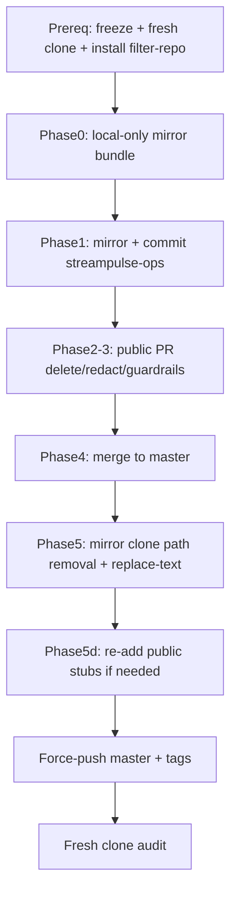

# Public ops boundary cleanup + history separation (rev 2)

> **Status: EXECUTED 2026-07-07.** Sections below are the original execution spec retained for audit. Use **Post-execution status** and **Post-execution follow-up** for current truth.

## Post-execution status

| Item | Result |
|------|--------|
| **Streamclone public `master`** | `b6834a9` — `chore(ops): restore public stubs after history redaction` |
| **Pre-redaction backup** | WSL `~/private-mirrors/streamclone-pre-redaction-2026-07-07.bundle` (~84MB) — **not pushed** to GitHub |
| **Private ops mirror** | `streampulse-ops` `b8d595f` — `archive/public-import/2026-07-07/` (+ SSH launch probes) — **local commit; push when ready** |
| **Fresh-clone audit** | No `141.11.243`, `23.173.152`, SSH topology in tracked tree (allowlisted guard/rule examples only) |
| **History rewrite** | `git filter-repo` replace-text then path removal; all `v*` tags force-pushed with new SHAs |
| **Production API** | Public probes pass (`/v1/extension/health`, `scripts/hosted-launch-probes.sh`) |
| **Production deploy label** | Hosted health may still report **`v0.3.0-rc19`** until private ops promotes a new `IMAGE_TAG` — **expected**; history rewrite ≠ prod redeploy |
| **GHCR / image namespace** | Out of scope — digest promotion and `streampulse/*` cutover remain separate |

## Post-execution follow-up

- **Streamclone public repo:** complete at `b6834a9`; tracked tree clean.
- **Production:** public probes pass; hosted health still reports `v0.3.0-rc19` until private ops pins/promotes a newer tag — deploy and image promotion are separate from this rewrite.
- **Private ops:** push `streampulse-ops` mirror commit (`b8d595f` + any pulse evidence imports) when ready.
- **Pulse companion cleanup required** (separate plan: [`pulse_ops_boundary_cleanup_98bec652.plan.md`](pulse_ops_boundary_cleanup_98bec652.plan.md)):
  - Remove operator SSH/IP/topology from `streamclone-pulse` docs/agents (tracked leaks confirmed in `AGENTS.md`, `ops-diagnostics-reviewer.md`, `release-status.md`, `website-portal-requirements.md`, and others).
  - **Decision:** current-tree cleanup only (no Pulse history rewrite).
  - Add public repo boundary guard/rule in `streamclone-pulse`.
  - Mirror/delete untracked local evidence runbooks before commit.

## Scope framing

This plan **finishes the public ops boundary for Streamclone** (app source + CI + contracts only). It does **not** complete the separate **image namespace migration** away from `ghcr.io/aron-chu/streamclone/*` → promoted `ghcr.io/aron-chu/streampulse/*`; that remains under [`docs/production-promotion-contract.md`](docs/production-promotion-contract.md) and sibling image-exit audit docs.

---

## Problem

Public [`Aron-Chu/streamclone`](.) still contains operator execution material and infrastructure topology in the **current tree and full git history**. [`AGENTS.md`](AGENTS.md) contradicts itself (golden rule #11 vs Hosted production router row pointing at SSH runbooks).

**No live credential values found** in tracked files (gitleaks + `.env*` gitignore). The failure mode is **topology + runbooks in a public app repo**, not committed tokens.

---

## Critical corrections from review (rev 1 → rev 2)

| Rev 1 mistake | Rev 2 fix |
|---------------|-----------|
| Push `backup/pre-ops-redaction-*` to GitHub | **Never push** pre-redaction backup to public remote. Local bare mirror, private ops archive bundle, or offline `git bundle` only. If accidentally pushed, **delete the public ref before declaring done**. |
| `filter-repo --replace-text` only | **Path removal** for all moved operator artifacts **plus** replace-text for identifiers that remain in app/archive docs. Re-add public stubs **after** rewrite if path removal drops them from HEAD. |
| “33 paths” inventory | **Broader inventory** below (contract docs, evidence `.txt`, agent-notes, skills, migration docs). |
| Narrow pre-commit regex | Block/review full topology set (see Guardrails). |
| Start from dirty `twitch-7tv-clone` worktree | **Fresh clone** for branch + rewrite; current checkout has unrelated product WIP and untracked job-mirror files. |
| Assume `git filter-repo` available | **Install prerequisite** (pip/apt) before Phase 6. |
| Assume streampulse-ops at `0840cd2+` | **Verify actual baseline** — private checkout reported dirty at **`40ad1ef`**; clean/commit there before mirroring. |

---

## Naming policy (public repo)

Avoid resolvable infrastructure names in public docs after cleanup:

| Do not use in public | Use instead |
|----------------------|-------------|
| `141.11.243.103` | `legacy-rollback-host` |
| `23.173.152.156` | `hosted-production-vps` (generic label, not DNS) |
| `streampulse-vps` (as SSH/deploy target) | `hosted-production-vps` or “private ops host” |
| `BearHost VPS` (with IP/context) | `legacy-rollback-host` |
| `root@streampulse-vps`, SSH fingerprints, `/root/streampulse-ops` | Remove or “private ops checkout (never commit paths)” |

**Allowed in public:** `https://api.streampulse.stream`, `https://streampulse.stream`, GHCR source image contract names, env **key names** in `.example` files.

---

## Prerequisites (must pass before Phase 2)

1. **Freeze** public repo writes during rewrite window (no parallel merges to `master`).
2. **Do not branch or rewrite** from the current dirty worktree (`job_mirror*`, analytics-console, portal WIP, untracked `scripts/ops/run-gate2-after-ssh.sh`, etc.). Stash/commit that work elsewhere or ignore until after re-clone.
3. **Fresh clone** for all ops-boundary work:
   ```bash
   git clone git@github.com:Aron-Chu/streamclone.git streamclone-ops-cleanup
   cd streamclone-ops-cleanup && git checkout master
   ```
4. **Install `git-filter-repo`** in the shell used for Phase 6 (not currently available in operator shell):
   ```bash
   pip install git-filter-repo   # or apt install git-filter-repo
   ```
5. **Private `streampulse-ops`**: resolve dirty state at **`40ad1ef`**, confirm destination tree (`scripts/smoke/`, `docs/runbooks/`, `docs/deployments/`, `archive/public-import/`), then mirror **before** any public deletes.

---

## Phase 0 — Local-only backup (never public)

Create **one** offline rollback artifact — **do not push to GitHub**:

```bash
git clone --mirror git@github.com:Aron-Chu/streamclone.git ~/private-mirrors/streamclone-pre-redaction-2026-07-07.git
# optional portable bundle:
git -C ~/private-mirrors/streamclone-pre-redaction-2026-07-07.git bundle create ~/private-mirrors/streamclone-pre-redaction-2026-07-07.bundle --all
```

Optionally copy the bundle into **private streampulse-ops** `archive/pre-redaction/` (private repo only).

**Forbidden:** `git push origin backup/pre-ops-redaction-*` or any tag/branch that preserves pre-redaction history on the public remote.

---

## Phase 1 — Mirror to private streampulse-ops (commit first)

Copy **full operator inventory** from public `master` into private ops. Suggested private layout: `archive/public-import/2026-07-07/` preserving paths.

### Scripts — delete from public after mirror

| Path | Notes |
|------|-------|
| `scripts/hosted-launch-probes.sh` | Full SSH version → private `scripts/smoke/hosted-launch-probes-ssh.sh` |
| `scripts/ops/*` (all tracked) | `hosted-*`, `release-gap-vps-execute.sh`, `ssh-access-preflight.sh`, `verify-public-hub-edge-cache.sh` |
| `scripts/load/hosted-cap250-soak-monitor.sh` | |
| `scripts/load/hosted-release-check-soak-loop.sh` | |
| `scripts/load/pulse-load-smoke-vps.sh` | |
| `scripts/load/pulse-load-staging-25-vps.sh` | |
| `scripts/load/pulse-load-vps-inspect.sh` | |
| `scripts/load/pulse-load-channels.txt` | load fixture — ops scope |
| `scripts/cloudflared-tunnel-token-rotate.sh` | |
| `scripts/batch-q-post-canary-remote.sh` | |
| `scripts/batch-q-post-canary.sh` | review — may reference hosted paths |

### Docs / runbooks — delete from public after mirror

| Path | Notes |
|------|-------|
| `docs/ops/**` | All 9 tracked files (runbooks, evidence, templates) |
| `docs/streampulse-vps.md` | Full operator doc → private; public gets stub |
| `migration-baseline.md` | |
| `docs/ops-migration-plan.md` | Move or redact heavily — contains host IPs |
| `docs/ops-migration-prepared-report.md` | Ops-internal |
| `docs/agent-notes/corpus-0b2-hosted-verify.md` | |
| `docs/agent-notes/corpus-hosted-baseline-2026-07-01.md` | |
| `docs/agent-notes/corpus-hosted-baseline-2026-07-02.md` | |
| `docs/agent-notes/hosted-live-viewer-coverage-2026-07.md` | Keep product knobs in public only if stripped of deploy paths; else mirror |
| `docs/agent-notes/hosted-rc14-rc15-deploy-evidence-2026-07.md` | Pure deploy evidence → private |
| `docs/agent-notes/corpus-0b-safe-batch.md`, `corpus-pr0a-audit.md` | Redact or mirror if host references |

### Evidence `.txt` — delete from public after mirror

| Path | Leak |
|------|------|
| [`docs/pulse-extension/ops-001-evidence.txt`](docs/pulse-extension/ops-001-evidence.txt) | BearHost IP |
| [`docs/pulse-extension/evidence/corpus-0b-canary-2026-07-01.txt`](docs/pulse-extension/evidence/corpus-0b-canary-2026-07-01.txt) | VPS IP + deploy script names |
| `docs/pulse-extension/evidence/pulse-api-boundary-edge-block-2026-07-01.txt` | BearHost deploy |
| `docs/pulse-extension/load-001-smoke-evidence.txt` | BearHost |
| `docs/pulse-extension/load-001-dry-run-evidence.txt` | BearHost |
| `docs/pulse-extension/load-001b-staging-evidence.txt` | BearHost VPS script |
| `docs/pulse-extension/soak-24h-evidence.txt` | BearHost tmux |

(Product evidence without host topology may stay; re-grep before merge.)

### Smoke — delete from public after mirror

| Path | Notes |
|------|-------|
| `deploy/smoke/hosted-internal-ops-smoke.sh` | Requires `PULSE_OPS_PROBE_TOKEN` / internal ops |

**Keep in public** (public API only, no SSH):

- `deploy/smoke/test-hub-moments-hosted.sh` — `https://api.streampulse.stream`
- `deploy/smoke/test-013b-hosted.sh` — public API + grafana exposure checklist

### Contract / router docs — redact in public (not “keep unchanged”)

| Path | Action |
|------|--------|
| [`docs/hosted-production-ops.md`](docs/hosted-production-ops.md) | Strip SSH table; pointer to private ops only |
| [`docs/production-artifact-contract.md`](docs/production-artifact-contract.md) | Remove operator SSH probe commands; keep source-build contract |
| [`docs/production-promotion-contract.md`](docs/production-promotion-contract.md) | Remove VPS-specific operator blocks |
| `docs/ops-migration-truth-table.md` | **Untracked today** — add only redacted version (no `/root/streampulse-ops/env/production.local.env` grep recipes) |
| [`docs/laptopworker-dev.md`](docs/laptopworker-dev.md) | Redact if host references |
| [`.claude/skills/pulse/capacity-governor-review/SKILL.md`](.claude/skills/pulse/capacity-governor-review/SKILL.md), [`.claude/skills/pulse/pulse-live-coverage-review/SKILL.md`](.claude/skills/pulse/pulse-live-coverage-review/SKILL.md) | Redact VPS SSH paths |
| [`docs/pulse-extension/top-roster-awareness-requirements.md`](docs/pulse-extension/top-roster-awareness-requirements.md) | Redact hosted host references |
| Archive/historical `.md` with IPs | See redact list in Phase 2 |

**Commit mirror in private streampulse-ops first**; record private commit SHA in public PR description.

---

## Phase 2 — Public current-tree cleanup (fresh clone PR)

Branch: `chore/public-ops-boundary-cleanup` from clean clone. **Strict path staging** — no `git add .`.

### 2a. Delete mirrored operator paths

Delete everything listed in Phase 1 mirror table after private commit exists.

### 2b. Only two public script surfaces

| Script | Role |
|--------|------|
| [`scripts/ops-stub.sh`](scripts/ops-stub.sh) | Generic redirect — already exists |
| [`scripts/hosted-launch-probes.sh`](scripts/hosted-launch-probes.sh) | **Rewrite** to public-API-only: `https://api.streampulse.stream/v1/public/hub` + `/v1/extension/health` — **no SSH, no internal ops, no `PULSE_PROBE_SSH_*`** |

All other deleted script paths: **do not** add shims — agents use `ops-stub.sh` or private ops.

### 2c. Public stubs (post-delete)

| File | Content |
|------|---------|
| `docs/streampulse-vps.md` | Short pointer: hosted prod ops are private; public API URL only |
| `docs/ops/README.md` | Single stub linking to [`docs/hosted-production-ops.md`](docs/hosted-production-ops.md) |
| [`docs/bearhost-production.md`](docs/bearhost-production.md) | Already a stub — keep |

### 2d. Redact remaining tracked docs (placeholders per naming policy)

- `docs/scraping-archive/implementation-task-plan.md`
- `docs/scraping-archive/archive-observability.md`
- `docs/multi-user/requirements.md`
- `docs/requirements/corpus-scaling-observability.md`
- Contract docs listed in Phase 1 redact table
- [`AGENTS.md`](AGENTS.md) — remove Hosted production SSH routing (see Phase 3)

### 2e. Keep in public

- All Go/TS product code (`internal/analytics/hosted_*.go` is **product**, not ops)
- `deploy/env/profile-hosted-*.env.example` — key names only
- [`docs/ops-migration-manifest.md`](docs/ops-migration-manifest.md) — path mapping as documentation (no live values)
- CI including [`.github/workflows/hub-health-monitor.yml`](.github/workflows/hub-health-monitor.yml)
- Public API smoke scripts under `deploy/smoke/test-*-hosted.sh`

**Commit:** `chore(ops): remove hosted operator artifacts from public tree`

**Pre-merge verification (fresh clone worktree):**

```bash
make compose-config-check
go test ./internal/config/... ./internal/analytics/... -count=1
bash scripts/hosted-launch-probes.sh
bash scripts/pre-commit-public-ops-guard.sh   # after Phase 3 hook added
rg -n '141\.11\.243|23\.173\.152|SHA256:Jldje|root@streampulse|/root/streampulse-ops|/etc/streamclone/pulse\.env|id_ed25519_bearhost|PULSE_PROBE_SSH_' --glob '!*.plan.md'
```

---

## Phase 3 — Guardrails (same PR as Phase 2)

### 3a. [`AGENTS.md`](AGENTS.md)

- Golden rule: **Never commit** production host IPs, SSH fingerprints, VPS shell accounts, `/root/streampulse-ops` paths, operator runbooks, or deploy evidence — private **streampulse-ops** only.
- **Hosted production** router row: contract docs + `curl https://api.streampulse.stream/v1/extension/health` — **not** `streampulse-vps.md` SSH, not `ssh-access-preflight.sh`, not SSH `hosted-launch-probes.sh`.

### 3b. [`.cursor/rules/public-repo-boundary.mdc`](.cursor/rules/public-repo-boundary.mdc)

Always-on: no new operator scripts; no topology patterns; prod runbooks → private ops.

### 3c. [`docs/security.md`](docs/security.md)

Add **Public repo boundary** section (IPs, runbooks, evidence files, SSH topology).

### 3d. Pre-commit — `scripts/pre-commit-public-ops-guard.sh`

Fail staged files matching (with allowlist for guard script, `.env.example`, `profile-*.env.example`, migration manifest path **names** without values, and filter-repo manifest files):

```
141\.11\.243|23\.173\.152
SHA256:[A-Za-z0-9+/=]{20,}
/root/streampulse-ops
/etc/streamclone/pulse\.env
root@streampulse-vps
id_ed25519_bearhost
PULSE_PROBE_SSH_
streampulse-vps-production-deploy
production\.local\.env
```

**Allowlist note (`.cursor/plans/`):** untracked/private plans may contain topology during active cleanup. **Committed** public plans must pass the same topology guard — do not rely on a permanent `.cursor/plans/*` hole in pre-commit.

Review-only warn (optional second hook): bare `streampulse-vps` and `BearHost VPS` in new docs — prefer generic labels.

Wire into [`.pre-commit-config.yaml`](.pre-commit-config.yaml).

---

## Phase 4 — Merge current-tree cleanup

Merge PR to `master`. **Stop** — do not rewrite from the PR clone if it picked up local pollution; use a new mirror for Phase 5.

---

## Phase 5 — History rewrite (mirror clone only)

**Why two steps:** replace-text alone leaves deleted runbooks/scripts in old commits (with sanitized hostnames). Path removal excises operator artifacts from **all** history.

### 5a. Paths file — `scripts/ops/filter-repo-paths.txt`

List every path ever committed that is operator scope (Phase 1 inventory + historical paths from [`docs/ops-migration-manifest.md`](docs/ops-migration-manifest.md) §2–3):

```
docs/ops/
scripts/ops/
scripts/load/hosted-cap250-soak-monitor.sh
scripts/load/hosted-release-check-soak-loop.sh
scripts/load/pulse-load-smoke-vps.sh
scripts/load/pulse-load-staging-25-vps.sh
scripts/load/pulse-load-vps-inspect.sh
scripts/cloudflared-tunnel-token-rotate.sh
scripts/batch-q-post-canary-remote.sh
deploy/smoke/hosted-internal-ops-smoke.sh
migration-baseline.md
docs/pulse-extension/ops-001-evidence.txt
docs/pulse-extension/evidence/corpus-0b-canary-2026-07-01.txt
# ... plus manifest-listed historical paths (bearhost*, streampulse-vps*, etc.)
```

Use `--path-glob` or multiple `--path` entries per [`git-filter-repo` docs](https://github.com/newren/git-filter-repo).

### 5b. Replacements — `scripts/ops/filter-repo-replacements.txt`

```
141.11.243.103==>legacy-rollback-host
23.173.152.156==>hosted-production-vps
SHA256:JldjePMc3Mt8hxqIQZti5lGg58m3epFFKA7beaLejKE==>[REDACTED_SSH_FINGERPRINT]
/root/streampulse-ops==>private-streampulse-ops-checkout
/etc/streamclone/pulse.env==>private-host-env-file
root@streampulse-vps==>operator-host
id_ed25519_bearhost_streamclone==>legacy-rollback-key
streampulse-vps==>hosted-production-vps
```

(Adjust if `--replace-text` global replace of `streampulse-vps` is too aggressive for innocent prose — use literal paths first, then selective globs.)

### 5c. Execution

```bash
git clone --mirror git@github.com:Aron-Chu/streamclone.git ~/rewrite/streamclone.git
cd ~/rewrite/streamclone.git

# Path removal first (excise operator artifacts from all commits)
git filter-repo --paths-from-file filter-repo-paths.txt --invert-paths --force

# Then identifier redaction on remaining blobs
git filter-repo --replace-text filter-repo-replacements.txt --force

git remote add origin git@github.com:Aron-Chu/streamclone.git
```

### 5d. Re-add public stubs (if path removal dropped them from HEAD)

Path removal of `docs/ops/**` removes **all** historical and final `docs/ops/README.md`. After filter-repo, in a **non-bare** checkout of the rewritten repo:

```bash
git checkout -b post-redaction-stubs
# Re-apply stub files from Phase 2c/2b (streampulse-vps.md, docs/ops/README.md, public-API hosted-launch-probes.sh, guardrails)
git commit -m "chore(ops): restore public stubs after history redaction"
```

### 5e. Force-push (only after verification)

```bash
git push --force-with-lease origin master
git push --force origin 'refs/tags/*'   # 41 v* tags — new SHAs; GHCR digests unchanged
```

**Verify from a second fresh clone:**

```bash
git clone git@github.com:Aron-Chu/streamclone.git verify-redaction
cd verify-redaction
rg '141\.11\.243|23\.173\.152|SHA256:Jldje|root@streampulse-vps|/root/streampulse-ops'
git log --all -S '141.11.243.103' --oneline    # expect empty
git log --all -- scripts/ops/release-gap-vps-execute.sh --oneline  # expect empty
pre-commit run --all-files
```

Re-clone all local checkouts; discard pre-redaction clones or keep only under `~/private-mirrors/`.

Optional: GitHub support request to purge unreachable objects after force-push.

---

## Execution order (final)



---

## Do NOT

- Merge stale [`chore/public-ops-cleanup-prep`](.) (unrelated product reversions)
- Push pre-redaction backup refs to public GitHub
- Run filter-repo from dirty product worktree
- Do not rewrite **`streamclone-pulse` history** as part of this Streamclone rewrite. A **separate Pulse cleanup** is required because current tracked Pulse docs still contain old operator topology (see Post-execution follow-up).
- Claim this completes **streampulse/* GHCR promotion** (separate track)
- Confuse **history rewrite complete** with **production redeployed from rewritten HEAD** — prod tag pin is private ops (`IMAGE_TAG` in `streampulse-ops`)

---

## Out of scope

- `job_mirror`, analytics-console, portal WIP
- VPS deploy / `production.local.env` values (private ops only)
- Image namespace cutover evidence
- **streamclone-pulse** public boundary (companion plan — current-tree only)
