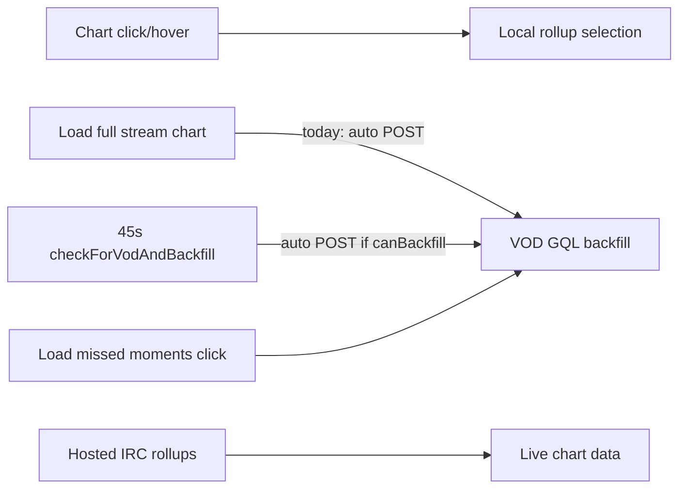

# Pulse extension UX + backfill honesty

**Repo:** [`streamclone-pulse`](C:/Users/Aron/streamclone-pulse) (extension). **Pre-step:** one isolated commit in [`streamclone`](C:/Users/Aron/twitch-7tv-clone) for [`docs/agent-notes/hosted-live-viewer-coverage-2026-07.md`](C:/Users/Aron/twitch-7tv-clone/docs/agent-notes/hosted-live-viewer-coverage-2026-07.md) only (Protect waiver line optional).

**Out of scope:** health API `stackVersion`/`serviceVersion` fields (rc17 backend), frontend/HLS/rc17 WIP, VPS deploy.

---

## Agent guardrails (required)

### G1 — SWR cache: TTL + window key

Do **not** return `getSessionPulse(login)` blindly.

- Cache key: `pulse:{login}:{window}` (or store `window` on `PulseCacheEntry` and reject mismatches).
- Also store `streamId` on cache entry; discard cache when payload `streamId` differs from request context (route change / new stream).
- TTL cap: **30–60s** freshness for SWR serve; stale entries trigger background refresh but must not block forever on wrong-window or wrong-stream data.
- Never serve a cached **`full`** payload for a **`recent`** poll (and vice versa unless explicitly requested).

### G2 — CTA gating: `canBackfill && (vodId || explicitHint)`

Stricter than `canBackfill`-only:

- Show load CTA / `'load'` button state only when backend `canBackfill === true` **and** (`vodId` present **or** user is on explicit load path with a fresh page/GQL hint to include in POST body).
- Periodic VOD check (`refreshVodStatus`) may discover `vodId` but must **not** auto-POST; CTA appears only after status refresh shows backfill is actionable.
- No-VOD live + IRC tracked: no load CTA; copy = live tracking / VOD unavailable or waiting.

### G3 — Automated “no POST except explicit click” tests

Manual verification alone is insufficient. Add tests (Overlay mock, service-worker message mock, or extracted helpers):

| Path | Must NOT send `LOAD_MISSED_MOMENTS` |
|------|-------------------------------------|
| `loadStreamFromStart` | yes |
| 45s `refreshVodStatus` interval | yes |
| VOD hint effect (`submitPageVodHint` only) | yes |
| Chart select / hover / Jump / Open Analytics | yes |

| Path | Must send `LOAD_MISSED_MOMENTS` |
|------|--------------------------------|
| CoverageCard explicit “Fill from Twitch VOD” click | yes |

### G4 — Dirty tree: read before edit

**streamclone-pulse** worktree is already very dirty, including files this plan touches.

- Before editing each target file: `git diff -- <path>` and read full file — preserve unrelated WIP; narrow diffs only.
- **streamclone** evidence commit: verify `git status --short` shows **only** `docs/agent-notes/hosted-live-viewer-coverage-2026-07.md` before commit.

---

## Thought experiments (plan must pass)

| Scenario | Expected behavior |
|----------|-------------------|
| No-VOD live streamer, IRC tracked | Chart from live rollups; no VOD GQL; CTA hidden or “VOD unavailable / waiting” |
| VOD appears while live | Periodic check updates status only; user must click “Fill from Twitch VOD” to start GQL |
| User clicks graph 20 times | Local selected moment only; zero backfill POST |
| User clicks “From stream start” | Seek DVR / expand timeline; **no** backfill POST |
| Warm cache after route change | Stale payload from previous `streamId` must not persist (TTL + streamId check) |

---

## Problem summary



Chart interaction is already local; **VOD GQL** starts from `loadStreamFromStart`, `checkForVodAndBackfill`, and loose CTA gating — not from Jump/Open Analytics.

---

## Phase 0 — Protect rc16 evidence (streamclone, 1 commit)

- Commit only [`hosted-live-viewer-coverage-2026-07.md`](C:/Users/Aron/twitch-7tv-clone/docs/agent-notes/hosted-live-viewer-coverage-2026-07.md) with existing rc16 tables.
- Add one-line Protect waiver if not already explicit enough.
- Do **not** stage other dirty files.

---

## Phase 1 — Backfill honesty (Lane B)

### 1A. Split VOD check vs backfill start — [`Overlay.tsx`](C:/Users/Aron/streamclone-pulse/src/ui/Overlay.tsx)

| Function | Behavior after change |
|----------|----------------------|
| `refreshVodStatus()` (new, from `checkForVodAndBackfill`) | Submit page/GQL hint, refresh pulse (`window=recent`), update coverage debug — **never** call `loadMissedMomentsWithPayload` |
| `checkForVodAndBackfill` | Rename/replace: `onCheckVod` → `refreshVodStatus` only |
| `loadMissedMoments` | Unchanged entry for explicit button — only path that POSTs backfill |
| 45s interval (~631–642) | Call `refreshVodStatus` only (local backend); remove auto-backfill on `canBackfill` |
| `loadStreamFromStart` (~685–704) | **Remove** all `loadMissedMomentsWithPayload` / `checkForVodAndBackfill` calls; keep `setFullTimeline(true)`, optional VOD hint for seek, `seekToStreamStart()` |
| VOD hint effect (~753–757) | Keep hint-only (`submitPageVodHint`); no backfill chain |

### 1B. Tighten CTA gating — [`missedMoments.ts`](C:/Users/Aron/streamclone-pulse/src/ui/missedMoments.ts)

- `missedMomentsButtonState`: return `'load'` only when **`canBackfill === true` AND (`vodId` OR explicit-hint-ready flag passed from Overlay)** — remove fallback `coverageStart > 60` without canBackfill.
- Helper e.g. `canShowVodBackfillCTA(source, explicitHint?: string | null)` centralizes G2 rule.
- `shouldShowMissedMomentsBanner`: require `canShowVodBackfillCTA` or active backfill/waiting states — not late start alone.
- `coverageCardCopy`: when load-ready, body = **"Fill missing start from Twitch VOD"**; when `coverageStartOffsetSeconds <= 60` and no gaps, return full-tracked copy (hide CTA path); waiting-VOD copy must not imply IRC backfill.

### 1C. Copy — [`CoverageCard.tsx`](C:/Users/Aron/streamclone-pulse/src/ui/CoverageCard.tsx)

- Replace status `'Ready to load missed moments'` with `'Fill missing start from Twitch VOD'`.
- Button label: `'Fill from Twitch VOD'` (or keep "Load missed moments" in `missedMomentsButtonLabel` tests — update tests to match chosen copy consistently).
- Backfilling strings stay explicit: *"Loading VOD chat via Twitch…"* style if job message absent.

### 1D. Tests — [`tests/missedMoments.test.ts`](C:/Users/Aron/streamclone-pulse/tests/missedMoments.test.ts) + new regression tests

- Late start **without** `canBackfill` → `'hidden'`.
- `canBackfill` without `vodId` and without hint → `'hidden'` or `'check_vod'` (not `'load'`).
- `canBackfill` + `vodId` → `'load'`.
- Label expectations if copy changes.

**No-POST regression** (G3): new test file e.g. `tests/backfillTriggers.test.ts` or extend Overlay tests with mocked `sendBackgroundMessage`:

- Assert `loadStreamFromStart`, simulated 45s tick, and hint-only paths never emit `LOAD_MISSED_MOMENTS`.
- Assert CoverageCard `onLoad` path does emit it.

---

## Phase 2 — Chart UX (Lane C)

### 2A. [`PulseOverviewChart.tsx`](C:/Users/Aron/streamclone-pulse/src/ui/PulseOverviewChart.tsx)

- Replace `onMouseMove` with `onPointerMove` / `onPointerLeave` on hit rect.
- Throttle hover: store pending index in ref, schedule single `requestAnimationFrame` update; skip `setHoverIndex` when index unchanged.
- **Remove** `activityHighlightBand()` calls for pin/preview (~806–823); render:
  - Pin: 2px vertical line (`CHART_INTERACTION.pinLine`) + optional full-height rect at ~4% opacity tint (no filled bar band).
  - Preview/hover: existing dashed 1.25px line only.

### 2B. [`SelectedMomentCard.tsx`](C:/Users/Aron/streamclone-pulse/src/ui/SelectedMomentCard.tsx)

- Remove dual `border` + `borderLeft`; use single `1px solid rgba(255,255,255,0.12)` or subtle `boxShadow` ring — no left-accent-only chrome.

---

## Phase 3 — Load speed / SWR (Lane D)

### 3A. [`storage.ts`](C:/Users/Aron/streamclone-pulse/src/shared/storage.ts) + [`service-worker.ts`](C:/Users/Aron/streamclone-pulse/src/background/service-worker.ts)

Extend session cache (G1):

```ts
// PulseCacheEntry adds:
window: 'recent' | 'full'
streamId: string  // invalidate when mismatch
// sessionKey: pulse:{login}:{window}
const PULSE_CACHE_TTL_MS = 45_000  // 30-60s band
```

`getSessionPulse(login, window)` returns entry only if:

- `entry.window === window`
- `Date.now() - entry.fetchedAt <= PULSE_CACHE_TTL_MS`
- optional: caller passes expected `streamId` — reject if stale stream

Refactor `GET_PULSE`:

1. If fresh cache hit for requested window → respond immediately.
2. Background `peekPulse(login, window)`; `broadcastPulse` on completion.
3. Poll path always uses `window=recent`; `full` only on explicit message flag.

### 3B. Coverage cadence

- Add session cache key `coverage:{login}` with `fetchedAt` in [`storage.ts`](C:/Users/Aron/streamclone-pulse/src/shared/storage.ts) (mirror `PulseCacheEntry` shape for tier only).
- In `refreshPulse` / `peekPulse`: fetch coverage tier at most every **60s** per login unless forced (backfill terminal refresh uses force flag).
- `GET_COVERAGE` message: return cached tier if fresh; else fetch.

### 3C. [`Overlay.tsx`](C:/Users/Aron/streamclone-pulse/src/ui/Overlay.tsx)

- `refreshPulse(full)`: pass `full` only from `requestFullTimeline`, post-backfill success, and explicit user actions — not from chart select/hover/jump.
- After `submitPageVodHint`, avoid `refreshPulse(true)` unless already in backfill/full mode.

---

## Phase 4 — Docs + settings pill (Lane A)

### 4A. Fix stale backend default docs

- [`README.md`](C:/Users/Aron/streamclone-pulse/README.md): default API = `https://api.streampulse.stream`; local `localhost:8090` requires explicit opt-in in Options.
- [`AGENTS.md`](C:/Users/Aron/streamclone-pulse/AGENTS.md): same correction for extension default vs portal hosted default.

### 4B. API status pill

- [`StreamPulseHeader`](C:/Users/Aron/streamclone-pulse/src/ui/Overlay.tsx) (~1182): add pill next to status — **"Hosted API"** when `isHostedBackendUrl(backendUrl)`, **"Local dev API"** when local (warn styling).
- [`PulseSettingsPanel.tsx`](C:/Users/Aron/streamclone-pulse/src/ui/PulseSettingsPanel.tsx): show same pill above backend URL input; if local URL on Twitch, one-line warning that IRC pool differs from production.

Uses existing [`isHostedBackendUrl`](C:/Users/Aron/streamclone-pulse/src/shared/storage.ts) / `isLocalStackBackendUrl`.

---

## Verification

```bash
cd streamclone-pulse
npm run typecheck
npm test
npm run build
```

**Automated (G3):** `npm test` includes no-POST regression cases.

**Manual** on Twitch (hosted API default):

- Chart click/hover: selection updates locally; **no** GQL backfill message in notice/banner.
- Jump / Open Analytics: seek or portal only; no backfill.
- "Load full stream chart": expands timeline + seek only; no POST backfill.
- "Fill from Twitch VOD" (local mode CoverageCard): **only** explicit click starts GQL job.
- Settings show **Hosted API** pill; Options docs match behavior.
- Second poll feels instant when cache warm (SWR); navigate to new stream — no previous-stream flash (streamId invalidation).

---

## Risk notes

- Tighter CTA may hide load when backend omits `canBackfill` but gaps exist — `resolvePulseCoverage` derives `canBackfill` when `vodId` + late start; still require `vodId` for `'load'` state per G2.
- SWR may briefly show stale rollups within TTL after backfill completes — post-backfill still forces `refreshPulse(true)` and should bust cache for that login/window.
- **Operational:** dirty pulse worktree — enforce G4 on every file touched.
