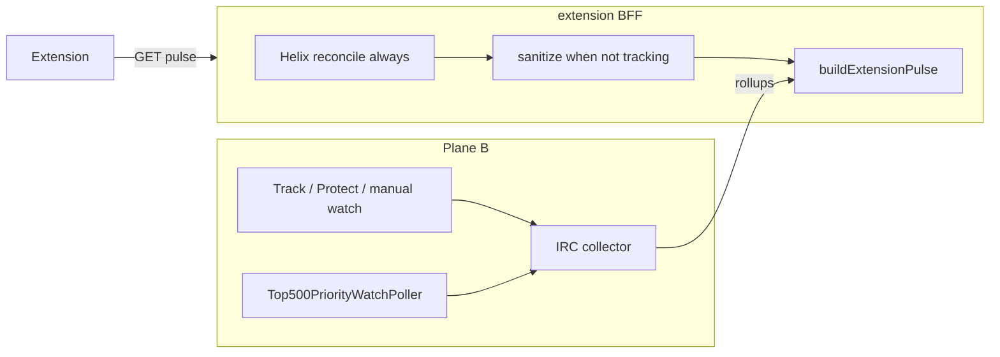

# Pulse Live — correctness, extension gates, hosted admission

## Product contract (what we ship)

Two modes on the **same** overlay, driven by backend `tracking` (collector truth):

| Mode | When | UI |
|------|------|-----|
| **Pulse Lite** | `tracking: false` | Helix live metadata + **Chat not collecting** + Track/Protect CTA; **no** rollups/peaks/heatmap |
| **Pulse Live** | `tracking: true` | Existing live band, Most Reacted, warming → collecting, coverage/backfill |

**Out of scope for honesty:** universal live chat for every streamer. Top-roster admission fills spare cap slots only; protected/manual always win ([`collector.go`](c:/Users/Aron/twitch-7tv-clone/internal/analytics/collector.go) preemption at line 285).

---

## Phase 1 — Backend P0 (streamclone)

**Root cause:** [`reconcileExtensionLiveStream`](c:/Users/Aron/twitch-7tv-clone/internal/analytics/extension_api.go) returns early when `tracking=false` (line 495), so orphan open rows (e.g. prod `shroud`: `isLive:true`, 689 rollups, June 30 `startedAt`) ship as current live Pulse.

### 1a. Always Helix-reconcile

- Remove the `!tracking` guard from `reconcileExtensionLiveStream`; keep existing Helix-off / disabled-runtime early returns.
- Reuse the same reconcile path from [`buildExtensionCoverageTier`](c:/Users/Aron/twitch-7tv-clone/internal/analytics/extension_coverage_tier.go) (today also uses `stream.EndedAt == nil` without reconcile — same bug).
- Extract a small shared helper (e.g. `resolveExtensionStreamLive(ctx, login, stream, tracking)`) used by both pulse and coverage-tier builders.

**Behaviors to preserve from existing tracked path:**
- Helix offline → `CloseStream` on stale open row
- Helix live + new `stream_id` → `UpsertLiveStream` + refresh latest row
- Helix errors → fail open to DB state (current behavior)

### 1b. Sanitize pulse payload when not collecting

In `buildExtensionPulse`, after reconcile:

When `tracking == false`:
- Set `isLive` from **Helix-reconciled** stream truth (not orphan DB alone).
- **Do not** attach live chat artifacts from a non-current or non-collected stream:
  - Clear `rollups`, `fullRollups`, `lanes`, `peaks` for the **live** path
  - Keep **ended-stream recap** when `!isLive` and stream is properly closed (historical Pulse Lite)
- Set coverage to honest non-collecting state (reuse [`computePulseCoverage`](c:/Users/Aron/twitch-7tv-clone/internal/analytics/pulse_coverage.go) / existing partial states; avoid `missing_ranges_detected` on stale orphan rows)

Optional but high-value (already designed in [`extension_coverage_tier.go`](c:/Users/Aron/twitch-7tv-clone/internal/analytics/extension_coverage_tier.go)):
- Add a **minimal adjunct** on `ExtensionPulseResponse` (e.g. `liveMetadata` + `coverageTier`) populated via existing `assembleExtensionCoverageResponse` logic — gives extension viewer count/title without a second fetch. Run [api-contract-drift-check](c:/Users/Aron/streamclone-pulse/.cursor/skills/api-contract-drift-check/SKILL.md) after shape change.

### 1c. Cache invalidation

- On stream close / stream-id change during reconcile, call existing `invalidatePulseCaches` so BFF Redis does not serve stale `shroud`-class payloads for 12s.

### 1d. Go tests (new file or extend [`extension_api_test.go`](c:/Users/Aron/twitch-7tv-clone/internal/analytics/extension_api_test.go))

| Case | Expect |
|------|--------|
| Untracked + Helix offline + open DB row | `isLive:false`, peaks/rollups empty, stream closed |
| Untracked + Helix live + **different** stream_id | `isLive:true`, empty rollups/peaks (Lite) |
| Tracked + Helix live + matching stream_id | Full rollups/peaks unchanged |
| Coverage-tier builder uses same reconcile | Tier `top500_metadata_only` when fresh metadata, not `active_live_coverage` |

Run: `go test ./internal/analytics/... -run 'ReconcileExtension|ExtensionPulseUntracked|CoverageTier'`

---

## Phase 2 — Extension P0 (streamclone-pulse)

Defense in depth even after BFF fix.

### 2a. Panel layout: collector gates live UI

[`pulsePanelLayout.ts`](c:/Users/Aron/streamclone-pulse/src/ui/pulsePanelLayout.ts) today shows live stats/Most Reacted from `isLive || pageLive` only (lines 19–24) — this caused stale peaks to render for `tracking:false`.

- Add `tracking` (or `payload.tracking`) to section resolution:
  - `showLiveStatsBand` / `showMostReacted` → require `tracking === true`
  - `showWarming` → live page + **not tracking** OR tracked warming (existing `WarmingState` already has correct copy at [`Overlay.tsx:1307`](c:/Users/Aron/streamclone-pulse/src/ui/Overlay.tsx))
- Update [`tests/pulsePanelLayout.test.ts`](c:/Users/Aron/streamclone-pulse/tests/pulsePanelLayout.test.ts): untracked + peaks fixture → warming only, no Most Reacted

### 2b. Live badge vs collector truth

[`effectivePulseLive.ts`](c:/Users/Aron/streamclone-pulse/src/ui/effectivePulseLive.ts): keep page-live elevation for **header “Live” badge** only if desired; do **not** use it to unlock chart sections (handled by 2a). Consider `uiIsLive` for badge = `pageIsLive || (payload.isLive && payload.tracking)`.

### 2c. Channel switch hygiene

[`entry.ts`](c:/Users/Aron/streamclone-pulse/src/content/entry.ts):
- On login change: immediately mount with **null payload** / “Checking channel…” ( [`mount.tsx`](c:/Users/Aron/streamclone-pulse/src/content/mount.tsx) already supports null → connecting state)
- Fix same-login early return (line 28): refetch when Twitch live DOM flips or `streamId`/`startedAt` changes in payload vs page context
- Wire [`livePoll.ts`](c:/Users/Aron/streamclone-pulse/src/content/livePoll.ts) `createLivePollController` for **tracked + live** tabs (currently unused); keeps Pulse Live chart fresh under MV3 suspension

Run: `cd streamclone-pulse && npm test -- pulsePanelLayout` + targeted entry tests if added.

---

## Phase 3 — Enable top-roster admission on hosted

Code already wired in [`cmd/analytics/main.go`](c:/Users/Aron/twitch-7tv-clone/cmd/analytics/main.go) via [`Top500PriorityWatchPoller`](c:/Users/Aron/twitch-7tv-clone/internal/analytics/top500_priority_watch.go); flag-gated by `PULSE_TOP500_ADMISSION_ENABLED` ([`config.go`](c:/Users/Aron/twitch-7tv-clone/internal/config/config.go)).

**Deploy order (operator / streampulse-ops):**

1. Ship backend + extension builds (`v0.3.0-rc10+` or next tag)
2. **Pre-enable probe:** `curl .../pulse/channels/shroud?window=full` → expect `tracking:false`, `isLive` matches Twitch, **0 peaks** on Lite path
3. Set env on hosted analytics (keep cap conservative first):
   - `PULSE_TOP500_ADMISSION_ENABLED=true`
   - `PULSE_TOP500_ADMISSION_TOP_N=100` (or roster subset)
   - `PULSE_TOP500_ADMISSION_SOURCE=helix_top_live`
   - Keep `PULSE_MAX_ACTIVE_CHANNELS` at current prod value until soak passes
4. **Post-enable checks** (from [`top-roster-awareness-requirements.md`](c:/Users/Aron/twitch-7tv-clone/docs/pulse-extension/top-roster-awareness-requirements.md)):
   - `activeTracked <= cap` always
   - S-25: manual/protected never preempted by top-roster
   - Admitted top-N channel → `tracking:true` → extension shows Pulse Live warming within ~1–2 min

**HOLD until G2 soak:** raising cap 10 → 25 (document in ops runbook; do not bundle with first admission enable).

Public `/v1/extension/health` intentionally omits caps ([`pulse_health_test.go`](c:/Users/Aron/twitch-7tv-clone/internal/analytics/pulse_health_test.go)); use admin health or `/v1/extension/pulse/channels/{login}/coverage` `hostedCap` for operator visibility.

---

## Verification checklist (before calling done)

| Probe | Pass |
|-------|------|
| `shroud?window=full` untracked | `tracking:false`, no stale peaks, honest Lite state |
| Track a live channel manually | `tracking:true`, warming → chart within minutes |
| Switch streamers rapidly in extension | No blank stuck panel; no previous channel peaks |
| Top-roster admitted channel (if cap free) | Auto `tracking:true`, Pulse Live UI |
| Protected/manual under cap contention | Still admitted; top-roster skipped with capacity reason |

Local: `make up` → extension against `:8090`. Hosted: `https://api.streampulse.stream` after deploy.

---

## User-facing copy (unchanged intent)

- **Not collecting:** “This channel isn’t in StreamPulse’s live chat collector yet…” ([`WarmingState`](c:/Users/Aron/streamclone-pulse/src/ui/Overlay.tsx))
- **Collecting:** existing warming progress copy
- **Tracking badge:** only when `tracking:true`

---

## Risk notes

- **Do not** enable admission before Phase 1 lands — would admit channels into a BFF that still serves stale rollups for untracked logins.
- Top-roster admission ≠ top-500 IRC for all live channels; cap + priority law still applies.
- Extension `pageIsLive` elevation was added for tracked catch-up; narrowing it must not break legitimate new-broadcast UX for **tracked** channels.
