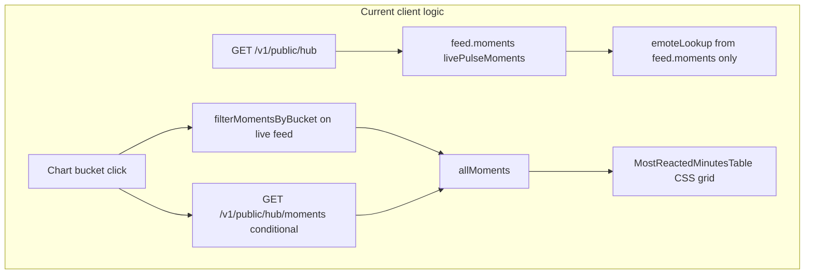
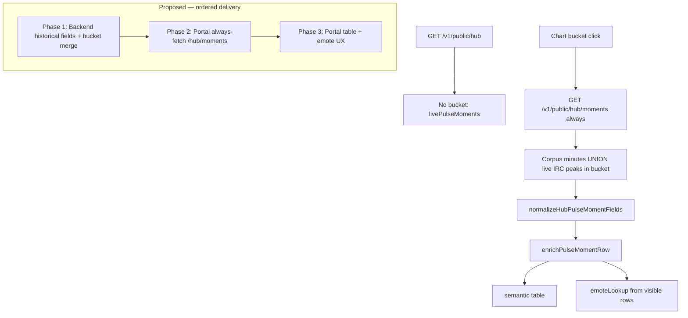

# Pulse Moments: unified data + table fix

## Review consensus (2026-07-06)

Plan is **feasible** and targets the right causes. Ship with these adjustments incorporated:

- **Backend first:** bucket merge + historical `Viewers`/`EmotesPerMin` are hard dependencies before portal always-fetch.
- **Narrow normalizer:** shared helper for field normalization only — not a replacement for live/historical builders (coverage, VOD state, labels, activity tags stay source-specific).
- **Honest emote gaps:** when `total_emote_count > 0` but `emotes_json` is empty, UI shows “Emote breakdown unavailable” — cannot invent emote names client-side.
- **Provider-aware links** (not image pipeline): `absolutizeEmoteAssetUrl` / `preferResolvableEmoteUrl` already handle images; fix `sevenTvEmoteUrl` used for all providers in the table.

---

## Problem diagnosis

Three client code paths produce the same UI with inconsistent fields:



| Symptom | Root cause |
|---------|------------|
| **Viewers mostly `—` in bucket view** | [`hubHistoricalMomentFromCandidate`](c:/Users/Aron/twitch-7tv-clone/internal/analytics/hub_historical_moments.go) sets `ChatPerMin` only — no `Viewers` or `EmotesPerMin`. Live path minute rollups often have `viewer_latest = 0`. |
| **Emotes/min but Top emotes empty** | Historical attaches `topEmotes` only when `emotes_json` is non-empty; count-without-identity rows have no renderable name. |
| **Inspector vs table emote drift** | [`emoteLookup`](c:/Users/Aron/streamclone-pulse/streampulse-web/src/ui/components/analytics/PulseMomentsLivePanel.tsx) indexes `feed.moments` only; [`MomentEmotesCell`](c:/Users/Aron/streamclone-pulse/streampulse-web/src/ui/components/analytics/MostReactedMinutesTable.tsx) skips `topEmoteCode` when array empty. |
| **Formatting drift** | Pulse-live 9-column CSS grid ([`figma-analytics.css`](c:/Users/Aron/streamclone-pulse/streampulse-web/src/ui/components/analytics/figma-analytics.css) ~4786); session view already uses `<table>`. |
| **Bucket loads wrong rows** | [`bucketFilterMiss`](c:/Users/Aron/streamclone-pulse/streampulse-web/src/ui/components/analytics/PulseMomentsLivePanel.tsx) falls back to all live peaks; conditional historical fetch is fragile. |

---

## Target architecture



---

## Phase 1 — Backend (Streamclone) — ship first

**Files:** [`store.go`](c:/Users/Aron/twitch-7tv-clone/internal/analytics/store.go), [`hub_historical_moments.go`](c:/Users/Aron/twitch-7tv-clone/internal/analytics/hub_historical_moments.go), [`hub_live_pulse_moments.go`](c:/Users/Aron/twitch-7tv-clone/internal/analytics/hub_live_pulse_moments.go)

### 1a. Historical viewer SQL (peaks path requires rollup join)

`analytics_minute_peaks` has **no viewer columns** ([`000061_analytics_minute_peaks.up.sql`](c:/Users/Aron/twitch-7tv-clone/migrations/000061_analytics_minute_peaks.up.sql)).

**Peaks query** (`topHistoricalChatMinutesFromPeaks`): add

```sql
LEFT JOIN analytics_minute_rollups r
  ON r.stream_id = p.stream_id AND r.minute_ts = p.minute_ts
```

Select:

```sql
COALESCE(NULLIF(r.viewer_latest, 0), r.viewer_max, r.viewer_avg, 0) AS viewer_count
```

**Rollups fallback** (`topHistoricalChatMinutesFromRollups`): select viewer fields directly from `r`.

Extend `hubHistoricalMinuteCandidate` + `scanHubHistoricalMinuteCandidates` with `ViewerCount` (or `ViewerLatest`).

### 1b. Historical moment fields

In [`hubHistoricalMomentFromCandidate`](c:/Users/Aron/twitch-7tv-clone/internal/analytics/hub_historical_moments.go):

- Set `Viewers` from candidate viewer count
- Set `EmotesPerMin` from `TotalEmoteCount` (or `SevenTVEmoteCount` when dominant)
- Keep existing `topEmotes` decoration when `emotes_json` non-empty

### 1c. Narrow `normalizeHubPulseMomentFields`

**Not** a full builder replacement. Live keeps [`hubLivePulseMomentFromPeak`](c:/Users/Aron/twitch-7tv-clone/internal/analytics/hub_live_pulse_moments.go) (coverage filter, VOD state, labels, activity tags, category). Historical keeps [`hubHistoricalMomentFromCandidate`](c:/Users/Aron/twitch-7tv-clone/internal/analytics/hub_historical_moments.go).

Shared post-build normalizer only:

- `Viewers` — rollup at minute when still zero
- `EmotesPerMin` — from emote count or sum of `topEmotes`
- `TopEmoteCode` — from first top emote when missing
- Trim category / display name; ensure `StreamStartedAt` populated

Call from both paths after source-specific construction.

### 1d. Bucket endpoint merge (hard dependency)

In [`buildPublicHubMoments`](c:/Users/Aron/twitch-7tv-clone/internal/analytics/hub_historical_moments.go):

1. Build corpus rows from historical candidates (existing).
2. Build live IRC peak rows for `[bucketStart, bucketEnd)` via filtered `buildHubLivePulseMoments` output (or equivalent in-handler filter on `At`).
3. Merge, dedupe by `(login, at)` or `(streamId, offsetSeconds)`, sort by score, cap at 10.
4. Expose `source: "bucket_merged"` when both paths contribute (diagnostics only).

**Tests:** [`hub_historical_moments_test.go`](c:/Users/Aron/twitch-7tv-clone/internal/analytics/hub_historical_moments_test.go) — viewers/emotes on historical rows; bucket merge with live + corpus; peaks SQL join covered by store test or integration test.

**Deploy** to `api.streampulse.stream` before Phase 2 portal changes.

---

## Phase 2 — Portal fetch simplification (after backend deploy)

**Files:** [`PulseMomentsLivePanel.tsx`](c:/Users/Aron/streamclone-pulse/streampulse-web/src/ui/components/analytics/PulseMomentsLivePanel.tsx), new [`pulseMomentRow.ts`](c:/Users/Aron/streamclone-pulse/streampulse-web/src/lib/pulseMomentRow.ts)

1. **Always `GET /v1/public/hub/moments?bucketT=...` on bucket click** — remove `filterMomentsByBucket`, `liveBucketMiss`, `useHistoricalFetch` branching, and `bucketFilterMiss` fallback to all live peaks.

2. **No bucket selected:** keep `livePulseMoments` from main hub poll (unchanged).

3. **`enrichPulseMomentRow(moment, ctx)`** before render:
   - `emotesPerMin` via `resolveMomentEmotesPerMin`
   - If `topEmotes` empty but `topEmoteCode` set → synthesize single-entry array for lookup/render
   - `viewers` via `resolveMomentViewers`; live-pool fallback **only** when `moment.at` within live horizon
   - Time labels use `moment.at` / `moment.streamStartedAt` — not `hub.liveChannels.startedAt` (API omits it)

4. **`emoteLookup` from enriched visible rows**, not `feed.moments`.

5. Empty bucket → banner “No spikes in this bucket” + Clear (no silent fallback).

---

## Phase 3 — Table + emote presentation

**Files:** [`MostReactedMinutesTable.tsx`](c:/Users/Aron/streamclone-pulse/streampulse-web/src/ui/components/analytics/MostReactedMinutesTable.tsx), [`figma-analytics.css`](c:/Users/Aron/streamclone-pulse/streampulse-web/src/ui/components/analytics/figma-analytics.css)

1. **Replace pulse-live CSS grid with `<table class="figma-table pulse-moments__table">`**
   - Row click + ArrowUp/Down on `<tr>` (not `div[role=option]`)
   - Update [`MostReactedMinutesTable.test.tsx`](c:/Users/Aron/streamclone-pulse/streampulse-web/tests/MostReactedMinutesTable.test.tsx) for `<tr>` semantics and keyboard behavior

2. **Unified formatters:** `Chat/min`, `Emotes/min` → `compact(n)/m`; `Viewers` → `formatMomentViewers` with muted when live-pool fallback

3. **`MomentEmotesCell`:**
   - Up to 3 from `topEmotes`; else chip from `topEmoteCode` via existing `resolveMomentEmote`
   - **Provider-aware external link helper** (Twitch / 7TV / FFZ / BTTV) — replace hardcoded `sevenTvEmoteUrl` for every emote
   - Keep `EmoteImg` + `preferResolvableEmoteUrl` for images (no change to image pipeline)
   - When emote count > 0 but no identity: **“Emote breakdown unavailable”** (not fake names/icons)

4. **CSS:** drop pulse-live grid rules; `.pulse-moments__table` column tokens; category ellipsis; numeric `tabular-nums` right-align

---

## Phase 4 — Verification

| Check | Command / action |
|-------|------------------|
| Go unit tests | `go test ./internal/analytics/... -run 'HubHistorical\|HubLivePulse\|PublicHubMoments'` |
| Portal unit tests | `npm test -- tests/pulseMomentsUtils.test.ts tests/momentMetricLabels.test.ts tests/MostReactedMinutesTable.test.tsx tests/publicHub.test.ts` |
| Hosted smoke (post-deploy) | Recent bucket click → live + corpus rows; viewers/emotes populated where rollups exist |
| Honest gaps | Historical row with count but empty `emotes_json` → “Emote breakdown unavailable”, not broken icons |
| Regression | Unfiltered hub → 10 live peaks; inspector syncs with selected row |

---

## Known unavoidable gap

Historical (and some live) rows where backend has **`total_emote_count > 0` but empty `emotes_json`** cannot show specific emote icons or names. Fix long-term = ensure rollup writer persists emote maps; short-term = honest unavailable copy + emote rate from count.

---

## Execution order (strict)

1. Backend historical SQL + candidate fields + `normalizeHubPulseMomentFields`
2. Backend bucket merge endpoint
3. **Deploy Streamclone analytics**
4. Portal always-fetch + enrich + emoteLookup fix
5. Semantic table + provider links + test updates
6. Hosted smoke
