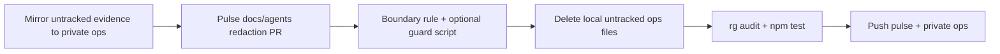

# Pulse public ops boundary cleanup

## Context

Streamclone public boundary work is **done** (`master` at `b6834a9`, history rewritten, operator artifacts mirrored to private **streampulse-ops** `b8d595f`). Remaining leaks are in **streamclone-pulse** (extension + portal docs/agents) and a few **local untracked** files that must not be committed.

**Scope:** current-tree cleanup only (no `git filter-repo` on streamclone-pulse).

**Out of scope:** extension source changes / rebuild, Streamclone history changes, GHCR image namespace exit.

---

## Naming policy (match Streamclone)

| Remove / replace | Use instead |
|------------------|-------------|
| `141.11.243.103`, BearHost VPS (with context) | `legacy-rollback-host` |
| `23.173.152.156` | `hosted-production-vps` (generic label) |
| `streampulse-vps` as SSH/deploy target | `hosted-production-vps` or “private ops host” |
| `root@streampulse-vps`, `~/.ssh/id_ed25519`, `PULSE_PROBE_SSH_*` | Remove; point to private **streampulse-ops** |
| `streampulse-ops/env/production.local.env` | “private streampulse-ops production env (never commit paths/values)” |

**Keep:** `https://api.streampulse.stream`, `https://streampulse.stream`, product/architecture references to hosted API.

---

## Phase 0 — Mirror untracked evidence to private ops (before delete)

Copy into **streampulse-ops** (e.g. `archive/public-import/2026-07-07-pulse/`) then **do not commit** these in public pulse:

| Untracked (local) | Leak |
|-------------------|------|
| [`docs/pulse-extension/evidence/top100-overnight-soak.md`](c:/Users/Aron/streamclone-pulse/docs/pulse-extension/evidence/top100-overnight-soak.md) | BearHost IP + SSH key |
| [`docs/pulse-extension/load002t100-runbook.md`](c:/Users/Aron/streamclone-pulse/docs/pulse-extension/load002t100-runbook.md) | BearHost key path |

Commit mirror in private **streampulse-ops** (can amend/follow `b8d595f` import commit or add `archive/public-import/2026-07-07-pulse/`).

---

## Phase 1 — Pulse PR: tracked file redactions

Branch from clean `streamclone-pulse` `master`. Strict path staging.

### 1a. Router / agents (high priority)

| File | Change |
|------|--------|
| [`AGENTS.md`](c:/Users/Aron/streamclone-pulse/AGENTS.md) | **Remove** “VPS SSH” row (line ~28). Add golden rule: never commit host IPs, SSH paths, operator runbooks — private **streampulse-ops** only. Hosted ops row → streamclone contract docs + `curl https://api.streampulse.stream/v1/extension/health`. |
| [`.cursor/agents/ops-diagnostics-reviewer.md`](c:/Users/Aron/streamclone-pulse/.cursor/agents/ops-diagnostics-reviewer.md) | Remove both IPs, SSH key table, dead links to removed streamclone compose paths. Review checklist uses public API + private ops pointer only. |
| [`.cursor/skills/capacity-governor-review/SKILL.md`](c:/Users/Aron/streamclone-pulse/.cursor/skills/capacity-governor-review/SKILL.md) | Replace streamclone `streampulse-vps.md` SSH link with [`docs/hosted-production-ops.md`](https://github.com/Aron-Chu/streamclone/blob/master/docs/hosted-production-ops.md); generic “hosted-production-vps” for caps. |

### 1b. Portal / product docs

| File | Change |
|------|--------|
| [`docs/website-portal/release-status.md`](c:/Users/Aron/streamclone-pulse/docs/website-portal/release-status.md) | **Delete** “Canonical SSH” block and `PULSE_PROBE_SSH_*` exports (~lines 75–82). Replace with public probes + “Gate 2 evidence lives in private streampulse-ops”. |
| [`docs/pulse-extension/website-portal-requirements.md`](c:/Users/Aron/streamclone-pulse/docs/pulse-extension/website-portal-requirements.md) | Remove BearHost IP (~line 39); use `legacy-rollback-host`. Update streamclone doc link to stub [`docs/streampulse-vps.md`](https://github.com/Aron-Chu/streamclone/blob/master/docs/streampulse-vps.md) or `hosted-production-ops.md`. |
| [`docs/website-portal/design.md`](c:/Users/Aron/streamclone-pulse/docs/website-portal/design.md) | §4.2: keep “private streampulse-ops” without literal `env/production.local.env` path if possible. Diagram labels: `hosted-production-vps` not resolvable hostname. |
| [`docs/website-portal/tasks.md`](c:/Users/Aron/streamclone-pulse/docs/website-portal/tasks.md) | INFRA tasks: “operator runbook in private streampulse-ops” — no `production.local.env` path (~line 74), no “create tunnel on streampulse-vps” SSH instructions (~line 43). |

### 1c. Extension docs (broader redact pass)

Replace deploy-target hostname/IP prose (not product API URLs):

- [`docs/pulse-extension/evidence/improvements.md`](c:/Users/Aron/streamclone-pulse/docs/pulse-extension/evidence/improvements.md) — remove `23.173.152.156`
- [`docs/pulse-extension/design.md`](c:/Users/Aron/streamclone-pulse/docs/pulse-extension/design.md) — §7 scaling: generic hosted stack, private ops for deploy
- [`docs/pulse-extension/live-coverage-requirements.md`](c:/Users/Aron/streamclone-pulse/docs/pulse-extension/live-coverage-requirements.md) — scope table + §8: “hosted API at api.streampulse.stream”, not VPS hostname

**Commit message:** `chore(ops): redact hosted operator topology from pulse docs and agents`

---

## Phase 2 — Guardrails (same PR)

### 2a. Cursor rule

Add [`.cursor/rules/public-repo-boundary.mdc`](c:/Users/Aron/streamclone-pulse/.cursor/rules/public-repo-boundary.mdc) — mirror Streamclone rule: no host IPs, SSH, `/root/streampulse-ops`, operator runbooks in this **public** pulse repo. Cross-link streamclone [`docs/hosted-production-ops.md`](https://github.com/Aron-Chu/streamclone/blob/master/docs/hosted-production-ops.md).

Optionally add one line to [`.cursor/rules/streamclone.mdc`](c:/Users/Aron/streamclone-pulse/.cursor/rules/streamclone.mdc) guardrails: “No production topology in docs/agents.”

### 2b. Pre-commit guard (lightweight)

Pulse has no `.pre-commit-config.yaml` today. Add optional hook script only (wired via existing [`.cursor/hooks.json`](c:/Users/Aron/streamclone-pulse/.cursor/hooks.json) or documented in AGENTS.md):

- Copy pattern from Streamclone [`scripts/pre-commit-public-ops-guard.sh`](c:/Users/Aron/twitch-7tv-clone/scripts/pre-commit-public-ops-guard.sh) → `scripts/pre-commit-public-ops-guard.sh`
- Allowlist: guard script itself, `.cursor/rules/public-repo-boundary.mdc`

Skip full pre-commit bootstrap unless you want parity with Streamclone.

---

## Phase 3 — Local untracked cleanup (do not commit)

### streamclone-pulse

After mirroring to private ops, **delete locally** (or gitignore):

- `docs/pulse-extension/evidence/top100-overnight-soak.md`
- `docs/pulse-extension/load002t100-runbook.md`

### streamclone (local only)

Delete untracked ops scripts that reference removed public paths:

- [`scripts/ops/run-gate2-after-ssh.sh`](c:/Users/Aron/twitch-7tv-clone/scripts/ops/run-gate2-after-ssh.sh) — calls deleted `ssh-access-preflight.sh`
- [`scripts/ops/apply-public-hub-cloudflare-rules.mjs`](c:/Users/Aron/twitch-7tv-clone/scripts/ops/apply-public-hub-cloudflare-rules.mjs) — move to private ops if still needed

Do **not** commit these deletions to Streamclone unless you want a hygiene commit removing untracked files from disk only.

---

## Phase 4 — Verification

```bash
cd streamclone-pulse
rg -n '141\.11\.243|23\.173\.152|root@streampulse|PULSE_PROBE_SSH_|id_ed25519_bearhost|/root/streampulse-ops' \
  --glob '!scripts/pre-commit-public-ops-guard.sh' \
  --glob '!.cursor/rules/public-repo-boundary.mdc'
npm test          # if logic untouched, should pass
npm run typecheck # portal/extension TS unchanged
```

**No extension rebuild** unless `src/` changes (this plan does not touch `src/`).

---

## Phase 5 — Push

1. Push **streamclone-pulse** PR to `master`
2. Push private **streampulse-ops** mirror commit(s) when ready (`b8d595f` + pulse evidence import)

---

## Execution order



---

## Explicit non-goals

- `git filter-repo` on streamclone-pulse
- Extension `npm run build` / Chrome reload
- Streamclone code or history changes
- Image namespace cutover (`streamclone/*` → `streampulse/*`)
