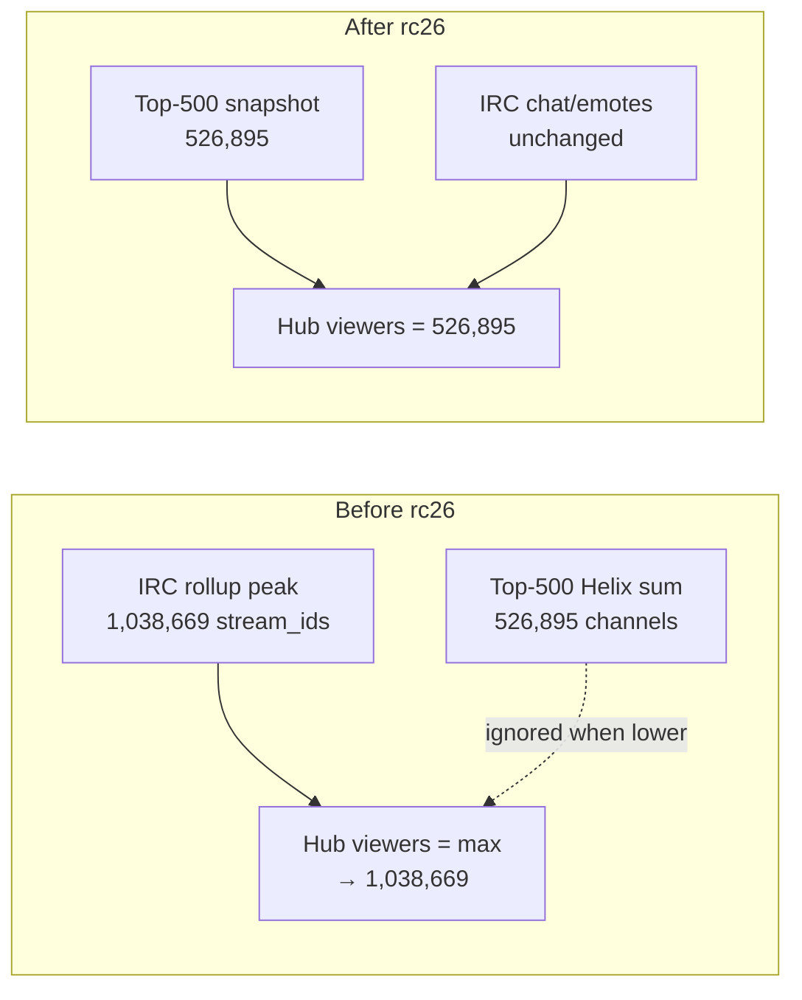

> **HISTORICAL (archived from .cursor/plans).** Not product law. Do not use for routing analytics, ingest, hub, ops, or Pulse work into public Streamclone. See docs/archive/agent-plans/README.md and docs/streampulse-product-boundary.md.
---
name: rc26 viewer hotfix deploy
overview: Commit the hub viewer-line correctness fix, tag v0.3.0-rc26, wait for GHCR analytics image, deploy analytics-only to hosted prod, and verify the audited 17:30Z bucket plus live hub health—with no ingest/env/scale changes.
todos:
  - id: commit-viewer-fix
    content: Commit hub_overview.go + hub_overview_test.go only with fix(analytics) message
    status: completed
  - id: test-gate
    content: Run TestForwardFillTop500 + TestMergeTop500 and make check-quick
    status: completed
  - id: tag-rc26
    content: Push master, tag v0.3.0-rc26, wait for release-images CI green + GHCR analytics image
    status: completed
  - id: deploy-analytics
    content: "VPS: IMAGE_TAG=v0.3.0-rc26 production-up.sh --no-deps analytics (no env edits)"
    status: completed
  - id: verify-bucket
    content: Verify t=1783531800000 viewers ~526895, chat/emotes unchanged; limits guard PASS
    status: completed
  - id: evidence-doc
    content: Write PHASE_E_RC26_VIEWER_FIX.md evidence with before/after jq output
    status: completed
  - id: followup-stale-streams
    content: "File follow-up: audit 203 vs 92 stream_id inflation in rollup viewer aggregation (post-deploy)"
    status: pending
isProject: false
---

# rc26 hub viewer-line hotfix deploy

## Rule (locked)

```text
Viewer line = Top-500/Helix concurrent snapshot when available
Chat/emote lines = IRC rollups
Do not let stale IRC stream_id rollups override live Helix viewer truth
```

## Current state

- **Fix is implemented locally, not committed** — only two files changed:
  - [`internal/analytics/hub_overview.go`](c:/Users/Aron/twitch-7tv-clone/internal/analytics/hub_overview.go)
    - `mergeTop500ViewerBucketsIntoActivity`: **replace** `pt.Viewers` with Top-500 snapshot (was `max(IRC, top500)` which let 1.04M IRC beat 527K Helix)
    - `forwardFillTop500ViewerTrail`: skip buckets with explicit Top-500 sample (no forward-fill over real drops)
  - [`internal/analytics/hub_overview_test.go`](c:/Users/Aron/twitch-7tv-clone/internal/analytics/hub_overview_test.go)
    - `TestMergeTop500ViewerBucketsPrefersSnapshotOverIRCInflation` (1,038,669 → 526,895, chat unchanged)
    - `TestForwardFillTop500ViewerTrail` updated (43K stays 43K when Top-500 sample exists)
- **Prod today:** `v0.3.0-rc23` on [`/v1/extension/health`](https://api.streampulse.stream/v1/extension/health); latest tag in repo is `v0.3.0-rc25` (coverage wiring, not this viewer fix).
- **VERSION file** stays `v0.5.3` — hosted rc line uses image tag `v0.3.0-rc26` (same pattern as rc23–rc25).



## Deploy scope (explicit non-goals)

| In scope | Out of scope |
|----------|----------------|
| `hub_overview.go` + tests | ingest-core env / 500/250 scale |
| analytics container only | redis, postgres, workers recreate |
| `production-up.sh --no-deps analytics` | DB migrations, portal deploy |
| limits guard + hub verify | coverage/admission `0/102` fix (separate) |

## Step 1 — Commit and test (streamclone repo)

1. Stage only the two analytics files above.
2. Commit (Conventional Commits, Aron-Chu author per [`.cursor/rules/commits.mdc`](c:/Users/Aron/twitch-7tv-clone/.cursor/rules/commits.mdc)):

   ```
   fix(analytics): prefer Top-500 snapshots for hub viewer line

   Replace inflated IRC rollup viewer peaks with deduped Helix Top-500
   bucket totals; skip forward-fill when an explicit snapshot exists.
   ```

3. Run narrow gate before tag:

   ```powershell
   cd C:\Users\Aron\twitch-7tv-clone
   go test ./internal/analytics/ -run "TestForwardFillTop500|TestMergeTop500" -count=1
   make check-quick
   ```

4. Push commit to `master`.

## Step 2 — Tag and wait for GHCR image

1. Tag and push (triggers [`.github/workflows/release-images.yml`](c:/Users/Aron/twitch-7tv-clone/.github/workflows/release-images.yml)):

   ```powershell
   git tag v0.3.0-rc26
   git push origin v0.3.0-rc26
   ```

2. **Wait for CI green** — `release-gate` runs `make check`; image job pushes `ghcr.io/aron-chu/streamclone/analytics:v0.3.0-rc26`.
3. Confirm workflow success via `gh run list --workflow=release-images.yml -L 3` before VPS pull.

## Step 3 — Deploy analytics only (hosted VPS)

Via SSH (`root@streampulse-vps`, existing key):

```bash
IMAGE_TAG=v0.3.0-rc26 bash /root/streampulse-ops/scripts/deploy/production-up.sh --no-deps analytics
```

- **Do not** run `ingest-phase-e-250-enable.sh` or edit `production.local.env`.
- `production-up.sh` runs limits guard automatically ([`streampulse-ops/docs/runbooks/production-limits.md`](c:/Users/Aron/streampulse-ops/docs/runbooks/production-limits.md)).

Re-run guard explicitly for evidence:

```bash
bash /root/streampulse-ops/scripts/smoke/hosted-limits-guard.sh
```

Expect: `HOSTED_LIMITS_GUARD: PASS`.

## Step 4 — Post-deploy verification

### A. Audited historical bucket (`2026-07-08T17:30:00Z` → `t=1783531800000`)

| Field | Before (rc23) | Expected after rc26 |
|-------|---------------|---------------------|
| Hub viewers | 1,038,669 | **526,895** (± small drift if Top-500 snapshot reticked) |
| Chat/min | 4,779 | **unchanged** |
| Emotes/min | 2,541 | **unchanged** |

```bash
curl -s 'https://api.streampulse.stream/v1/public/hub?activityWindow=24h' \
  | jq '.activity.points[] | select(.t==1783531800000) | {t, viewers, chat, emotes}'
```

Normalize chat/emotes mentally: API returns 6-min bucket totals; `/6` ≈ per-min rates above.

Optional DB cross-check on VPS (ground truth Top-500 sum for same bucket):

```sql
-- top500_concurrent_sum should match hub viewers after fix
SELECT SUM(viewer_count)::bigint FROM (
  SELECT DISTINCT ON (channel_id) channel_id, viewer_count
  FROM top500_live_snapshots
  WHERE sample_tick_at >= '2026-07-08 17:30:00+00'
    AND sample_tick_at < '2026-07-08 17:36:00+00'
    AND is_live = true
  ORDER BY channel_id, sample_tick_at DESC
) x;
```

### B. Live hub health (do not block on collector warmup)

```bash
curl -s 'https://api.streampulse.stream/v1/extension/health' | jq '{version, ok}'
curl -s 'https://api.streampulse.stream/v1/public/hub?activityWindow=24h' \
  | jq '{ingest, collectors: .corpusPipeline.collectorActive, state: .corpusPipeline.state, coverage: .coverage.state}'
```

**Collector note:** T+0 after analytics restart may show `0/N IRC collecting`. Check T+2m, T+5m, T+10m separately — do **not** roll back rc26 if viewers fix passes but collectors are still warming.

### C. Evidence artifact

Add brief public evidence (no host topology):

[`docs/pulse-ingest-v2/evidence/phase-c-20260708T010515Z/PHASE_E_RC26_VIEWER_FIX.md`](c:/Users/Aron/twitch-7tv-clone/docs/pulse-ingest-v2/evidence/phase-c-20260708T010515Z/PHASE_E_RC26_VIEWER_FIX.md)

Include: tag, commit SHA, limits guard PASS, before/after bucket jq output, analytics RSS T+0.

## Concerns worth tracking (not blocking rc26)

1. **Second analytics restart today** — we restarted ~30 min ago for 500/250 env confirm; rc26 will restart again. Expect another brief collector dip; chat line may look low until warm.

2. **Buckets without Top-500 snapshots** — fix only applies when `top500_live_snapshots` has a row for that coarse bucket. Gaps (table absent, sampling outage) still fall back to IRC viewer peaks. Production currently has dense snapshots (~102 channels/bucket).

3. **Open in-progress bucket** — `mergeCurrentHelixLiveViewersIntoOpenBucket` still floors the **trailing** bucket with live `top500_current` sum (Helix-deduped). This is correct for the open bucket only and uses Helix not IRC; it should not reintroduce 2× inflation.

4. **Recent-window overlay** — `overlayRecentPoolHubActivity` runs before `finalizeHubActivityViewers`; Top-500 replace in finalize still wins for buckets with snapshots. No code change needed for this hotfix.

5. **Portal/UI** — no `streampulse-web` deploy required; chart reads `/v1/public/hub` directly.

6. **Underlying data smell (follow-up, post-rc26)** — audited bucket had **203 IRC `stream_id` rows vs 92 live Top-500 channels**. File a separate task to audit stale rollup eligibility / dedupe by `channel_id` / session close. Does not block this hotfix.

7. **CI release gate** — if `make check` fails on tag push, do not deploy partial image; fix and re-tag (rc26.1 or amend commit + force tag only if user approves).

## Rollback

If hub viewers regress or analytics unhealthy:

```bash
IMAGE_TAG=v0.3.0-rc23 bash /root/streampulse-ops/scripts/deploy/production-up.sh --no-deps analytics
bash /root/streampulse-ops/scripts/smoke/hosted-limits-guard.sh
```

No env rollback needed (this deploy does not touch env).
