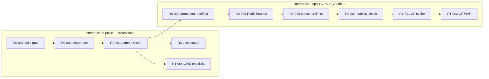

> **HISTORICAL (archived from .cursor/plans).** Not product law. Do not use for routing analytics, ingest, hub, ops, or Pulse work into public Streamclone. See docs/archive/agent-plans/README.md and docs/streampulse-product-boundary.md.
---
name: Release gap closure
overview: Execute release-gap-closure-tasks.md for Full StreamPulse GA (website + API + CWS), cap-250 stable, corpus paused. Two-track sign-off — Track A (release readiness) ships website/API; Track B (CWS approved) is parallel/external.
todos:
  - id: r0-003-tsconfig
    content: "TASK-R0-003: App-only tsconfig for build; tsconfig.test.json with deep paths; typecheck=both, build=app only"
    status: completed
  - id: r0-004-setup-race
    content: "TASK-R0-004: Module-top setup in ConsoleChannelView before AnalyticsConsole renders/queryFns run"
    status: completed
  - id: r0-001-commits
    content: "TASK-R0-001: Fix HubCommandHeader whitespace; split WIP into 5 reviewable commit slices"
    status: completed
  - id: r0-002-manifest
    content: "TASK-R0-002: Fill promotion manifest in streampulse-ops; reconcile IMAGE_TAG/STREAMCLONE_VERSION/digests"
    status: completed
  - id: r0-005-redis
    content: "TASK-R0-005: Sample Redis keys/TTLs; classify non-evictable state; then maxmemory + eviction policy"
    status: completed
  - id: r0-006-limits
    content: "TASK-R0-006: Capture docker stats/restart baselines per stage; set limits from measured usage"
    status: completed
  - id: r0-007-stability
    content: "TASK-R0-007: Run 2–6h hosted-cap250-soak-monitor release-check; store evidence"
    status: completed
  - id: r1-001-cf-cache
    content: "TASK-R1-001: Enable Cloudflare hub cache rule; capture CF-Cache-Status HIT/REVALIDATED"
    status: completed
  - id: r1-002-cf-waf
    content: "TASK-R1-002: Add/document WAF rate rule for /v1/public/*; smoke normal portal polling"
    status: completed
  - id: r1-004-cws
    content: "TASK-R1-004: CWS checklist + submit listing (parallel track; not blocking website/API ship)"
    status: completed
  - id: r3-docs
    content: "TASK-R3-001/R3-002: Corpus-paused note + release-status.md with manifest link and gate list"
    status: completed
isProject: false
---

# Release gap closure plan (Full GA)

**Scope lock** (from task doc): keep **250-channel live tracking**; no Top500/corpus/backfill widening; replace broad soak with a **2–6h focused stability check** after Redis/container changes.

**Release target:** Full StreamPulse GA = website + hosted API + Chrome Web Store extension (TASK-R1-003).

**Two-track sign-off** (Phase 5):

- **GA release readiness** — portal build green, hosted API stable, extension build/checklist complete, ops evidence attached. Website/API may ship when this track passes.
- **CWS approval complete** — store listing approved (externally timed). Does not block website/API deploy; blocks final “extension GA” CTA swap on Landing.



---

## Phase 1 — Portal release gate (P0, repo)

### TASK-R0-003: Fix TypeScript build gate

**Problem:** [`streampulse-web/tsconfig.json`](c:/Users/Aron/streamclone-pulse/streampulse-web/tsconfig.json) includes `tests/`, but tests import deep paths like `../../twitch-7tv-clone/packages/analytics-console/src/...` that `tsc` cannot resolve (Vite/Vitest aliases only exist in [`vite.config.ts`](c:/Users/Aron/streamclone-pulse/streampulse-web/vite.config.ts) / [`vitest.config.ts`](c:/Users/Aron/streamclone-pulse/streampulse-web/vitest.config.ts)).

**Risk:** TypeScript/Vitest/Vite alias drift if app and test configs are not kept deliberately separate. **Build must never depend on test typecheck.**

**Implementation checklist:**

1. Split configs:
   - `tsconfig.json` — **app only** (`include: ["src"]`)
   - `tsconfig.test.json` — extends app config, `include: ["tests"]`
2. **`tsconfig.test.json` paths** — package alias alone is insufficient. Tests import deep subpaths (e.g. `.../analytics-console/src/utils/streamRouteResolution.ts`). Either:
   - **Preferred:** refactor test imports to `@streamclone/analytics-console` public exports where possible, **or**
   - Add explicit `compilerOptions.paths` for deep subpaths, e.g.:
     ```json
     "@streamclone/analytics-console/*": ["../../twitch-7tv-clone/packages/analytics-console/src/*"]
     ```
     (mirror sibling layout used by Vite alias root in `vitest.config.ts`)
3. Update [`package.json`](c:/Users/Aron/streamclone-pulse/streampulse-web/package.json) scripts **explicitly**:
   - **`typecheck`:** `tsc --noEmit -p tsconfig.json && tsc --noEmit -p tsconfig.test.json` (app + tests)
   - **`build`:** `tsc --noEmit -p tsconfig.json && node scripts/check-analytics-tailwind.mjs && vite build && ...` (**app config only** — must NOT invoke `tsconfig.test.json`)
   - **`test`:** Vitest runtime (unchanged; resolves aliases via `vitest.config.ts`)
4. Verify: a broken test-only deep import fails `npm run typecheck` but does **not** fail `npm run build`.

**Acceptance:**

- `npm run build` passes with app-only `tsconfig.json`
- `npm run typecheck` passes (both configs)
- `npm test` passes (Vitest)

---

### TASK-R0-004: Fix analytics setup race

**Problem:** [`ChannelAnalyticsPage.tsx`](c:/Users/Aron/streamclone-pulse/streampulse-web/src/routes/analytics/ChannelAnalyticsPage.tsx) calls `setupStreamcloneAnalyticsApi()` in `useEffect`, which can run **after** lazy `ConsoleChannelView` mounts. The configured API must exist **before** `<AnalyticsConsole />` renders and its query functions / React Query `queryFn`s can call `getConfiguredAnalyticsApi()`.

**Fix:**

1. Remove setup from `ChannelAnalyticsPage` `useEffect`.
2. Add **synchronous** module-top call in [`ConsoleChannelView.tsx`](c:/Users/Aron/streamclone-pulse/streampulse-web/src/routes/analytics/ConsoleChannelView.tsx) so setup completes before `<AnalyticsConsole />` renders:
   ```ts
   import { setupStreamcloneAnalyticsApi } from '../../lib/streamcloneAnalytics'
   setupStreamcloneAnalyticsApi()
   ```
   (Place after imports, before the component definition; lazy chunk load order guarantees this runs when the console route chunk loads.)
3. Keep [`main.tsx`](c:/Users/Aron/streamclone-pulse/streampulse-web/src/main.tsx) free of analytics-console bootstrap (preserves `/analytics` entry slimming from prior perf work).
4. Optional: narrow Vitest or route smoke asserting configured API exists before first console fetch.

**Acceptance:** `/analytics` stays light; `/analytics/:login` has configured API before `<AnalyticsConsole />` queryFns/effects run.

---

### TASK-R0-001: Split and commit dirty WIP

**Problem:** Mixed uncommitted changes across portal perf, hub UI, extension, docs, artifacts.

**Slice plan (separate commits, no generated junk):**

| Slice | Paths (approx) | Commit type |
|-------|----------------|-------------|
| A — Portal perf + build | `streampulse-web/index.html`, `main.tsx`, `routes/index.tsx`, `usePublicHubData.ts`, `vite.config.ts`, `hub-fanout-edge-cache.md`, `hub_overview_test.go` | `perf(portal): hub first-load and cache tests` |
| B — Build gate + setup race | tsconfig split, test import fixes, `ConsoleChannelView` setup | `fix(portal): restore typecheck and console bootstrap` |
| C — Hub UI refactor | `HubCommandHeader.tsx`, `AnalyticsLandingPage.tsx`, `figma-analytics.css`, related hub components/tests | `feat(portal): hub command header and landing polish` |
| D — Extension overlay | `src/ui/Overlay.tsx`, panel components, extension tests | `fix(extension): overlay/panel updates` |
| E — Docs/agents | `.cursor/*`, `AGENTS.md`, portal docs not tied to UI | `docs: agent and portal runbook updates` |

**Before each commit:**

- Normalize `HubCommandHeader.tsx` line endings (CRLF → LF) so `git diff --check` passes.
- Do **not** stage: `dist*`, screenshots, `test-results/`, `.playwright-mcp/`, `tsconfig.tsbuildinfo`, `.codegraph/`, `.env.local`.

**Acceptance:** Each slice clean; tag candidate identifiable.

---

## Phase 2 — Promotion identity (P0, ops)

### TASK-R0-002: Promotion manifest

**Template:** [`docs/ops/promotion-manifest.template.md`](c:/Users/Aron/twitch-7tv-clone/docs/ops/promotion-manifest.template.md)
**Reconcile script:** [`scripts/ops/hosted-promotion-reconcile.sh`](c:/Users/Aron/twitch-7tv-clone/scripts/ops/hosted-promotion-reconcile.sh)

**Steps (operator, private streampulse-ops):**

1. Pick single `IMAGE_TAG` (likely `v0.3.0-rc18` or next RC).
2. Record digests for analytics, workers, metadata, emote, migrate; document scraper tag exception if still on older tag.
3. Set `STREAMCLONE_VERSION` env on VPS to match `IMAGE_TAG` (not host checkout `VERSION` file).
4. Write `DEPLOYED_SHA`; attach smoke output from boundary + launch probes.
5. Run reconcile script; confirm health JSON version matches manifest.

**Acceptance:** One manifest = one rollback target.

---

## Phase 3 — Hot path safety (P0, ops)

### TASK-R0-005: Bound Redis

**Pre-step (required before choosing eviction policy):**

1. Capture baseline: `INFO memory`, `INFO stats` (rejected_connections), connected clients.
2. **Sample keys and TTLs** — classify key families:
   - Evictable cache (BFF hub, public hub Redis cache) — should have TTL
   - Non-evictable state (locks, quotas, job/tracking state) — must not be silently evicted
3. Document counts: expiring vs non-expiring keys; note any `noeviction` risk if policy evicts wrong family.
4. **Only then** set `maxmemory` (~70–75% of allocated Redis container budget after R0-006) and choose policy with evidence:
   - `volatile-lru` only if non-evictable keys are protected (separate DB, prefix exclusion, or no TTL on critical keys + confirmed safe)
   - Wrong policy can break locks, quotas, job state, or tracking state

**Post-change validation:** rejected_connections stop rising; public hub + extension health OK; spot-check hub cache HIT/MISS behavior.

### TASK-R0-006: Staged container limits

Apply **one service at a time** with rollback command documented. Order Redis → analytics → Postgres → Caddy is reasonable, but **limits must follow measured baselines**, not fixed caps alone.

**Before each stage:**

- `docker stats --no-stream` (record RSS/CPU per container)
- Restart counts / OOM history (`docker inspect` restart count or compose logs)
- Health curl baseline

**After each stage:** short burn-in; compare stats to baseline; rollback command ready if restarts or 5xx spike.

Use existing ops compose limit fragments; set limits slightly above observed P95 usage, not arbitrary fractions.

### TASK-R0-007: Focused 250-channel stability check

**Not** a 7-day corpus soak. After R0-005/R0-006:

- Run 2–6h (or one busy window) using [`scripts/load/hosted-cap250-soak-monitor.sh`](c:/Users/Aron/twitch-7tv-clone/scripts/load/hosted-cap250-soak-monitor.sh) with `SOAK_DAY=release-check`.
- Watch: Redis rejected delta, evictions, analytics restarts, hub latency/5xx, extension health, Caddy 5xx.
- Store transcript in streampulse-ops evidence folder.

**Acceptance:** cap-250 stable; rejected connections flat; no restart loops.

---

## Phase 4 — Public abuse surface (P1, ops)

### TASK-R1-001: Prove Cloudflare hub cache

Follow [`hub-fanout-edge-cache.md`](c:/Users/Aron/streamclone-pulse/docs/website-portal/hub-fanout-edge-cache.md):

```bash
curl -sI "https://api.streampulse.stream/v1/public/hub?activityWindow=30m" | grep -iE 'cache-control|cf-cache-status|x-cache'
```

Repeat within 30s; expect `CF-Cache-Status: HIT` or `REVALIDATED`. Attach output to promotion manifest.

### TASK-R1-002: WAF/rate limit evidence

- Rule on `/v1/public/*` that does not break 45s portal polling.
- Document threshold in ops manifest; smoke normal hub 200.

---

## Phase 5 — Full GA product gates (P1)

### TASK-R1-003: Release definition (locked)

**Product target:** Full StreamPulse GA = website + hosted API + Chrome Web Store extension.

**Track A — GA release readiness** (blocks website/API ship):

- Portal `npm run build` + deploy green
- Hosted API stability (Phase 3–4)
- Extension **build** + checklist complete (submit-ready)
- Privacy policy URL live
- Promotion manifest + stability evidence attached

**Track B — CWS approval complete** (does **not** block website/API ship):

- Chrome Web Store listing **approved** (externally timed)
- Post-approval only: update [`Landing.tsx`](c:/Users/Aron/streamclone-pulse/streampulse-web/src/routes/public/Landing.tsx) CTA from docs link to store URL

**Out-of-scope (explicit):**

- Corpus expansion / Top500 widen
- ReplayForge auto-clipper GA (TASK-R2-* stays follow-up)
- Broad 7-day corpus soak

### TASK-R1-004: Chrome Web Store final check (Track B)

Use [`docs/pulse-extension/chrome-web-store-review-checklist.md`](c:/Users/Aron/streamclone-pulse/docs/pulse-extension/chrome-web-store-review-checklist.md):

- Permissions/host_permissions audit on `manifest.json`
- Privacy policy on streampulse.stream
- `npm test` + `npm run build` on extension after any last fixes
- Screenshots + single-purpose listing copy
- **Submit listing** when Track A is green (parallel with website/API deploy)
- **Post-approval:** Landing CTA swap (final extension GA milestone)

---

## Phase 6 — Docs cleanup (P3, repo)

### TASK-R3-001: Corpus paused note

Add short callout to [`improvements.md`](c:/Users/Aron/streamclone-pulse/docs/pulse-extension/evidence/improvements.md) executive section (or link from it):

- Corpus expansion paused for this release
- Gate = 250-channel live stability + portal/API/extension GA
- No broad corpus soak required

### TASK-R3-002: Release status summary

Create [`docs/website-portal/release-status.md`](c:/Users/Aron/streamclone-pulse/docs/website-portal/release-status.md) with:

- Release target (Full StreamPulse GA)
- **Track A status** (release readiness) vs **Track B status** (CWS approved)
- In-scope / out-of-scope gates
- Current `IMAGE_TAG`, manifest link, rollback tag
- Known exceptions (e.g. scraper tag)
- Last stability check date + pass/fail

Link from [`release-gap-closure-tasks.md`](c:/Users/Aron/streamclone-pulse/docs/website-portal/release-gap-closure-tasks.md) and optionally `AGENTS.md` task router.

---

## Validation matrix

### Track A — GA release readiness (website + API ship gate)

| Check | Command / action |
|-------|------------------|
| Portal build (app only) | `cd streampulse-web && npm run build` |
| Portal typecheck (app + tests) | `npm run typecheck` |
| Portal tests | `npm test` |
| Extension build + tests | `cd streamclone-pulse && npm test && npm run build` |
| Backend hub tests | `go test ./internal/analytics/ -run 'TestPublicHub\|TestGetPublicHub' -count=1` |
| Hosted health | `curl -s https://api.streampulse.stream/v1/extension/health` |
| Hub cache headers + CF | `curl -sI .../v1/public/hub?activityWindow=30m` |
| Promotion reconcile | `bash scripts/ops/hosted-promotion-reconcile.sh` |
| Stability transcript | `SOAK_DAY=release-check bash scripts/load/hosted-cap250-soak-monitor.sh --enforce-stop-conditions` |
| Git hygiene | `git diff --check` per repo |
| CWS submit-ready | Checklist in R1-004 complete; listing submitted (approval pending OK) |

### Track B — Extension GA complete (post-CWS approval)

| Check | Action |
|-------|--------|
| CWS approved | Store listing live |
| Landing CTA | Swap to store URL in `Landing.tsx` |

---

## Risk notes

- **R0-003 (highest repo risk):** App vs test tsconfig drift — enforce `build` = app-only; never wire `tsconfig.test.json` into `npm run build`.
- **Redis eviction policy:** Wrong choice breaks locks/quotas/tracking — require TTL/key classification evidence (R0-005 pre-step) before policy change.
- **Container limits:** Without per-stage baselines, rollback decisions are fuzzy — capture `docker stats` + restart counts before each R0-006 stage.
- **CWS latency:** Track B is external; Track A can ship website/API while CWS review is pending.
