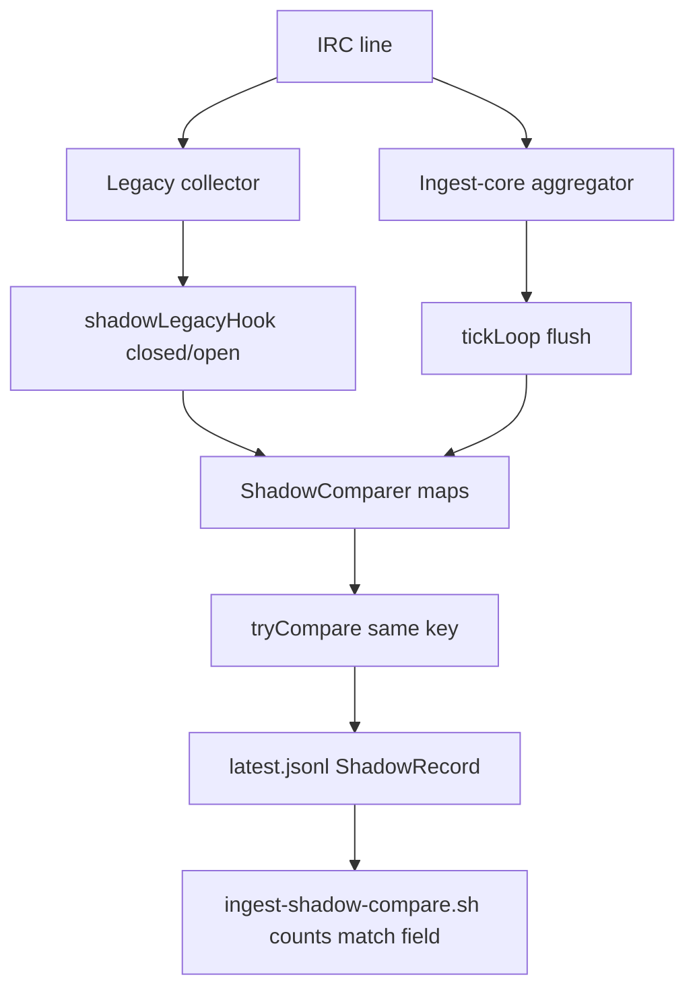

> **HISTORICAL (archived from .cursor/plans).** Not product law. Do not use for routing analytics, ingest, hub, ops, or Pulse work into public Streamclone. See docs/archive/agent-plans/README.md and docs/streampulse-product-boundary.md.
---
name: Shadow compare diagnosis
overview: ACTIVE. Determine why rc23 shadow compare produced 0% match; fix compare policy/artifact normalization before more soak. Closed-to-closed gate only. Limits guard must pass before every gate. Phase D NO-GO until ≥1000 closed samples at ≥99%.
todos:
  - id: shadow-inspect-vps
    content: Add ingest-shadow-inspect.sh; run on VPS against latest.jsonl → 05-shadow-diagnosis/
    status: completed
  - id: compare-diagnostics
    content: Rewrite ingest-shadow-compare.sh with ShadowRecord diagnostics + --closed-only gate mode
    status: completed
  - id: gates-closed-only
    content: Update ingest-phase-c-gates.sh to use closed-only compare; open skew as WARN only
    status: completed
  - id: go-normalize-closed
    content: "normalizeLogin # trim + shadow_test.go; optional skip/skip-tag open Append in shadow.go"
    status: completed
  - id: debug-gate-2ch
    content: "VPS: shrink allowlist to xqc,ludwig, production-up --no-deps analytics, run 03-gates-debug"
    status: completed
  - id: runbook-shadow-gate
    content: Document closed-only Phase C gate + diagnosis workflow in ingest-core-runbook.md
    status: completed
isProject: false
---

# Shadow Compare Diagnostics (active workstream)

**Status: ACTIVE** — supersedes further limits work. **Phase D: NO-GO** until production gate passes.

**Hard stops:**

```text
INGEST_CORE_ENABLED=0
legacy remains sole PG writer
no 500/50
hosted-limits-guard PASS before every gate
production-up.sh --no-deps analytics for env-only restarts
do not expand allowlist until closed-minute match rate is nonzero and understood
```

**Supersedes:** [Persistent limits rc23 gates](persistent_limits_rc23_gates_4a7de401.plan.md) (COMPLETE for infrastructure).

## Context

Limits deploy path is **fixed** ([`04-final-rc23-capped/`](c:/Users/Aron/streampulse-ops/docs/deployments/ingest-core-phase-c-20260708T010515Z/04-final-rc23-capped/)). Final gates are **NO-GO**: 312 samples, **0% match** ([`03-gates-final/summary.md`](c:/Users/Aron/streampulse-ops/docs/deployments/ingest-core-phase-c-20260708T010515Z/03-gates-final/summary.md)).

**Critical schema fact:** [`latest.jsonl`](c:/Users/Aron/streampulse-ops/compose/runtime/ingest-shadow/latest.jsonl) does **not** contain separate `legacy`/`shadow` event types. Each line is a **paired compare record** written by Go [`ShadowRecord`](c:/Users/Aron/twitch-7tv-clone/internal/analytics/ingestcore/shadow.go) after both sides share the same key:

```text
stream_id|channel|minute_rfc3339|open|closed
```

312 lines ⇒ **312 key intersections** already occurred in-process; 0% means **all pairs failed `withinTolerance`**, not "no pairs found."

Prior evidence ([`02-shadow-deploy/summary.md`](c:/Users/Aron/streampulse-ops/docs/deployments/ingest-core-phase-c-20260708T010515Z/02-shadow-deploy/summary.md)) cites dominant reasons: `legacy_zero_shadow_nonzero`, `chat_diff_pct` — consistent with **open-minute timing skew** and/or **shadow IRC path missing stream bind**.



**Decision (locked):** Do **not** expand allowlist. Do **not** approve Phase D. **Compare-policy first** — no ingest-core flush/bind timing patch in the same pass unless closed-minute mismatches remain after closed-only gate.

---

## Phase 1 — VPS artifact inspection (read-only)

On VPS, artifact path (confirmed):

```text
/root/streampulse-ops/compose/runtime/ingest-shadow/latest.jsonl
INGEST_SHADOW_ARTIFACT_DIR=/runtime/ingest-shadow  (container mount)
```

Add operator script [`scripts/ingest-shadow-inspect.sh`](c:/Users/Aron/twitch-7tv-clone/scripts/ingest-shadow-inspect.sh):

- `ls -lah`, mtime, size
- Line count
- Parse **ShadowRecord** fields (not `.type/.kind` — those will be absent):
  - `match`, `reason`
  - `key.streamID`, `key.channel`, `key.minute`, `key.closed`
  - `legacyChat`, `shadowChat`, `legacyViewers`, `shadowViewers`
- Output:
  - `closed_records` vs `open_records` (from `key.closed`)
  - `reason` histogram (`legacy_zero_shadow_nonzero`, `chat_diff_pct=…`, `viewer_sample_mismatch`)
  - First 5 mismatches with full JSON
  - First 5 matches (if any)

Save evidence to:

```text
streampulse-ops/docs/deployments/ingest-core-phase-c-20260708T010515Z/05-shadow-diagnosis/
```

**Hard stops unchanged:** `INGEST_CORE_ENABLED=0`, legacy writer, capped containers, `production-up.sh --no-deps analytics` only.

---

## Phase 2 — Diagnostic compare script

Rewrite [`scripts/ingest-shadow-compare.sh`](c:/Users/Aron/twitch-7tv-clone/scripts/ingest-shadow-compare.sh) Python block to understand `ShadowRecord` and emit:

```text
total_records=N
closed_records=N
open_records=N
match_count=N
mismatch_count=N
closed_match_count=N
closed_mismatch_count=N
open_match_count=N          # informational only
open_mismatch_count=N       # informational only
reason_histogram:
  legacy_zero_shadow_nonzero=N
  chat_diff_pct=N
  viewer_sample_mismatch=N
first_mismatch=json
first_closed_mismatch=json
first_match=json            # if any
```

Flags:

- `--closed-only` — **Phase C gate mode** (pass/fail only on `key.closed==true`)
- `--diagnose` — always print histogram + samples (default on fail)
- Keep positional args: `TOLERANCE MIN_SAMPLES`

Update [`scripts/ingest-phase-c-gates.sh`](c:/Users/Aron/twitch-7tv-clone/scripts/ingest-phase-c-gates.sh):

- Invoke compare with `--closed-only` for production gate
- Log open-minute mismatch count as **WARN**, not FAIL
- Debug output dir: `03-gates-debug/` with `MIN_SAMPLES=100`

---

## Phase 3 — Compare policy (closed-to-closed only)

### 3a. Bash compare gate

- Phase C pass criteria: **closed records only**, ≥99% match, ≥1000 closed samples (or configurable `--min-closed-samples`)
- Open-minute rows: counted in diagnostics, excluded from pass/fail

### 3b. Go artifact policy (optional same pass, small diff)

In [`internal/analytics/ingestcore/shadow.go`](c:/Users/Aron/twitch-7tv-clone/internal/analytics/ingestcore/shadow.go) `tryCompare`:

- Option A (preferred): still append all records, but set `reason` prefix `open_minute_excluded` and document that gate filters `key.closed`
- Option B: skip `Append` for open minutes entirely (reduces JSONL noise)

Also harden key normalization in one place:

- Extend [`normalizeLogin`](c:/Users/Aron/twitch-7tv-clone/internal/analytics/ingestcore/tiers.go) to `strings.TrimPrefix(..., "#")` after lowercase (align legacy + shadow channel keys)

**Out of scope this pass:** flush interval alignment, BindStream timing changes, allowlist expansion.

---

## Phase 4 — Unit tests

Add [`internal/analytics/ingestcore/shadow_test.go`](c:/Users/Aron/twitch-7tv-clone/internal/analytics/ingestcore/shadow_test.go):

| Test | Proves |
|------|--------|
| `TestCompareKeyNormalization` | `#XQC` / `xqc` same key |
| `TestWithinTolerance_closedMatch` | equivalent chat within 2% |
| `TestWithinTolerance_legacyZeroShadowNonzero` | open-skew scenario |
| `TestShadowComparer_closedOnlyPairing` | open vs closed do not pair |

Add [`scripts/ingest-shadow-compare_test.sh`](c:/Users/Aron/twitch-7tv-clone/scripts/ingest-shadow-compare_test.sh) or Python fixture test:

- 2-line JSONL fixture: one closed match, one open mismatch
- `--closed-only` passes; full compare fails

Run: `go test ./internal/analytics/ingestcore/... -run Shadow`

---

## Phase 5 — Debug gate (2-channel allowlist)

1. Set allowlist **only** `xqc,ludwig` in `production.local.env`
2. Restart: `IMAGE_TAG=v0.3.0-rc23 bash scripts/deploy/production-up.sh --no-deps analytics`
3. Confirm guard PASS
4. Soak ~30–60m (debug only — do not expand)
5. Run:

```bash
INGEST_SHADOW_ARTIFACT_DIR=/root/streampulse-ops/compose/runtime/ingest-shadow \
  bash /root/streamclone-scripts/ingest-shadow-inspect.sh \
  docs/deployments/ingest-core-phase-c-20260708T010515Z/05-shadow-diagnosis

bash /root/streamclone-scripts/ingest-phase-c-gates.sh 2 100 \
  docs/deployments/ingest-core-phase-c-20260708T010515Z/03-gates-debug
```

(Compare script uses `--closed-only` internally for gate decision; min 100 is debug-only.)

---

## Phase 6 — Decision tree (after diagnostics)

| Observation | Next action |
|-------------|-------------|
| Open skew dominates; closed match ≥99% | Continue soak on **current small allowlist**; re-run **1000 closed-sample** gate; Phase D still NO-GO until final gate passes |
| Closed minutes still 0% match | **Second pass:** ingest-core fix (stream bind before enqueue, shadow flush alignment, dual IRC drop audit) — requires new rc24 tag |
| Empty `key.streamID` on shadow side | BindStream / `LoginForStreamID` bug — rc24 |
| Wrong artifact path / stale file | Fix env mount + invalidate soak |

**PHASE_D_GO_NOGO remains NO-GO** until `03-gates-final/` passes with **1000 closed samples ≥99%** under capped rc23.

---

## Files to change

| Repo | Files |
|------|-------|
| **streamclone** | `scripts/ingest-shadow-compare.sh`, `scripts/ingest-shadow-inspect.sh` (new), `scripts/ingest-phase-c-gates.sh`, `internal/analytics/ingestcore/shadow.go`, `internal/analytics/ingestcore/tiers.go`, `internal/analytics/ingestcore/shadow_test.go`, `docs/pulse-ingest-v2/ingest-core-runbook.md` (closed-only gate note) |
| **streampulse-ops** | `docs/deployments/.../05-shadow-diagnosis/`, `03-gates-debug/` evidence |

No plan file edits. No allowlist expansion. No Phase D.
