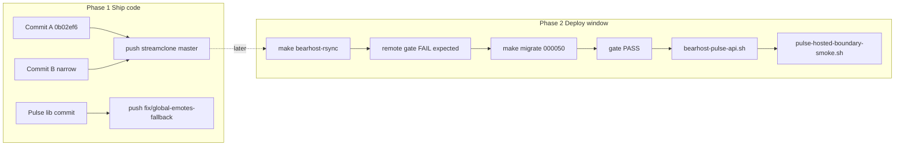

> **HISTORICAL (archived from .cursor/plans).** Not product law. Do not use for routing analytics, ingest, hub, ops, or Pulse work into public Streamclone. See docs/archive/agent-plans/README.md and docs/streampulse-product-boundary.md.
---
name: Ship code deploy later
overview: Create narrow Commit B in streamclone (fix Makefile staging leak), push Commit A + B without prod recreate; create a separate lib-only pulse branch for Global Emotes 404/503 fallback. Prod migrate/recreate/smoke stays a manual second window.
todos:
  - id: fix-makefile-staging
    content: Unstage Makefile and re-stage only bearhost-analytics-predeploy-gate target hunks
    status: completed
  - id: streamclone-commit-b
    content: Run hosted auth Go tests; commit staged Commit B with Conventional Commits message (Aron-Chu author)
    status: completed
  - id: streamclone-push-ab
    content: Push origin master (0b02ef6 + Commit B); do not recreate prod analytics
    status: completed
  - id: pulse-branch-commit
    content: Create fix/global-emotes-fallback; commit only publicEmotesOverview.ts + test; run targeted vitest
    status: completed
  - id: pulse-push-branch
    content: Push fix/global-emotes-fallback to origin
    status: completed
  - id: document-phase2
    content: Leave Phase 2 migrate/deploy/smoke for manual window; note pre-existing extension test-suite exit code in commit/PR body
    status: completed
isProject: false
---

# Ship code first, deploy second

## Current state (verified)

**Streamclone** ([`C:\Users\Aron\twitch-7tv-clone`](C:\Users\Aron\twitch-7tv-clone)):
- HEAD = Commit A `0b02ef6` (`feat(analytics): add IVR shadow canary…`), **ahead of `origin/master` by 1**, author Aron-Chu, no co-author trailer.
- Commit B content is **already staged** (14 files, ~912 lines): hosted auth, gate/smoke scripts, runbook, tests — matches plan scope **except Makefile**.

**Makefile staging leak (must fix before commit):**
Staged [`Makefile`](Makefile) includes unrelated hunks (codegraph extra roots, `flame-proxy-policy`, `emote-history-smoke`, `vscode-copilot-setup`, `corpus-smoke`, etc.). Plan requires **gate target only**. The gate lines themselves are present:

```makefile
bearhost-analytics-predeploy-gate:
	@bash scripts/bearhost-analytics-predeploy-gate.sh
```

**Action:** `git restore --staged Makefile`, then re-stage only the `bearhost-analytics-predeploy-gate` target hunks (both Windows and non-Windows Makefile branches).

**Streamclone-pulse** ([`C:\Users\Aron\streamclone-pulse`](C:\Users\Aron\streamclone-pulse)):
- On `fix/portal-momentref-route-contract` (ahead 22); **not** pushing to this branch or master.
- Per your choice: new branch `fix/global-emotes-fallback` from current HEAD.
- Per your choice: **smallest passing commit** = lib fallback only:
  - [`streampulse-web/src/lib/publicEmotesOverview.ts`](streampulse-web/src/lib/publicEmotesOverview.ts)
  - [`streampulse-web/tests/publicEmotesOverview.test.ts`](streampulse-web/tests/publicEmotesOverview.test.ts)
- **Unstage** for this batch: `GlobalEmotes.tsx`, `globalEmotesPage.test.tsx` (require `routes/index.tsx`, `global-emotes-atlas.css`, `hubFormat.ts`, fixtures — hub work, not deploy batch).
- Optional prototype banner ([`streampulse-web/prototypes/emoteverse/index.html`](streampulse-web/prototypes/emoteverse/index.html)) stays out.



---

## Phase 1 — Commit and push (no prod recreate)

### 1. Streamclone — narrow Commit B

**Pre-commit checks:**
```powershell
cd C:\Users\Aron\twitch-7tv-clone
go test ./internal/analytics -run "Test(HostedStream|HostedChannelLive|NonHostedChannelLive|PublicEmotesOverview)" -count=1
```

**Commit** (Aron-Chu env vars per [`.cursor/rules/commits.mdc`](.cursor/rules/commits.mdc)):

Suggested message:
```
fix(analytics): gate hosted timelines and enforce 000050 predeploy

Require beta/device auth for Layer-2 routes in hosted mode. Add
bearhost-analytics-predeploy-gate, pulse-hosted-boundary-smoke, and
mandatory deploy order in bearhost-production runbook.
```

**Files in commit (14 after Makefile fix):**
- `internal/analytics/api.go`, `pulse_hosted.go`, `portal_analytics_api.go`, `hosted_analytics_auth_test.go`
- `scripts/bearhost-analytics-predeploy-gate.sh`, `scripts/bearhost-migration-000050-preflight.sh`, `scripts/pulse-hosted-boundary-smoke.sh`, `scripts/bearhost-pulse-api.sh`
- `scripts/lib/bearhost-analytics-gate-checks.sh`, `bearhost-analytics-gate-checks-remote.sh`, `bearhost-smoke-fixtures-remote.sh`
- `docs/bearhost-production.md`, `docs/agent-notes/ivr-gold-prod-status.md`
- `Makefile` (gate target only)

**Push:**
```powershell
git push origin master   # pushes 0b02ef6 then Commit B
```

Do **not** run `bearhost-pulse-api.sh`, `make migrate`, or analytics recreate.

---

### 2. Streamclone-pulse — lib-only fallback branch

```powershell
cd C:\Users\Aron\streamclone-pulse
git restore --staged streampulse-web/src/routes/dashboard/GlobalEmotes.tsx streampulse-web/tests/globalEmotesPage.test.tsx
git checkout -b fix/global-emotes-fallback
# ensure only lib + test staged:
git add streampulse-web/src/lib/publicEmotesOverview.ts streampulse-web/tests/publicEmotesOverview.test.ts
npm test -- tests/publicEmotesOverview.test.ts   # in streampulse-web/
```

Suggested message:
```
fix(portal): degrade public emotes overview on 404/503

Map missing or unavailable /v1/public/emotes/overview responses to an
aggregate-only unavailable contract for Global Emotes UI consumers.
```

**PR/commit note:** Full extension `npm test` may exit 1 due to pre-existing unhandled `chrome` rejections in `tests/tracking.test.ts`; not introduced by this change. Targeted portal tests pass.

**Push:**
```powershell
git push -u origin fix/global-emotes-fallback
```

Pages deploy (if desired) is separate: build/deploy from this branch after merge or manual `pages:deploy:prod` — **not** part of analytics binary deploy.

---

## Phase 2 — Prod migration/deploy window (manual, after push)

**Do not start until Phase 1 push completes.** IVR shadow overlay stays **HOLD**.

| Step | Command | Expected today |
|------|---------|----------------|
| 1 | `make bearhost-rsync` | Gate scripts on VPS |
| 2 | `BEARHOST_ANALYTICS_GATE_REMOTE=1 make bearhost-analytics-predeploy-gate` | **FAIL** — prod `source_columns=0` |
| 3 | On VPS: `make migrate` | Applies `000050` |
| 4 | Re-run gate | `MIGRATION_000050=PASS`, `BLOCK_ANALYTICS_RECREATE=0`, `ANALYTICS_DEPLOY_GATE=PASS` |
| 5 | `bash scripts/bearhost-pulse-api.sh` | Recreates analytics (gate enforced inside) |
| 6 | `bash scripts/pulse-hosted-boundary-smoke.sh` | `PUBLIC_BOUNDARY=PASS` |
| 7 | `PULSE_BETA_KEY=... bash scripts/pulse-hosted-boundary-smoke.sh` | `CHART_CANARY=PASS`, `VOD_EXTENSION_CANARY=PASS` |

**Post-deploy success lines:**
```text
BLOCK_ANALYTICS_RECREATE=0
ANALYTICS_DEPLOY_GATE=PASS
MIGRATION_000050=PASS
PUBLIC_BOUNDARY=PASS
CHART_CANARY=PASS|SKIP
VOD_EXTENSION_CANARY=PASS|SKIP
new_binary_requires_000050=confirmed
```

**Verdict after Phase 1 only:** `READY_FOR_MIGRATION_THEN_ANALYTICS_DEPLOY` (code on GitHub; prod still old binary until Phase 2).

**Not in scope:** IVR shadow canary, 000051/000052 public emote materialization, Global Emotes page/CSS/route hub refactor, extension full test suite gate.

---

## Risks and guards

| Risk | Mitigation |
|------|------------|
| Makefile bloat in Commit B | Unstage and re-add gate target only before commit |
| Pulse commit breaks clean checkout | Lib-only; no page/route/CSS deps |
| Accidental prod recreate | Phase 1 explicitly excludes `bearhost-pulse-api.sh` |
| Local gate false PASS | Always use `BEARHOST_ANALYTICS_GATE_REMOTE=1` for prod checks |
| Co-authored-by trailer | Verify `git log -1` after commit; rewrite if Cursor adds trailer |
