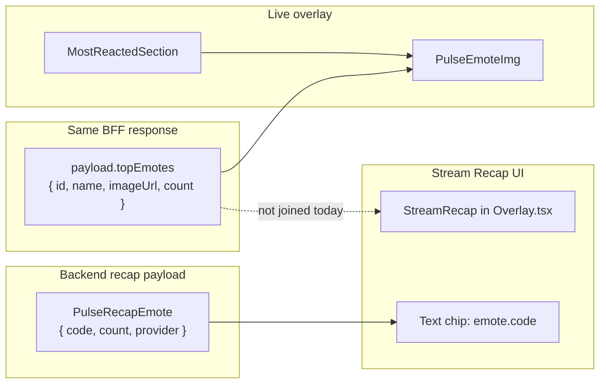

> **HISTORICAL (archived from .cursor/plans).** Not product law. Do not use for routing analytics, ingest, hub, ops, or Pulse work into public Streamclone. See docs/archive/agent-plans/README.md and docs/streampulse-product-boundary.md.
---
name: Stream Recap Emotes
overview: Stream Recap shows text-only emote names because the recap API returns `{ code, count }` without image metadata, while the live overlay uses `PulseEmoteImg` with full emote objects. Fix by enriching recap emotes on the backend and redesigning the extension recap UI to match the live Most Reacted pattern.
todos:
  - id: backend-enrich-recap-emotes
    content: Extend recap.Emote with id/imageUrl and enrich in buildPulseStreamRecap via TopEmotesFromRollups + rewriteHostedTopEmotes join
    status: completed
  - id: update-recap-types
    content: Add optional id/imageUrl to PulseRecapEmote in streamclone-pulse messages.ts and streamclone apiTypes
    status: completed
  - id: recap-emote-helper
    content: Add recapEmotes.ts helper + unit tests for mapping/join fallback
    status: completed
  - id: recap-ui-redesign
    content: Redesign StreamRecap + OfflineRecapCard in Overlay.tsx using RecapTopEmotesRow, PulseEmoteImg, PulseSectionCard, and top-moment hero
    status: completed
  - id: verify-extension-recap
    content: Run Go tests + streamclone-pulse npm test; manual dev reload check on ended stream recap
    status: completed
isProject: false
---

# Stream Recap emote display fix

## Root cause

Two separate gaps produce the screenshot you shared (`LOL · 7,561` text pills):



1. **Data gap:** [`internal/analytics/recap/recap.go`](c:/Users/Aron/twitch-7tv-clone/internal/analytics/recap/recap.go) builds `topEmotes` via `topSevenTVEmotes()` with only `Code`, `Count`, `Provider` — no `id` / `imageUrl`.
2. **UI gap:** [`StreamRecap`](c:/Users/Aron/streamclone-pulse/src/ui/Overlay.tsx) (lines ~1569–1574) renders `{emote.code} · {count}` instead of reusing [`PulseEmoteImg`](c:/Users/Aron/streamclone-pulse/src/ui/PulseEmoteImg.tsx). The same text-only pattern exists in [`OfflineRecapCard`](c:/Users/Aron/streamclone-pulse/src/ui/Overlay.tsx) even though it already has full `ExtensionEmote` objects.

Live sections look correct because [`MostReactedSection`](c:/Users/Aron/streamclone-pulse/src/ui/MostReactedSection.tsx) + [`SelectedMomentCard`](c:/Users/Aron/streamclone-pulse/src/ui/SelectedMomentCard.tsx) always pipe emotes through `PulseEmoteImg`.

Note: desktop [`StreamRecapPanel`](c:/Users/Aron/twitch-7tv-clone/frontend/src/components/Analytics.tsx) also shows text-only names today; backend enrichment will make images available there later without changing this task’s UI scope.

---

## Implementation plan

### 1. Backend — enrich recap emotes with image metadata

**Files:** [`internal/analytics/recap/recap.go`](c:/Users/Aron/twitch-7tv-clone/internal/analytics/recap/recap.go), [`internal/analytics/recap_handler.go`](c:/Users/Aron/twitch-7tv-clone/internal/analytics/recap_handler.go), new helper (e.g. `recap_emote_enrich.go`)

- Extend `recap.Emote` with optional fields:
  - `ID string json:"id,omitempty"`
  - `ImageURL string json:"imageUrl,omitempty"`
- After `pulserecap.Build(...)` in `buildPulseStreamRecap`, enrich `TopEmotes`:
  - Build catalog via existing [`TopEmotesFromRollups(rollups, 10)`](c:/Users/Aron/twitch-7tv-clone/internal/analytics/store.go) (has `id`, `imageUrl`, provider)
  - Apply [`rewriteHostedTopEmotes`](c:/Users/Aron/twitch-7tv-clone/internal/analytics/hosted_emote_urls.go) for hosted/CDN URLs
  - Join recap rows to catalog by case-insensitive `code` ↔ `name`; preserve recap `count` (authoritative for recap ranking)
  - Filter catalog to 7TV providers to preserve current recap semantics (`topSevenTVEmotes` behavior)
- This automatically fixes both:
  - `GET /v1/pulse/streams/{streamId}/recap`
  - Extension BFF recap embedded in [`extension_api.go`](c:/Users/Aron/twitch-7tv-clone/internal/analytics/extension_api.go) (already calls `buildPulseStreamRecap`)

**Types to update (optional fields, backward compatible):**
- [`streamclone-pulse/src/shared/messages.ts`](c:/Users/Aron/streamclone-pulse/src/shared/messages.ts) — `PulseRecapEmote`
- [`twitch-7tv-clone/frontend/src/api.ts`](c:/Users/Aron/twitch-7tv-clone/frontend/src/api.ts) and [`packages/analytics-console/src/apiTypes.ts`](c:/Users/Aron/twitch-7tv-clone/packages/analytics-console/src/apiTypes.ts)

**Tests:** Add Go unit test for enrichment join (name match, hosted URL rewrite, 7TV-only filter). Existing [`recap/recap_test.go`](c:/Users/Aron/twitch-7tv-clone/internal/analytics/recap/recap_test.go) stays focused on pure aggregation.

---

### 2. Extension — align Stream Recap UI with live overlay

**Primary file:** [`streamclone-pulse/src/ui/Overlay.tsx`](c:/Users/Aron/streamclone-pulse/src/ui/Overlay.tsx)

**New small helper:** `src/ui/recapEmotes.ts`
- `recapEmoteToExtensionEmote(emote: PulseRecapEmote): ExtensionEmote` — map `code → name`, pass through `id/imageUrl/provider/count`
- `resolveRecapEmotes(recapEmotes, catalog?: ExtensionEmote[])` — fallback join when backend fields are missing (uses `payload.topEmotes` from same poll)

**New presentational component:** `src/ui/RecapTopEmotesRow.tsx` (read-only; no toggle behavior)
- Reuse visual language from [`EmoteOverlayChips`](c:/Users/Aron/streamclone-pulse/src/ui/EmoteOverlayChips.tsx): ranked grid, emote image, count badge, provider label
- Render with [`PulseEmoteImg`](c:/Users/Aron/streamclone-pulse/src/ui/PulseEmoteImg.tsx) + existing `emoteChipImg` style already defined in Overlay styles

**Redesign `StreamRecap` to mirror live layout:**
- Wrap in [`PulseSectionCard`](c:/Users/Aron/streamclone-pulse/src/ui/PulseSectionCard.tsx) (same shell as Most Reacted)
- Pass `backendUrl` into `StreamRecap` from parent (~line 1155)
- **Top moment hero:** reuse [`SelectedMomentCard`](c:/Users/Aron/streamclone-pulse/src/ui/SelectedMomentCard.tsx) pattern for `recap.topMoments[0]` (convert recap moment → minimal `LiveHeatPoint` shape, or add a thin `RecapMomentCard` that shares styles)
- **Emotes:** replace text chips with `RecapTopEmotesRow`
- **Emote burst highlight:** show `PulseEmoteImg` beside burst text when `funniestEmoteBurst.code` resolves
- **Moment list:** optionally add emote stack per row when `moment.topEmotes` exists (backend already includes these on recap moments)

**Also fix `OfflineRecapCard`:** swap text chips for `RecapTopEmotesRow` using existing `payload.topEmotes` (quick win, same sidebar).

**Wire-up change in Overlay render:**

```tsx
<StreamRecap
  recap={payload.recap}
  backendUrl={backendUrl}
  emoteCatalog={payload.topEmotes}
  onJump={offset => openAnalytics(offset)}
/>
```

---

### 3. Verification

| Check | Command / action |
|-------|------------------|
| Go enrichment tests | `go test ./internal/analytics/... -run Recap` |
| Extension unit tests | `npm test` in `streamclone-pulse` (new `recapEmotes.test.ts`) |
| Manual smoke | `npm run dev` → load extension on ended tracked stream → Stream Recap shows emote images like Most Reacted |
| API sanity | `curl :8090/v1/extension/pulse/channels/{login}` when offline → `recap.topEmotes[].imageUrl` populated |

---

## Visual target (extension)

Match live overlay hierarchy:

1. **Section card** with title + duration/message meta
2. **Hero top moment** (score, chat/emote metrics, emote images, jump action)
3. **Stat band** (peak chat, messages — keep current StatCards)
4. **Highlights row** (spike + emote burst, burst shows image)
5. **Top emotes grid** (images + counts, not text pills)
6. **Ranked moments list** (existing rows, optionally with emote stacks)

No product-behavior changes beyond honest display of existing recap data.
